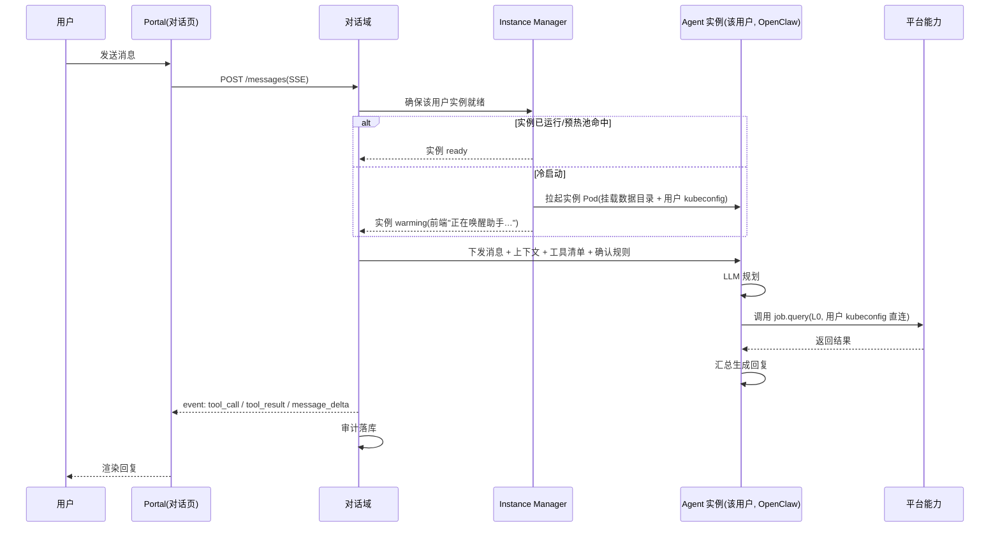
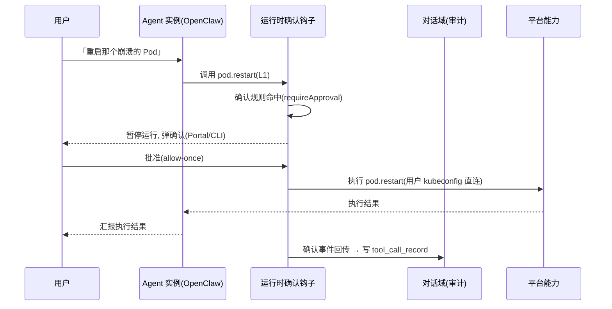
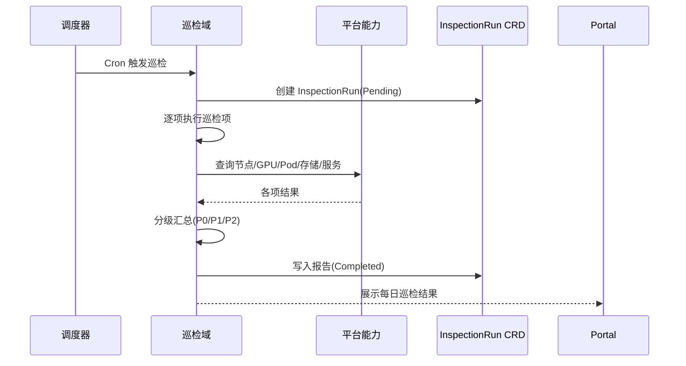
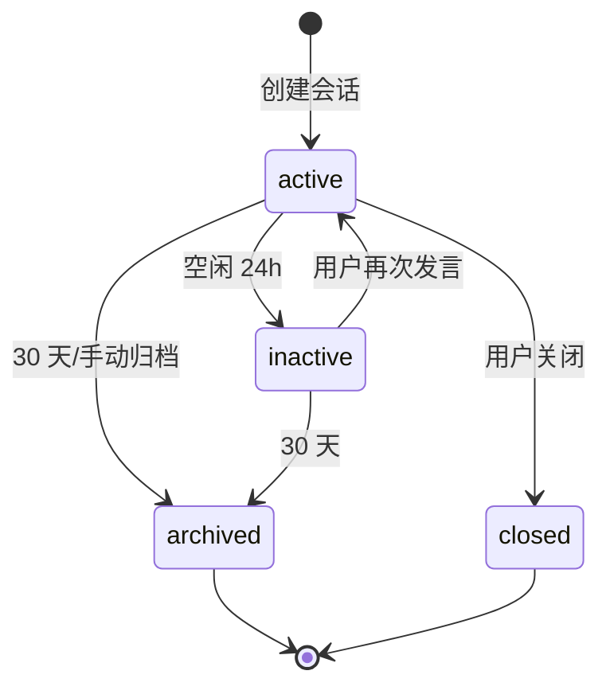
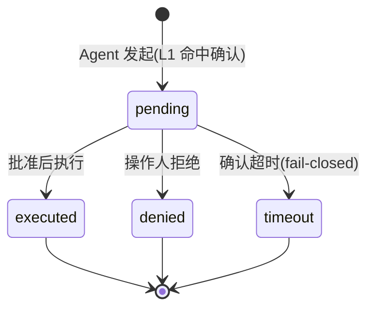
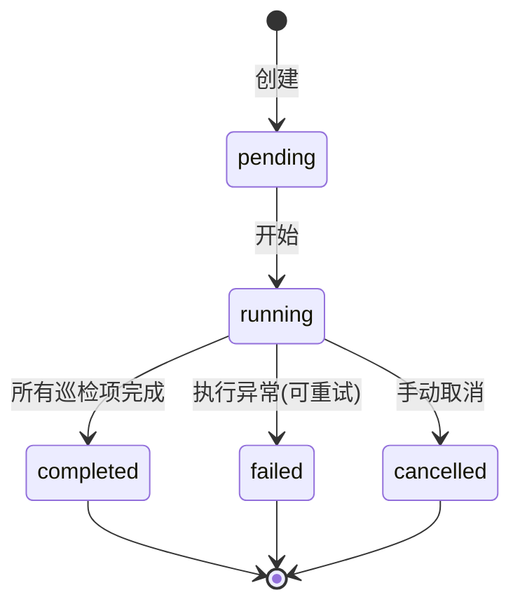
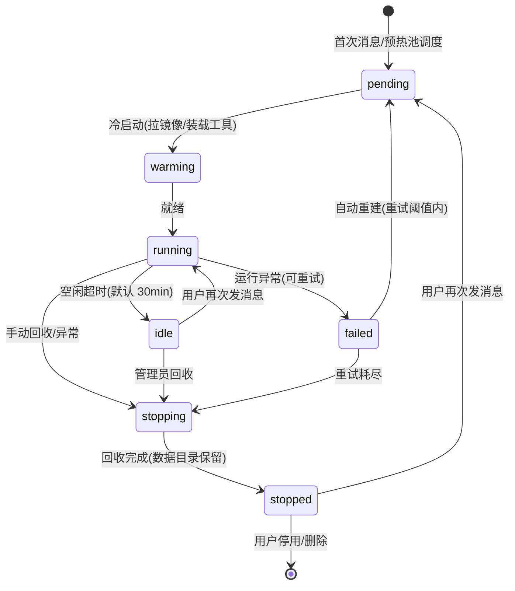

# CubeStack 平台智能助手（CubePilot）模块设计文档

**文档状态：** Draft（初稿，待评审）
**适用范围：** CubeStack 智算云平台 · 平台智能助手模块（第一阶段 MVP）
**产品名：** CubePilot（仓库 `cubepilot`）
**架构理念：** 平台能力 API 化，AI Agent 只做编排与决策，不直接操作底层资源
**文档版本：** v0.1

---

# 1. 引言

## 1.1 目的

智算平台规模扩大后，GPU 集群、训练/推理服务与多租户资源的日常运维复杂度快速上升，平台使用者需要低门槛的方式来查询资源、操作任务、理解运行状态。

平台智能助手模块（CubePilot）是 CubeStack 面向「所有用户」的一站式 AI 助手：将平台的资源管理、任务编排、监控能力封装为可被自然语言调用的智能服务。

- **用户侧**：对话式问答与自然语言操作（ChatOps），降低平台使用门槛；
- **运维侧**：集群状态自动感知与健康巡检，辅助运维决策。

本文档描述 CubePilot 第一阶段（MVP）的完整设计。预期读者：模块研发、平台架构、运维、安全、测试工程师。

## 1.2 范围

**第一阶段包含：**

- 对话式问答与自然语言操作（ChatOps）
- 平台能力工具化：只读工具自动执行，写/高风险操作运行时确认
- 集群健康巡检：固定预置巡检项 + 分级报告 + Portal 展示
- 极简审计：工具调用 / 确认结果的单表记录
- 每用户 Agent 实例与生命周期管理

**第一阶段不包含（后置，见 §14 演进展望）：**

- 平台知识库（RAG）、IM 通道、邮件 / 站内通知
- 推理服务自动验证、自定义 Workflow、故障诊断 RCA、自动修复
- 平台审批系统（确认由 Agent 运行时原生 HITL 承担）
- 完整审计治理（查询界面、保留策略）

## 1.3 术语表

| 术语 | 说明 |
|---|---|
| Agent | 具备规划、工具调用能力的自主智能体，本文档指 OpenClaw 运行于用户实例中的助手 Agent |
| Skill / Tool | OpenClaw 扩展机制：将平台 API 封装为 Agent 可调用的工具；一个 Skill 可含多个 Tool |
| MCP | Model Context Protocol，开放工具接入协议，本模块工具统一以 MCP 方式暴露 |
| ChatOps | 通过自然语言对话完成平台查询与操作 |
| HITL | Human-in-the-loop，写/高风险操作必须由操作人本人确认后执行（运行时原生确认） |
| 确认规则 | 平台维护的「工具/命令 → 是否需要操作人确认」规则表，下发为 OpenClaw `requireApproval` 等运行时钩子 |
| OpenShell | OpenClaw 可选沙箱执行环境，隔离不可信代码执行 |

## 1.4 参考资料

- 《CubeStack 智算云平台详细设计文档》（v0.4）
- OpenClaw：https://docs2.openclaw.ai/zh-CN · https://github.com/openclaw/openclaw
- MCP 规范：https://modelcontextprotocol.io/
- K8s、GPUStack、vLLM、Keycloak 官方文档

---

# 2. 功能概述

## 2.1 模块定位

CubePilot 位于平台 **AI 产品能力层**，是平台能力的「AI 化入口」：不重造底层能力，将既有能力（K8s、AI Controller、GPUStack、监控等）通过**受控工具**暴露给 Agent，由 Agent 完成「理解意图 → 规划 → 调用工具 → 汇总结果」闭环。

| 角色 | 典型诉求 | 助手提供的价值 |
|---|---|---|
| 算法工程师 | 低门槛使用训练/推理能力 | 自然语言查询任务状态、解释失败、提交/取消任务 |
| 应用开发者 | 快速接入推理服务 | 对话式部署服务、查询状态、获取 API 示例 |
| 平台运维 | 高效巡检与排障 | 自动巡检、异常分级报告、受控自动操作 |
| 平台/租户管理员 | 资源治理与合规 | 配额查询、使用分析、操作记录追溯 |

## 2.2 功能清单

| 功能 | 说明 | 确认级别 |
|---|---|---|
| 对话问答 | 平台使用引导、资源/状态查询、报错解释 | — |
| 自然语言操作（ChatOps） | 对话执行受权限约束的查询与操作（提交/取消任务、部署/扩缩推理服务等） | 写操作 L1 确认 |
| 集群健康巡检 | 按预置策略周期性检查平台运行状态，生成分级报告 | 只读 |
| 审计 | 工具调用与确认结果单表记录 | — |

## 2.3 用户角色与权限

复用平台「租户 → 项目 → 用户 → 角色」权限体系，工具调用叠加确认规则：

| 角色 | 助手可用工具 | 写/高风险操作 |
|---|---|---|
| 平台管理员 | 全部（含高风险） | 需操作人本人确认 |
| 租户管理员 | 租户内全部 | 需操作人本人确认 |
| 开发人员 | 项目内只读 + 操作类 | 需操作人本人确认 |
| 只读用户（运营） | 只读工具 | 不涉及 |

---

# 3. 总体架构

## 3.1 设计原则

- **能力直连 + 运行时确认**：Agent 是认知引擎，以**用户自己的凭据**直连平台能力（等效用户 kubectl）；写/高风险操作由 Agent 运行时原生 HITL 确认（操作人本人），平台不设统一授权门、不建审批系统。
- **每用户实例、物理隔离**：每个活跃用户一个独立 Agent 实例与数据目录，隔离边界为进程 + 存储的物理边界。
- **最小化 + 扩展点前置**：一阶段每个模块只做最小闭环；可扩展能力实现为标准化的**注册 / 适配接口**（MCP 工具注册表、巡检项注册表、Agent Runtime Adapter、知识注入 hook），不在当下实现扩展本身。
- **模型无关与私有化**：Agent 通过统一接口对接 LLM；LLM 私有化部署，满足完全内网环境。
- **渐进演进**：第一阶段以 OpenClaw 落地，经 Agent Runtime Adapter 平滑迁移到自研，隔离与记忆机制不因运行时变化而改变。

## 3.2 功能域架构

CubePilot 按**功能域**划分 6 个模块（5 功能域 + 1 支撑域），架构扁平、贴近产品功能：

```text
       用户入口：Portal 对话页 / 悬浮窗 / REST API（统一 Keycloak 鉴权）
                          │
                          ▼
   ┌───────────────────────────────────────────────────────────┐
   │ M1 对话域   会话管理 · 上下文装载 · 流式响应(SSE)           │
   ├───────────────────────────────────────────────────────────┤
   │ M3 Agent 域  意图理解 → 规划 → 工具编排 → 结果汇总          │
   │              (OpenClaw · 每用户一个实例 · LLM 路由)        │
   ├───────────────────────────────────────────────────────────┤
   │ M2 工具域   平台能力API化 · 用户凭据直连 · 运行时HITL确认    │
   │             L0只读直放 ── L1写/高风险本人确认              │
   ├───────────────┬───────────────────────────────────────────┤
   │ M4 巡检域      │  M5 审计域（极简）                          │
   │ 定时健康巡检    │  工具调用/确认单表记录                      │
   │ 报告+分级      │                                           │
   └───────────────┴───────────────────────────────────────────┘
                          │
                          ▼
   平台能力层：K8s · AI Controller · GPUStack · Prometheus/Loki
              · Keycloak · 数据服务(PostgreSQL/Redis) · 推理服务(LLM)
```

**各模块职责一览：**

| 模块 | 职责 | 一阶段关键内容 | 扩展点 |
|---|---|---|---|
| M1 对话域 | 会话管理、消息流、上下文组装 | 会话 CRUD、SSE、200 轮/5 会话上限 | 提示词组装处预留知识注入 hook（→ RAG） |
| M2 工具域 | 平台能力工具化、凭据直连、确认 | 9 个只读 + 5 个写工具；运行时 HITL | MCP 工具注册表（→ AI Ops 工具/Workflow 步骤） |
| M3 Agent 域 | 编排核心、实例生命周期、LLM 路由 | OpenClaw 每用户实例、Instance Manager | Agent Runtime Adapter（→ Hermes/自研） |
| M4 巡检域 | 定时健康巡检、报告 | 固定预置巡检项、InspectionRun CRD、Portal 展示 | 巡检项注册表；执行骨架 → Workflow 引擎 |
| M5 审计域 | 极简记录 | `tool_call_record` 单表 | 审计治理后置 |
| M6 平台集成 | 凭据管理、下游接入 | 用户 kubeconfig 注入/轮换、数据服务 | 新增平台能力 = 新增集成点 |

## 3.3 数据流向

```text
用户(对话) ──► Portal ──► M1 对话域(鉴权/会话) ──► M3 Agent 实例(OpenClaw)
                                                       │
                              ┌────────────────────────┤
                              ▼                        ▼
                       LLM(推理服务)              M2 工具域(用户凭据直连 + HITL)
                              │                        │
                              ▼                        ▼
                         对话/工具决策              K8s/GPUStack/监控
                                                       │
                              M4 巡检域(调度器定时) ──► 同一平台能力层
```

- **上行**：用户消息经 M1 鉴权后进入该用户 Agent 实例，实例结合系统提示词、工具定义与 LLM 产出「回复文本 + 工具调用序列」。
- **下行**：Agent 以用户凭据直连平台能力；写/高风险调用先经运行时确认（操作人本人）再执行，结果回填后经 M1 流式返回用户。
- **旁路**：巡检由调度器定时驱动 M4 执行，报告写 CRD 供 Portal / API 展示。

## 3.4 技术选型

| 能力 | 第一阶段选型 | 说明 |
|---|---|---|
| Agent 运行时 | OpenClaw（每用户实例形态） | 原生支持 Skills / MCP / 多模型；生命周期由 Instance Manager 管理；预留 Agent Runtime Adapter |
| 工具接入 | MCP；K8s 以用户 kubeconfig 直连 | 业务工具以轻量 MCP Server 暴露；K8s 用 k8s MCP 客户端 / kubectl |
| LLM | 私有化开源模型（Qwen / DeepSeek 等，具 Function Calling） | OpenAI 兼容接口，经平台推理服务或独立助手 LLM 服务 |
| 会话存储 | PostgreSQL + Redis | 会话/消息/审计持久化；热点上下文缓存 |
| 实例数据目录 | 共享存储（Lustre / NFS / PVC） | 每用户一个目录，持久化实例记忆 |
| 沙箱 | OpenShell（gVisor，可选） | 隔离不可信代码 / 脚本执行 |
| 集群护栏 | Kyverno / Pod Security Admission | 禁 privileged / hostPath 等危险载荷，与请求来源无关 |

---

# 4. 功能域设计

## 4.1 M1 对话域

**职责**：会话管理、消息收发、上下文组装。

| 维度 | 设计 |
|---|---|
| 会话载体 | `Conversation` 实体（DB），绑定 `user_id + tenant_id + project_id` |
| 流式响应 | `POST /messages` → SSE 事件流：`message_start / agent_thinking / tool_call / tool_result / confirm_pending / confirm_resolved / message_delta / message_done` |
| 上下文装载 | 每次请求动态组装系统提示词 = 平台身份（用户/租户/项目/角色）+ 工具清单 + 确认规则 + 会话历史 |
| 超时/限制 | 会话空闲 24h 标记 inactive、30 天归档；单会话 200 轮；单用户并发 5 会话 |
| 扩展点 | 系统提示词组装处预留「知识注入 hook」，后续接入 RAG 知识库 |

## 4.2 M2 工具域

**职责**：将平台能力封装为 Agent 可调用工具，负责凭据直连与确认判定。

**工具清单（一阶段）：**

| 工具 | 封装能力 | 确认级别 |
|---|---|---|
| `cluster.health` / `cluster.nodes` | 集群健康、节点列表与状态 | L0 |
| `gpu.query` | GPU 池/卡利用率、显存、温度 | L0 |
| `job.query` / `job.logs` | TrainingJob / InferenceService 列表详情、日志 | L0 |
| `inference.query` | 推理服务状态 | L0 |
| `quota.query` / `asset.query` / `pod.query` | 配额、资产、Pod 状态与事件 | L0 |
| `job.submit` / `job.cancel` | 提交 / 取消训练任务 | L1 |
| `inference.deploy` / `inference.scale` | 部署 / 扩缩推理服务 | L1 |
| `pod.restart` | 重建异常 Pod | L1 |

**K8s 直连**：实例注入用户 kubeconfig（Secret 挂载 0600），等效用户自己的 kubectl；`get/list/watch/logs` 只读直放，`apply/patch/scale/delete/exec` 命中确认规则；权限由平台 RBAC 在 API Server 端强制，操作记入 K8s Audit Log。

**确认模型（运行时 HITL，不做审批系统）：**

| 级别 | 定义 | 执行方式 |
|---|---|---|
| L0 · 只读 | 不改变平台状态的查询 | Agent 直接调用，不拦截 |
| L1 · 写/高风险 | 改变状态、删除、重建、exec | 运行时 HITL：操作人本人确认；拒绝/超时默认不执行（fail-closed） |

确认规则表由平台管理员维护，下发为 OpenClaw `before_tool_call` / `requireApproval` 钩子；确认结果（谁、何时、批准/拒绝）回传写审计。

**错误标准化**：工具统一返回 `{success, data | error}`，错误分类：

| 错误 | 说明 | Agent 处理建议 |
|---|---|---|
| `PERMISSION_DENIED` | 无权限（RBAC 拒绝） | 说明权限范围，引导联系管理员 |
| `USER_DENIED` | 操作人拒绝确认 | 停止操作，询问后续意图 |
| `CONFIRM_TIMEOUT` | 确认超时 | 提示重新发起并尽快确认 |
| `RESOURCE_NOT_FOUND` | 资源不存在 | 提示检查名称/项目 |
| `RATE_LIMITED` / `TIMEOUT` | 限流 / 超时 | 稍后重试 |
| `UPSTREAM_ERROR` | 下游组件异常 | 提示平台组件状态，避免误导性归因 |

## 4.3 M3 Agent 域

**职责**：Agent 编排核心 + 每用户实例生命周期 + LLM 路由。

- **编排循环**：接收任务 → LLM 规划 → 调用工具 → 评估结果 → 汇报。
- **每用户实例**：一用户一个 OpenClaw 实例 Pod + 独立数据目录（HERMES_HOME），进程 + 存储物理隔离；实例无状态化，状态从 DB / 数据目录恢复。
- **Instance Manager**：按需拉起（首条消息）、闲置回收（默认 30min）、异常重建；单主 + Leader Election；上报实例状态指标。
- **LLM 路由**：模型无关，OpenAI 兼容接口接入私有化模型；请求按会话用户隔离，禁止跨会话串扰。
- **扩展点**：Agent Runtime Adapter（窄接口：进入 = 消息 + 上下文 + 工具清单；返回 = 事件流），可平滑切换 Hermes / 自研。

## 4.4 M4 巡检域

**职责**：按预置策略定时检查平台运行状态，生成分级报告供 Portal 展示。

**触发**：调度器 Cron（默认每日 02:00，可配置）+ 对话/API 手动触发。

**固定预置巡检项：**

| 巡检类别 | 巡检项 | 数据来源 |
|---|---|---|
| 控制面 | API Server / etcd / Controller Manager / Scheduler 健康 | healthz、组件指标 |
| 节点 | Node Ready、压力（Disk / Mem / PID） | K8s Node 状态 |
| GPU | 健康（XID / 降级）、利用率、温度、显存 | GPU Exporter / DCGM |
| Pod | 异常（CrashLoopBackOff / Pending / ImagePullBackOff / OOM） | K8s Pod、事件 |
| 存储 | Ceph / Lustre 容量、PVC 使用率 | Ceph Exporter / 组件指标 |
| 平台组件 | GPUStack / Harbor / Keycloak / Prometheus 健康 | 组件健康检查 |

**报告**：结构化存 `InspectionRun` CRD，异常按 P0（紧急）/ P1（重要）/ P2（一般）分级；Portal Dashboard 展示每日巡检结果，API 可查。一阶段不主动推送通知。

**扩展点**：巡检项做成**注册表**（新增巡检项 = 注册一项）；「调度 → 逐项执行 → 汇总 → 报告」骨架后续复用为 **Workflow 引擎**，推理服务验证 / RCA 均建立在其上。

## 4.5 M5 审计域（极简）

**职责**：工具调用与确认结果的单表记录，供后续排查。

- `tool_call_record` 表：`user_id / conversation_id / tool / args / level / status / confirm(操作人、时间、决策、原因) / result / created_at`。
- 只落库，不做查询界面与保留策略；K8s 操作由平台 K8s Audit Log 兜底。
- 完整审计治理（查询界面、保留、归档）后置（§14）。

## 4.6 M6 平台集成（支撑）

- **凭据管理**：按用户 RBAC 最小权限生成 / 注入 / 轮换 kubeconfig（Secret 挂载 0600），用户失效即时吊销；禁止使用集群管理员凭据。
- **下游依赖**：Keycloak、PostgreSQL + Redis、K8s、AI Controller、GPUStack、Prometheus / Loki、推理服务（助手 LLM）。
- 平台能力层故障不拖垮助手：下游调用带超时、重试与熔断（§9.1）。

---

# 5. API 设计

## 5.1 API 概览

新增分组 `/api/v1/assistant/*`，复用平台统一鉴权（Keycloak OIDC）与统一响应格式 `{code, message, data, request_id}`。

| 分组 | 接口 | 方法 | 说明 |
|---|---|---|---|
| 会话 | `/conversations` | GET / POST | 会话列表 / 创建 |
| | `/conversations/{id}` | GET / DELETE | 详情 / 归档 |
| | `/conversations/{id}/messages` | POST / GET | 发送（SSE 流式）/ 历史分页 |
| 工具 | `/tools` | GET | 当前用户可用工具清单 |
| 巡检 | `/inspections` | GET / POST | 巡检记录 / 手动触发 |
| | `/inspections/{id}` | GET | 报告详情 |
| 审计 | `/audit-logs` | GET | 工具调用/确认记录查询 |

## 5.2 发送消息（SSE 示例）

```text
POST /api/v1/assistant/conversations/conv-9f3a/messages
Content-Type: application/json
Accept: text/event-stream
{"content": "帮我查一下 llama3-chat 推理服务现在的状态", "project_id": "proj-001"}

event: message_start   data: {"message_id": "msg-001"}
event: agent_thinking  data: {"text": "正在查询推理服务状态..."}
event: tool_call       data: {"tool": "job.query", "args": {"name": "llama3-chat"}, "level": "L0"}
event: tool_result     data: {"tool": "job.query", "success": true, "summary": "服务已就绪，副本 2/2"}
event: message_delta   data: {"text": "llama3-chat 当前状态：**Ready**，就绪副本 2/2。"}
event: message_done    data: {"message_id": "msg-001", "tokens_used": 153}
```

L1 写操作时，Agent 经运行时 HITL 弹确认（Portal 内嵌 / CLI），前端展示 `confirm_pending` / `confirm_resolved` 事件。

## 5.3 错误码（新增）

| HTTP | 业务码 | 说明 |
|---|---|---|
| 400 | 45000 | 对话内容非法 / 参数错误 |
| 403 | 45100 | 工具未授权 |
| 403 | 45101 | 确认被拒 |
| 409 | 45200 | 确认已处理（重复确认） |
| 422 | 45300 | 操作超出用户资源范围 |
| 429 | 45400 | 限流 |
| 502 | 45500 | 下游平台组件异常 |
| 503 | 45501 | 助手服务不可用（降级） |

---

# 6. 数据模型

**存储策略**：会话/消息/审计等高写入数据存平台数据服务（PostgreSQL）+ Redis；巡检报告为「运维资产」，以 CRD（`assistant.suanova.io/v1alpha1`）承载。

## 6.1 DB 表

**Conversation**：`id`(UUID)、`user_id / tenant_id / project_id`（隔离键）、`title`、`status`(active/inactive/archived/closed)、`context`(json)、时间戳。

**Message**：`id`、`conversation_id`、`role`(user/assistant/tool/system)、`content`、`tool_calls`(json)、`token_usage`(json)、`error`(json)、`created_at`。

**ToolCallRecord**（极简审计）：`id`、`user_id / conversation_id / message_id`、`tool`、`args`、`level`(L0/L1)、`status`(pending/executed/denied/failed/timeout)、`confirm`(json：操作人、时间、决策、原因)、`result`(json)、`created_at`。

## 6.2 CRD

**InspectionRun**：`spec.scope`(all/node-pool/tenant/project)、`spec.items`（启用的巡检项）、`spec.schedule.cron`、`spec.trigger`(manual/cron)；`status.phase`(Pending/Running/Completed/Failed/Cancelled)、`status.items`（各项结果与证据）、`status.summary`（异常数与 P0/P1/P2 计数）、`status.conditions`。

---

# 7. 时序图

## 7.1 对话与只读工具调用



## 7.2 高风险操作确认（运行时 HITL）



## 7.3 每日巡检



---

# 8. 状态机设计

## 8.1 会话



## 8.2 工具调用 / 确认



## 8.3 巡检



## 8.4 Agent 实例生命周期



---

# 9. 安全设计

| 维度 | 设计 |
|---|---|
| 身份与授权 | Keycloak OIDC 鉴权，助手服务从 Token 解析用户/租户/项目/角色；工具资源归属校验复用平台 RBAC |
| 凭据最小化 | 实例仅持用户自己的 kubeconfig（Secret 注入 0600），定期轮换、失效即时吊销；禁止集群管理员凭据 |
| 物理隔离 | 一用户一实例一数据目录，隔离边界为进程 + 存储；实例数据目录由存储层 ACL / 配额隔离 |
| 确认护栏 | L1 操作由运行时 HITL 拦截，操作人本人确认；拒绝/超时默认不执行（fail-closed）；Agent 不得重试被拒操作 |
| Prompt 注入防护 | 用户输入与系统指令区分；工具返回的非信任内容作为数据而非指令传入 LLM；即使注入，权限受 RBAC 约束、高危操作须确认 |
| 实例加固 | `runAsNonRoot`、`seccomp: RuntimeDefault`、drop ALL capabilities、readOnlyRootFilesystem、NetworkPolicy egress 白名单（仅 K8s API / 工具 / LLM） |
| 集群护栏 | 用户命名空间启用 Pod Security Admission（restricted）+ Kyverno 基线，禁 privileged / hostPath / hostNetwork |
| 限流防滥用 | 会话级（单会话串行）、用户级（消息速率）、实例级（单用户 1 实例 + 闲置回收）、工具级（写操作频控）、LLM 级（独立配额）、直连级（K8s 调用聚合频控） |

## 9.1 错误处理与降级

助手模块是「锦上添花」能力，任何情况下不得反向拖垮平台：

| 下游 | 超时 | 重试 | 降级 |
|---|---|---|---|
| 实例冷启动 | 60s | 2 次 | 提示「助手唤醒失败，请稍后重试」，不影响其他用户实例 |
| 助手 LLM | 首 Token 15s / 总 60s | 1 次 | 返回「助手暂时不可用」 |
| K8s / AI Controller | 10s | 2 次（指数退避） | 提示控制面异常，不继续编排 |
| Prometheus / Loki | 5s | 1 次 | 返回「监控数据暂不可用」 |

熔断：单一下游连续失败超阈值（默认 5 次 / 30s）触发熔断，快速失败并告警，恢复探测通过后放行。

---

# 10. 可观测性

| 指标类别 | 指标 |
|---|---|
| 对话/体验 | 会话数、消息数、首 Token 延迟（P95）、回复总延迟、流式中断率 |
| 智能 | 工具调用次数、成功率、L0/L1 分布、确认率、确认等待耗时 |
| 成本 | LLM Token 消耗（输入/输出） |
| 运维 | 巡检执行时长、巡检异常项分布（P0/P1/P2） |
| 实例池 | 活跃/预热/回收实例数、冷启动时长（P95）、回收率、重建率、每实例资源占用 |

- **日志**：助手服务结构化日志（含 `conversation_id / user_id / tool_call_id` 关联字段）接入 Loki。
- **告警**：助手 LLM 不可用（P1）、首 Token 高延迟 > 5s（P1）、工具失败率 > 10%（P2）、实例池异常（P2）。

---

# 11. 性能与容量

| 指标 | 目标值 |
|---|---|
| 对话首 Token 延迟 | P95 < 3s |
| 对话完整回复延迟 | P95 < 15s |
| 工具调用执行延迟 | P95 < 5s |
| 实例冷启动（预热池命中 / 完全冷启） | P95 < 1s / < 15s |
| 巡检全量执行（中规模） | < 15min |

| 资源 | 估算 |
|---|---|
| Agent 实例池 | 单实例约 0.5~1 vCPU / 1~2 GB；活跃实例数 = 并发对话用户数 + 预热池，按 Infra 容量设上限 |
| 每用户数据目录 | 单用户约 50~200 MB，默认配额 1 GB |
| 助手服务 | 单副本 ~50 并发会话，2 副本起步 |
| 助手 LLM GPU | 独立推理节点 ≥ 1 张 80G 级 GPU（视模型规格） |

---

# 12. 测试设计

| 层级 | 内容 |
|---|---|
| 单元测试 | 确认规则匹配、错误标准化、会话管理逻辑 |
| 集成测试 | 运行时确认钩子 ↔ K8s 直连、助手服务 ↔ Agent 运行时、确认与审计链路 |
| E2E 测试 | 对话（问答 → 工具调用 → 确认 → 执行 → 汇报）、每日巡检全流程 |
| 智能评测 | 意图识别、工具选择、越权拒绝、指令注入、错误归因评测集 |
| 安全 / 性能 / 故障注入 | Prompt 注入、越权、确认绕过、隔离、沙箱逃逸；并发与 LLM 吞吐；下游故障、确认超时 |

**关键场景**：确认（批准/拒绝/超时默认不执行/重复确认去重）；实例生命周期（冷启动、回收、重建后会话/记忆恢复）；物理隔离（用户 A 无法访问用户 B 数据/会话/记忆）；巡检全流程与分级；越权请求 → 拒绝并说明；指令注入 → 行为不被污染；下游故障 → 熔断不拖垮平台。

---

# 13. 部署设计

## 13.1 部署形态

以 Helm Chart（`cubepilot`）交付，纳入平台总装 Chart 依赖管理：

| 组件 | Chart 子项 | 副本 | 说明 |
|---|---|---|---|
| 助手服务 | `assistant-service` | 2 | 无状态，水平扩展（含对话域 / 工具服务 / 审计写入） |
| Instance Manager | `assistant-instance-manager` | 1（Leader） | Agent 实例生命周期管理 |
| Agent 实例池 | `agent-runtime` | 按需 0~N | 每用户一个 OpenClaw 实例 Pod + 数据目录 + 用户 kubeconfig |
| 调度器 | `assistant-scheduler` | 1（Leader） | 定时巡检触发 |
| 助手 LLM 服务 | `assistant-llm`（InferenceService） | 1~N | 独立推理池，HPA 扩缩（共享） |

## 13.2 依赖与离线交付

- **平台既有**：Keycloak、PostgreSQL、Redis、K8s、AI Controller、GPUStack、Prometheus / Loki。
- **新增**：助手 LLM 模型镜像（具 Function Calling）、Agent 实例镜像（OpenClaw + kubectl / k8s MCP 客户端）、用户 kubeconfig 生成与轮换机制。
- **集群护栏**：随集群交付 Kyverno / PSA 基线策略。
- **离线交付**：所有镜像、模型、Helm Chart 随安装包内化（见主文档 §14.5）。

## 13.3 升级与回滚

- 升级顺序：CRD → Instance Manager / 调度器 → 助手服务 → Agent 实例镜像 → 前端。
- Agent 实例为无状态 Pod（状态在 DB / 数据目录），升级实例镜像 = 滚动重建实例，会话与记忆不受影响。
- 回滚：`helm rollback` 分钟级；LLM 模型升级独立于平台，评测集通过后生效。

---

# 14. 演进展望（第二阶段及以后）

第一阶段的核心产出是**能力底座与扩展点**，后续能力均建立其上：

| 阶段 | 新增能力 | 复用的一阶段扩展点 |
|---|---|---|
| 二阶段 | RAG 知识库（平台手册 / FAQ 检索问答） | M1 知识注入 hook |
| | 推理服务自动验证 | M4 巡检执行骨架（注册为验证项） |
| | 自定义 Workflow 引擎 | M4「调度 → 执行 → 汇总」骨架 + 巡检项注册表演化 |
| | 通知（站内 + 邮件 + IM） | 巡检报告 / 验证结果推送 |
| | 审计治理（查询界面、保留策略） | M5 `tool_call_record` 表 |
| | RCA / 自动修复 | M2 工具注册表 + Workflow 引擎 |
| 三阶段 | 自研 Agent 运行时 | M3 Agent Runtime Adapter |
| | 多 Agent 协同、预测性运维 | M2 / M3 / M4 扩展接口 |

---

# 15. 待解决问题

| 编号 | 问题 | 优先级 |
|---|---|---|
| ISSUE-001 | 助手 LLM 模型选型（Qwen / DeepSeek）与规格（显存/吞吐）评估 | 高 |
| ISSUE-002 | 用户 kubeconfig 注入与轮换机制（生成/挂载/吊销/轮换）及 k8s 客户端选型 | 高 |
| ISSUE-003 | OpenClaw 确认钩子（requireApproval）与 Portal 内嵌确认的适配验证 | 高 |
| ISSUE-004 | 确认规则表初始内容与评审（哪些工具/命令需确认） | 中 |
| ISSUE-005 | 巡检项与阈值细化（P0/P1/P2 判定标准） | 中 |
| ISSUE-006 | 实例池参数调优（预热池大小、闲置回收时长、实例数上限） | 中 |
| ISSUE-007 | 每用户数据目录底层存储选型与权限设计 | 高 |
| ISSUE-008 | 实例凭据保护与出网收敛验证（kubeconfig 0600/加密、NetworkPolicy 白名单） | 高 |
