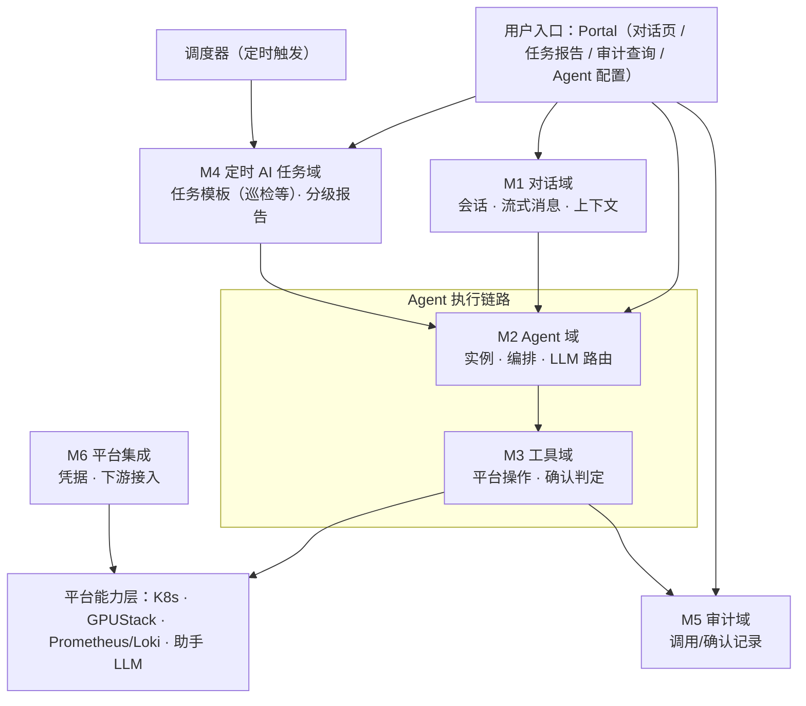

# CubeStack 平台智能助手（CubePilot）功能需求细化文档

**状态：** Draft（待评审）　**产品：** CubePilot　**版本：** v0.5
**定位：** 需求层文档，细化助手模块功能需求并按交付批次标注阶段，含各业务模块 AI Agent 能力与对接设计（[§8](#8-各模块-ai-agent-能力与对接设计)）；设计细节见《CubePilot 模块设计文档 v0.2》，本文档不替代设计文档。

---

# 1. 概述

本文档将助手模块（CubePilot）建设目标分解为**可评审、可排期、可测试**的功能需求，回答三个问题：① 做什么（[§3](#3-功能需求按功能域)/[§4](#4-非功能需求) 按功能域细化的需求清单）；② 分几个阶段、每阶段交付什么（每行的「阶段」+ [§5](#5-交付路线图) 路线图）；③ 各业务模块如何接入基座、哪些 AI 能力由模块自身承接（[§8](#8-各模块-ai-agent-能力与对接设计)）。

**范围**：对话问答（ChatOps）、自然语言操作、定时 AI 任务（健康巡检等）、审计、Agent 运行时与工具体系、平台集成、各业务模块 AI Agent 能力与对接；以及后续阶段 RAG、推理服务自动验证、任务模板、RCA/自动修复。**不包含**：平台底层资源管理与调度内核、LLM 模型训练微调、既有业务 API、IM 深度定制。

**溯源**：需求 → 设计章节映射见 [§6 需求溯源](#6-需求溯源)；设计文档变更需同步核对本文档。

---

# 2. 约定

- **编号**：功能需求 `FR-M{域}-{序号}`，非功能 `NFR-{序号}`；域：M1 对话 / M2 Agent / M3 工具 / M4 定时 AI 任务 / M5 审计 / M6 平台集成。
- **阶段**（唯一维度）：`一`=首批必须（最小可用）/ `二`=次批（安全与 AI Ops）/ `三`=后续（智能演进）。
  - 阶段顺序即优先级：阶段一为首批必须，阶段二、三依次后置；不再设 P0/P1/P2 子档；
  - **阶段与平台交付阶段对齐**：阶段一/二/三 分别承接平台的「推理平台 MVP → 微调平台 → 通用训练平台」三阶段（见平台详细设计文档 §18 阶段目标）；各阶段模块能力落地以平台对应阶段能力就绪为前提。
- **表字段**：编号 / 需求 / 验收要点 / 阶段。

---

# 3. 功能需求（按功能域）

助手模块按功能域划分为 **6 个域**，职责与数据流向如下（各域交付阶段见对应表格）：



> 说明：Portal 除对话页（M1）外，还提供任务报告（M4）、审计查询（M5）、Agent 配置（M2）等非对话入口；**定时 AI 任务（M4）由调度器定时触发，经 M2 Agent 实例执行**——以创建者身份跑任务模板（巡检是其中一种预置模板），经 M3 工具域访问平台能力层，结果写报告供 Portal / API 展示；阶段三起报告供 Agent 消费，用于 RCA 根因分析 / 自动修复 / 预测性运维（FR-M4-012~014）。

## 3.1 M1 对话域（职责：会话管理、消息收发、上下文组装）

| 编号 | 需求 | 验收要点 | 阶段 |
|---|---|---|---|
| FR-M1-001 | 会话管理 CRUD（绑定操作者身份；`tenant/project` 字段预留，多租户就绪后启用） | 增删改查可用 | 一 |
| FR-M1-002 | 会话归属隔离（多用户体系就绪后按用户/租户隔离） | 跨用户访问返回 403 | 二 |
| FR-M1-003 | 流式消息推送，包含 8 类事件：`message_start / agent_thinking / tool_call / tool_result / confirm_pending / confirm_resolved / message_delta / message_done`（`confirm_*` 阶段二 HITL 启用） | 客户端依次收到全部事件（阶段一为其余 6 类） | 一 |
| FR-M1-004 | 消息历史查询：按游标（cursor）向上滚动加载 | 滚动加载历史不重不漏 | 一 |
| FR-M1-005 | 上下文组装：平台侧要素（操作者身份、能力目录 FR-M3-006、确认规则〔阶段二起〕）为实例级配置、启动时加载；每次请求仅动态组装新消息与会话历史 | 上下文含平台侧要素 + 动态会话历史 | 一 |
| FR-M1-006 | 会话限制：200 轮/会话、空闲 24h inactive、30 天归档 | 超限被拒、状态正确迁移 | 二 |
| FR-M1-007 | **Portal 智能助手对话页**：chat UI + 流式渲染 + 会话切换（登录与多用户体系阶段二接入） | 可对话/看流式/切会话 | 一 |
| FR-M1-008 | RAG 知识库问答（手册/FAQ/最佳实践，回答溯源） | 命中正确知识点并附来源 | 二 |
| FR-M1-009 | 消息富文本渲染（代码块/表格/@资源引用） | 正确渲染、可点击跳转 | 二 |
| FR-M1-010 | 长对话超出 LLM 上下文窗口时，自动压缩早期历史为摘要，保留系统指令和近期对话不丢失 | 超长对话不丢失关键信息 | 二 |
| FR-M1-011 | 多入口：任意页面唤出助手对话框（悬浮/内嵌），上下文感知当前页面资源 | 任意页可唤出；能感知当前页资源作答 | 二 |
| FR-M1-012 | 移动端入口：企微/钉钉/App 下达指令、接收通知、查看报告 | 移动端可对话与收通知 | 二 |
| FR-M1-013 | 多模态对话（图片/文件上传理解） | 可理解内容并回答 | 三 |
| FR-M1-014 | 跨会话长期记忆（偏好/历史结论检索） | 新会话引用历史偏好 | 三 |

> 分页约定：对话消息历史（FR-M1-004）用游标（cursor）分页，适配向上滚动加载；审计查询（FR-M5-002）等按页跳转/总数场景用 offset 分页。

## 3.2 M2 Agent 域（职责：实例生命周期、LLM 路由）

> 编排循环（理解→规划→工具调用→评估→汇总）及跨模块任务编排由 Agent 运行时原生提供，配合能力目录（FR-M3-006）即可实现，非自研项。

| 编号 | 需求 | 验收要点 | 阶段 |
|---|---|---|---|
| FR-M2-001 | 操作者间物理隔离（多用户体系就绪后按每用户独立实例/数据目录隔离，机制承接 NFR-002） | 多用户就绪后操作者 A 无法访问 B 的数据/会话/记忆 | 二 |
| FR-M2-002 | Agent 实例生命周期：按需可用、闲置回收资源、异常自动恢复 | 按需启停、空闲回收、异常自愈 | 一 |
| FR-M2-003 | LLM 路由：模型无关，默认私有化部署模型，支持配置平台外 LLM | 换模型不破坏对话功能 | 一 |
| FR-M2-004 | 实例可重建且不丢失会话与记忆 | 重建后会话与记忆完整 | 一 |
| FR-M2-005 | **用户 Agent 配置管理**：模型选择/工具开关/系统提示词，持久化并即时生效；能力目录（FR-M3-006）作为工具开关与系统提示词的一部分，实例启动时加载 | 改配置即生效、重启保留 | 一 |
| FR-M2-006 | 实例状态指标上报（活跃/回收/冷启动时长） | 指标可查 | 二 |
| FR-M2-007 | RAG 检索结果接入 Agent 上下文（不干扰系统指令） | 检索结果不改变系统指令 | 二 |
| FR-M2-008 | 主动告警与报告推送：监控训练异常/服务故障/资源不足/配额预警主动推送；根据监控/日志/评估自动生成结构化报告并推送 | 异常主动推送；报告自动生成并推送 | 二 |
| FR-M2-009 | Agent 运行时可替换：不锁定单一运行时实现 | 更换运行时不需重写业务逻辑 | 三 |
| FR-M2-010 | 多模型路由与切换（按会话/用户，与 FR-M2-005 联动） | 切换后对话用新模型 | 三 |
| FR-M2-011 | 长期记忆体系（跨会话记忆/偏好沉淀） | 新会话引用历史偏好 | 三 |

## 3.3 M3 工具域（职责：平台能力操作化、能力目录、确认判定）

| 编号 | 需求 | 验收要点 | 阶段 |
|---|---|---|---|
| FR-M3-001 | 平台资源操作：Agent 以用户身份操作平台资源（含全部 CRD），权限由平台 RBAC 强制；读操作直放，写操作**阶段一直放执行、阶段二起命中确认规则后需确认**（FR-M3-002/003） | 读写均以用户身份执行；无权限被 RBAC 拒绝 | 一 |
| FR-M3-002 | 确认规则：管理员维护需确认的操作范围，规则即时生效 | 改规则即时生效 | 二 |
| FR-M3-003 | 运行时 HITL：高风险操作由操作人本人确认；拒绝/超时 fail-closed；重复确认去重 | 确认后才执行、超时默认不执行 | 二 |
| FR-M3-004 | 写操作 dry-run：执行前预览变更影响范围 | 确认前展示变更范围 | 二 |
| FR-M3-005 | 操作结果/错误解析与归因：统一解析返回结果，错误分类（权限/资源不存在/超时/下游异常）供 LLM 合理归因 | 错误可理解并归因正确 | 二 |
| FR-M3-006 | 平台能力目录：将平台能力（DevEnvironment / InferenceService / TrainingJob / Model / Dataset 等 CRD）登记为 Agent 可发现的能力清单——每项含用途、关键参数、调用示例；作为实例级配置启动时加载（注册为工具定义 + 能力说明注入系统提示词，承接 FR-M2-005） | 能力目录随实例启动加载；Agent 依据目录正确选择并调用对应能力（如创建开发环境、部署推理服务） | 一 |
| FR-M3-007 | 预测性运维工具（容量预测/利用率趋势/告警关联） | 返回分析结果 | 三 |

## 3.4 M4 定时 AI 任务域（职责：任务模板 · 定时任务 · 分级报告）

| 编号 | 需求 | 验收要点 | 阶段 |
|---|---|---|---|
| FR-M4-001 | 定时任务调度：支持每日定时 + 手动/API 触发（实现方式不限），以创建者身份执行、权限与创建者一致；巡检为其预置模板之一 | 到点/手动可触发；无权限项执行时被拒绝并标注 | 一 |
| FR-M4-002 | 定时/触发 AI 任务（用户级）：用户创建定时/手动/事件触发的任务（选预置模板或自定义），以创建者身份执行、结果按用户隔离；阶段一读写均直放、不二次确认，创建时明确提示「将以你的身份直接执行、不再确认」 | 任务到点/触发即执行；创建时可见直放提示；无权限项被拒绝并标注；任务/结果仅创建者可见 | 一 |
| FR-M4-003 | 预置巡检项 6 类：控制面/节点/GPU/Pod/存储/平台组件（阶段一 GPU/存储经 K8s API 做基本状态检查，阶段二起接入 GPUStack 等详细指标） | 全执行并识别异常 | 一 |
| FR-M4-004 | 任务报告持久化存储、可查询，异常分级计数 | 分级正确、报告可查 | 一 |
| FR-M4-005 | Portal 展示任务结果（报告 + API），巡检结果为其中一种报告类型 | 报告可看、API 可查 | 一 |
| FR-M4-006 | 巡检模板阈值配置（分级判定标准可配） | 改阈值改判定 | 二 |
| FR-M4-007 | AI 智能巡检：自主探索集群状态，发现预置巡检项之外的异常（配置漂移、资源浪费、跨资源关联异常等），输出结构化发现 + 自然语言描述 | Agent 能发现预置项未覆盖的异常；发现附带证据链与自然语言说明 | 一 |
| FR-M4-008 | 推理服务自动验证：启动/健康/推理请求/结果校验/响应时间/GPU 利用率 6 项 | 输出验证报告 | 二 |
| FR-M4-009 | 任务模板：预置 + 自定义任务模板，模板声明执行内容、所需权限、触发方式、输出形式；巡检为预置模板之一 | 可定义并执行模板 | 二 |
| FR-M4-010 | 告警触发自动诊断（监控告警联动拉起诊断） | 告警联动拉起诊断 | 二 |
| FR-M4-011 | 通知推送（报告/验证结果→站内+邮件+飞书） | 多通道可达 | 三 |
| FR-M4-012 | RCA 根因分析（监控/日志/事件→结构化报告） | 输出含证据链 RCA | 三 |
| FR-M4-013 | 自动修复 Auto-Fix（可安全自愈异常受控修复，需确认） | 安全场景自愈、危险不自动 | 三 |
| FR-M4-014 | 预测性运维（容量预测/异常趋势预警） | 输出预测与预警 | 三 |

> 授权约定：定时 AI 任务（FR-M4-001~007）均为用户级能力——以创建者身份执行、权限与创建者一致；巡检是预置任务模板之一，全集群巡检需集群级只读权限（通常运维/管理员具备），普通用户可建但范围限于自身 project，无权限项执行时被拒绝并标注。模板的「所需权限」为提示性说明，非授权机制。

## 3.5 M5 审计域（职责：工具调用与确认记录）

| 编号 | 需求 | 验收要点 | 阶段 |
|---|---|---|---|
| FR-M5-001 | 工具调用与确认的完整记录（操作者/会话/工具/参数/级别/状态/确认/结果） | 每次调用落库、字段完整 | 二 |
| FR-M5-002 | 审计查询 API（/audit-logs 按用户/工具/时间） | 可筛选查询 | 二 |
| FR-M5-003 | 审计记录不阻塞对话主链路 | 审计故障不影响对话 | 二 |
| FR-M5-004 | 审计治理界面（查询/筛选/导出） | 界面可用 | 二 |
| FR-M5-005 | 审计合规报告（操作统计/异常告警/追踪导出） | 可导出报告 | 三 |

## 3.6 M6 平台集成（职责：凭据管理、下游接入）

| 编号 | 需求 | 验收要点 | 阶段 |
|---|---|---|---|
| FR-M6-001 | 用户凭据管理：最小权限生成、安全传递、失效即时吊销；禁止管理员凭据 | 权限最小化、失效即吊销 | 一 |
| FR-M6-002 | 下游接入：K8s API Server + 助手 LLM 推理服务；阶段二起按需接入 GPUStack/Prometheus/Loki 等非 K8s 数据源 | K8s 与 LLM 联通可用 | 一 |
| FR-M6-003 | 助手 LLM 推理服务：独立部署、可弹性扩缩、完全内网运行 | 可用、可扩缩、内网部署 | 一 |
| FR-M6-004 | 每用户数据目录：Agent 实例工作目录，多用户体系就绪后按用户隔离（用户间不可互访） | 实例可读写自身目录 | 二 |
| FR-M6-005 | 消息中心/邮件/飞书/企微/钉钉通知通道集成（含移动端推送） | 报告/确认/告警可推送 | 二 |

---

# 4. 非功能需求

## 4.1 安全

| 编号 | 需求 | 阶段 |
|---|---|---|
| NFR-001 | 身份认证与授权；资源归属校验（随平台多用户体系落地） | 二 |
| NFR-002 | 物理隔离：每用户独立实例与数据目录，用户间不可互相访问 | 一 |
| NFR-003 | Prompt 注入防护：指令/数据分离，非信任内容作数据处理 | 一 |
| NFR-004 | 实例最小权限运行：非 root、限制系统调用、禁止特权、只读根文件系统、出网仅允许必要目标 | 一 |
| NFR-005 | 限流：按用户/工具/LLM 等维度控制调用速率，防止资源滥用 | 三 |

## 4.2 性能

| 编号 | 需求 | 阶段 |
|---|---|---|
| NFR-006 | 对话首 Token 延迟 P95 < 3s | 一 |
| NFR-007 | 完整回复延迟 P95 < 15s | 一 |
| NFR-008 | 工具调用执行延迟 P95 < 5s | 二 |
| NFR-009 | 实例冷启动（完全冷启）P95 < 15s | 二 |
| NFR-010 | 巡检模板全量执行（中规模）< 15min | 二 |

## 4.3 可观测性（接口预留、能力后置）

| 编号 | 需求 | 阶段 |
|---|---|---|
| NFR-011 | 监控指标接口预留：暴露 /metrics，对话/智能/成本/运维/实例池 5 类埋点；采集与面板展示后置 | 一 |
| NFR-012 | 结构化日志规范：携带 conversation_id/user_id/tool_call_id 关联字段；接入 Loki 后置 | 一 |
| NFR-013 | 链路追踪上下文预留：trace_id 透传约定（Portal→助手→Agent→工具）；采集后端后置接入 | 一 |
| NFR-014 | 告警规则：LLM 不可用/首 Token 高延迟>5s/工具失败率>10%/实例池异常 | 二 |

## 4.4 容量

| 编号 | 需求 | 阶段 |
|---|---|---|
| NFR-015 | 实例池资源：0.5~1 vCPU / 1~2GB 每实例，按 Infra 容量设上限 | 三 |
| NFR-016 | 助手 LLM GPU：独立推理节点 ≥ 8 张 64G 级 GPU（按 DeepSeek V4 Flash 最低规格） | 一 |

---

# 5. 交付路线图

## 5.1 三阶段总览

| 阶段 | 主题 | 交付内容（需求明细见 [§3](#3-功能需求按功能域)） | 验收锚点 |
|---|---|---|---|
| **一 · 首批必须** | 最小可用对话助手 | 对话闭环 + Portal 对话页（FR-M1-001、003~005、007）；Agent 实例与配置管理（FR-M2-002~005）；平台资源操作 + 能力目录（FR-M3-001、006）；**定时 AI 任务（含巡检模板）**（FR-M4-001~005、007）；平台集成基础（FR-M6-001~003）；可观测性接口（NFR-011~013）；安全/性能基础（NFR-002~004、006~007、016） | 自然语言创建开发环境/查询/操作推理服务（写操作直放）；Agent 依据能力目录正确选择 CRD 并操作；实例按需启停；预置+AI 巡检每日出报告；/metrics+日志关联字段；首 Token<3s |
| **二 · 次批** | 安全与 AI Ops 扩展 | 会话限制/多入口/移动端（FR-M1-006、011~012）；主动告警与报告（FR-M2-008）；实例指标/告警（FR-M2-006、NFR-014）；RAG 问答与上下文注入（FR-M1-008、M2-007）；确认规则/HITL/dry-run/错误解析（FR-M3-002~005）；任务增强（FR-M4-006、008~010）；审计（FR-M5-001~004）；数据目录/通知通道（FR-M6-004~005）；富文本/截断（FR-M1-009~010）；身份与多用户隔离（NFR-001、FR-M1-002、FR-M2-001）；性能达标（NFR-008~010） | 写操作命中 HITL；审计可查；RAG 答平台问题并溯源；自动验证输出报告；预置+自定义任务模板可编排 |
| **三 · 后续** | 智能演进 | 多模态/长期记忆（FR-M1-013~014、M2-011）；运行时替换/多模型路由（FR-M2-009~010）；RCA/自动修复/预测运维（FR-M4-012~014、M3-007）；通知推送（FR-M4-011）；审计合规报告（FR-M5-005）；限流（NFR-005）；实例池容量（NFR-015） | RCA 自动生成含证据链；多模型切换可用；长期记忆跨会话引用 |

## 5.2 阶段一关键决策

- **阶段一为单操作者使用**：平台多用户/租户体系尚未就绪，身份与授权（NFR-001）随平台用户体系在阶段二落地；物理隔离（NFR-002）阶段一通过每用户独立实例实现，多用户上线后自然延续。
- **阶段一写操作不设 HITL**：直放执行，等效用户本人操作；由「凭据直连 + API Server RBAC + K8s Audit Log」兜底，建议阶段一凭据最小权限。风险：LLM 幻觉可能触发未预料的写操作。
- **阶段一不建业务工具与工具级权限系统**：平台资源均为 CRD，Agent 可通过平台 API 覆盖主要操作；阶段一通过平台能力目录（FR-M3-006）注入 Agent 上下文，Agent 依据目录直接操作 CRD；非 K8s 数据源（GPU 指标等）阶段二起按需接入。
- **阶段一含定时 AI 任务**（FR-M4-001~005、007：调度/预置模板/报告/Portal 展示，巡检为预置模板，Agent 以创建者身份只读查询探索集群），任务增强（阈值/验证/模板/诊断，FR-M4-006、008~010）阶段二。
- **阶段一数据源以 K8s API（kubectl）为主**：智能日志分析经 `kubectl logs` 做简单分析，GPU/存储巡检经 K8s 节点状态（`nvidia.com/gpu` capacity/allocatable、PVC 状态）做基本检查；GPUStack / Prometheus / Loki 等非 K8s 详细数据源阶段二起接入（FR-M6-002）。
- **审计为阶段二能力**（FR-M5-001~003）：阶段一写操作仅靠 K8s Audit Log 兜底。
- **可观测性接口阶段一预留、能力后置**（NFR-011~013）：埋点/日志关联字段/trace 约定是写码规范，事后补成本高；Loki/Perses/告警/追踪后端阶段二后置。

## 5.3 扩展点

知识注入 → RAG（FR-M1-008）· Agent 运行时替换（FR-M2-009）· 定时任务骨架（→ 推理服务验证/任务模板）· 平台操作底座 + 能力目录（→ 后续按需扩展非 K8s 工具）· **任务报告 → Agent 消费（阶段三 RCA/自动修复/预测运维，FR-M4-012~014）**。

---

# 6. 需求溯源

需求 → 设计章节映射。文档链接可点击跳转。

| 需求 | [模块设计文档 v0.2](./CubeStack-平台智能助手-CubePilot-模块设计文档.md) |
|---|---|
| M1 对话域 | §5.1 |
| M2 Agent 域 | §5.2, §4.1 |
| M3 工具域 | §5.3, §4.2~§4.3 |
| M4 定时 AI 任务域 | §5.4 |
| M5 审计域 | §5.5 |
| M6 平台集成 | §5.6 |
| 安全 NFR-001~005 | §8 |
| 性能 NFR-006~010 | §10 |
| 可观测性 NFR-011~014 | §9 |
| 容量 NFR-015~016 | §10 |

**平台需求文档**：参见 [AI 智算云服务平台软件-需求文档](./requirements/AI智算云服务平台软件-需求文档.md) §4 AI 智能体（模块定位）、§9 运维管理（AI Operations）、§11 多租户与安全；**平台交付三阶段**见 [智算云平台详细设计文档](./CubeStack-智算云平台详细设计文档.md) §18 阶段目标。

---

# 7. 待确认问题

| 编号 | 问题 | 涉及需求 | 优先级 |
|---|---|---|---|
| Q-001 | 助手 LLM 模型选型（不低于 DeepSeek V4 Flash 规格）与评估 | FR-M6-003、NFR-016 | 高 |
| Q-002 | 用户凭据注入与轮换机制实现方式 | FR-M6-001、FR-M3-001 | 高 |
| Q-003 | 确认钩子与 Portal 内嵌确认的适配验证 | FR-M3-002/003 | 高 |
| Q-004 | 确认规则初始内容评审（哪些命令/资源需确认） | FR-M3-002 | 中 |
| Q-005 | 巡检项与阈值细化（分级判定标准） | FR-M4-006 | 中 |
| Q-006 | 实例池参数调优（闲置回收/实例数上限） | FR-M2-002、NFR-009 | 中 |
| Q-007 | 实例凭据保护与出网收敛验证（凭据安全、出网白名单） | NFR-004 | 高 |
| Q-008 | 阶段二/三需求是否有客户现场明确诉求（决定是否提前排期） | 阶段二/三全部 | 中 |
| Q-009 | 各模块「自带 Agent」的实现形态：独立 Agent 实例，还是复用基座 Agent + 模块注册领域技能（Skill）？倾向后者，避免每模块一套实例 | §8 | 高 |
| Q-010 | 能力目录（FR-M3-006）的登记/审核流程：谁维护、模块如何接入？ | §8.3、FR-M3-006 | 高 |
| Q-011 | 模块级 Agent 的 LLM 与基座共用一套，还是各模块独立？（共用降低部署成本） | §8 | 中 |
| Q-012 | 运维/运营/安全的深度智能（降噪、成本优化、安全响应）是否确为平台首期范围？ | §8.4.8~§8.4.10 | 中 |

---

# 8. 各模块 AI Agent 能力与对接设计

**定位：** 梳理平台各业务模块的 AI Agent 能力，说明各模块如何与 CubePilot 基座对接（本章原为独立文档 v0.1，已并入本文档 v0.5）。基座能力见 [§3](#3-功能需求按功能域)/[§4](#4-非功能需求)，本章不重复定义基座。

---

## 8.1 概述与定位

**定位分工**：CubePilot 是**共享 Agent 基座 + 通用能力**；各业务模块的 AI Agent 能力由**模块自身承接**，通过基座的对接机制暴露给 Agent。

```
用户（UI / 自然语言 / API/CLI 三路径）
        │
        ▼
CubePilot 基座（对话 · 编排 · 平台操作 · 报告/告警）
        │  ◄── 能力目录（FR-M3-006）── 各模块登记自己的能力
        ▼
各业务模块能力（开发环境/数据/模型/训练/评估/推理/镜像/运维/运营/安全）
```

---

## 8.2 基座能力清单（CubePilot 提供）

以下为 CubePilot 基座向各模块暴露的能力，具体需求定义见对应 FR 条目：

| 能力 | 基座需求 | 阶段 |
|---|---|---|
| 对话 / 智能问答 / 多入口（任意页面唤出、上下文感知） | FR-M1-001,003~005,007,011 | 一/二 |
| 移动端入口（企微/钉钉/App） | FR-M1-012 | 二 |
| 平台能力目录（各模块能力登记、实例级配置加载） | FR-M3-006 | 一 |
| 跨模块任务编排（一句话串联多模块操作） | Agent 原生能力（配合能力目录即实现） | 一 |
| 通用日志分析（任意任务日志→定位→修复建议） | Agent 原生能力 + 平台日志查询 | 一 |
| 主动告警与报告推送（异常推送、报告生成） | FR-M2-008 | 二 |
| 平台资源操作（用户身份、RBAC 强制） | FR-M3-001 | 一 |
| 身份 / 权限继承 / HITL / dry-run | FR-M3-002~004, NFR-001 | 二 |
| 审计 | FR-M5-001~004 | 二 |
| 长期记忆（偏好/上下文/历史） | FR-M2-011 | 三 |

---

## 8.3 对接机制（通用 4 步）

各模块 Agent 能力统一按以下方式与基座对接：

1. **能力 API 化**：模块能力遵循 API/CLI-First 原则，提供标准化接口，Agent 可编程调用。
2. **能力目录登记**：模块将能力登记进**能力目录**（FR-M3-006）——每项含用途、关键参数、调用示例；目录作为实例级配置启动时加载（承接 FR-M2-005）。
3. **工具化调用**：Agent 依据目录选择能力，经平台资源操作（FR-M3-001）调用；阶段二起复杂操作先预览影响（FR-M3-004），高风险操作需 HITL 确认（FR-M3-003）。
4. **凭据与权限继承**：所有调用以用户身份执行（凭据直连 + RBAC），不越权；全程审计（M5）。

**实现归属约定**：

| 类型 | 说明 | 归属 |
|---|---|---|
| **基座通用** | 问答/编排/记忆/报告/告警 | CubePilot 提供，各模块复用 |
| **能力目录工具化** | 模块的**操作类**能力（创建环境、提交训练、部署推理等） | 模块提供 CRD/API，基座登记为能力/工具 |
| **模块自带** | 模块的**领域智能**（数据画像、模型推荐、评估解读、成本优化、告警关联等） | 由模块实现，基座提供对话/推理外壳 |

**§8.4 归属取值说明**（固定词汇，表内用「+」表示多方协作）：

- **能力目录工具化**：模块提供 CRD/API，基座登记为能力/工具，Agent 经能力目录调用（纯问答类可标注「基座 LLM 问答」）；
- **模块自带**：模块实现领域智能（提示词/Skill/API），基座提供对话/推理外壳；
- **基座报告 / 告警 / 预测运维 / RCA / 定时任务 / 自动修复**：直接复用基座对应 FR 能力（FR-M2-008、FR-M4-001~007、FR-M4-012~014 等）；
- **Agent 原生 + 日志查询**：编排循环由 Agent 运行时原生提供（非自研），日志查询走平台日志（阶段一 kubectl、阶段二起 Loki），领域聚类/诊断由模块补充。

> **待定（Q-009）**：模块「自带 Agent」的最终形态——独立 Agent 实例，还是复用基座 Agent + 模块注册领域技能（倾向后者，避免每模块一套实例）。「模块自带」的三种实现方式：
> - **A. 能力 API 化**：模块封装领域逻辑为 API → 登记能力目录 → Agent 工具化调用
> - **B. 领域 Skill**：模块打包查询工具 + 领域提示词 → 基座场景化加载
> - **C. 数据开放 + 基座推理**：模块暴露数据/API → 基座 LLM 直接分析（关键诊断场景倾向 A/B）

---

## 8.4 各模块能力 × 对接映射

### 8.4.1 开发环境

| 能力 | 依赖的平台 API/数据 | 实现归属 | 阶段 |
|---|---|---|---|
| 自然语言创建环境 | DevEnvironment CRD / 环境 API | 能力目录工具化 | 一 |
| 环境诊断（CUDA 冲突/OOM/依赖冲突提示+修复建议） | 环境状态、GPU/显存指标、日志 | 模块自带 | 一 |
| 环境推荐（按历史使用+当前任务） | 用户历史、任务上下文 | 模块自带 | 三 |
| 一键复刻（打包镜像+推私有仓库+分享配置） | 镜像构建/推送 API（Harbor） | 能力目录工具化 | 二 |

### 8.4.2 数据

| 能力 | 依赖的平台 API/数据 | 实现归属 | 阶段 |
|---|---|---|---|
| 数据画像（质量报告：分布/重复率/异常值/label 均衡） | 数据集统计 API | 模块自带 | 二 |
| 数据问答（条数、label 分布差异等查询） | 数据集元数据/统计 API | 能力目录工具化（基座 LLM 问答） | 二 |
| 数据异常检测（漂移/缺失/损坏主动告警） | 数据血缘、定期抽样统计 | 模块自带 + 基座主动告警 | 三 |

### 8.4.3 模型

| 能力 | 依赖的平台 API/数据 | 实现归属 | 阶段 |
|---|---|---|---|
| 模型推荐（按任务描述推荐模型+微调方案） | 模型广场元数据、兼容矩阵 | 模块自带 | 三 |
| 自动模型测试（Playground 跑用例生成体验报告） | 推理服务、测试用例集 | 模块自带 + 基座报告 | 一 |
| 模型血缘问答（lineage 查询） | Model/Lineage 元数据 | 能力目录工具化（基座 LLM 问答） | 二 |
| 版本监控（新版本通知+差异对比） | 模型版本元数据 | 模块自带 + 基座主动告警 | 三 |

### 8.4.4 训练

| 能力 | 依赖的平台 API/数据 | 实现归属 | 阶段 |
|---|---|---|---|
| 自然语言提交训练 | TrainingJob CRD / 训练 API | 能力目录工具化 | 二 |
| 训练监控+智能干预（loss 异常告警+调参建议） | 训练指标、日志流 | 模块自带 + 基座主动告警 | 二 |
| 自动调参（HPO 贝叶斯优化） | 训练 API、HPO 框架 | 模块自带 | 三 |
| 训练报告（自动生成+推送） | 训练指标、日志、耗时/成本 | 基座报告（FR-M2-008） | 二 |
| 故障自动恢复（checkpoint 恢复+通知） | Checkpoint、训练 API | 模块自带（基座编排执行） | 二 |

### 8.4.5 评估

| 能力 | 依赖的平台 API/数据 | 实现归属 | 阶段 |
|---|---|---|---|
| 评估方案生成（选 benchmark+指标设计计划） | 评估 API、benchmark 库 | 模块自带 | 二 |
| 结果解读（自然语言报告+强弱项+改进方向） | 评估结果 | 模块自带 + 基座报告 | 二 |
| 对比建议（新模型 vs 已有模型结构化结论） | 评估结果、模型元数据 | 模块自带 | 二 |
| 性能调优建议（基于压测结果） | 压测结果、推理配置 | 模块自带 | 三 |

### 8.4.6 推理

| 能力 | 依赖的平台 API/数据 | 实现归属 | 阶段 |
|---|---|---|---|
| 智能部署（按模型/流量/延迟推荐框架/并行/量化） | InferenceService、模型元数据、压测数据 | 模块自带（基座执行） | 一 |
| 自动排障（服务异常→日志→定位→方案→授权执行） | 推理日志、监控指标、网关 | Agent 原生 + 日志查询 + 模块诊断 | 一 |
| 性能优化（持续监控+低效配置建议） | 推理指标（QPS/延迟/利用率） | 模块自带 | 二 |

### 8.4.7 镜像

| 能力 | 依赖的平台 API/数据 | 实现归属 | 阶段 |
|---|---|---|---|
| 智能构建（自动生成 Dockerfile+构建+验证） | 镜像构建 API、Dockerfile 模板 | 模块自带 | 二 |
| 安全巡检（漏洞扫描+修复建议） | Trivy 扫描结果、CVE 库 | 模块自带 + 基座主动告警 | 三 |
| 镜像优化（层级精简建议） | 镜像层分析 | 模块自带 | 三 |
| 自动同步（上游更新提示） | Harbor 同步、上游仓库 | 模块自带 + 基座主动告警 | 二 |
| 容量预测（仓库增长预警） | Harbor 存储指标 | 基座预测运维（FR-M4-014） | 三 |
| 清理建议（无引用/过期/重复镜像） | Harbor 元数据 | 模块自带 | 二 |

### 8.4.8 运维

| 能力 | 依赖的平台 API/数据 | 实现归属 | 阶段 |
|---|---|---|---|
| 智能告警分析（多指标关联根因） | 告警、指标、事件 | 模块自带 + 基座 RCA（FR-M4-012） | 三 |
| 异常预测（趋势预测故障） | 指标历史趋势 | 基座预测运维（FR-M4-014） | 三 |
| 监控报告自动生成（日报/周报/月报推送） | 监控指标、告警历史 | 基座报告（FR-M2-008） | 二 |
| 智能降噪（学习告警模式抑制噪声） | 告警历史 | 模块自带 | 三 |
| 巡检自动化（定期巡检+隐患报告） | 平台状态 | 基座定时任务（FR-M4-001~005,007） | 一 |
| 节点健康管理 / 自动修复（GPU 掉卡/驱动崩溃） | 节点状态、健康检查 | 基座自动修复（FR-M4-013）+ 模块 | 三 |
| 性能回归检测（benchmark 对比基线） | Benchmark 结果 | 模块自带 | 三 |
| 滚动升级（编排零停机+分批验证） | 集群升级 API | Agent 原生编排 + 模块 | 三 |
| 智能调度建议 / 配额优化 / 抢占决策 / 碎片分析 | 调度队列、配额、资源分布 | 模块自带（基座问答/编排外壳） | 三 |
| 存储诊断 / 容量预警 / 冷热分析 / 备份验证 / 异常检测 | 存储指标、访问日志 | 模块自带 + 基座预测运维 | 三 |
| 网络异常分析 / 拓扑优化 / NCCL 退化检测 / 网络规划 | 网络指标、NCCL 测试 | 模块自带 | 三 |
| 故障根因分析（RCA） | 日志/指标/事件 | 基座 RCA（FR-M4-012） | 三 |
| Runbook 自动生成 / 自然语言驱动运维 / 变更影响评估 | 运维文档、集群操作 API | 模块自带（Agent 原生编排） | 三 |
| 运维知识库（经验+故障案例→解决方案推荐） | 历史故障、修复记录 | 模块自带（基座 RAG 外壳） | 三 |
| 智能日志分析 / 根因定位 / 日志摘要 / 日志问答 | 平台日志（阶段一 `kubectl logs` 简单分析，阶段二起接入 Loki） | Agent 原生 + 日志查询 + 模块聚类 | 一 |

### 8.4.9 运营

| 能力 | 依赖的平台 API/数据 | 实现归属 | 阶段 |
|---|---|---|---|
| 用户活跃度分析 / 异常用户检测 / 用户引导 | 用户使用数据、角色 | 模块自带 | 三 |
| 智能配额建议（按历史+配额池） | 配额用量、历史 | 模块自带（基座问答外壳） | 二 |
| 成本优化建议 / 异常计费检测 / 账单解读 / 费用预测 / 计费策略推荐 | 计费数据、资源使用 | 模块自带 + 基座报告/告警 | 三 |
| 智能分析报告 / 低效资源识别 / 容量预测 / 异常检测 / 投入产出分析 | 资源使用统计 | 模块自带 + 基座报告 | 三 |
| 自然语言查询（上月 GPU 消费等） | 资源使用统计 API | 能力目录工具化（基座 LLM 问答） | 三 |
| 运营日报 / 预算预警 / 用户满意度分析 / 运营优化建议 | 资源/费用/SLA/工单 | 模块自带 + 基座报告/告警 | 三 |

### 8.4.10 安全

| 能力 | 依赖的平台 API/数据 | 实现归属 | 阶段 |
|---|---|---|---|
| 异常行为检测（操作模式分析） | 审计日志、操作记录 | 模块自带（基座审计数据） | 三 |
| 权限优化建议（最小化调整） | 权限数据、使用分析 | 模块自带 | 三 |
| 安全事件响应（隔离账号/封禁 IP/暂停任务） | 安全事件、账号/网络 API | 模块自带（基座编排执行） | 三 |

---

## 8.5 落地阶段规划

| 阶段 | 模块 Agent 落地重点 | 基座配套 |
|---|---|---|
| **一 · 最小可用** | **开发环境**：自然语言创建环境、环境诊断；**推理**：智能部署、自动排障；**模型**：自动模型测试；**运维**：巡检自动化、智能日志分析 | 对话闭环 + Portal 对话页、Agent 实例与配置管理、平台资源操作 + 能力目录、定时 AI 任务（含巡检模板）、平台集成基础、可观测性接口 |
| **二 · AI Ops 扩展** | **开发环境**：一键复刻；**数据**：数据画像、数据问答；**模型**：模型血缘问答；**训练**：自然语言提交训练、训练监控+智能干预、训练报告、故障自动恢复；**评估**：评估方案生成、结果解读、对比建议；**推理**：性能优化；**镜像**：智能构建、自动同步、清理建议；**运维**：监控报告自动生成 | 会话限制/多入口/移动端、RAG 问答、主动告警/报告、确认规则/HITL/dry-run/错误解析、任务增强（阈值/推理验证/任务模板/诊断）、审计、数据目录/通知通道、身份/多用户隔离（NFR-001、FR-M1-002、FR-M2-001） |
| **三 · 智能演进** | **开发环境**：环境推荐；**数据**：数据异常检测；**模型**：模型推荐、版本监控；**训练**：自动调参 HPO；**评估**：性能调优建议；**镜像**：安全巡检/优化/容量预测；**运维**：智能告警分析/异常预测/智能降噪/节点健康/性能回归/滚动升级/调度建议/存储诊断/网络分析/RCA/自动修复/Runbook/知识库；**运营**：成本优化/智能配额/运营分析；**安全**：异常行为检测/权限优化/安全事件响应 | 多模态/长期记忆、运行时替换/多模型路由、预测运维/RCA/自动修复、通知推送、审计合规报告、限流（NFR-005） |
