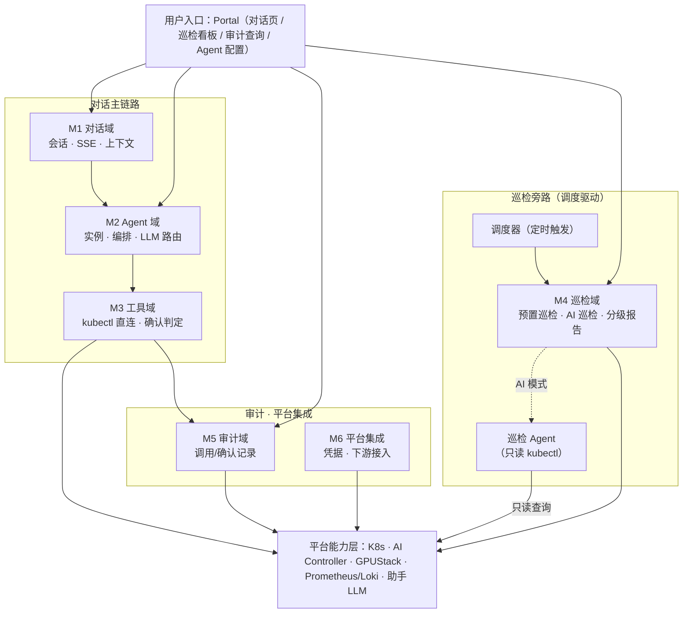

# CubeStack 平台智能助手（CubePilot）功能需求细化文档

**状态：** Draft（待评审）　**产品：** CubePilot　**版本：** v0.5
**定位：** 需求层文档，细化助手模块功能需求并按交付批次标注阶段；设计细节见《CubePilot 模块设计文档 v0.1》与《平台智能助手详细设计 v0.4》，本文档不替代设计文档。

---

# 1. 概述

本文档将助手模块（CubePilot）建设目标分解为**可评审、可排期、可测试**的功能需求，回答两个问题：① 做什么（[§3](#3-功能需求按功能域)/[§4](#4-非功能需求) 按功能域细化的需求清单）；② 分几个阶段、每阶段交付什么（每行的「阶段」+ [§5](#5-交付路线图) 路线图）。

**范围**：对话问答（ChatOps）、自然语言操作、健康巡检、审计、Agent 运行时与工具体系、平台集成；以及后续阶段 RAG、推理服务自动验证、Workflow、RCA/自动修复。**不包含**：平台底层资源管理与调度内核、LLM 模型训练微调、既有业务 API、IM 深度定制。

**溯源**：需求 → 设计章节映射见 [§6 需求溯源](#6-需求溯源)；设计文档变更需同步核对本文档。

---

# 2. 约定

- **编号**：功能需求 `FR-M{域}-{序号}`，非功能 `NFR-{序号}`；域：M1 对话 / M2 Agent / M3 工具 / M4 巡检 / M5 审计 / M6 平台集成。
- **阶段**（唯一维度）：`一`=首批必须（最小可用）/ `二`=次批（安全与 AI Ops）/ `三`=后续（智能演进）。
  - 阶段顺序即优先级：阶段一为首批必须，阶段二、三依次后置；不再设 P0/P1/P2 子档；
  - 阶段表示**交付批次**，与平台自身阶段解耦。
- **表字段**：编号 / 需求 / 验收要点 / 阶段。

---

# 3. 功能需求（按功能域）

助手模块按功能域划分为 **6 个域**，职责与数据流向如下（各域交付阶段见对应表格）：

> 说明：Portal 除对话页（M1）外，还提供巡检看板（M4 报告）、审计查询（M5）、Agent 配置（M2）等非对话入口；**巡检（M4）由调度器定时驱动，不经对话 Agent 域（M2）**，预置巡检直接查询平台能力层，AI 巡检模式使用 M4 专属巡检 Agent（只读 kubectl）探索集群；Agent 查巡检结果经 M3 工具域 `kubectl get inspectionrun` 读取报告 CRD；阶段三起巡检报告供 Agent 消费，用于 RCA 根因分析 / 自动修复 / 预测性运维（FR-M4-011~013）。

## 3.1 M1 对话域（职责：会话管理、消息收发、上下文组装）

| 编号 | 需求 | 验收要点 | 阶段 |
|---|---|---|---|
| FR-M1-001 | 会话管理 CRUD（绑定操作者身份；`tenant/project` 字段预留，多租户就绪后启用） | 增删改查可用 | 一 |
| FR-M1-002 | 会话归属隔离（多用户体系就绪前为单操作者，之后按用户/租户隔离） | 跨用户访问返回 403 | 一 |
| FR-M1-003 | SSE 流式消息，8 类事件（事件列表见下表注） | 客户端依次收到全部事件 | 一 |
| FR-M1-004 | 消息历史分页查询 | 翻页不重不漏 | 一 |
| FR-M1-005 | 上下文组装：系统提示词 = 操作者身份 + 工具清单/能力目录（FR-M3-006）+ 确认规则 + 会话历史 | 下发提示词含四要素 | 一 |
| FR-M1-006 | 会话限制：200 轮/会话、空闲 24h inactive、30 天归档 | 超限被拒、状态正确迁移 | 二 |
| FR-M1-007 | **Portal 智能助手对话页**：chat UI + SSE 流式渲染 + 会话切换（登录与多用户体系阶段二接入） | 可对话/看流式/切会话 | 一 |
| FR-M1-008 | 知识注入 hook 预留（返回空，供 RAG 接入） | 接口存在且不干扰对话 | 二 |
| FR-M1-009 | RAG 知识库问答（手册/FAQ/最佳实践，经 M1-008 hook 注入，回答溯源） | 命中正确知识点并附来源 | 二 |
| FR-M1-010 | 消息富文本渲染（代码块/表格/@资源引用） | 正确渲染、可点击跳转 | 二 |
| FR-M1-011 | 上下文窗口截断策略（系统提示词>最近消息>早期摘要） | 超长对话保关键指令 | 二 |
| FR-M1-012 | 多入口：任意页面唤出助手对话框（悬浮/内嵌），上下文感知当前页面资源 | 任意页可唤出；能感知当前页资源作答 | 二 |
| FR-M1-013 | 移动端入口：企微/钉钉/App 下达指令、接收通知、查看报告 | 移动端可对话与收通知 | 二 |
| FR-M1-014 | 多模态对话（图片/文件上传理解） | 可理解内容并回答 | 三 |
| FR-M1-015 | 跨会话长期记忆（偏好/历史结论检索） | 新会话引用历史偏好 | 三 |

> 注：SSE 事件包括 `message_start / agent_thinking / tool_call / tool_result / confirm_pending / confirm_resolved / message_delta / message_done`。

## 3.2 M2 Agent 域（职责：实例生命周期、LLM 路由）

> 编排循环（理解→规划→工具调用→评估→汇总）及跨模块任务编排由 Agent 运行时（OpenClaw）**原生提供**，配合能力目录（FR-M3-006）即可实现，非自研项。

| 编号 | 需求 | 验收要点 | 阶段 |
|---|---|---|---|
| FR-M2-001 | 每操作者 Agent 实例 + 独立数据目录（多用户体系就绪后为每用户，物理隔离） | 操作者 A 无法访问 B | 一 |
| FR-M2-002 | Instance Manager：按需拉起/闲置回收（默认 30min 可配）/异常重建/单主 Leader Election | 按需启停、回收、重建 | 一 |
| FR-M2-003 | LLM 路由：模型无关（OpenAI 兼容），私有化部署模型 | 换模型不改代码 | 一 |
| FR-M2-004 | 实例无状态化：状态从 DB/数据目录恢复 | 重建后会话与记忆完整 | 一 |
| FR-M2-005 | **用户 Agent 配置管理**：模型选择/工具开关/系统提示词，持久化并即时生效 | 改配置即生效、重启保留 | 一 |
| FR-M2-006 | 实例状态指标上报（活跃/回收/冷启动时长） | 指标可查 | 二 |
| FR-M2-007 | RAG 检索接入 Agent 上下文（数据注入不污染系统指令） | 检索结果不改变系统指令 | 二 |
| FR-M2-008 | 主动告警与报告推送：监控训练异常/服务故障/资源不足/配额预警主动推送；根据监控/日志/评估自动生成结构化报告并推送 | 异常主动推送；报告自动生成并推送 | 二 |
| FR-M2-009 | Agent Runtime Adapter 接口预留（窄接口，可切其他运行时） | 换运行时只替换适配器 | 三 |
| FR-M2-010 | 多模型路由与切换（按会话/用户，与 FR-M2-005 联动） | 切换后对话用新模型 | 三 |
| FR-M2-011 | 长期记忆体系（跨会话记忆/偏好沉淀） | 新会话引用历史偏好 | 三 |

## 3.3 M3 工具域（职责：平台能力操作化（kubectl 直连）、能力目录、确认判定）

| 编号 | 需求 | 验收要点 | 阶段 |
|---|---|---|---|
| FR-M3-001 | kubectl 直连：实例注入用户 kubeconfig，Agent 以用户身份操作 K8s（含全部平台 CRD）；`get/list/logs` 与 `apply/patch/delete/scale/exec` 均直放；高危命令确认由 FR-M3-002/003 承接；权限由 API Server RBAC 强制 | 只读写均直放；无权限被 RBAC 拒绝 | 一 |
| FR-M3-002 | 确认规则表：管理员维护「命令/资源 → 是否需确认」，下发运行时钩子（kubectl apply/patch/delete/exec 命中） | 改规则即时生效 | 二 |
| FR-M3-003 | 运行时 HITL：L1 命令由操作人本人确认；拒绝/超时 fail-closed；重复确认去重 | 确认后才执行、超时默认不执行 | 二 |
| FR-M3-004 | 写命令 dry-run 影响预览（复用 kubectl --dry-run） | 确认前展示变更范围 | 二 |
| FR-M3-005 | 命令输出/错误解析与归因：kubectl 返回统一解析，错误分类（权限/资源不存在/超时/下游异常）供 LLM 合理归因 | 错误可理解并归因正确 | 二 |
| FR-M3-006 | 平台能力目录：将平台能力（DevEnvironment / InferenceService / TrainingJob / Model / Dataset 等 CRD）登记为 Agent 可发现的能力清单——每项含用途、关键 spec 字段、kubectl 调用示例；随上下文注入（承接 FR-M1-005） | 能力目录注入 Agent 上下文；Agent 依据目录正确选择并调用对应能力（如创建开发环境、部署推理服务） | 一 |
| FR-M3-007 | 预测性运维工具（容量预测/利用率趋势/告警关联） | 返回分析结果 | 三 |

## 3.4 M4 巡检域（职责：预置巡检 + AI 智能巡检、分级报告）

| 编号 | 需求 | 验收要点 | 阶段 |
|---|---|---|---|
| FR-M4-001 | 定时巡检调度：支持每日定时触发 + 手动/API 触发（实现方式不限，可用 OpenClaw cron 或 K8s CronJob） | 到点/手动可触发 | 一 |
| FR-M4-002 | 预置巡检项 6 类：控制面/节点/GPU/Pod/存储/平台组件 | 全执行并识别异常 | 一 |
| FR-M4-003 | 巡检报告：InspectionRun CRD 持久化，异常分级计数 | 分级正确、CRD 可查 | 一 |
| FR-M4-004 | Portal 展示巡检结果（Dashboard + API） | 看板出图、API 可查 | 一 |
| FR-M4-005 | 巡检阈值配置（分级判定标准可配） | 改阈值改判定 | 二 |
| FR-M4-006 | AI 智能巡检：巡检 Agent 持有只读 kubectl，自主探索集群状态，发现预置巡检项之外的异常（配置漂移、资源浪费、跨资源关联异常等），输出结构化发现 + 自然语言描述 | Agent 能发现预置项未覆盖的异常；发现附带证据链与自然语言说明 | 一 |
| FR-M4-007 | 推理服务自动验证：启动/健康/推理请求/结果校验/响应时间/GPU 利用率 6 项 | 输出验证报告 | 二 |
| FR-M4-008 | Workflow 引擎：复用巡检「调度→逐项→汇总→报告」骨架，预置+自定义 | 可定义并执行 | 二 |
| FR-M4-009 | 告警触发自动诊断（监控告警联动拉起诊断） | 告警联动拉起诊断 | 二 |
| FR-M4-010 | 通知推送（报告/验证结果→站内+邮件+飞书） | 多通道可达 | 三 |
| FR-M4-011 | RCA 根因分析（监控/日志/事件→结构化报告） | 输出含证据链 RCA | 三 |
| FR-M4-012 | 自动修复 Auto-Fix（可安全自愈异常受控修复，需确认） | 安全场景自愈、危险不自动 | 三 |
| FR-M4-013 | 预测性运维（容量预测/异常趋势预警） | 输出预测与预警 | 三 |

## 3.5 M5 审计域（职责：工具调用与确认记录）

| 编号 | 需求 | 验收要点 | 阶段 |
|---|---|---|---|
| FR-M5-001 | 工具调用/确认单表（tool_call_record：user/conversation/tool/args/level/status/confirm/result） | 每次调用落库、字段完整 | 二 |
| FR-M5-002 | 审计查询 API（/audit-logs 按用户/工具/时间） | 可筛选查询 | 二 |
| FR-M5-003 | 审计写入与主链路解耦（异步写、失败重试） | 审计故障不影响对话 | 二 |
| FR-M5-004 | 审计治理界面（查询/筛选/导出） | 界面可用 | 二 |
| FR-M5-005 | 审计合规报告（操作统计/异常告警/追踪导出） | 可导出报告 | 三 |

## 3.6 M6 平台集成（职责：凭据管理、下游接入）

| 编号 | 需求 | 验收要点 | 阶段 |
|---|---|---|---|
| FR-M6-001 | kubeconfig 凭据管理：最小权限生成/注入(0600)/轮换/吊销；禁管理员凭据 | 权限最小化、失效即吊销 | 一 |
| FR-M6-002 | 下游接入：K8s API Server + 助手 LLM 推理服务；阶段二起按需接入 GPUStack/Prometheus/Loki 等非 K8s 数据源 | K8s 与 LLM 联通可用的 | 一 |
| FR-M6-003 | 助手 LLM 服务：独立推理池（InferenceService）、HPA、私有化 | 可用、可扩缩、内网部署 | 一 |
| FR-M6-004 | 每用户数据目录：Agent 实例工作目录；多用户体系就绪后配额/ACL 隔离 | 实例可读写自身目录 | 二 |
| FR-M6-005 | 消息中心/邮件/飞书/企微/钉钉通知通道集成（含移动端推送） | 报告/确认/告警可推送 | 二 |

---

# 4. 非功能需求

## 4.1 安全

| 编号 | 需求 | 阶段 |
|---|---|---|
| NFR-001 | 身份与授权：Keycloak OIDC 鉴权；资源归属校验复用平台 RBAC（随平台多用户体系落地） | 二 |
| NFR-002 | 物理隔离：每用户一实例一目录，存储层 ACL/配额隔离（随平台多用户体系落地） | 二 |
| NFR-003 | Prompt 注入防护：指令/数据分离，非信任内容作数据处理 | 一 |
| NFR-004 | 实例加固：runAsNonRoot/seccomp/drop caps/readOnlyRootFilesystem/egress 白名单 | 一 |
| NFR-005 | 集群护栏：PSA restricted + Kyverno 基线 | 一 |
| NFR-006 | 六级限流：会话/用户/实例/工具/LLM/直连 | 二 |

## 4.2 性能

| 编号 | 需求 | 阶段 |
|---|---|---|
| NFR-007 | 对话首 Token 延迟 P95 < 3s | 一 |
| NFR-008 | 完整回复延迟 P95 < 15s | 一 |
| NFR-009 | 工具调用执行延迟 P95 < 5s | 二 |
| NFR-010 | 实例冷启动（完全冷启）P95 < 15s | 二 |
| NFR-011 | 巡检全量执行（中规模）< 15min | 二 |

## 4.3 可观测性（接口预留、能力后置）

| 编号 | 需求 | 阶段 |
|---|---|---|
| NFR-012 | 监控指标接口预留：暴露 /metrics，对话/智能/成本/运维/实例池 5 类埋点；采集与面板展示后置 | 一 |
| NFR-013 | 结构化日志规范：携带 conversation_id/user_id/tool_call_id 关联字段；接入 Loki 后置 | 一 |
| NFR-014 | 链路追踪上下文预留：OTel trace_id 透传约定（Portal→助手→Agent→工具）；采集后端后置接入 | 一 |
| NFR-015 | 告警规则：LLM 不可用/首 Token 高延迟>5s/工具失败率>10%/实例池异常 | 二 |

## 4.4 容量

| 编号 | 需求 | 阶段 |
|---|---|---|
| NFR-016 | 实例池资源：0.5~1 vCPU / 1~2GB 每实例，按 Infra 容量设上限 | 三 |
| NFR-017 | 助手 LLM GPU：独立推理节点 ≥ 1 张 64G 级 GPU（按现有硬件） | 一 |

---

# 5. 交付路线图

## 5.1 三阶段总览

| 阶段 | 主题 | 交付内容（需求明细见 [§3](#3-功能需求按功能域)） | 验收锚点 |
|---|---|---|---|
| **一 · 首批必须** | 最小可用对话助手 | 对话闭环 + Portal 对话页（FR-M1-001~005、007）；Agent 实例与配置管理（FR-M2-001~005）；kubectl 直连 + 平台能力目录（FR-M3-001、006）；**基本巡检 + AI 智能巡检**（FR-M4-001~004、006）；平台集成基础（FR-M6-001~003）；可观测性接口（NFR-012~014）；安全/性能基础（NFR-003~005、007~008、017） | 自然语言创建开发环境/查询/操作推理服务（写操作直放）；Agent 依据能力目录正确选择 CRD 并操作；实例按需启停；预置+AI 巡检每日出图；/metrics+日志关联字段；首 Token<3s |
| **二 · 次批** | 安全与 AI Ops 扩展 | 会话限制/多入口/移动端（FR-M1-006、012~013）；主动告警与报告（FR-M2-008）；实例指标/告警（FR-M2-006、NFR-015）；RAG 问答与上下文注入（FR-M1-008~009、M2-007）；确认规则/HITL/dry-run/错误解析（FR-M3-002~005）；巡检增强（FR-M4-005、007~009）；审计（FR-M5-001~004）；数据目录/通知通道（FR-M6-004~005）；富文本/截断（FR-M1-010~011）；身份/隔离/限流（NFR-001~002、006、009~011） | 写操作命中 HITL；审计可查；RAG 答平台问题并溯源；自动验证输出报告；预置+自定义 Workflow 可编排 |
| **三 · 后续** | 智能演进 | 多模态/长期记忆（FR-M1-014~015、M2-011）；Runtime Adapter/多模型路由（FR-M2-009~010）；RCA/自动修复/预测运维（FR-M4-011~013、M3-007）；通知推送（FR-M4-010）；审计合规报告（FR-M5-005）；实例池容量（NFR-016） | RCA 自动生成含证据链；多模型切换可用；长期记忆跨会话引用 |

## 5.2 阶段一关键决策

- **阶段一为单操作者使用**：平台多用户/租户体系尚未就绪，身份与授权、每用户隔离（NFR-001/002）随平台用户体系在阶段二落地；阶段一会话与实例以「操作者」为粒度。
- **阶段一写操作不设 HITL**：kubectl 直放执行，等效用户本人操作；由「凭据直连 + API Server RBAC + K8s Audit Log」兜底，建议阶段一凭据最小权限。风险：LLM 幻觉可能触发未预料的写操作。
- **阶段一不建业务工具与工具级权限系统**：平台资源均为 CRD，kubectl 可覆盖主要操作；阶段一通过平台能力目录（FR-M3-006）注入 Agent 上下文，Agent 依据目录直接操作 CRD；非 K8s 数据源（GPU 指标等）阶段二起按需接入。
- **阶段一含基本巡检 + AI 智能巡检**（FR-M4-001~004、006：调度/预置项/报告/Portal 展示 + Agent 只读 kubectl 探索集群），巡检增强（阈值/验证/Workflow/诊断，FR-M4-005、007~009）阶段二。
- **审计为阶段二能力**（FR-M5-001~003）：阶段一写操作仅靠 K8s Audit Log 兜底。
- **可观测性接口阶段一预留、能力后置**（NFR-012~014）：埋点/日志关联字段/trace 约定是写码规范，事后补成本高；Loki/Perses/告警/追踪后端阶段二后置。

## 5.3 扩展点

知识注入 hook（FR-M1-008 → RAG）· Agent Runtime Adapter（FR-M2-009）· 巡检调度骨架（→ 推理服务验证/Workflow）· kubectl 直连底座 + 能力目录（→ 后续按需扩展非 K8s 工具）· **巡检报告 → Agent 消费（阶段三 RCA/自动修复/预测运维，FR-M4-011~013）**。

---

# 6. 需求溯源

需求 → 设计章节映射。文档链接可点击跳转。

| 需求 | [模块设计文档 v0.1](./CubeStack-平台智能助手-CubePilot-模块设计文档.md) | [详细设计文档 v0.4](./CubeStack-平台智能助手模块详细设计文档.md) |
|---|---|---|
| M1 对话域 | §4.1 | §4.1 |
| M2 Agent 域 | §4.3 | §4.2 |
| M3 工具域 | §4.2 | §4.3 |
| M4 巡检域 | §4.4 | §4.4 |
| M5 审计域 | §4.5 | §9.7 |
| M6 平台集成 | §4.6 | §3.5, §4.6, §9.10 |
| 安全 NFR-001~006 | §9 | §9 |
| 性能 NFR-007~011 | §11 | §11 |
| 可观测性 NFR-012~015 | §10 | §10 |
| 容量 NFR-016~017 | §11 | §11 |

**平台需求文档**：参见 [AI 智算云服务平台软件-需求文档](./requirements/AI智算云服务平台软件-需求文档.md) §2.2 模块定位、§15 AI Operations、§16 Portal、§18 三阶段目标。

---

# 7. 待确认问题

| 编号 | 问题 | 涉及需求 | 优先级 |
|---|---|---|---|
| Q-001 | 助手 LLM 模型选型（Qwen/DeepSeek）与规格评估 | FR-M6-003、NFR-017 | 高 |
| Q-002 | kubeconfig 注入/轮换/吊销机制实现方式 | FR-M6-001、FR-M3-001 | 高 |
| Q-003 | OpenClaw 确认钩子（requireApproval）与 Portal 内嵌确认适配验证 | FR-M3-002/003 | 高 |
| Q-004 | 确认规则表初始内容评审（哪些命令/资源需确认） | FR-M3-002 | 中 |
| Q-005 | 巡检项与阈值细化（分级判定标准） | FR-M4-005 | 中 |
| Q-006 | 实例池参数调优（闲置回收/实例数上限） | FR-M2-002、NFR-010 | 中 |
| Q-007 | 每用户数据目录存储选型与权限设计 | FR-M6-004 | 高 |
| Q-008 | 实例凭据保护与出网收敛验证（kubeconfig 0600/加密、egress 白名单） | NFR-004 | 高 |
| Q-009 | 阶段二/三需求是否有客户现场明确诉求（决定是否提前排期） | 阶段二/三全部 | 中 |
