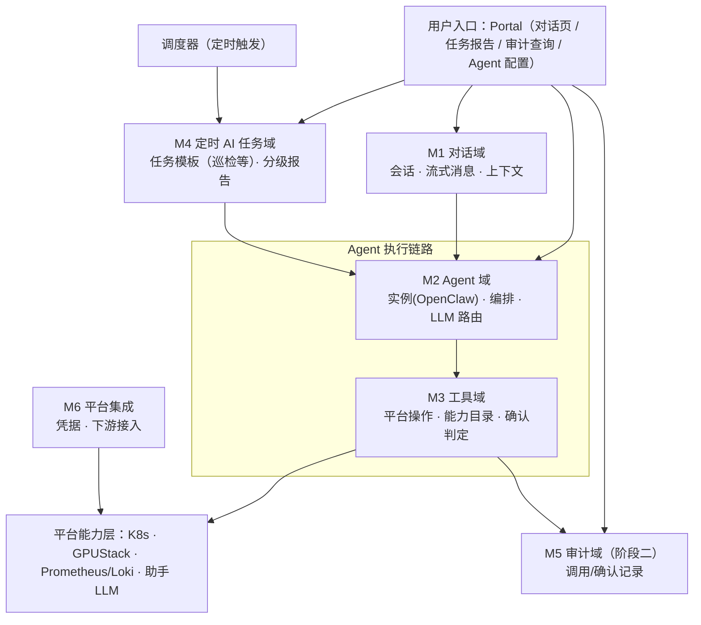
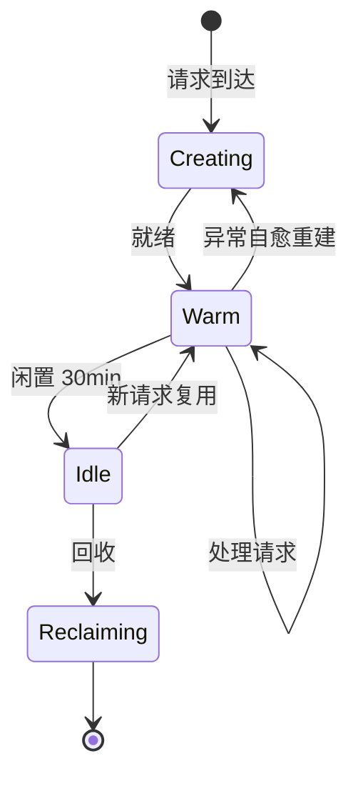
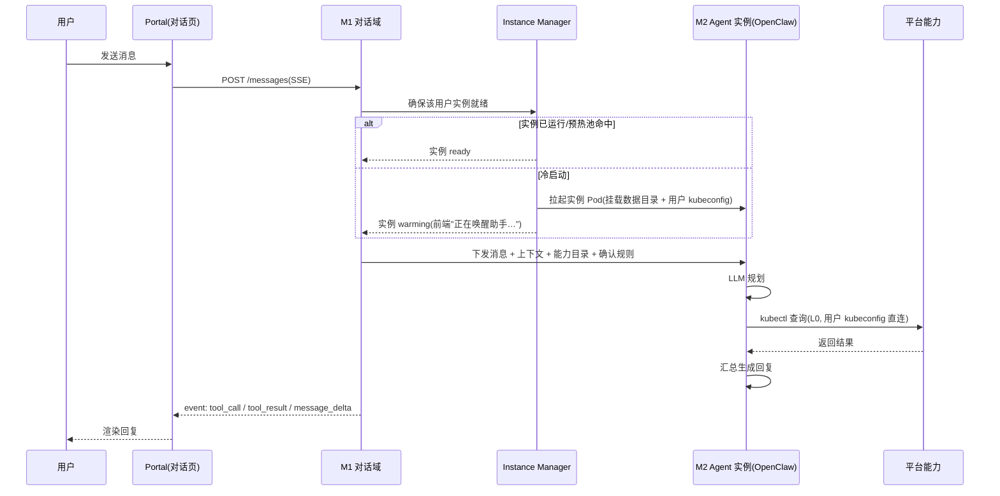
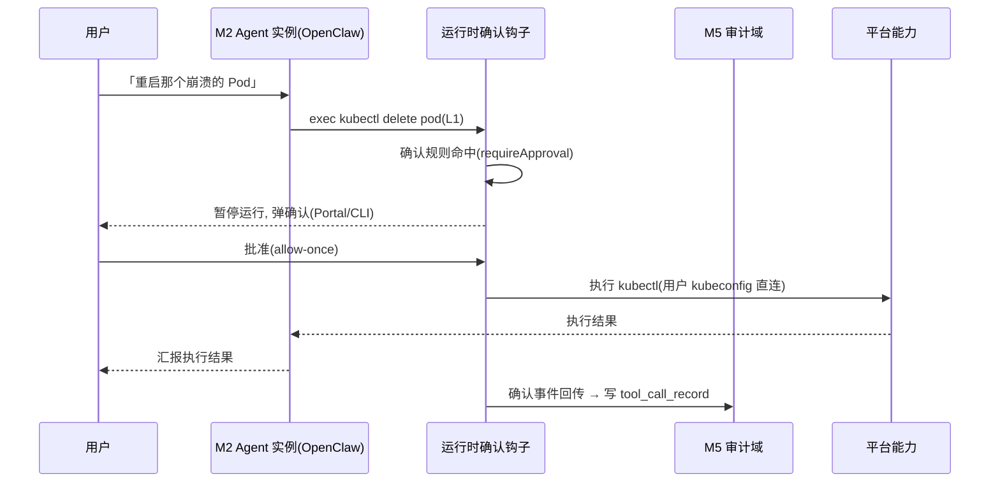
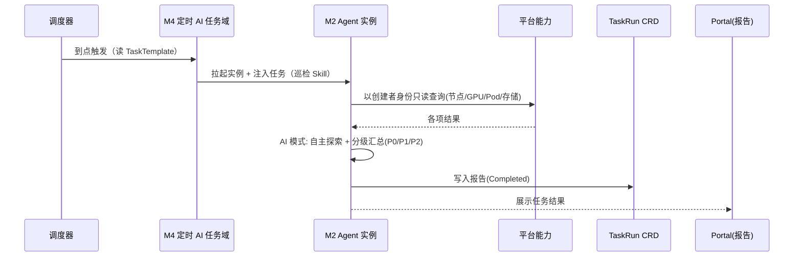

# CubeStack 平台智能助手（CubePilot）模块设计文档

**文档状态：** Draft（重写稿，待评审）
**适用范围：** CubeStack 智算云平台 · 平台智能助手模块（第一阶段 MVP）
**产品名：** CubePilot（仓库 `cubepilot`）
**架构理念：** 平台能力 API 化，AI Agent 只做编排与决策，不直接操作底层资源
**文档版本：** v0.2

> **本文档定位**：设计层文档，描述 CubePilot 的模块架构与关键机制，与 [《功能需求细化文档 v0.5》](./CubeStack-平台智能助手-CubePilot-功能需求细化文档.md) 对齐（需求编号 `FR-M{域}-{序号}` / `NFR-{序号}`），是唯一的设计文档。实现层面的方案取舍（kubectl 直连、Instance Manager、kubeconfig 注入、工具双通道、HITL 双方案等）在 §4 核心扩展点中作为预留点集中说明。

---

# 1. 引言

## 1.1 目的

智算平台规模扩大后，GPU 集群、训练/推理服务与多租户资源的日常运维复杂度快速上升，平台使用者需要低门槛的方式来查询资源、操作任务、理解运行状态。

CubePilot 是 CubeStack 面向「所有用户」的一站式 AI 助手：将平台的资源管理、任务编排、监控能力封装为可被自然语言调用的智能服务。

- **用户侧**：对话式问答与自然语言操作（ChatOps），降低平台使用门槛；
- **运维侧**：集群状态自动感知与健康巡检，辅助运维决策。

**与原生 OpenClaw 的关系**：CubePilot 复用 OpenClaw 作为 Agent 运行时，但**不复用其常驻部署与原生 UI**——① **实例按需存活**：OpenClaw 以「每用户实例 Pod」形态按需拉起、闲置回收、异常自愈（原生为常驻 gateway），这是 Instance Manager 与「会话账本 vs 执行态」分层（[§5.1](#51-m1-对话域)）的根因；② **Portal 为平台统一入口**：对话页 / 任务报告 / 审计查询 / Agent 配置，而非 OpenClaw 的聊天 UI / TUI。

本文档描述 CubePilot 的**架构设计**，核心回答四个问题：① 六个功能域如何划分、如何协作（[§3](#3-总体架构)/[§5](#5-功能域设计)）；② 哪些组件**可替换 / 可扩展**，接口如何预留（[§4](#4-核心扩展点设计)）；③ 各业务模块如何接入基座、模块领域智能如何落地（[§5.7](#57-各模块-ai-agent-能力与对接设计)）；④ 第一阶段如何做到**最小可用且可演进**（[§12](#12-架构演进)）。

## 1.2 范围

与需求文档阶段划分一致，本文档按**交付批次**区分设计深度：

| 阶段 | 主题 | 设计深度 |
|---|---|---|
| **一 · 首批必须** | 最小可用对话助手 | 完整设计（本文档主体） |
| **二 · 次批** | 安全与 AI Ops 扩展 | 机制设计 + 扩展点预留 |
| **三 · 后续** | 智能演进 | 扩展点预留（不展开实现） |

**第一阶段包含**：对话闭环 + Portal 对话页、Agent 实例与配置管理、平台资源操作 + 能力目录、定时 AI 任务（含巡检模板 + AI 智能巡检）、平台集成基础、可观测性接口、模块 Agent 对接机制（开发环境/推理/模型/运维，[§5.7](#57-各模块-ai-agent-能力与对接设计)）。

**第一阶段不包含**（后置）：HITL 确认、审计、RAG、通知推送、推理服务验证、自定义任务模板、RCA/自动修复。

## 1.3 术语表

| 术语 | 说明 |
|---|---|
| Agent | 具备规划、工具调用能力的自主智能体，运行于用户实例中 |
| Skill / Tool | Agent 运行时扩展机制，将平台能力封装为可调用工具 |
| MCP | Model Context Protocol，开放工具接入协议 |
| MCP Gateway | 聚合多个 MCP Server 的统一入口，集中做鉴权 / 路由 / 策略 / HITL（如 mcp-context-forge） |
| ChatOps | 通过自然语言对话完成平台查询与操作 |
| HITL | Human-in-the-loop，写/高风险操作由操作人本人确认后执行 |
| 确认规则 | 平台维护的「操作 → 是否需要确认」规则表，下发为运行时钩子 |
| 能力目录 | 平台能力（CRD）登记为 Agent 可发现的能力清单（FR-M3-006） |
| 定时 AI 任务 | 用户创建的定时/触发 Agent 任务，由平台调度器按任务模板（cron 配置）触发，以创建者身份 + RBAC 执行 |
| 任务模板 | TaskTemplate CRD：Skill 引用 + cron 配置 + 创建者 + 所需权限提示，巡检是其中一种预置模板 |
| OpenClaw | 第一阶段 Agent 运行时 |
| Hermes | 预留的替代 Agent 运行时（隔离与记忆机制同构） |

## 1.4 参考资料

- 《CubeStack 平台智能助手（CubePilot）功能需求细化文档》v0.5
- OpenClaw：https://docs2.openclaw.ai/zh-CN · https://github.com/openclaw/openclaw
- MCP 规范：https://modelcontextprotocol.io/
- mcp-context-forge（MCP Gateway 参考实现）：https://ibm.github.io/mcp-context-forge/
- K8s、GPUStack、vLLM、Keycloak 官方文档

---

# 2. 设计原则

| 原则 | 含义 | 落地 |
|---|---|---|
| **能力直连 + 用户身份** | Agent 是认知引擎，以**用户自己的凭据**直连平台能力，等效用户本人操作；权限由平台 RBAC 强制 | 实例持用户 kubeconfig 直连 K8s |
| **每用户实例、物理隔离** | 每活跃用户一个独立 Agent 实例与数据目录，隔离边界为 Pod + 数据目录 | 一用户一实例 Pod + 独立数据目录（NFR-002，阶段一） |
| **扩展点前置、最小闭环** | 每个模块只做最小闭环；可扩展能力实现为**标准化注册/适配接口**，不在当下实现扩展本身 | [§4 核心扩展点](#4-核心扩展点设计) |
| **模型无关** | 统一接口对接 LLM；默认私有化部署（完全内网），也支持配置平台外 LLM（OpenAI 兼容 API） | LLM 路由（FR-M2-003） |
| **渐进演进** | 第一阶段 OpenClaw 落地，经窄接口平滑迁移到 Hermes/自研，隔离与记忆机制不因运行时变化而改变 | Agent Runtime Adapter（[§4.1](#41-扩展点一agent-runtime-adapter)） |

**关键取舍（为什么这么设计）**：

| 决策 | 理由 |
|---|---|
| 每用户实例（非共享） | 物理隔离（NFR-002）要求 Pod 级隔离，共享实例无法满足「用户间不可互访」 |
| kubectl 直连（非自研 API 封装） | 平台资源皆为 CRD，kubectl 已覆盖；凭据直连等效用户本人操作，权限交 K8s RBAC |
| 能力目录/任务报告用 CRD（非 DB） | 与平台资产同生命周期，声明式 + RBAC 管控；报告是运维资产 |
| 定时任务经 M2 执行 | 巡检等定时任务由平台调度器触发，到点拉起实例、经 M2 Agent 实例执行（创建者身份 + Skill），独立会话与对话解耦 |
| OpenClaw 起步（经 Adapter 可替换） | 阶段一求最小闭环，OpenClaw 原生 MCP/确认钩子/上下文压缩；隔离与记忆机制同构便于迁移 |

---

# 3. 总体架构

## 3.1 功能域架构

CubePilot 按**功能域**划分 6 个模块（5 功能域 + 1 支撑域），编号与需求文档一致：**M1 对话 / M2 Agent / M3 工具 / M4 定时 AI 任务 / M5 审计 / M6 平台集成**。



**各模块职责一览：**

| 模块 | 职责 | 阶段一关键内容 | 扩展点 |
|---|---|---|---|
| M1 对话域 | 会话管理、消息流、上下文组装 | 会话 CRUD、SSE、上下文组装（实例级配置 + 动态会话历史） | 知识注入 hook（→ RAG） |
| M2 Agent 域 | 编排核心、实例生命周期、LLM 路由 | OpenClaw 每用户实例、配置管理 | Agent Runtime Adapter（→ Hermes/自研） |
| M3 工具域 | 平台能力操作化、能力目录、确认判定 | 平台资源操作 + 能力目录；写操作直放 | MCP Gateway（→ 多 MCP Server 聚合 + 统一 HITL） |
| M4 定时 AI 任务域 | 定时任务（巡检等）、分级报告 | 预置巡检 6 类 + AI 巡检 + 任务报告 CRD | 定时任务（调度器 + 任务模板）→ 推理验证 / RCA |
| M5 审计域 | 工具调用与确认记录（阶段二） | — | `tool_call_record` 表 → 审计治理 |
| M6 平台集成 | 凭据管理、下游接入 | 用户凭据生成/注入、K8s+LLM 联通 | 非 K8s 数据源接入（GPUStack/Prometheus 等） |

## 3.2 数据流向

```text
对话主链路：
用户(对话) ──► Portal ──► M1 对话域(鉴权/会话) ──► M2 Agent 实例(OpenClaw)
                                                        │
                                                        ├──► LLM(推理服务)
                                                        └──► M3 工具域(用户凭据直连) ──► K8s/GPUStack/监控

定时任务（调度驱动，经 M2）：
调度器 ──► M4 定时 AI 任务域(任务模板) ──► M2 Agent 实例 ──► M3 工具域 ──► 平台能力层
M4 定时 AI 任务域 ──► TaskRun CRD ──► Portal 报告
```

- **上行**：用户消息经 M1 鉴权后进入该用户 Agent 实例，实例结合系统提示词、工具定义/能力目录与 LLM 产出「回复文本 + 工具调用序列」。
- **下行**：Agent 以用户凭据直连平台能力；阶段一写操作直放，阶段二起写/高风险操作先经 HITL 确认再执行，结果回填后经 M1 流式返回用户。
- **定时任务**：巡检等定时任务由调度器触发，经 M2 Agent 实例执行（创建者身份 + Skill），经 M3 工具访问平台能力层；报告写 CRD 供 Portal / API 展示。

## 3.3 组件清单

功能域（M1~M6）是逻辑划分；物理上由下列组件承载（含选型与交互关系）：

| 组件 | 选型 / 形态 | 承载域 | 职责 | 关键交互 |
|---|---|---|---|---|
| Portal 前端 | Web 静态资源 | — | 对话页 / 任务报告 / 审计查询 / Agent 配置 | → 助手服务（SSE / REST） |
| 助手服务 | 无状态 Deployment ×2 | M1+M3+M5 | 会话/消息/上下文组装、工具编排、审计写入 | → Instance Manager、Agent 实例、PG/Redis、CRD |
| Instance Manager | 单副本（Leader） | M2 | 实例拉起/回收/自愈、预热池 | → K8s API（拉起 Agent Pod） |
| Agent 实例 | OpenClaw Pod 0~N（每用户） | M2 | 编排循环（规划→工具调用→汇总） | → 助手 LLM、K8s（kubectl）、数据目录 |
| 调度器 | 单副本（Leader） | M4 | 读 TaskTemplate CRD，到点拉起实例注入任务 | → Instance Manager、Agent 实例 |
| 助手 LLM | InferenceService 1~N | M6 | 推理（DeepSeek V4 Flash 起步，OpenAI 兼容，可外接） | ← Agent 实例 |
| 能力目录 / 任务模板 / 任务报告 | CRD | M3/M4 | 能力契约 / 调度定义 / 任务报告资产 | ← 助手服务、调度器 |
| 存储 | PostgreSQL + Redis + 每用户独立 PVC | — | 会话/消息/审计 + 实例数据目录 | ← 助手服务、Agent 实例 |

## 3.4 核心扩展点总览

本文档的架构核心是**可替换 / 可扩展点**。下表先给全景，[§4](#4-核心扩展点设计) 逐项展开：

| # | 扩展点 | 阶段一形态 | 演进目标 | 预留机制 |
|---|---|---|---|---|
| E1 | **Agent 运行时** | OpenClaw | Hermes / 自研 | Agent Runtime Adapter（窄接口） |
| E2 | **工具接入** | kubectl 直连 | MCP Gateway 聚合多 Server | 双路径：直连 + Gateway |
| E3 | **HITL 确认** | 无（写直放） | 运行时原生 → 网关统一 | 确认规则表 + 确认钩子抽象 |
| E4 | **知识注入** | 返回空 | RAG 知识库问答 | 系统提示词组装处 hook |
| E5 | **定时任务（调度器 + 任务模板）** | 预置 + AI 巡检 | 推理验证 / RCA / 自定义任务 | 任务模板 CRD + 平台调度器 |

---

# 4. 核心扩展点设计

> 本章是本文档的重点。每个扩展点遵循同一模式：**阶段一用最简单实现打通闭环，同时预留窄接口，使后续替换/扩展不重写业务逻辑**。

## 4.1 扩展点一：Agent Runtime Adapter

**目标**：不锁定单一运行时；阶段一用 OpenClaw 落地，后续可平滑替换为 Hermes / 自研。

```
M2 Agent 域
   │  标准接口（窄）
   ▼
AgentRuntimeAdapter ◄──► OpenClawAdapter（阶段一）
                     ◄──► HermesAdapter（预留）
                     ◄──► SelfBuiltAdapter（预留）
```

**适配接口契约（窄接口）**：

| 方向 | 内容 |
|---|---|
| **进入** | 消息 + 会话历史（每次请求动态）；身份/能力目录/确认规则 + 工具清单（实例级配置，启动时加载） |
| **返回** | 事件流（`message_start / agent_thinking / tool_call / tool_result / confirm_pending / confirm_resolved / message_delta / message_done`） |

**为什么可替换**：OpenClaw 与 Hermes 均为「多会话 + 数据目录（HERMES_HOME）+ MCP 工具」形态，实例无状态化（状态持久化于 DB + 数据目录），隔离与记忆机制**不因运行时变化而改变**。替换时只替换 Adapter 实现，业务逻辑（会话、工具、巡检、审计）不动。

**阶段一落地**：OpenClaw 每用户实例 Pod + 独立数据目录；实例生命周期由 Instance Manager 管理（按需拉起、闲置回收、异常自愈，FR-M2-002）。

## 4.2 扩展点二：工具接入双路径

**目标**：阶段一用最直接的 kubectl 直连打通 K8s 操作；预留 MCP Gateway，为「聚合多个 MCP Server + 统一治理」留出升级路径。

```text
M3 工具域
   │
   ├── 路径 A（阶段一，默认）：kubectl 直连
   │        Agent 实例 ──(用户 kubeconfig)──► K8s API Server
   │
   └── 路径 B（预留）：MCP Gateway 聚合
            Agent 实例 ──► MCP Gateway（mcp-context-forge）
                                ├──► K8s MCP Server（kubectl MCP）
                                ├──► 其他 MCP Server（GPUStack / Prometheus / ...）
                                └──► 统一鉴权 / 路由 / 策略 / HITL
```

**路径 A（阶段一）**：实例挂载用户 kubeconfig（Secret，0600），以 kubectl 直连 K8s，等效用户自己的 kubectl；只读命令（`get/list/watch/logs`）直放，写命令命中确认规则后经 HITL 执行（阶段二起）；权限由 K8s API Server RBAC 强制，操作记入 K8s Audit Log。

**路径 B（预留）**：引入 MCP Gateway（如 mcp-context-forge），将 K8s 能力以 **K8s MCP Server** 暴露，与其他 MCP Server（GPUStack、Prometheus 等非 K8s 数据源）统一挂到 Gateway 下。Gateway 集中做：工具路由、鉴权、限流、策略、以及 **HITL**（见 [§4.3](#43-扩展点三hitl-确认)）。

**演进关系**：两条路径对 Agent 而言是**同一抽象**（工具调用），能力目录（FR-M3-006）描述的始终是「能力 + 参数 + 示例」，不绑定实现方式。从 A 切换到 B，Agent 侧无感知，仅替换「工具提供方」。

## 4.3 扩展点三：HITL 确认

**目标**：阶段一写操作直放（简化）；阶段二引入 HITL，且 HITL 的实现位置**可演进**——先运行时原生，后可统一到 Gateway。

| 方案 | 实现位置 | 阶段 | 特点 |
|---|---|---|---|
| **方案 A：运行时原生 HITL** | OpenClaw 确认钩子（`requireApproval` / exec approval） | 二（默认） | 简单，无需额外组件；但换运行时时需重新适配确认钩子 |
| **方案 B：Gateway 统一 HITL** | MCP Gateway（forge）集中处理确认 | 预留 | 确认逻辑集中一处，与运行时解耦；需引入 Gateway |

**方案 A（阶段二默认）**：平台维护「确认规则」表（哪些操作需确认，FR-M3-002），下发为 OpenClaw 运行时钩子；Agent 通过 exec/shell 执行 kubectl 写命令时，命中规则即暂停，弹确认（Portal 内嵌/CLI），操作人本人批准后执行；拒绝/超时默认不执行（fail-closed）。

**方案 B（预留）**：当工具接入演进到 MCP Gateway（[§4.2](#42-扩展点二工具接入双路径) 路径 B）后，HITL 可统一收敛到 Gateway——所有工具调用经 Gateway 路由，Gateway 在「执行前」统一做确认判定，不再依赖各运行时的确认钩子。这使 Agent 运行时成为「无确认能力的纯 MCP 客户端」，OpenClaw/Hermes/自研切换时确认逻辑**零迁移**。

**两方案的确认契约统一**（无论实现位置）：
- 操作人本人确认，拒绝/超时默认不执行（fail-closed）；
- 重复确认去重；
- 确认结果（谁、何时、批准/拒绝）回写审计（M5，阶段二）。

## 4.4 扩展点四：知识注入 hook

**目标**：为 RAG（阶段二）预留注入点，阶段一不影响对话。

- 系统提示词组装流程中预留一个**注入点**：阶段一返回空，阶段二接入 RAG 检索结果（手册/FAQ/最佳实践，FR-M1-008）。
- 约束：注入内容**不改变系统指令优先级**，检索结果作为数据而非指令处理（NFR-003 Prompt 注入防护）。

## 4.5 扩展点五：定时任务（调度器 + 任务模板）

**目标**：定时/触发任务用**平台级调度器 + 任务模板 CRD** 落地——任务定义（Skill 引用 + cron 配置）持久化在 `TaskTemplate` CRD，调度器到点拉起实例执行；不自研 DAG 编排。巡检是预置模板之一，骨架可复用为推理验证 / RCA / 自定义任务。

- **平台级调度器**（独立于每用户实例）：读 `TaskTemplate` CRD，到点拉起/创建该用户实例并注入任务（Skill）。不能用「复用 OpenClaw cron」——cron 跑在实例进程内，实例被回收后到点不触发，故必须平台级调度 + 持久化任务定义。
- 巡检项做成**注册表**（新增巡检项 = 注册一项，FR-M4-003）；
- 任务模板后续扩展：
  - **定时/触发 AI 任务**（FR-M4-002，阶段一）= 预置 Skill（巡检等）+ cron 配置；
  - **推理服务自动验证**（FR-M4-008，阶段二）= 注册为验证项；
  - **任务模板**（FR-M4-009，阶段二）= 预置 + 自定义模板；
  - **RCA / 自动修复 / 预测运维**（FR-M4-012~014，阶段三）= 报告 → Agent 消费。

---

# 5. 功能域设计

## 5.1 M1 对话域

**职责**：会话管理、消息收发、上下文组装。

| 维度 | 设计 | 需求 |
|---|---|---|
| 会话载体 | 阶段一复用 OpenClaw session（数据目录持久、冷启动自恢复）；阶段二多租户落地时引入 `Conversation` 元数据表（`user/tenant/project` 键 + `openclaw_session_id` 映射） | FR-M1-001 |
| 归属隔离 | 阶段一单操作者（无多用户隔离）；多用户体系就绪后按用户/租户隔离，跨用户访问返回 403 | FR-M1-002（阶段二） |
| 流式响应 | `POST /messages` → SSE 事件流（8 类事件；阶段一为其余 6 类，`confirm_*` 阶段二 HITL 启用） | FR-M1-003 |
| 历史分页 | 游标（cursor）分页，向上滚动加载，不重不漏 | FR-M1-004 |
| 上下文装载 | 平台侧要素（身份/能力目录/确认规则）为实例级配置、启动时加载；每次请求仅动态组装新消息 + 会话历史 | FR-M1-005 |
| Portal 对话页 | chat UI + 流式渲染 + 会话切换 | FR-M1-007 |
| 上下文压缩 | 长对话超窗口时压缩早期历史为摘要，保留系统指令与近期对话（OpenClaw 原生支持，无自研工作） | FR-M1-010 |
| 扩展点 | 系统提示词组装处「知识注入 hook」（→ RAG） | E4 |

**会话存储（阶段一不建会话表）**：OpenClaw session 原生持久化在数据目录（`sessions.json` + transcript JSONL），实例回收→重建后自动恢复，冷启动接回无需自建 DB。会话清单与历史由助手服务经 OpenClaw gateway 的 HTTP `POST /tools/invoke` 调 `sessions_list` / `sessions_history` 读取（bearer token 鉴权，本地已验证）——`sessions_list` 返会话元数据（sessionId / 派生 title / 时间戳），`sessions_history` 返结构化消息（含 thinking/toolCall 块，Portal 折叠渲染，超长截断）。**代价**：读取要求实例存活，冷时列会话需先冷启动。阶段二多租户 / 审计 / 200 轮状态机落地时，再引入 Conversation/Message 元数据表。

**上下文组装**：按序装载——① 系统提示词（指令层）② 知识注入（E4 hook，阶段一空）③ 能力目录/工具清单 ④ 确认规则（阶段二起）⑤ 会话历史（近期 N 轮 + 超窗压缩摘要）；其中 ①~④ 为实例级配置（启动时加载），⑤ 每次请求动态。Token 预算：系统指令 + 能力目录固定，剩余分配给会话历史，超窗触发压缩（FR-M1-010）。

**SSE 事件映射**：8 类事件由 Adapter 将 OpenClaw 原生事件流映射而来——`agent_thinking` 对应 LLM 规划阶段，`tool_call/tool_result` 对应工具往返，`message_delta/message_done` 对应回复流式输出；`confirm_*` 阶段二 HITL 启用。

## 5.2 M2 Agent 域

**职责**：编排核心、实例生命周期、LLM 路由。

- **编排循环**：接收任务 → LLM 规划 → 调用工具 → 评估结果 → 汇报（Agent 运行时原生能力）。
- **每用户实例**：一用户一个 OpenClaw 实例 Pod + 独立数据目录，以 Pod 为隔离边界（NFR-002）；实例无状态化，状态从 DB/数据目录恢复（FR-M2-004）。
- **Instance Manager**：按需拉起、闲置回收（默认 30min）、异常自愈（FR-M2-002）；上报实例状态指标（FR-M2-006，阶段二）。
- **LLM 路由**：模型无关，OpenAI 兼容接口（FR-M2-003）；默认私有化模型，也可配置平台外 LLM；换模型不破坏对话功能。
- **配置管理**：模型选择/工具开关/系统提示词，持久化并即时生效（FR-M2-005）；能力目录作为工具开关 + 系统提示词的一部分，实例启动时加载、变更即时生效。
- **扩展点**：Agent Runtime Adapter（→ Hermes/自研），见 [§4.1](#41-扩展点一agent-runtime-adapter)。

**实例生命周期**：



## 5.3 M3 工具域

**职责**：将平台能力封装为 Agent 可调用工具，负责凭据直连与确认判定。

**能力目录（FR-M3-006，阶段一核心）**：将平台能力（DevEnvironment / InferenceService / TrainingJob / Model / Dataset 等 CRD）登记为 Agent 可发现的能力清单——每项含用途、关键参数、调用示例；作为实例级配置启动时加载（注册为工具定义 + 能力说明注入系统提示词，承接 FR-M2-005 配置管理），Agent 依据目录正确选择并调用对应能力。

**平台资源操作（FR-M3-001）**：Agent 以用户身份操作平台资源（含全部 CRD），权限由平台 RBAC 强制；读操作直放，写操作命中确认规则后需确认（阶段二起）。

**确认模型（阶段二起，方案见 [§4.3](#43-扩展点三hitl-确认)）**：

| 级别 | 定义 | 执行方式 |
|---|---|---|
| L0 · 只读 | 不改变平台状态的查询 | Agent 直接调用，不拦截 |
| L1 · 写/高风险 | 改变状态、删除、重建、exec | 阶段一：直放；阶段二：HITL 本人确认，fail-closed |

**dry-run（FR-M3-004，阶段二）**：写操作执行前先预览变更影响范围，随 HITL 确认一并展示。

**错误标准化（FR-M3-005，阶段二）**：工具统一返回 `{success, data | error}`，错误分类：

| 错误 | 说明 | Agent 处理建议 |
|---|---|---|
| `PERMISSION_DENIED` | 无权限（RBAC 拒绝） | 说明权限范围，引导联系管理员 |
| `USER_DENIED` | 操作人拒绝确认 | 停止操作，询问后续意图 |
| `CONFIRM_TIMEOUT` | 确认超时 | 提示重新发起并尽快确认 |
| `RESOURCE_NOT_FOUND` | 资源不存在 | 提示检查名称/项目 |
| `RATE_LIMITED` / `TIMEOUT` | 限流 / 超时 | 稍后重试 |
| `UPSTREAM_ERROR` | 下游组件异常 | 提示平台组件状态，避免误导性归因 |

**扩展点**：MCP Gateway 双路径，见 [§4.2](#42-扩展点二工具接入双路径)。

## 5.4 M4 定时 AI 任务域

**职责**：定时任务模板（预置巡检 + 自定义）、任务执行、分级报告。

**触发**：平台调度器读 `TaskTemplate` CRD 到点触发（默认每日 02:00）+ 手动/API 触发（FR-M4-001）；调度器到点拉起实例，任务经 M2 Agent 实例执行（FR-M4-002）。

**预置巡检项（FR-M4-003）**：

| 巡检类别 | 巡检项 | 数据来源 |
|---|---|---|
| 控制面 | API Server / etcd / Controller Manager / Scheduler 健康 | healthz、组件指标 |
| 节点 | Node Ready、压力（Disk / Mem / PID） | K8s Node 状态 |
| GPU | 健康（XID / 降级）、利用率、温度、显存 | 阶段一 K8s 节点状态（`nvidia.com/gpu`）；阶段二 GPU Exporter / DCGM |
| Pod | 异常（CrashLoopBackOff / Pending / ImagePullBackOff / OOM） | K8s Pod、事件 |
| 存储 | Ceph / Lustre 容量、PVC 使用率 | 阶段一 K8s PVC 状态；阶段二 Ceph Exporter / 组件指标 |
| 平台组件 | GPUStack / Harbor / Keycloak / Prometheus 健康 | 组件健康检查 |

> 阶段一数据源以 K8s API（kubectl）为主：GPU 经 `nvidia.com/gpu` capacity/allocatable、存储经 PVC 状态做基本检查；GPUStack / DCGM / Ceph Exporter 等详细指标阶段二起接入（FR-M6-002）。

**AI 智能巡检（FR-M4-007）**：巡检作为定时任务经 M2 Agent 实例执行（创建者身份 + RBAC、只读），自主探索集群，发现预置项未覆盖的异常（配置漂移、资源浪费、跨资源关联异常等），输出结构化发现 + 自然语言描述 + 证据链。

**报告（FR-M4-004/005）**：结构化存 `TaskRun` CRD（任务报告，巡检为其中一种类型），异常按 P0（紧急）/ P1（重要）/ P2（一般）分级；Portal Dashboard 展示任务结果，API 可查。阶段一不主动推送通知。

**扩展点**：定时任务（调度器 + 任务模板）→ 推理验证 / RCA，见 §4.5。

## 5.5 M5 审计域（阶段二）

**职责**：工具调用与确认的完整记录。

- `tool_call_record` 表：`user_id / conversation_id / message_id / tool / args / level / status / confirm / result / created_at`（FR-M5-001）。
- 审计查询 API（/audit-logs 按用户/工具/时间，offset 分页，FR-M5-002）+ 治理界面（FR-M5-004，阶段二）。
- 审计写入与主链路解耦（异步写、失败重试），审计故障不阻塞对话（FR-M5-003）。
- 阶段一写操作仅靠 K8s Audit Log 兜底。

## 5.6 M6 平台集成（支撑）

- **凭据管理（FR-M6-001）**：按用户 RBAC 最小权限生成 / 注入 / 轮换 kubeconfig（Secret 挂载 0600），用户失效即时吊销；禁止使用集群管理员凭据。
- **下游接入（FR-M6-002）**：阶段一接入 K8s API Server + 助手 LLM 推理服务；阶段二起按需接入 GPUStack/Prometheus/Loki 等非 K8s 数据源，经工具接入层预留扩展点（E2）暴露给 Agent，不绑定具体网关实现。
- **助手 LLM 服务（FR-M6-003）**：默认独立推理池（InferenceService）部署，HPA 扩缩，完全内网运行；同时按 FR-M2-003（模型无关）支持配置平台外 LLM 端点。
- **下游容错**：下游调用带超时、重试与熔断，平台能力层故障不拖垮助手。

---

## 5.7 各模块 AI Agent 能力与对接设计

> 对应需求 [§8](./CubeStack-平台智能助手-CubePilot-功能需求细化文档.md)。CubePilot 是共享 Agent 基座 + 通用能力，各业务模块的 AI Agent 能力由模块自身承接、经基座对接机制暴露给 Agent；本节定义对接架构，各模块能力的完整清单与分阶段映射见需求 §8.4/§8.5，不在此重复。

### 5.7.1 对接机制（通用 4 步）

任何模块能力接入基座统一走 4 步（需求 §8.3）：

| 步骤 | 内容 | 落地 |
|---|---|---|
| ① 能力 API 化 | 模块能力遵循 API/CLI-First，提供标准化接口（CRD / API），Agent 可编程调用 | 平台既有 CRD/API |
| ② 能力目录登记 | 模块能力登记进能力目录（FR-M3-006）：用途 / 关键参数 / 调用示例 | `Capability` CRD（[§7.2](#72-crd)） |
| ③ 工具化调用 | Agent 依据目录选择能力，经平台资源操作（FR-M3-001，用户凭据直连）调用；阶段二起复杂操作先预览（FR-M3-004）、高风险 HITL（FR-M3-003） | M3 工具域 |
| ④ 凭据与权限继承 | 调用以用户身份执行（凭据直连 + RBAC），不越权；全程审计 | M6 / M5 |

### 5.7.2 能力目录设计（FR-M3-006）

能力目录是基座与模块的**契约中心**，与工具实现解耦：

- **载体**：`Capability` CRD（`assistant.suanova.io/v1alpha1`），见 [§7.2](#72-crd)。
- **注入**：能力目录作为实例级配置、启动时加载——按用户可见范围注册为工具定义 + 能力说明注入系统提示词，变更即时生效（FR-M2-005）；每次请求仅动态组装新消息 + 会话历史（FR-M1-005）。
- **登记/审核**：阶段一由平台侧（管理员/模块方）维护，登记与审核流程待定（Q-010）。
- **扩展性**：目录描述「能力 + 参数 + 示例」，不绑定工具实现（kubectl 直连 / MCP Server），与 E2 工具接入双路径解耦；新增能力 = 登记一项，Agent 侧无需改代码。

### 5.7.3 实现形态（模块「自带」领域智能的三条路径）

基座通用能力（对话/智能问答/多入口、跨模块任务编排、通用日志分析、主动告警与报告、长期记忆，需求 §8.2）由 CubePilot 提供、各模块复用；模块**操作类**能力登记为能力目录工具化；模块**领域智能**由模块自身实现、基座提供对话/推理外壳（需求 §8.3 实现归属约定）。「模块自带」领域智能的三种实现方式（对应 Q-009）：

| 方式 | 说明 | 适用 | 阶段一采用 |
|---|---|---|---|
| **A. 能力 API 化** | 封装领域逻辑为 API → 登记能力目录 → Agent 工具化调用 | 操作类（创建环境、提交训练、部署推理） | ✓ 主 |
| **B. 领域 Skill** | 打包查询工具 + 领域提示词 → 基座场景化加载 | 领域智能（诊断、推荐、解读） | ✓ 倾向 |
| **C. 数据开放 + 基座推理** | 暴露数据/API → 基座 LLM 直接分析 | 数据问答、血缘问答 | 阶段二起 |

> **阶段一倾向 B**（复用基座 Agent + 模块注册领域 Skill，避免每模块一套实例，Q-009）；关键诊断类场景倾向 A/B 而非 C（C 缺领域提示词约束，可靠性较低）。模块级 Agent 的 LLM 与基座共用一套（Q-011，降低部署成本）。

### 5.7.4 阶段一模块能力映射

完整映射见需求 §8.4；阶段一落地模块（需求 §8.5）：

| 模块 | 阶段一能力 | 实现归属 |
|---|---|---|
| 开发环境 | 自然语言创建环境、环境诊断 | 能力目录工具化（创建）/ 模块自带 B（诊断） |
| 推理 | 智能部署、自动排障 | 模块自带 B（基座执行）/ Agent 原生 + 日志查询 |
| 模型 | 自动模型测试 | 模块自带 + 基座报告 |
| 运维 | 巡检自动化、智能日志分析 | 基座定时任务（M4）/ Agent 原生 + 日志查询 |

阶段二/三模块能力按需求 §8.5 分期接入，基座侧配套 RAG（E4）、HITL（E3）、审计（M5）、长期记忆等扩展点预留。

---

# 6. 关键时序

## 6.1 对话与只读工具调用



## 6.2 写操作 HITL（阶段二，方案 A：运行时原生）



## 6.3 定时任务执行（阶段一，巡检示例）



---

# 7. 数据模型

**存储策略**：会话/消息（阶段一）不存 DB，落在 OpenClaw 实例数据目录（经 `/tools/invoke` 读取）；任务报告/能力目录/任务模板为「运维/契约资产」，以 CRD（`assistant.suanova.io/v1alpha1`）承载；审计与多租户元数据（阶段二）存 PostgreSQL + Redis。

## 7.1 DB 表（阶段二）

| 表 | 关键字段 | 需求 |
|---|---|---|
| **Conversation** | `id`(UUID)、`user_id / tenant_id / project_id`（隔离键）、`openclaw_session_id`（映射到 OpenClaw session）、`title`、`status`(active/inactive/archived/closed)、`context`(json)、时间戳 | FR-M1-001 |
| **Message** | `id`、`conversation_id`、`role`(user/assistant/tool/system)、`content`、`tool_calls`(json)、`token_usage`(json)、`error`(json)、`created_at` | FR-M1-003/004 |
| **ToolCallRecord** | `id`、`user_id / conversation_id / message_id`、`tool`、`args`、`level`(L0/L1)、`status`(pending/executed/denied/failed/timeout)、`confirm`(json)、`result`(json)、`created_at` | FR-M5-001 |

## 7.2 CRD

**TaskRun**（任务报告，FR-M4-004/005）：`spec.type`(inspection/verification/...，巡检为其中一种)、`spec.scope`(all/node-pool/tenant/project)、`spec.items`（启用的巡检项/校验项）、`spec.schedule.cron`、`spec.trigger`(manual/cron)；`status.phase`(Pending/Running/Completed/Failed/Cancelled)、`status.items`（各项结果与证据）、`status.summary`（异常数与 P0/P1/P2 计数）、`status.conditions`。

**TaskTemplate**（任务模板/调度定义，FR-M4-001/009）：`spec.skillRef`（Skill 引用）、`spec.schedule.cron`、`spec.creator`（创建者，以创建者身份 + RBAC 执行）、`spec.requiredPermissions`（所需权限提示，非授权机制）、`spec.trigger`(manual/cron)；巡检为其预置模板之一，平台调度器据此到点拉起实例执行。

**Capability**（能力目录，FR-M3-006）：`spec.title`（能力名）、`spec.description`（用途）、`spec.params[]`（关键参数）、`spec.examples[]`（调用示例）、`spec.toolRef`（对应平台 CRD/API 引用）；登记为 Agent 可发现的能力清单，作为实例级配置启动时加载（承接 FR-M2-005），见 §5.7.2。

---

# 8. 安全设计

| 维度 | 设计 | 需求 |
|---|---|---|
| 身份与授权 | Keycloak OIDC 鉴权，从 Token 解析用户/租户/项目/角色；工具资源归属校验复用平台 RBAC | NFR-001（阶段二） |
| 凭据最小化 | 实例仅持用户自己的 kubeconfig（Secret 注入 0600），定期轮换、失效即时吊销；禁止集群管理员凭据 | FR-M6-001 |
| 物理隔离 | 一用户一实例一数据目录，隔离边界为 Pod + 数据目录 | NFR-002（阶段一） |
| Prompt 注入防护 | 用户输入与系统指令区分；工具返回的非信任内容作为数据而非指令传入 LLM；即使注入，权限受 RBAC 约束、高危操作须确认 | NFR-003（阶段一） |
| 实例最小权限 | 非 root、seccomp RuntimeDefault、drop ALL capabilities、readOnlyRootFilesystem、NetworkPolicy egress 白名单（仅 K8s API / 工具下游 / LLM） | NFR-004（阶段一） |
| 确认护栏 | L1 操作由 HITL 拦截，操作人本人确认；拒绝/超时默认不执行（fail-closed）；Agent 不得重试被拒操作 | FR-M3-003（阶段二） |
| 限流防滥用 | 按用户/工具/LLM 维度控制调用速率，防止资源滥用 | NFR-005（阶段三） |

## 8.1 错误处理与降级

助手模块是「锦上添花」能力，任何情况下不得反向拖垮平台：

| 下游 | 超时 | 重试 | 降级 |
|---|---|---|---|
| 实例冷启动 | 60s | 2 次 | 提示「助手唤醒失败，请稍后重试」，不影响其他用户实例 |
| 助手 LLM | 首 Token 15s / 总 60s | 1 次 | 返回「助手暂时不可用」 |
| K8s API Server | 10s | 2 次（指数退避） | 提示控制面异常，不继续编排 |
| Prometheus / Loki | 5s | 1 次 | 返回「监控数据暂不可用」 |

熔断：单一下游连续失败超阈值（默认 5 次 / 30s）触发熔断，快速失败并告警，恢复探测通过后放行。

---

# 9. 可观测性

| 指标类别 | 指标 | 需求 |
|---|---|---|
| 对话/体验 | 会话数、消息数、首 Token 延迟（P95）、回复总延迟、流式中断率 | NFR-006/007 |
| 智能 | 工具调用次数、成功率、L0/L1 分布、确认率、确认等待耗时 | — |
| 成本 | LLM Token 消耗（输入/输出） | — |
| 运维 | 任务执行时长、任务异常项分布（P0/P1/P2） | NFR-010、FR-M4-004 |
| 实例池 | 活跃/预热/回收实例数、冷启动时长（P95）、回收率、重建率、每实例资源占用 | NFR-009 |

- **接口预留（阶段一）**：暴露 `/metrics`，5 类埋点；采集与面板展示后置（NFR-011）。
- **结构化日志（阶段一）**：携带 `conversation_id / user_id / tool_call_id` 关联字段；接入 Loki 后置（NFR-012）。
- **链路追踪（阶段一）**：`trace_id` 透传约定（Portal→助手→Agent→工具）；采集后端后置（NFR-013）。
- **告警（阶段二）**：助手 LLM 不可用（P1）、首 Token 高延迟 > 5s（P1）、工具失败率 > 10%（P2）、实例池异常（P2，NFR-014）。

---

# 10. 性能与容量

| 指标 | 目标值 | 需求 |
|---|---|---|
| 对话首 Token 延迟 | P95 < 3s | NFR-006 |
| 对话完整回复延迟 | P95 < 15s | NFR-007 |
| 工具调用执行延迟 | P95 < 5s | NFR-008（阶段二） |
| 实例冷启动（预热池命中 / 完全冷启） | P95 < 1s / < 15s | NFR-009（阶段二） |
| 巡检模板全量执行（中规模） | < 15min | NFR-010（阶段二） |

| 资源 | 估算 | 需求 |
|---|---|---|
| Agent 实例池 | 单实例约 0.5~1 vCPU / 1~2 GB；活跃实例数 = 并发对话用户数 + 预热池，按 Infra 容量设上限 | NFR-015（阶段三） |
| 每用户数据目录 | 单用户约 50~200 MB，独立 PVC 默认 1 GB | FR-M6-004 |
| 助手服务 | 单副本 ~50 并发会话，2 副本起步 | — |
| 助手 LLM GPU | 独立推理节点 ≥ 8 张 64G 级 GPU（按 DeepSeek V4 Flash 最低规格） | NFR-016 |

---

# 11. 部署设计

## 11.1 部署形态

以 Helm Chart（`cubepilot`）交付，纳入平台总装 Chart 依赖管理：

| 组件 | Chart 子项 | 副本 | 说明 |
|---|---|---|---|
| 助手服务 | `assistant-service` | 2 | 无状态，水平扩展（含对话域 / 工具服务 / 审计写入） |
| Instance Manager | `assistant-instance-manager` | 1（Leader） | Agent 实例生命周期管理 |
| Agent 实例池 | `agent-runtime` | 按需 0~N | 每用户一个 OpenClaw 实例 Pod + 数据目录 + 用户 kubeconfig |
| 调度器 | `assistant-scheduler` | 1（Leader） | 读 TaskTemplate CRD，到点拉起实例执行定时任务 |
| 助手 LLM 服务 | `assistant-llm`（InferenceService） | 1~N | 独立推理池，HPA 扩缩 |

> **预留（阶段二/三）**：MCP Gateway（`mcp-gateway`）子项——当工具接入切换到 [§4.2](#42-扩展点二工具接入双路径) 路径 B 时启用。

## 11.2 依赖与离线交付

- **平台既有**：Keycloak、PostgreSQL、Redis、K8s、GPUStack、Prometheus / Loki。
- **新增**：助手 LLM 模型镜像（具 Function Calling）、Agent 实例镜像（OpenClaw + kubectl）、用户 kubeconfig 生成与轮换机制。
- **离线交付**：所有镜像、模型、Helm Chart 随安装包内化。

## 11.3 升级与回滚

- 升级顺序：CRD → Instance Manager / 调度器 → 助手服务 → Agent 实例镜像 → 前端。
- Agent 实例为无状态 Pod（状态在 DB / 数据目录），升级实例镜像 = 滚动重建实例，会话与记忆不受影响。
- 回滚：`helm rollback` 分钟级；LLM 模型升级独立于平台，评测集通过后生效。

---

# 12. 架构演进

可替换点随交付阶段逐步启用、业务逻辑不重写（各阶段交付内容见需求 §5.1 / §8.5）：

```text
阶段一：OpenClaw + kubectl 直连 + 写直放
    │
    ├──► 阶段二：+ 运行时原生 HITL（OpenClaw requireApproval / exec approval）
    │
    └──► 阶段三：OpenClaw ──Adapter──► Hermes / 自研
                kubectl 直连 ──Gateway──► MCP Gateway 聚合多 Server + 统一 HITL
```

---

# 13. 待解决问题

需求侧待确认见需求 §7（Q-001~Q-012）。设计侧额外待定：

- MCP Gateway 引入时机与统一 HITL 可行性（§4.2/§4.3）；
- Agent Runtime Adapter 接口契约冻结（OpenClaw/Hermes 事件流对齐，§4.1）。
