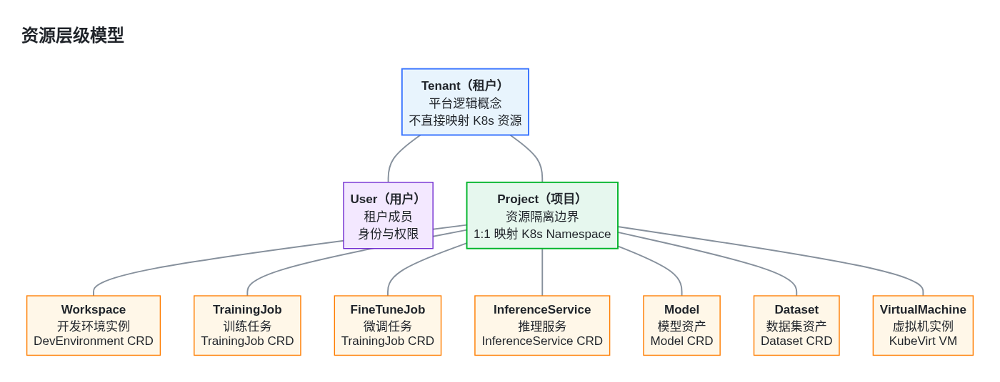
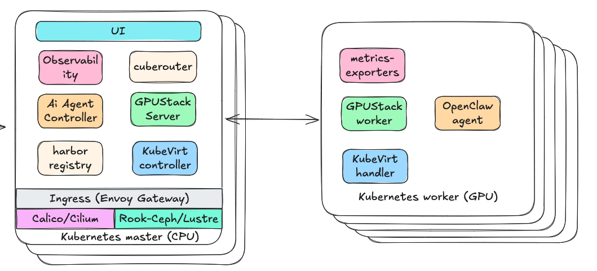
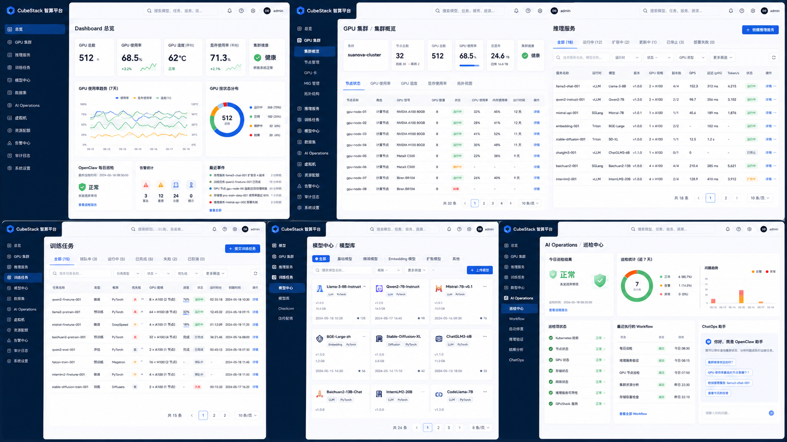
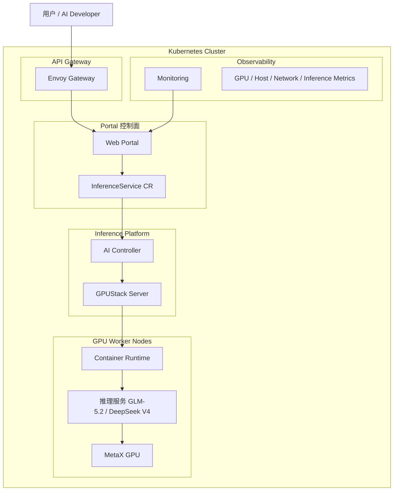

# CubeStack 智算云平台详细设计文档

**文档状态：Ready for review**

**适用范围：**CubeStack 智算云平台（支持 NVIDIA / 沐曦 / 壁仞 等多品牌 GPU）

**架构理念：**Kubernetes 作为统一底座，AI 能力以 CRD \+ Controller 方式向上扩展

**文档版本：**v0\.4（评审修订版）

# 1\. 引言

## 1\.1 目的

CubeStack 的定位是企业级 AI Infrastructure Platform，而不是 AI Framework 或 MLOps Platform。平台聚焦于智算资源管理、AI 工作负载编排和智能运维，为企业提供统一、开放、可演进的 AI 基础设施控制平面。平台支持完全私有化网络环境的部署和运营。

本文档详细描述 CubeStack 智算云平台的设计方案，包括系统架构、组件设计、API 接口、数据模型、状态流转、错误处理、安全与可观测性等内容。

本文档的预期读者包括：架构师、平台开发工程师、运维工程师、GPU 适配工程师、测试工程师。文档旨在为开发、测试、运维团队提供统一的设计参考和实现依据。

## 1\.2 范围

**包含范围**

- 统一门户与认证权限

- AI 开发环境 / 训练 / 微调 / 推理服务

- AI 资产中心（模型 / 数据 / Checkpoint）

- 虚拟机实例（KubeVirt）

- AI 工作负载控制平面（自研 CRD \+ Controller）

- 资源治理与任务队列（Kueue）

- 调度与拓扑感知

- 统一可观测性

- 镜像与制品管理（Harbor）

- 多品牌 GPU 适配（NVIDIA / 沐曦 / 壁仞）

- Kubernetes 基础设施

- Ceph 存储 / Lustre 文件存储

- 网络体系（Calico / Multus \+ RDMA）

- 平台安装部署

**不包含范围**

- 具体 AI 模型算法设计

- 硬件采购与数据中心建设

- 操作系统底层定制

- 上层业务应用开发

- GPU 硬件设计

## 1\.3 参考资料

- Kubernetes 官方文档：https://kubernetes\.io/docs/

- Kubespray 项目：https://github\.com/kubernetes\-sigs/kubespray

- Kueue 官方文档：https://kueue\.sigs\.k8s\.io/

- KubeVirt 官方文档：https://kubevirt\.io/

- GPUStack 项目：https://github\.com/gpustack/gpustack

- vLLM 项目文档：https://docs\.vllm\.ai/

- SGLang 项目文档：https://sglang\.readthedocs\.io/

- Ceph 官方文档：https://docs\.ceph\.com/

- Calico 官方文档：https://docs\.tigera\.io/

- Multus CNI：https://github\.com/k8snetworkplumbingwg/multus\-cni

- Harbor 官方文档：https://goharbor\.io/

- Keycloak 官方文档：https://www\.keycloak\.org/documentation

- 【待补充】NVIDIA GPU 技术文档（NVIDIA GPU Operator）

- 【待补充】沐曦 GPU 技术文档

- 【待补充】壁仞 GPU 技术文档

# 2\. 功能概述

## 2\.1 核心功能模块

|模块|功能说明|用户角色|
|---|---|---|
|AI 开发环境<br>|提供交互式 GPU 开发实例，支持 SSH 和 JupyterLab 访问|开发人员|
|训练任务|支持单机/多机多卡训练任务的提交、监控与管理|算法工程师|
|微调任务|支持模型微调（LoRA / QLoRA / Full Fine\-tune）|算法工程师|
|推理服务<br>|基于 **Inference Runtime** 部署和管理高吞吐LLM 推理服务。|算法工程师 / 应用开发者|
|AI 资产中心<br>|统一管理模型、数据集、Checkpoint、运行配方等资产|所有用户|
|虚拟机实例|基于 KubeVirt 提供 VM 服务，支持 GPU 直通|开发人员|
|资源管理|租户/项目两级资源隔离与配额管理|管理员|
|GPU 资源池|多品牌 GPU 资源池化、调度与健康管理|管理员 / 运维|
|监控中心|集群监控、GPU 利用率、任务统计、告警|运维 / 管理员|
|统一门户|Web 控制台，整合所有功能入口|所有用户|
|平台智能助手|构建AI智能助手体系|所有用户|

## 2\.2 用户角色与权限

|角色|职责|典型操作|
|---|---|---|
|平台管理员|平台全局管理|租户管理、节点管理、全局配置|
|租户管理员|租户内资源与用户管理|项目创建、配额分配、成员管理|
|开发人员|使用 AI 平台进行开发|创建开发环境、提交训练、部署推理|
|只读用户\(运营\)|查看项目资源与状态|查看任务、查看模型、统计资源使用情况|

## 2\.3 资源层级模型

平台的资源组织遵循「租户 → 项目 → 业务资源」三级层级模型，以项目作为资源隔离的基本边界。



### 2\.3\.1 层级定义

|层级|名称|K8s 映射|说明|
|---|---|---|---|
|L1|**Tenant（租户）**|无直接映射|平台逻辑概念，是计费、配额、隔离的最高单位。一个租户包含多个用户和多个项目。|
|L2|**User（用户）**|无直接映射|租户成员，通过 RBAC 绑定到项目角色。身份认证走 Keycloak / OIDC。|
|L3|**Project（项目）**|1:1 映射 Namespace|资源隔离边界。所有业务资源（开发环境、训练任务、推理服务、模型、数据集等）都归属于某个项目，物理上通过 Namespace \+ RBAC \+ NetworkPolicy 隔离。|

### 2\.3\.2 项目下的业务资源

项目是业务资源的容器，项目下包含以下 CRD 资源：

|资源类型|CRD|说明|
|---|---|---|
|开发环境|DevEnvironment|交互式 GPU 开发实例（Jupyter / SSH），一种业务资源，不是资源组织层级|
|训练任务|TrainingJob|模型预训练与分布式训练任务|
|微调任务|TrainingJob（jobType=finetune）|模型微调（LoRA / QLoRA / Full Fine\-tune）|
|推理服务|InferenceService<br>|在线推理服务部署，通过 Inference Runtime Adapter 对接多引擎|
|模型|Model|模型资产管理与版本管理|
|数据集|Dataset|数据集资产管理与版本管理|
|虚拟机|VirtualMachine（KubeVirt）|基于 KubeVirt 的 VM 实例，支持 GPU 直通|

### 2\.3\.3 关键约束

- **Tenant：**平台逻辑概念，不直接映射 Kubernetes 资源。租户级配额（TenantGPUQuota）通过 Webhook \+ Kueue ClusterQueue 实现。

- **Project：**资源隔离边界，1:1 映射 Kubernetes Namespace。项目内所有 CRD 资源都创建在该 Namespace 下，通过 RBAC 控制用户访问权限。

- **Workspace：**AI 开发环境实例，是一种业务资源（DevEnvironment CRD），不是资源组织层级。

- **跨项目资源：**Model 和 Dataset 默认项目级隔离，如需跨项目共享需通过「发布到公共库」机制显式授权。

# 3\. 架构上下文

## 3\.1 架构设计原则

**核心设计理念：Kubernetes 作为统一底座，AI 能力以扩展方式叠加其上。**

不重造轮子、不另起炉灶 — 尽可能复用 K8s 生态的成熟能力，AI 领域特性通过 CRD \+ Controller 的 Operator 模式向上扩展。

- **底座优先，扩展在上** — K8s 是唯一底座，AI 能力通过 K8s 扩展机制（CRD / Controller / Webhook / Device Plugin / CNI / CSI）实现

- **复用优先，自研为辅** — 优先采用 K8s 生态成熟组件（Kueue、KubeVirt、Harbor、Prometheus 等），仅在 AI 领域逻辑处自研

- **分层解耦** — 底座层与扩展层严格分层，AI 控制面故障不影响 K8s 底座

- **声明式 API** — 所有 AI 资源均采用声明式 CRD API，遵循 K8s Operator 模式

- **幂等可重入** — 所有部署与运维操作具备幂等性，失败后可安全重跑



## 3\.2 组件架构图

CubeStack 智算云平台采用 6 层分层架构，自上而下依次为：用户入口层、AI 产品能力层、AI 平台核心控制层、Kubernetes 基础设施层、安装与供给层、物理资源层。参照[AI智算云平台架构草图\.html](https://y001ut2s2go.feishu.cn/file/Y1mPbmVv7oIrwaxR4SScZoIHnre)

### 3\.2\.1 架构分层总览

|层级|核心能力|关键组件|
|---|---|---|
|用户入口层|统一门户、认证与权限|自研门户、Keycloak、租户/项目/RBAC|
|AI 产品能力层|面向用户的 AI 功能产品|开发环境、训练/微调、推理服务、AI 资产中心、虚拟机、AI智能体|
|AI 平台核心控制层<br>|AI 对象到 K8s 资源的转换与治理<br>|自研控制平面 CRD、Kueue、调度拓扑、可观测性、Harbor|
|Kubernetes 基础设施层|容器编排底座与平台插件|K8s、Ceph、Calico/Multus、KubeVirt、GPU Device Plugin、Lustre|
|安装与供给层<br>|离线交付与自动化安装|自研 Installer、Helm 组件、离线镜像仓库|
|物理资源层\(爱东现有assets\)<br>|硬件资源<br>|管理节点 / 基础设施节点 / 存储节点 / GPU 节点 / 高速网络<br>操作系统/业务网IP/计算网/存储网/BMC/存储（Lustre）|

### 3\.2\.2 数据流向

用户入口层 →（API / SSO）→ AI 产品能力层 →（AI 领域 API / 控制器 / CRD）→ AI 平台核心控制层 →（Kubernetes 标准资源接口）→ Kubernetes 基础设施层 → 物理资源层

### 3\.2\.3 扩展方式汇总

|扩展方式|适用场景|本平台应用|
|---|---|---|
|CRD \+ Controller|新增领域资源类型与生命周期管理|Workspace / TrainingJob / FineTuneJob / InferenceService / Model / Dataset 等|
|AdmissionWebhook<br>|资源创建/更新时的校验与变更<br>|AI 资源参数校验、默认值注入、配额检查|
|Scheduler Framework|扩展调度能力|GPU 拓扑感知调度、RDMA 亲和调度|
|Device Plugin|扩展硬件资源类型|NVIDIA / 沐曦 / 壁仞 GPU 设备发现与分配|
|CNI Plugin|扩展网络能力|Multus 多网络、RDMA 网络|
|CSI Plugin|扩展存储能力|Ceph RBD / Lustre 存储接入|
|Helm Chart|组件打包与部署|所有平台组件的安装与升级|

## 3\.3 部署架构

### 3\.3\.1 节点角色

**管理节点 \(Master\)**

- K8s Control Plane

- etcd

- CPU 节点，≥3 副本

- 仅运行 K8s 核心组件

**基础设施节点 \(Infra\)**

- AI 控制平面 \(Controller\)

- Training Runtime

- Inference Runtime

- 监控 / 日志 / 告警

- Harbor 镜像仓库

- Keycloak

- Envoy Gateway \+ AI Gateway Controller

- Ceph MON / MGR

- CPU 节点，≥2 副本

**存储节点（可选）**

- Ceph OSD

- Lustre 存储一体机

- 独立存储网络

- **小规模可并入 infra**

**GPU 计算节点**

- NVIDIA / 沐曦 / 壁仞 GPU

- Scale\-up 高速互联

- 400Gb 计算/存储网

- 运行训练/推理工作负载

**节点职责分离原则：**管理节点（Master）仅运行 Kubernetes 核心控制平面组件（API Server、Controller Manager、Scheduler、etcd），AI 平台组件、监控、镜像仓库等全部部署在 Infra 节点上，避免平台业务负载影响 K8s 控制面稳定性。

### 3\.3\.2 网络架构

|网络平面|带宽|用途|
|---|---|---|
|计算网|400Gb|GPU 间通信、多机训练、RDMA|
|存储网|400Gb|Ceph / Lustre 存储访问|
|业务网|25Gb|Pod 网络、管理流量、API 访问|

### 3\.3\.3 部署规模参考

|规模|管理节点 \(Master\)|基础设施节点 \(Infra\)|存储节点|GPU 节点|适用场景|
|---|---|---|---|---|---|
|小规模|3 节点|2 节点（可与 Master 合并）|并入 infra 节点<br>|1\~4 节点|开发测试、PoC|
|中规模|3 节点|3 节点（独立）|3\~5 节点（独立）|5\~50 节点|生产环境|
|大规模|3\~5 节点|≥3 节点（独立）|≥6 节点（独立）|50\+ 节点|企业级生产|

**节点合并说明：**小规模环境下，Infra 节点可与 Master 节点合并部署，存储也可并入 Infra 节点；中大规模环境必须独立 Infra 节点，将 AI 控制平面、监控、Harbor 等负载从 Master 剥离，避免业务负载影响 K8s 控制面稳定性。

### 3\.3\.4 高可用部署

|组件|部署节点|高可用方式|
|---|---|---|
|K8s Control Plane|Master 节点|≥3 节点，etcd 集群|
|AI Controller|Infra 节点|多副本 \+ Leader Election|
|Kueue|Infra 节点|多副本 \+ Leader Election|
|Training Runtime|Infra 节点|多副本 \+ Leader Election|
|Inference Runtime|Infra 节点|多副本 \+ Leader Election|
|Keycloak|Infra 节点|集群部署|
|Harbor|Infra 节点|高可用部署|
|Prometheus / Perses / Loki|Infra 节点|高可用部署【待补充】|
|Envoy Gateway \+ AI Gateway Controller|Infra 节点|多副本 \+ 负载均衡|
|Ceph MON / MGR|Infra 节点|≥3 节点集群|
|Ceph OSD|存储节点 / Infra 节点|多副本 / EC 冗余|
|GPU Device Plugin|GPU 节点|DaemonSet|
|KubeVirt|Infra \+ GPU 节点|Operator 模式|

# 4\. 详细设计

## 4\.1 AI 工作负载控制平面

### 4\.1\.1 职责

AI 工作负载控制平面是平台的核心扩展模块，通过自定义 CRD 和 Controller 将 AI 领域对象转换为底层训练/推理执行引擎的资源。

**训练编排策略：不自研训练编排内核，优先复用成熟开源方案。**

- **第一阶段（当前）**：推理服务执行层直接采用 **GPUStack**，自研 Controller 负责平台抽象层（CRD API、租户隔离、生命周期管理、状态聚合）

- **后续演进方向**：可根据业务复杂度迁移至 Training Runtime（PyTorchJob / MPIJob）或自研训练编排器

- **自研边界**：仅做平台层抽象与治理，不重造训练分布式通信与编排内核

- AI 资源生命周期管理（创建 / 更新 / 删除 / 状态同步）

- 平台级 CRD 抽象与多租户隔离（租户 / 项目 / 配额）

- AI 领域对象到底层执行引擎（GPUStack / vLLM / SGLang）的适配转换

- 任务状态聚合与事件上报

- Checkpoint 自动恢复协调（训练框架 \+ 存储 \+ 控制器协同）

### 4\.1\.2 接口

|CRD 名称|底层执行引擎|说明|
|---|---|---|
|Workspace|Deployment / Pod|AI 开发环境（Jupyter / SSH）|
|TrainingJob|Training Runtime / JobSet（通过 Adapter）|训练任务（单机/多机多卡），平台层统一抽象，底层通过 Adapter 对接 Kubeflow Trainer 与 JobSet|
|FineTuneJob|Training Runtime / JobSet|微调任务（LoRA / QLoRA / Full Fine\-tune）|
|InferenceService|Inference Runtime Adapter → vLLM / SGLang / Triton / GPUStack|推理服务，通过 runtime 运行时适配层对接多推理引擎|
|Model|\-（存储元数据）|模型资产|
|Dataset|\-（存储元数据）|数据集资产|
|ComputeProfile|\-（算力规格模板）|算力规格定义（GPU 型号 / 数量 / 内存）|

**适配层设计：TrainingJob Controller 不直接管理 MPI / PyTorch 分布式训练。**

Controller 内部通过 **Engine Adapter** 接口对接底层执行引擎，训练场景对接 **Training Runtime**（MPI / PyTorch / DeepSpeed 等）与 **JobSet**，推理场景对接 **Inference Runtime Adapter**。平台层 API 保持稳定，底层引擎可平滑扩展。

### 4\.1\.3 依赖关系

- **部署节点**：Infra 节点（通过 NodeSelector / Taint\-Toleration 调度）

- **上游依赖**：Kubernetes API Server、Kueue、Harbor、Ceph CSI

- **训练执行引擎**：Training Runtime \+ JobSet，部署在计算池 GPU 节点

- **推理执行引擎**：Inference Runtime Adapter → vLLM / SGLang / Triton / GPUStack，运行在推理池 GPU 节点

- **同层依赖**：GPU Operator、KubeVirt（VM 场景）

### 4\.1\.4 工作流程

```mermaid
flowchart TD
    A[用户通过门户 API<br/>创建 AI 资源 CRD] --> B[Admission Webhook<br/>参数校验 / 默认值注入 / 配额检查]
    B --> C{校验通过?}
    C -->|否| D[拒绝创建<br/>返回错误信息]
    C -->|是| E[Controller 监听 CR 创建<br/>进入 Reconcile 循环]
    E --> F[Engine Adapter<br/>训练→Trainer Controller / JobSet<br/>推理→Inference Runtime Adapter]
    F --> G[Kueue + Coscheduling Plugin<br/>配额准入 + Gang Scheduling]
    G --> H{资源充足?}
    H -->|否| I[进入排队<br/>Fair Sharing + 优先级排序]
    I --> H
    H -->|是| J[K8s 调度器分配资源<br/>PodGroup 成组启动]
    J --> K[Controller 持续监控<br/>聚合更新 CRD Status]
    K --> L[用户通过 Status<br/>观察任务进度与结果]```

1. 用户通过门户 API 创建 AI 资源 CRD

2. Admission Webhook 进行参数校验、默认值注入、租户配额检查

3. Controller 监听到 CR 创建，进入 Reconcile 循环

4. Controller 通过 Engine Adapter 将 AI 资源转换为底层执行引擎资源（训练→Kubeflow Trainer / JobSet，推理→Inference Runtime）

5. Kueue 进行资源配额准入与队列管理（配合 Coscheduling Scheduler Plugin 实现 Gang Scheduling）

6. K8s 调度器（配合调度扩展）分配资源并启动负载

7. Controller 持续监控下游资源状态，聚合更新 CRD Status

8. 用户通过 Status 字段观察任务进度与结果

## 4\.2 Kueue 资源队列

### 4\.2\.1 职责

**AI 调度体系：Kueue \+ Coscheduling Scheduler Plugin \+ Elastic Training。**

Kueue 负责队列层的配额管理与准入决策（Queueing / Fair Sharing / Priority / Preemption），Coscheduling Scheduler Plugin 负责 Pod 级的 Gang Scheduling（All\-or\-Nothing 成组启动），两者协同满足大规模 AI 训练的调度需求。

- **资源队列管理**：作业级排队与顺序管理

- **配额与准入控制**：租户/项目/队列级资源配额管理，决定作业是否可准入

- **公平调度（Fair Sharing）**：多租户 / 多队列间按权重公平分配资源

- **优先级与抢占（Priority \& Preemption）**：高优先级作业可抢占低优先级作业的资源

- **资源 Flavor 管理**：不同 GPU 型号 / 节点类型的资源池划分

- **Gang Scheduling**：通过 Coscheduling Scheduler Plugin 实现 Pod 级 All\-or\-Nothing 成组调度

- **弹性训练（Elastic Training）**：支持训练作业在运行时动态调整副本数

**调度分层架构：**

|层级|组件|职责|关键能力|
|---|---|---|---|
|队列准入层|Kueue|作业级排队、配额管理、准入决策|Queueing / Fair Sharing / Priority / Preemption|
|Pod 调度层|Coscheduling Scheduler Plugin|Pod 级成组调度、All\-or\-Nothing 语义|Gang Scheduling / PodGroup / MinAvailable|
|执行引擎层|Training Runtime / JobSet|分布式训练作业编排|MPI / PyTorch / DeepSpeed 作业管理|

**协同工作机制：**

- Kueue 在作业准入阶段检查 ClusterQueue 资源是否满足 Workload 的全部 Pod 需求（All\-or\-Nothing 准入语义）

- 准入通过后，Coscheduling Scheduler Plugin 在 Pod 调度阶段确保同一 PodGroup 的所有 Pod 同时被调度（避免部分启动导致的资源浪费）

- 高优先级作业资源不足时，Kueue 触发抢占，释放低优先级作业的资源

- 弹性训练场景下，JobSet 配合 Kueue 动态调整 Worker 副本数

### 4\.2\.2 接口

|资源|说明|
|---|---|
|ClusterQueue|集群级资源池，定义可用的 GPU / CPU / 内存总量，支持 Fair Sharing 权重|
|LocalQueue|项目级队列，映射到 ClusterQueue 的配额|
|Workload|作业抽象，由 TrainingJob 等 CRD 自动创建，携带优先级与 PodGroup 信息|
|ResourceFlavor|资源规格定义（如 GPU 型号、节点类型）|
|PodGroup（Coscheduling）|Pod 成组调度单元，定义 MinAvailable（最小可用副本数）|

### 4\.2\.3 依赖关系

- **部署节点**：Infra 节点

- **上游依赖**：Kubernetes API Server

- **下游依赖**：AI Controller（创建 Workload）

### 4\.2\.4 工作流程

```mermaid
flowchart TD
    A[AI Controller 创建 Workload<br/>关联 LocalQueue + ResourceFlavor + PodGroup] --> B[Kueue 检查 LocalQueue 配额<br/>+ Fair Sharing 权重]
    B --> C[Kueue 检查 ClusterQueue<br/>可用资源]
    C --> D{资源充足?}
    D -->|是| E[Admit Workload<br/>准入通过]
    E --> F[Kubeflow Training Operator / JobSet<br/>创建分布式训练任务]
    F --> G[Coscheduling Scheduler Plugin<br/>PodGroup 成组调度]
    G --> H[所有 Pod 同时启动<br/>Gang Scheduling 完成]
    D -->|否| I[进入排队队列<br/>按优先级 + Fair Sharing 排序]
    I --> J[高优先级作业触发 Preemption<br/>抢占低优先级资源]
    J --> K[资源释放后重新评估]
    K --> D```

1. AI Controller 创建 Workload 对象，关联 LocalQueue、ResourceFlavor 和 PodGroup

2. Kueue 检查 LocalQueue 配额、ClusterQueue 可用资源与 Fair Sharing 权重

3. 资源充足则 Admit Workload，AI Controller 触发 Training Runtime / JobSet 创建任务

4. 资源不足则进入排队，按优先级 \+ Fair Sharing 策略等待资源释放

5. Coscheduling Scheduler Plugin 确保同一 PodGroup 的所有 Pod 同时被调度（Gang Scheduling）

6. 高优先级作业资源不足时，Kueue 触发抢占，释放低优先级作业资源

## 4\.3 GPU 设备管理

### 4\.3\.1 职责

- 多品牌 GPU Operator 生命周期管理（NVIDIA / 沐曦 / 壁仞）

- GPU 设备发现、驱动安装、Device Plugin 部署一体化交付

- GPU 资源分配与容器注入

- GPU 健康监控与故障隔离（DCGM / 厂商监控 Exporter）

- GPU 拓扑信息管理（NUMA / NVLink / PCIe）

- 多型号 GPU 共存调度

### 4\.3\.2  GPU Operator

|适配维度|NVIDIA GPU|沐曦 GPU|壁仞 GPU|
|---|---|---|---|
|资源名|nvidia\.com/gpu|muxi\.com/gpu|biren\.com/gpu|
|GPU Operator|NVIDIA GPU Operator（官方）|沐曦 GPU Operator（厂商提供 \+ 适配层）|壁仞 GPU Operator（厂商提供 \+ 适配层）|
|Device Plugin|NVIDIA GPU Operator 内置（含 GPU Feature Discovery）|沐曦 GPU Device Plugin（Operator 管理）|壁仞 GPU Device Plugin（Operator 管理）|
|容器 Runtime|nvidia\-container\-runtime（Operator 管理）|muxi\-container\-runtime（Operator 管理）|biren\-container\-runtime（Operator 管理）|
|驱动管理|NVIDIA Driver \+ CUDA Toolkit（Operator 自动安装）|沐曦驱动 \+ MXDNN 工具链（Operator 管理）|壁仞驱动 \+ BR\-Stack 工具链（Operator 管理）|
|GPU 监控 Exporter|DCGM Exporter（Operator 内置，利用率/显存/温度/功耗/错误）|沐曦 GPU Exporter（Operator 管理，指标集需验证）|壁仞 GPU Exporter（Operator 管理，指标集需验证）|
|分布式通信库|NCCL|沐曦通信库MCCL（厂商提供）|壁仞通信库（厂商提供）|
|GPU 虚拟化|MIG / vGPU（Operator 管理）|【待验证】|【待验证】|
|MIG 模式|支持（A100/A10/H100，Operator 配置）|不适用|不适用|

### 4\.3\.3 统一调度验证要求

多品牌 GPU 统一调度需在上线前完成以下验证：

- **Device Plugin 能力验证**：各厂商 GPU Operator 中 Device Plugin 的设备发现、资源上报、分配/释放接口正确性

- **Runtime 兼容性验证**：容器内 GPU 设备可见性、驱动版本匹配、CUDA/厂商库兼容性

- **指标一致性验证**：各品牌 GPU Exporter 指标命名与语义对齐，统一接入 Prometheus

- **多型号共存调度**：同一集群内不同品牌 GPU 节点共存时，调度器的资源匹配正确性

- **故障隔离验证**：单品牌 GPU 故障不影响其他品牌 GPU 节点的正常运行

### 4\.3\.4 依赖关系

- **上游依赖**：各品牌 GPU Operator（驱动 \+ Device Plugin \+ Runtime \+ Exporter 一体化管理）

- **下游依赖**：AI 工作负载（声明 GPU 资源请求）、可观测性系统（Prometheus / Perses）

### 4\.3\.5 工作流程

```mermaid
flowchart TD
    subgraph Operator 部署阶段
        A[GPU Operator 部署到 GPU 节点] --> B[自动安装驱动 + Container Runtime<br/>+ Device Plugin + DCGM Exporter]
        B --> C[Device Plugin 扫描 GPU 设备<br/>上报资源到 API Server]
    end
    subgraph 任务调度阶段
        D[声明 GPU 资源请求<br/>指定品牌资源名] --> E[K8s 调度器匹配节点]
        E --> F[Kubelet 调用对应<br/>Device Plugin 分配设备]
        F --> G[Device Plugin 将 GPU 设备<br/>注入容器]
    end
    subgraph 运行监控阶段
        H[DCGM / 厂商 GPU Exporter<br/>持续采集 GPU 指标] --> I[Prometheus 抓取指标]
        I --> J[Perses 展示 / 告警规则评估]
    end
    C --> D
    G --> H```

1. GPU Operator 在 GPU 节点上自动部署驱动、Device Plugin、容器 Runtime 和监控 Exporter

2. Device Plugin 扫描节点上的 GPU 设备，通过 Kubelet Device Plugin 接口上报 GPU 资源到 API Server

3. TrainingJob / InferenceService 声明对应品牌的 GPU 资源请求时，Kubelet 调用对应 Device Plugin 分配设备

4. Device Plugin 将 GPU 设备注入容器（设备文件、环境变量）

5. GPU Operator 内置的监控 Exporter（DCGM / 厂商 Exporter）持续采集 GPU 指标，供 Prometheus 抓取

## 4\.4 推理服务管理

### 4\.4\.1 职责

- 推理服务生命周期管理

- 模型加载与版本管理

- 自动扩缩容

- 流量路由与灰度发布

- 多推理引擎统一适配（vLLM / SGLang / Triton / GPUStack）

**推理架构：InferenceService CRD → Inference Runtime Adapter → 多推理引擎。**

InferenceService Controller 不直接创建 Deployment \+ Service，而是通过 **Inference Runtime Adapter** 对接多种推理引擎运行时。Adapter 层屏蔽 vLLM、SGLang、Triton、GPUStack 等引擎的差异，向上提供统一的推理服务 API。

### 4\.4\.2 接口

- **管理接口**：InferenceService CRD（见数据模型章节）

- **推理接口**：兼容 OpenAI API 格式（/v1/chat/completions、/v1/completions、/v1/models）

- **运行时适配**：Inference Runtime Adapter（vLLM / SGLang / Triton / GPUStack）

### 4\.4\.3 依赖关系

- **上游依赖**：AI 控制平面、模型存储（Ceph RGW）

- **下游依赖**：GPU 资源、Inference Runtime Adapter、AI Gateway Controller（路由注册）、Envoy Gateway（流量转发）

### 4\.4\.4 自动扩缩容策略

**LLM 推理扩缩容需结合推理引擎特有指标，而非仅依赖 QPS / GPU 利用率。**

|指标类别|具体指标|说明|
|---|---|---|
|**vLLM / SGLang 特有指标**|Token 吞吐量（tokens/sec）|单位时间处理的 Token 数，直接反映服务处理能力|
||请求队列长度（request queue size）|等待处理的请求数，队列积压是扩容的关键信号|
||KV Cache 使用率（KV cache usage ratio）|显存中 KV Cache 的占用比例，影响可并发处理的请求数|
|**传统指标**|GPU 利用率|GPU 计算单元使用率，作为辅助参考|
||QPS / 并发请求数|请求量指标，结合 Token 指标综合判断|

**扩缩容决策逻辑：**

- **扩容触发**：请求队列长度 \> 阈值 且 KV Cache 使用率 \> 阈值，持续 N 个周期

- **缩容触发**：Token 吞吐 \< 阈值 且 请求队列长度 ≈ 0，持续 N 个周期

- **冷却时间**：扩容后冷却时间短（快速响应流量增长），缩容后冷却时间长（避免抖动）

- **最小/最大副本数**：由 InferenceService spec\.minReplicas / maxReplicas 约束

### 4\.4\.5 工作流程

```mermaid
flowchart TD
    A[用户创建 InferenceService CRD<br/>模型 / 引擎 / 规格 / 扩缩容] --> B[Controller 通过 Inference Runtime Adapter<br/>转换为对应引擎 Deployment或者调研GPUStack Server API]
    B --> C[AI Gateway Controller 监听<br/>自动生成 HTTPRoute]
    C --> D[注册到 Envoy Gateway]
    D --> E[Pod 启动<br/>从对象存储加载模型]
    E --> F{模型加载成功?}
    F -->|否| G[Pod 启动失败<br/>标记 Failed 状态]
    F -->|是| H[推理服务就绪<br/>通过 Gateway API 暴露入口]
    H --> I[自定义 Metrics Adapter<br/>采集推理引擎指标]
    I --> J[Token 吞吐 / 队列长度 / KV Cache 使用率]
    J --> K{HPA 评估扩缩容}
    K -->|需扩容| L[增加副本数]
    K -->|需缩容| M[减少副本数]
    K -->|稳定| N[保持当前副本数]
    L --> J
    M --> J
    N --> J```

1. 用户创建 InferenceService CRD，指定模型、引擎类型、算力规格、扩缩容配置

2. Controller 通过 Inference Runtime Adapter 转换为对应推理引擎的 Deployment \+ Service

3. AI Gateway Controller 监听到 InferenceService 创建，自动生成 HTTPRoute 注册到 Envoy Gateway

4. Pod 启动，从对象存储加载模型（vLLM / SGLang / Triton / GPUStack 各引擎按自身方式加载）

5. 推理服务就绪后，通过 Gateway API 暴露统一 API 入口

6. 自定义 Metrics Adapter 采集推理引擎指标（Token 吞吐、队列长度、KV Cache 使用率）

7. HPA 根据自定义指标自动扩缩容副本数

## 4\.5 AI 资产中心

### 4\.5\.1 职责

- 模型、数据集、Checkpoint 等 AI 资产的元数据管理

- 资产版本管理

- 资产上传下载

- 运行配方管理（模型 × GPU × 驱动 × 镜像兼容性矩阵）

### 4\.5\.2 接口

|资产类型|存储位置|元数据存储|
|---|---|---|
|模型文件|Ceph RGW（对象存储）/ Lustre / NFS|Model CRD|
|数据集|Ceph RGW / Lustre / NFS|Dataset CRD|
|Checkpoint|Ceph RGW / Lustre / NFS|训练任务关联|
|运行配方|\-|ConfigMap / CRD【待补充】|

### 4\.5\.3 依赖关系

- **上游依赖**：Ceph RGW、Lustre

- **下游依赖**：训练任务、推理服务、开发环境

## 4\.6 KubeVirt 虚拟化

### 4\.6\.1 职责

- 虚拟机生命周期管理（创建 / 启动 / 停止 / 删除）

- VM 镜像管理（CDI 导入）

- GPU 直通到 VM（GPU Passthrough）

- VM 控制台访问（VNC / Serial）

### 4\.6\.2 GPU Passthrough 方案

**GPU 直通方案：基于 KubeVirt \+ PCIe Passthrough，将物理 GPU 直接分配给 VM 使用。**

|技术维度|方案|说明|
|---|---|---|
|**IOMMU**|VT\-d / AMD\-Vi|BIOS 启用 IOMMU，内核参数配置 intel\_iommu=on / amd\_iommu=on，确保 DMA 隔离与设备直通安全|
|**NUMA 亲和**|NUMA 拓扑感知调度|VM vCPU 与直通 GPU 绑定到同一 NUMA 节点，避免跨 NUMA 访问延迟；通过 KubeVirt CPU Pinning \+ NUMA 配置实现|
|**驱动隔离**|vfio\-pci 驱动绑定|宿主机使用 vfio\-pci 驱动接管 GPU 设备，VM 内部安装对应品牌 GPU 驱动，宿主机与 VM 驱动完全隔离|
|**设备发现**|PCI 设备标签 \+ Node Feature Discovery|通过 NFD 标记支持 GPU 直通的节点，调度时通过 NodeSelector 匹配|
|**GPU 分配粒度**|整卡直通|单张 GPU 只能分配给一个 VM 使用；如需共享需使用 vGPU / MIG 方案（NVIDIA 支持，国产 GPU 待验证）|

**实施前提条件：**

- CPU 支持 VT\-d / AMD\-Vi 且 BIOS 已启用

- 内核启用 IOMMU，验证：`dmesg | grep -e DMAR -e IOMMU`

- GPU 支持 PCIe Passthrough（无 SR\-IOV 虚拟化限制）

- 宿主机加载 vfio\-pci 模块并正确绑定 GPU 设备

### 4\.6\.3 接口

- VirtualMachine / VirtualMachineInstance CRD（KubeVirt 原生）

- DataVolume CRD（CDI 镜像导入）

- GPU 直通通过 VM spec 中 hostDevices 配置

### 4\.6\.4 依赖关系

- **上游依赖**：Kubernetes、Ceph RBD（系统盘/数据盘）、vfio\-pci 驱动、IOMMU

- **下游依赖**：VM 用户、AI 平台门户

## 4\.7 存储体系

### 4\.7\.1 职责

- 提供块存储、对象存储、文件存储三种存储服务

- 通过 CSI 接口接入 K8s，以 StorageClass 形式供使用

### 4\.7\.2 接口

|存储类型|后端|K8s 接入方式|用途|
|---|---|---|---|
|块存储|Ceph RBD|CSI|PVC、VM 系统盘/数据盘|
|对象存储|Ceph RGW|S3 API|模型、数据集、Checkpoint|
|文件存储|Lustre|CSI【待补充】|模型、数据集、Checkpoint、其他共享数据|
|文件存储|NFS|CSI|模型、数据集、Checkpoint、其他共享数据|

### 4\.7\.3 依赖关系

- **上游依赖**：存储节点磁盘（或管理节点兼任）、存储网络

- **下游依赖**：所有需要持久化存储的组件

## 4\.8 网络体系

### 4\.8\.1 职责

- 基础 Pod 网络（Calico）后面需要考虑Cilium。

- 多网络支持（Multus）

- RDMA 高性能网络【待补充】

- 南北向流量网关（Envoy Gateway \+ Kubernetes Gateway API）

- AI 网关（AI Gateway Controller）：推理服务统一入口与流量治理

### 4\.8\.2 网关架构

**统一网关架构：Envoy Gateway \+ Kubernetes Gateway API \+ AI Gateway Controller。**

采用 Gateway API（K8s 下一代网关标准）替代 Ingress，通过 AI Gateway Controller 实现推理服务的智能路由与流量治理。

|层级|组件|职责|
|---|---|---|
|**数据面**|Envoy Proxy|高性能 L4/L7 代理，处理实际流量转发、TLS 终止、限流、熔断|
|**控制面**|Envoy Gateway|Gateway API 的参考实现，将 Gateway API 资源转换为 Envoy 配置|
|**API 标准**|Kubernetes Gateway API|K8s 官方下一代网关标准，支持 Gateway / HTTPRoute / TCPRoute / GRPCRoute 等资源|
|**AI 扩展**|AI Gateway Controller|自研控制器，管理推理服务的路由注册、流量切分、灰度发布、多模型路由|

**AI Gateway Controller 核心能力：**

- **自动路由注册**：监听 InferenceService CRD，自动创建/更新 HTTPRoute，将推理服务暴露到网关

- **多模型路由**：基于 URL 路径 / Header / Model 名称的路由，统一入口转发到不同推理后端

- **灰度发布**：按权重切分流量到不同版本模型（如 v1 80% \+ v2 20%）

- **限流与熔断**：基于 Token 速率、QPS 的限流；后端异常时自动熔断

- **可观测性**：网关层统一采集请求量、延迟、错误率等指标

### 4\.8\.3 接口

- Calico：Pod IPAM、NetworkPolicy

- Multus：NetworkAttachmentDefinition CRD

- Gateway API：Gateway / HTTPRoute / GRPCRoute / TCPRoute CRD

- AI Gateway：AIGatewayRoute CRD（平台扩展，封装推理路由逻辑）

### 4\.8\.4 依赖关系

- **上游依赖**：物理网络、网卡驱动

- **下游依赖**：所有 Pod / Service 网络通信、推理服务路由

- **部署节点**：Envoy Gateway 控制面部署在 Infra 节点，Envoy Proxy 以 DaemonSet / Deployment 形式部署

## 4\.9 可观测性

### 4\.9\.1 职责

- 全栈指标采集（集群 / GPU / AI 任务 / 推理 / 存储 / 网络）

- 日志采集与查询

- 告警规则管理与通知

- 监控可视化：基于 Perses 的自研监控面板，与平台 UI 深度集成

### 4\.9\.2 可视化方案

**为什么不用 Grafana：**Grafana 作为独立产品，与自研平台 UI 集成度低（iframe 嵌入体验割裂、主题/导航/权限体系不一致），定制化开发受限。

**方案选型：基于 Perses 自研监控面板。**Perses 是 Grafana Labs 推出的下一代开源可视化平台，原生支持 React 组件化嵌入，可与平台 UI 无缝集成。

|方案维度|Grafana（弃用）|Perses \+ 自研（采用）|
|---|---|---|
|**UI 集成**|iframe 嵌入，体验割裂|React 组件直接嵌入，导航/主题/权限统一|
|**定制能力**|插件机制重，自研成本高|组件化架构，面板/图表均可定制开发|
|**数据源**|支持广泛|Prometheus 原生支持，其他可扩展|
|**权限体系**|独立账号体系，需额外对接|复用平台 RBAC，数据权限与平台一致|
|**部署形态**|独立服务|前端组件 \+ 后端 API，与平台一体部署|

**Perses 核心能力复用：**

- **Dashboard 模型**：复用 Perses 的 Dashboard JSON 定义与面板布局引擎

- **图表组件**：时间序列图、状态面板、表格、热力图等基础图表组件

- **PromQL 编辑器**：语法高亮、自动补全的 PromQL 查询编辑器

- **变量与模板**：Dashboard 变量（集群、节点、租户、模型等）支持级联筛选

**自研扩展部分：**

- **AI 场景化面板**：GPU 集群总览、训练任务监控、推理服务监控、租户资源看板等业务面板

- **平台 UI 集成**：统一导航、统一主题（亮/暗色）、统一权限、统一告警入口

- **告警管理界面**：告警规则配置、告警历史、告警静默、告警订阅，与平台用户体系打通

- **日志查询界面**：基于 Loki 的日志查询与高亮展示，与指标面板联动跳转

### 4\.9\.3 接口

- Prometheus：/metrics 端点拉取

- Perses Dashboard API：面板定义 CRUD

- Loki：日志查询 API（LogQL）

- Alertmanager：告警路由与通知

### 4\.9\.4 依赖关系

- **部署节点**：Infra 节点（Prometheus / Perses / Loki / Alertmanager）

- **上游依赖**：各组件 /metrics 端点、GPU Exporter

- **下游依赖**：通知渠道（飞书 / 邮件）、平台前端 UI

## 4\.10 统一门户

### 4\.10\.1 职责

- 用户控制台：开发环境、训练、推理、资产、VM 等功能界面

- 管理控制台：租户、项目、节点、监控、系统设置

- 与后端 API 交互

### 4\.10\.2 接口

- 前端：Web UI（【待补充】技术栈）

- 后端 API：RESTful API（见 API 设计章节）

- 认证：OIDC（Keycloak）

### 4\.10\.3 依赖关系

- **部署节点**：Infra 节点（前端 \+ 后端 API）

- **上游依赖**：后端 API 服务、Keycloak

- **下游依赖**：无

# 5\. API 设计

## 5\.1 REST API 概览

|API 分组|接口|方法|说明|
|---|---|---|---|
|认证|/api/v1/auth/login|POST|用户登录|
||/api/v1/auth/logout|POST|用户登出|
||/api/v1/auth/me|GET|获取当前用户信息|
|开发环境|/api/v1/workspaces|GET|开发环境列表|
||/api/v1/workspaces|POST|创建开发环境|
||/api/v1/workspaces/\{id\}|GET|开发环境详情|
||/api/v1/workspaces/\{id\}|DELETE|删除开发环境|
||/api/v1/workspaces/\{id\}/start|POST|启动开发环境|
||/api/v1/workspaces/\{id\}/stop|POST|停止开发环境|
|训练任务|/api/v1/training\-jobs|GET|训练任务列表|
||/api/v1/training\-jobs|POST|提交训练任务|
||/api/v1/training\-jobs/\{id\}|GET|训练任务详情|
||/api/v1/training\-jobs/\{id\}|DELETE|取消训练任务|
||/api/v1/training\-jobs/\{id\}/logs|GET|训练日志（流式）|
|微调任务|/api/v1/finetune\-jobs|GET / POST|微调任务列表 / 创建|
||/api/v1/finetune\-jobs/\{id\}|GET / DELETE|微调任务详情 / 取消|
|推理服务|/api/v1/inference\-services|GET / POST|推理服务列表 / 创建|
||/api/v1/inference\-services/\{id\}|GET / PATCH / DELETE|详情 / 更新 / 删除|
|模型管理|/api/v1/models|GET / POST|模型列表 / 上传|
||/api/v1/models/\{id\}|GET / DELETE|模型详情 / 删除|
||/api/v1/models/\{id\}/versions|GET|模型版本列表|
|数据集|/api/v1/datasets|GET / POST|数据集列表 / 上传|
||/api/v1/datasets/\{id\}|GET / DELETE|数据集详情 / 删除|
|虚拟机|/api/v1/vms|GET / POST|VM 列表 / 创建|
||/api/v1/vms/\{id\}|GET / DELETE|VM 详情 / 删除|
||/api/v1/vms/\{id\}/start|POST|启动 VM|
||/api/v1/vms/\{id\}/stop|POST|停止 VM|
|租户管理|/api/v1/admin/tenants|GET / POST|租户列表 / 创建|
|节点管理|/api/v1/admin/nodes|GET|节点列表|
||/api/v1/admin/nodes/\{name\}|GET|节点详情|

## 5\.2 请求定义（示例）

### 5\.2\.1 创建训练任务

```json

{
  "name": "llama3-finetune-001",
  "description": "Llama3 8B 微调任务",
  "type": "pytorch",
  "compute_profile": "gpu-8-a100",
  "worker_count": 2,
  "image": "harbor.local/ai-images/pytorch:2.2.0-cuda12.1",
  "command": "torchrun --nproc_per_node=8 train.py",
  "env": [
    {"name": "DATASET_PATH", "value": "/data/train.jsonl"},
    {"name": "MODEL_PATH", "value": "/models/llama3-8b"}
  ],
  "volumes": [
    {"dataset_id": "ds-001", "mount_path": "/data"},
    {"model_id": "model-001", "mount_path": "/models"}
  ],
  "output": {
    "type": "s3",
    "bucket": "training-output",
    "prefix": "llama3-finetune-001/"
  }
}

```

### 5\.2\.2 创建推理服务

```json

{
  "name": "llama3-chat",
  "description": "Llama3 8B 聊天推理服务",
  "model_id": "model-001",
  "model_version": "v1.0.0",
  "engine": "vllm",
  "compute_profile": "gpu-2-a100",
  "min_replicas": 1,
  "max_replicas": 4,
  "autoscaling": {
    "enabled": true,
    "metric": "qps",
    "target": 100
  },
  "env": [
    {"name": "MAX_MODEL_LEN", "value": "4096"}
  ]
}

```

## 5\.3 响应定义

### 5\.3\.1 统一响应格式

```json

{
  "code": 0,
  "message": "success",
  "data": { ... },
  "request_id": "req-abc123"
}

```

### 5\.3\.2 分页响应

```json

{
  "code": 0,
  "message": "success",
  "data": {
    "items": [ ... ],
    "total": 100,
    "page": 1,
    "page_size": 20
  }
}

```

## 5\.4 错误处理

### 5\.4\.1 错误码规范

|HTTP 状态码|业务错误码|说明|
|---|---|---|
|400|40000|请求参数错误|
|401|40100|未认证|
|403|40300|无权限|
|404|40400|资源不存在|
|409|40900|资源冲突|
|422|42200|资源配额不足|
|500|50000|服务器内部错误|
|503|50300|服务不可用|

### 5\.4\.2 错误响应格式

```json

{
  "code": 42200,
  "message": "GPU 资源不足，当前项目可用 GPU: 0，请求: 8",
  "details": {
    "requested_gpu": 8,
    "available_gpu": 0,
    "queue_position": 5
  },
  "request_id": "req-abc123"
}

```

## 5\.5 推理服务 API

### 5\.5\.1 推理 API（数据面）

推理服务通过 **AI Gateway** 统一入口对外暴露，兼容 OpenAI API 格式。网关层负责多模型路由、流量切分、限流熔断等治理能力。

|接口|方法|说明|网关处理|
|---|---|---|---|
|/v1/chat/completions|POST|聊天补全|按 model 参数路由到对应推理后端|
|/v1/completions|POST|文本补全|按 model 参数路由|
|/v1/embeddings|POST|向量嵌入|按 model 参数路由|
|/v1/models|GET|可用模型列表|网关聚合所有后端模型信息|

### 5\.5\.2 网关路由机制

- **统一入口**：所有推理服务共享同一个 Gateway 入口，通过 URL 路径或 HTTP Header 区分模型

- **路由方式**：AI Gateway Controller 监听 InferenceService CRD，自动创建 HTTPRoute，将 `/v1/models/{model-name}/` 路径路由到对应后端 Service

- **灰度发布**：同一模型的不同版本通过 HTTPRoute 权重分配流量（如 v1:v2 = 80:20）

- **限流策略**：按租户 / 项目 / API Key 维度配置 QPS 和 Token 速率限制

### 5\.5\.3 管理 API（控制面）

推理服务的创建 / 更新 / 删除等管理操作通过平台 REST API 进行（见 5\.1 节推理服务分组），不经过 AI Gateway 数据面。

# 6\. 数据模型

**CRD 设计原则：薄编排层，平台 CRD 只承载领域语义，底层执行交由 K8s 生态组件。**

平台 CRD 是用户意图的声明式载体，Controller 通过 Adapter 层「转译」为 标准 K8s 生态资源，而非重新实现调度或编排逻辑。

## 6\.1 CRD 总览

|CRD 名称|中文名称|底层执行|所属节点池|说明|
|---|---|---|---|---|
|DevEnvironment<br>|开发环境|K8s StatefulSet|gpu\-compute|交互式开发（Jupyter / SSH）|
|TrainingJob|训练任务|Training Runtime / JobSet|gpu\-compute|模型训练与微调|
|InferenceService|推理服务<br>|Inference Runtime Adapter → vLLM / SGLang / Triton / GPUStack|gpu\-inference|模型推理服务部署|
|Model|模型|存储元数据|\-|模型资产管理|
|Dataset|数据集|存储元数据|\-|数据集资产管理|
|TenantGPUQuota|租户 GPU 配额|准入 Webhook|\-|租户级 GPU 资源配额管理|
|ComputeProfile|算力规格|模板资源|\-|GPU 算力规格定义|

**CRD 分组（API Group）**：`ai.suanova.io`，当前版本 `v1alpha1`。

## 6\.2 DevEnvironment（开发环境）

开发环境是面向算法工程师的交互式 GPU 开发环境，支持 Jupyter Notebook 和 SSH 两种接入方式。

### 6\.2\.1 Spec 字段定义

|字段|类型|必填|默认值|说明|
|---|---|---|---|---|
|spec\.type|string|是|\-|环境类型：jupyter / ssh / vscode|
|spec\.image|string|是|\-|开发镜像，从 Harbor 拉取，支持 base\-cuda / base\-maca 系列|
|spec\.computeProfile|string|是|\-|算力规格名称，关联 ComputeProfile CRD|
|spec\.gpuType|string|是|\-|GPU 厂商：nvidia / metax，用于 nodeSelector 路由到对应子池|
|spec\.gpuCount|int|是|1|GPU 卡数量|
|spec\.cpu|string|否|从 ComputeProfile 继承|CPU 核数，如 "16"|
|spec\.memory|string|否|从 ComputeProfile 继承|内存大小，如 "64Gi"|
|spec\.storage\.size|string|否|"100Gi"|持久化存储容量|
|spec\.storage\.storageClassName|string|否|集群默认|存储类名称|
|spec\.volumes|\[\]VolumeMount|否|\[\]|额外数据卷挂载（数据集、共享存储等）|
|spec\.env|\[\]EnvVar|否|\[\]|环境变量|
|spec\.command|\[\]string|否|镜像默认|启动命令覆盖|
|spec\.args|\[\]string|否|镜像默认|启动参数覆盖|
|spec\.idleTimeout|int|否|0（不超时）|空闲超时自动关机，单位秒；0 表示不启用|
|spec\.autoStopSchedule|string|否|\-|定时关机 Cron 表达式，如 "0 22 \* \* \*"|
|spec\.rdmaEnabled|bool|否|false|是否启用 RDMA 网络|
|spec\.ports|\[\]ServicePort|否|根据 type 自动配置|暴露的端口列表|

### 6\.2\.2 Status 字段定义

|字段|类型|说明|
|---|---|---|
|status\.phase|string|生命周期阶段：Pending / Running / Stopped / Failed / Terminating|
|status\.url|string|Jupyter / Web 访问地址|
|status\.sshEndpoint|string|SSH 连接地址，格式：ssh://user@host:port|
|status\.podName|string|关联的 Pod 名称|
|status\.nodeName|string|调度到的节点名称|
|status\.startTime|Time|启动时间|
|status\.lastActivityTime|Time|最后活动时间，用于空闲超时判断|
|status\.conditions|\[\]Condition|状态条件列表（Ready / PodScheduled / GPUAllocated 等）|
|status\.reason|string|当前状态的原因，失败时记录错误信息|

### 6\.2\.3 子资源

- **/status**：状态子资源，Controller 更新状态使用

- **/scale**：不支持（开发环境为单实例）

### 6\.2\.4 校验规则（Admission Webhook）

- GPU 配额校验：租户已用 GPU \+ 本次申请 ≤ TenantGPUQuota 上限

- 算力规格校验：computeProfile 必须存在

- 镜像校验：镜像必须存在于 Harbor 对应项目中

- 存储校验：storage\.size 不得超过租户存储配额

## 6\.3 TrainingJob（训练任务）

训练任务用于模型训练和微调，通过 Engine Adapter 对接 Training Runtime 与 JobSet，支持 PyTorch / MPI / DeepSpeed 等多种分布式训练模式。

### 6\.3\.1 Spec 字段定义

|字段|类型|必填|默认值|说明|
|---|---|---|---|---|
|spec\.engine|string|是|pytorch|训练执行引擎：pytorch / mpi / deepspeed（通过 Training Runtime 执行）|
|spec\.jobType|string|是|\-|任务类型：pretrain / finetune / evaluation|
|spec\.framework|string|是|pytorch|训练框架：pytorch / tensorflow / mx\-maca|
|spec\.image|string|是|\-|训练镜像|
|spec\.gpuType|string|是|\-|GPU 厂商：nvidia / metax|
|spec\.workerCount|int|是|1|Worker 节点数（多机训练）|
|spec\.gpuPerWorker|int|是|1|每个 Worker 的 GPU 数量|
|spec\.computeProfile|string|是|\-|算力规格|
|spec\.command|\[\]string|是|\-|训练启动命令|
|spec\.args|\[\]string|是|\-|训练参数|
|spec\.env|\[\]EnvVar|否|\[\]|环境变量|
|spec\.dataSources|\[\]DataSource|否|\[\]|数据集挂载列表|
|spec\.checkpoint|CheckpointSpec|否|\-|Checkpoint 配置|
|spec\.checkpoint\.enabled|bool|否|false|是否启用 Checkpoint 自动恢复|
|spec\.checkpoint\.path|string|否|\-|Checkpoint 存储路径（对象存储或共享文件系统）|
|spec\.checkpoint\.maxRetries|int|否|3|最大自动恢复重试次数|
|spec\.output|OutputSpec|否|\-|输出配置|
|spec\.priority|string|否|normal|优先级：low / normal / high / urgent|
|spec\.queue|string|否|default|提交到的 Kueue 队列名称|

### 6\.3\.2 Status 字段定义

|字段|类型|说明|
|---|---|---|
|status\.phase|string|Queued / Pending / Running / Succeeded / Failed / Cancelling / Cancelled|
|status\.startTime|Time|实际开始时间|
|status\.completionTime|Time|完成时间|
|status\.workerStatuses|\[\]WorkerStatus|各 Worker 状态（名称、节点、状态、重启次数）|
|status\.checkpoint|CheckpointStatus|最新 Checkpoint 信息（路径、步数、时间）|
|status\.retryCount|int|已重试次数（Checkpoint 恢复计数）|
|status\.conditions|\[\]Condition|状态条件列表|
|status\.reason|string|失败或异常原因|

## 6\.4 InferenceService（推理服务）

推理服务用于部署在线推理端点，通过 Inference Runtime Adapter 对接 vLLM / SGLang / Triton / GPUStack 等多种推理引擎。

### 6\.4\.1 Spec 字段定义

|字段|类型|必填|默认值|说明|
|---|---|---|---|---|
|spec\.modelRef|string|是|\-|关联的 Model CRD 名称|
|spec\.modelVersion|string|是|latest|模型版本|
|spec\.engine|string|是|vllm|推理引擎：vllm / sglang / triton / gpustack（通过 Inference Runtime Adapter 执行）|
|spec\.gpuType|string|是|\-|GPU 厂商：nvidia / metax|
|spec\.gpuCount|int|是|1|单副本 GPU 数量|
|spec\.computeProfile|string|是|\-|算力规格|
|spec\.tensorParallel|int|否|1|张量并行度（TP 数），需 ≤ gpuCount|
|spec\.minReplicas|int|是|1|最小副本数|
|spec\.maxReplicas|int|是|1|最大副本数（=minReplicas 表示不扩缩）|
|spec\.autoscaling|AutoscalingSpec|否|\-|自动扩缩容配置|
|spec\.autoscaling\.metric|string|否|token\_throughput|扩缩容指标：token\_throughput / queue\_size / kv\_cache\_usage / qps|
|spec\.autoscaling\.target|int|否|\-|目标阈值|
|spec\.autoscaling\.scaleUpStabilization|int|否|60|扩容稳定窗口（秒）|
|spec\.autoscaling\.scaleDownStabilization|int|否|300|缩容稳定窗口（秒）|
|spec\.env|\[\]EnvVar|否|\[\]|推理引擎环境变量|
|spec\.resources|ResourceRequirements|否|从 ComputeProfile 继承|CPU / 内存资源限制|
|spec\.route|RouteSpec|否|\-|网关路由配置|
|spec\.route\.publish|bool|否|true|是否发布到网关|
|spec\.route\.pathPrefix|string|否|/v1/models/\{name\}|路由路径前缀|

### 6\.4\.2 Status 字段定义

|字段|类型|说明|
|---|---|---|
|status\.phase|string|Creating / Ready / Updating / Failed / Terminating|
|status\.endpoint|string|推理服务访问地址（网关统一入口）|
|status\.replicas|int|期望副本数|
|status\.readyReplicas|int|就绪副本数|
|status\.availableReplicas|int|可用副本数|
|status\.gpustackDeploymentId|string|GPUStack 侧的部署 ID（关联用）|
|status\.conditions|\[\]Condition|状态条件列表|

## 6\.5 TenantGPUQuota（租户 GPU 配额）

租户 GPU 配额用于管理各租户的 GPU 资源使用上限，由准入 Webhook 在资源创建前进行校验。

### 6\.5\.1 Spec 字段定义

|字段|类型|必填|默认值|说明|
|---|---|---|---|---|
|spec\.tenantId|string|是|\-|租户 ID，全局唯一|
|spec\.gpuQuotas|\[\]GPUQuotaItem|是|\-|各 GPU 型号的配额列表|
|spec\.gpuQuotas\[\]\.gpuType|string|是|\-|GPU 厂商/型号：nvidia\-a100 / metax\-c500 等|
|spec\.gpuQuotas\[\]\.computeLimit|int|是|\-|计算池 GPU 配额上限（开发\+训练用）|
|spec\.gpuQuotas\[\]\.inferenceLimit|int|是|\-|推理池 GPU 配额上限|
|spec\.storageLimit|string|否|"1Ti"|存储总配额|
|spec\.cpuLimit|string|否|\-|CPU 总配额|
|spec\.memoryLimit|string|否|\-|内存总配额|

### 6\.5\.2 Status 字段定义

|字段|类型|说明|
|---|---|---|
|status\.gpuUsage|\[\]GPUUsageItem|各 GPU 型号的已用数量（分 compute / inference）|
|status\.gpuUsage\[\]\.gpuType|string|GPU 型号|
|status\.gpuUsage\[\]\.computeUsed|int|计算池已用 GPU 数（K8s 侧统计）|
|status\.gpuUsage\[\]\.inferenceUsed|int|推理池已用 GPU 数（GPUStack 侧统计）|
|status\.lastSyncTime|Time|最后一次用量同步时间|

**校验机制：**准入 Webhook 在创建 DevEnvironment / TrainingJob / InferenceService 时，读取对应 TenantGPUQuota 的 status 进行「已用 \+ 申请 ≤ 上限」校验。用量数据由配额 Controller 定期从 K8s 和 GPUStack 两侧同步并对账。

## 6\.6 Model（模型）与 Dataset（数据集）

Model 和 Dataset 为资产元数据 CRD，不承载运行时状态，主要用于管理和引用。

### 6\.6\.1 Model Spec

|字段|类型|说明|
|---|---|---|
|spec\.displayName|string|展示名称|
|spec\.description|string|模型描述|
|spec\.framework|string|模型框架：pytorch / tensorflow / mx\-maca|
|spec\.modelType|string|模型类型：llm / embedding / diffusion / 其他|
|spec\.storage\.type|string|存储类型：s3 / pvc / local|
|spec\.storage\.bucket|string|对象存储桶名|
|spec\.storage\.path|string|存储路径|
|spec\.tags|\[\]string|标签，用于分类和筛选|
|spec\.versions|\[\]ModelVersion|版本列表|
|spec\.versions\[\]\.name|string|版本号，如 v1\.0\.0|
|spec\.versions\[\]\.size|string|模型文件大小|
|spec\.versions\[\]\.status|string|版本状态：uploading / ready / failed / archived|

### 6\.6\.2 Dataset Spec

|字段|类型|说明|
|---|---|---|
|spec\.displayName|string|展示名称|
|spec\.description|string|数据集描述|
|spec\.datasetType|string|数据集类型：text / image / audio / multimodal|
|spec\.format|string|数据格式：jsonl / parquet / csv / 其他|
|spec\.storage\.type|string|存储类型：s3 / pvc|
|spec\.storage\.path|string|存储路径|
|spec\.size|string|数据集大小|
|spec\.sampleCount|int|样本数量|
|spec\.tags|\[\]string|标签|
|spec\.source|string|来源：upload / huggingface / modelscope / 本地导入|

## 6\.7 CRD API Version 管理

**API 版本策略：遵循 K8s API 演进规范，通过多版本并存 \+ 转换 Webhook 实现平滑升级。**

|版本阶段|命名|说明|
|---|---|---|
|Alpha|v1alpha1, v1alpha2\.\.\.|功能快速迭代，API 可能不兼容变更，默认关闭|
|Beta|v1beta1, v1beta2\.\.\.|功能相对稳定，向后兼容，默认开启|
|GA|v1, v2\.\.\.|正式稳定版，严格向后兼容，长期支持|

**版本管理机制：**

- **多版本并存**：同一 CRD 支持多个 API 版本同时存在（如 v1alpha1 \+ v1beta1），存储版本固定为最新稳定版

- **Conversion Webhook**：不同版本间通过 Conversion Webhook 自动转换，用户可使用任一版本 API

- **废弃策略**：旧版本标注 deprecated，至少保留 2 个 minor 版本后移除，提前发布变更通知

- **兼容性保证**：GA 版本字段只增不减，必填字段不新增，枚举值只扩不缩

## 6\.8 事件 Schema

平台通过 Kubernetes Events 和自定义事件通知系统状态变化。

|事件类型|触发时机|事件来源|
|---|---|---|
|TrainingJobCreated|训练任务创建|AI Controller|
|TrainingJobStarted|训练任务开始运行|AI Controller|
|TrainingJobSucceeded|训练任务成功完成|AI Controller|
|TrainingJobFailed|训练任务失败|AI Controller|
|InferenceServiceReady|推理服务就绪|AI Controller|
|GPUHealthDegraded|GPU 健康状态下降|GPU Exporter|
|QuotaExceeded|资源配额超限|Admission Webhook|

# 7\. 时序图

## 7\.1 提交训练任务时序

```mermaid
sequenceDiagram
    participant User as 用户
    participant Portal as 门户 API
    participant Keycloak as Keycloak
    participant AI as AI Controller
    participant Kueue as Kueue
    participant K8s as K8s Scheduler
    participant GPU as GPU Node

    User->>Portal: 提交训练任务
    Portal->>Keycloak: 验证 Token
    Keycloak-->>Portal: 验证通过
    Portal->>AI: 创建 TrainingJob CRD
    AI->>AI: Admission Webhook 校验参数/配额
    AI->>Kueue: 创建 Workload
    Kueue->>Kueue: 检查队列配额
    alt 资源充足
        Kueue->>Kueue: Admit Workload
        AI->>K8s: 创建 Job / PyTorchJob
        K8s->>GPU: 调度 Pod 到 GPU 节点
        GPU-->>K8s: Pod Running
        K8s-->>AI: Job Running
        AI-->>Portal: TrainingJob 状态更新为 Running
        Portal-->>User: 返回任务状态
    else 资源不足
        Kueue-->>AI: Workload 排队中
        AI-->>Portal: TrainingJob 状态为 Pending
        Portal-->>User: 返回排队信息
    end```

## 7\.2 部署推理服务时序

```mermaid
sequenceDiagram
    participant User as 用户
    participant Portal as 门户 API
    participant AI as AI Controller
    participant AIGW as AI Gateway Controller
    participant EG as Envoy Gateway
    participant K8s as K8s
    participant Model as 模型存储(RGW)

    User->>Portal: 创建推理服务
    Portal->>AI: 创建 InferenceService CRD
    AI->>AI: 校验模型存在性
    AI->>K8s: 创建 Deployment + Service
    K8s->>K8s: 调度 Pod
    K8s->>Model: Pod 启动，加载模型
    Model-->>K8s: 模型加载完成
    K8s-->>AI: Pod Ready
    AI->>AI: 更新 InferenceService Status 为 Ready
    AIGW->>AIGW: 监听 InferenceService 就绪
    AIGW->>EG: 创建 HTTPRoute（注册路由）
    EG-->>AIGW: 路由生效
    AI-->>Portal: 服务就绪，返回 Gateway Endpoint
    Portal-->>User: 返回推理 Endpoint
    User->>EG: 调用推理 API（统一入口）
    EG->>K8s: 按路由规则转发到推理服务 Pod
    K8s-->>EG: 返回推理结果
    EG-->>User: 返回推理结果```

## 7\.3 GPU 故障检测与隔离时序

```mermaid
sequenceDiagram
    participant GPUDev as GPU 设备
    participant Plugin as Device Plugin
    participant Exporter as GPU Exporter
    participant Prom as Prometheus
    participant Alert as Alertmanager
    participant K8s as K8s

    GPUDev->>Plugin: GPU 硬件故障
    Plugin->>Plugin: 检测到 GPU 异常
    Plugin->>K8s: 标记该 GPU 不可分配
    Exporter->>Prom: 上报 GPU 错误指标
    Prom->>Alert: 触发告警规则
    Alert->>User: 发送告警通知
    Note over K8s: 新任务不再调度到故障 GPU
    Note over K8s: 运行中任务需人工处理```

# 8\. 状态机设计

## 8\.1 TrainingJob 状态机

```mermaid
stateDiagram-v2
    [*] --> Pending: 创建任务
    Pending --> Running: 资源分配成功
    Pending --> Failed: 校验失败/配额不足
    Running --> Succeeded: 所有 Worker 成功
    Running --> Failed: 任一 Worker 失败
    Running --> Pending: 被抢占
    Pending --> Cancelled: 用户取消
    Running --> Cancelled: 用户取消
    Failed --> [*]
    Succeeded --> [*]
    Cancelled --> [*]```

|状态|说明|触发条件|
|---|---|---|
|Pending|等待资源调度|任务创建、被抢占后重新排队|
|Running|训练进行中|所有 Pod 已调度并运行|
|Succeeded|训练成功完成|所有 Worker 正常退出（exit code 0）|
|Failed|训练失败|Worker 异常退出、校验失败、超时|
|Cancelled|已取消|用户主动取消|

## 8\.2 InferenceService 状态机

```mermaid
stateDiagram-v2
    [*] --> Creating: 创建服务
    Creating --> Ready: 所有副本就绪
    Creating --> Failed: 启动失败
    Ready --> Updating: 更新配置
    Updating --> Ready: 更新完成
    Updating --> Failed: 更新失败
    Ready --> Scaling: 自动扩缩容
    Scaling --> Ready: 扩缩容完成
    Ready --> [*]: 删除
    Failed --> [*]: 删除```

## 8\.3 Workspace 状态机

```mermaid
stateDiagram-v2
    [*] --> Pending: 创建环境
    Pending --> Running: 启动成功
    Pending --> Failed: 启动失败
    Running --> Stopped: 空闲超时/用户停止
    Stopped --> Running: 用户启动
    Running --> [*]: 删除
    Stopped --> [*]: 删除
    Failed --> [*]: 删除```

# 9\. 错误处理

## 9\.1 错误分类

|错误类型|典型场景|处理策略|
|---|---|---|
|用户错误|参数无效、资源不存在、权限不足|立即返回错误，提示用户修正|
|资源不足|GPU 不足、配额超限、存储不足|进入排队 / 返回排队位置，等待资源释放|
|临时故障|网络抖动、API 超时、节点瞬断|自动重试（指数退避），超过重试次数后失败|
|硬件故障|GPU 故障、磁盘故障、网络故障|隔离故障节点，任务重调度【待补充】，触发告警|
|系统错误|Controller 异常、K8s API 不可用|告警通知运维，依赖 K8s 自愈能力|

## 9\.2 重试策略

- **指数退避重试** — 对临时性错误采用指数退避重试，初始 1s，最大 30s，最多重试 5 次

- **熔断机制** — 【待补充】下游服务连续失败时触发熔断，快速失败

### 9\.2\.1 Controller 幂等设计

**核心原则：所有 Controller 操作必须幂等，Reconcile 可任意次数重入而不产生副作用。**

|幂等维度|实现方式|说明|
|---|---|---|
|**资源创建**|Get\-or\-Create 模式|创建下游资源前先查询，已存在则跳过创建，避免重复创建|
|**资源更新**|乐观锁 \+ ResourceVersion|使用 K8s 原生乐观锁机制，更新时携带 ResourceVersion，冲突则重试|
|**状态更新**|Status Subresource|使用 Status Subresource 更新状态，与 Spec 更新分离，避免互相覆盖|
|**事件发送**|事件去重 \+ 聚合|相同类型事件在时间窗口内聚合发送，避免事件风暴|
|**Finalizer**|幂等添加与移除|Finalizer 操作前检查是否已存在/已移除，重复操作无副作用|

**Reconcile 幂等要点：**

- 基于声明式状态（Spec）计算期望状态（Desired State），与实际状态（Actual State）对比后只做必要变更

- 不依赖 Reconcile 调用顺序与次数，同一 Spec 多次 Reconcile 结果一致

- 所有外部副作用操作（发通知、写存储等）需具备幂等性或通过状态标记防重

- 使用 WorkQueue 速率限制（RateLimiter）控制重试频率，避免异常情况下的死循环

## 9\.3 故障恢复

- **Controller 重启恢复** — 基于 Reconcile 模式，重启后自动重新同步所有资源状态

- **节点故障恢复** — K8s 自动驱逐故障节点上的 Pod，重新调度到健康节点

- **etcd 备份恢复** — 定期备份 etcd，灾难恢复时从快照恢复

### 9\.3\.1 训练任务 Checkpoint 自动恢复

**Checkpoint 自动恢复需要训练框架、存储系统、任务控制器三方协同。**

|协同方|职责|实现要点|
|---|---|---|
|**训练框架**|周期性保存 Checkpoint|训练代码集成 Checkpoint 保存逻辑（如 PyTorch torch\.save / HuggingFace save\_pretrained），按步数或时间周期保存到共享存储|
|**存储系统**|Checkpoint 持久化存储|使用 Ceph RGW（对象存储）或 Lustre（文件存储）保存 Checkpoint 文件，确保数据持久化与多节点可读|
|**任务控制器**|故障检测与自动恢复触发|检测到 Worker 失败后，自动从最新 Checkpoint 重启训练任务；需记录 Checkpoint 路径与训练步数到 TrainingJob Status|

**恢复流程：**

1. 训练运行中，训练框架按配置周期保存 Checkpoint 到共享存储

2. Controller 监控训练状态，检测到 Worker 异常退出

3. Controller 读取 TrainingJob Status 中记录的最新 Checkpoint 路径

4. Controller 重新创建训练任务，自动注入 Checkpoint 恢复参数（resume\_from\_checkpoint）

5. 训练任务启动后从指定 Checkpoint 加载，继续训练

6. 恢复次数超过阈值后标记为 Failed，触发告警

**约束与限制：**

- 训练代码需支持 Checkpoint 保存与恢复（框架层提供最佳实践模板）

- 多机训练恢复需所有 Worker 同时从同一 Checkpoint 恢复，保证一致性

- Checkpoint 存储需支持高并发读写，推荐 Lustre 并行文件系统

- 恢复策略需用户显式开启，避免意外覆盖

### 9\.3\.2 平台备份与恢复

|备份对象|备份方式|恢复策略|备份频率|
|---|---|---|---|
|**etcd**|etcdctl snapshot|etcdctl snapshot restore，重建集群|每小时 \+ 每日全量|
|**CRD 资源**|Velero / kubectl dump|Velero restore，按 Namespace 恢复|每日|
|**Ceph 数据**|Ceph RBD 快照 / RGW 版本控制|快照回滚 / 版本恢复|按需 \+ 每日|
|**Harbor 镜像**|镜像仓库复制 / 多副本|从备用仓库拉取|实时同步|
|**Keycloak 配置**|数据库备份 \+ Realm 导出|数据库恢复 \+ Realm 导入|每日|
|**监控数据**|Prometheus TSDB 快照|快照恢复（可选，视保留策略）|每日|

**备份管理要求：**

- **异地备份**：关键数据（etcd、CRD、Keycloak）备份文件同步至异地存储，防止单机房故障

- **备份验证**：定期（每月）执行恢复演练，验证备份可用性

- **保留策略**：日备份保留 30 天，周备份保留 1 年，月备份永久保留

- **加密存储**：备份文件加密存储，防止数据泄露

# 10\. 安全设计

## 10\.1 认证与授权

- **统一认证**：Keycloak OIDC / SAML，支持 LDAP / 企业 SSO 集成

- **权限模型**：租户 / 项目 / 角色三级权限，底层对接 K8s RBAC

- **API 鉴权**：Token 校验 \+ 权限检查 \+ 资源归属校验

- **MFA**：【待补充】多因素认证支持

## 10\.2 多租户隔离

**多租户模型：租户（Tenant）→ 项目（Project）两级隔离，基于 K8s Namespace \+ RBAC 实现。**

|隔离维度|隔离方式|实现机制|
|---|---|---|
|**计算资源隔离**|配额 \+ Namespace|每个项目对应独立 Namespace，通过 ResourceQuota / LimitRange 限制资源使用；Kueue LocalQueue 管理租户配额|
|**网络隔离**|NetworkPolicy|默认禁止跨 Namespace 访问，按需开放白名单；租户间 Pod 网络不可达|
|**存储隔离**|StorageClass \+ 配额|不同租户使用独立 StorageClass 或独立存储池；PVC 配额限制；对象存储使用独立 Bucket|
|**API 隔离**|RBAC \+ 归属校验|K8s RBAC 控制 Namespace 级权限；API 层二次校验资源归属，防止越权访问|
|**镜像隔离**|Harbor 项目|Harbor 中按租户/项目划分镜像仓库，独立访问控制|
|**GPU 资源隔离**|资源池 \+ 配额|通过 Kueue ResourceFlavor \+ ClusterQueue 划分 GPU 资源池，租户按配额使用|

**租户模型说明：**

- **租户（Tenant）**：最高隔离单元，拥有独立的资源配额、用户体系、镜像仓库

- **项目（Project）**：租户内的协作单元，对应 K8s Namespace，成员共享项目内资源

- **用户（User）**：可属于多个租户/项目，不同租户下权限独立

- **超管（Admin）**：平台级管理员，可管理所有租户与节点资源

## 10\.3 网络安全

- **NetworkPolicy**：命名空间 / 项目间网络隔离

- **Gateway TLS**：所有外部访问在 Envoy Gateway 层强制 HTTPS，支持自动证书管理

- **网络分区**：管理网 / 业务网 / 计算网 / 存储网分离

- **WAF**：【待补充】Web 应用防火墙

## 10\.4 数据安全

- **静态数据加密**：【待补充】Ceph 存储加密

- **传输加密**：所有 API 通信使用 TLS

- **敏感信息管理**：K8s Secrets / Vault【待补充】

- **租户数据隔离**：不同租户数据存储隔离

## 10\.5 镜像安全

- Harbor 漏洞扫描（Trivy）

- 镜像签名与验证

- 私有镜像仓库访问控制

- 镜像白名单策略【待补充】

## 10\.6 审计

- **操作审计**：所有关键操作记录审计日志

- **K8s API 审计**：启用 API Server Audit Log

- **审计日志保留**：【待补充】保留周期与归档策略

# 11\. 可观测性设计

## 11\.1 监控指标体系

|层级|关键指标|采集方式|
|---|---|---|
|集群层|节点健康率、API Server 响应时间、etcd 状态|kube\-state\-metrics / API Server|
|GPU 层|GPU 利用率、显存使用率、温度、功耗、错误数|NVIDIA DCGM / 各品牌 GPU Exporter|
|AI 任务层|任务排队数、成功率、平均执行时长|AI Controller 自定义指标|
|推理服务层|QPS、P95 延迟、Token 吞吐量|vLLM / SGLang metrics|
|存储层|Ceph 使用率 / IOPS / 延迟、Lustre 带宽|Ceph Exporter / Lustre Exporter|
|网络层|带宽利用率、丢包率、RDMA 错误|Node Exporter / RDMA Exporter|

## 11\.2 告警策略

|告警级别|响应时间|典型告警|
|---|---|---|
|P0（紧急）|5 分钟|集群不可用、GPU 节点大面积故障、etcd 故障|
|P1（重要）|30 分钟|单节点故障、存储使用率 \> 80%、API 高延迟|
|P2（一般）|4 小时|GPU 温度偏高、单 Pod 异常重启|
|P3（提示）|工作日处理|证书即将过期、磁盘使用增长预警|

## 11\.3 日志管理

- **采集**：Promtail / Fluent Bit 采集 Pod 日志

- **存储**：Loki

- **查询**：自研日志查询界面 / LogQL（基于 Loki）

- **保留策略**：【待补充】热数据 7 天、冷数据 30 天

## 11\.4 链路追踪

- **协议**：OpenTelemetry

- **后端**：【待补充】Jaeger / Tempo

- **采样策略**：【待补充】

# 12\. 性能考虑

## 12\.1 性能指标

|指标|目标值|测量方式|
|---|---|---|
|训练任务调度延迟|【待补充】|从提交到 Pod Running 的 P95 时间|
|推理服务冷启动时间|【待补充】|从创建到 Ready 的时间|
|GPU 集群平均利用率|【待补充】≥ 60%|集群平均 GPU 利用率|
|推理吞吐量|【待补充】|Tokens / sec / GPU|
|API 响应时间|【待补充】P95 \< 500ms|管理 API 接口延迟|
|存储带宽|【待补充】|Lustre / Ceph 读写带宽|

## 12\.2 性能优化方向

- **GPU 拓扑感知调度** — 优先分配同一 NUMA 节点 / 同一互联域的 GPU，降低通信延迟

- **模型预热与缓存** — 常用模型预加载到 GPU 显存，减少冷启动时间

- **数据本地化** — 训练数据就近存储，减少网络 IO

- **批处理调度** — 推理请求批处理，提高 GPU 利用率

- **弹性伸缩** — 基于指标的自动扩缩容，平衡成本与性能

## 12\.3 容量规划

### 12\.3\.1 GPU 计算容量

|规划维度|方法|说明|
|---|---|---|
|**需求测算**|按业务场景估算 GPU 需求<br>|训练任务数 × 单任务 GPU 数 × 平均时长 / 时间窗口 = 所需 GPU 数；考虑 30% 冗余|
|**扩容触发**<br>|GPU 利用率 \+ 排队时长|GPU 集群平均利用率 \> 70% 且 平均排队时间 \> 30min，持续 1 周 → 触发扩容评估|
|**扩容步长**|按节点组扩容|每次扩容不少于 1 个节点组（如 8 节点机柜），保证网络/供电单元完整性|
|**缩容策略**|按业务周期评估|GPU 利用率持续 \< 30% 超过 1 个月 → 评估缩容；优先缩容非关键业务 GPU 池|

### 12\.3\.2 存储容量

|存储类型|容量估算|扩容方式|
|---|---|---|
|**对象存储（模型/数据集）**|模型数 × 单模型大小 × 版本数 \+ 数据集总量 × 冗余系数|Ceph RGW 横向扩展 OSD 节点|
|**块存储（PVC/VM盘）**|用户数 × 人均配额 × 超售比（1:3\~1:5）|Ceph RBD 增加 OSD 节点或磁盘|
|**文件存储（训练数据）**|活跃数据集总量 \+ Checkpoint 空间（训练数据 × 20%）|Lustre 扩容 OST / MDT|

### 12\.3\.3 控制面容量

- **etcd 容量**：etcd DB size \< 8GB；超限时考虑拆分集群或归档历史数据

- **API Server**：QPS 承载能力与 Master 节点规格正相关，建议压测验证；大规模集群考虑 API Server 水平扩展

- **Controller 并发**：AI Controller 并发 Reconcile 数根据 Worker 数量调整，默认 5\~10，避免 API Server 压力过大

- **监控容量**：Prometheus 存储按指标数 × 采样间隔 × 保留周期估算，建议预留 50% 余量

### 12\.3\.4 网络容量

- **计算网**：多机训练带宽需求 = GPU 数量 × 单卡带宽 × 通信系数（All\-Reduce 约 2\~4x）；按 400Gb / 节点规划

- **存储网**：按 GPU 节点数 × 单节点存储带宽需求规划，建议计算网与存储网物理分离

- **业务网**：按并发用户数 × 单用户带宽估算，25Gb 通常可满足

# 13\. 测试设计

## 13\.1 测试分层

|测试层级|测试内容|执行时机|
|---|---|---|
|单元测试|Controller 逻辑、工具函数、API Handler|每次代码提交|
|集成测试|CRD 控制器端到端、API 集成、存储集成|每次 PR / 每日构建|
|E2E 测试|完整用户流程：创建环境 → 训练 → 部署推理 → 调用|版本发布前|
|性能测试|调度性能、推理吞吐量、GPU 利用率、存储性能|版本发布前 / 定期|
|故障注入测试|节点故障、GPU 故障、网络分区、组件重启|定期|
|安全测试|权限绕过、注入攻击、越权访问、漏洞扫描|版本发布前|

## 13\.2 关键测试场景

### 13\.2\.1 功能测试

- 开发环境创建 / 启动 / 停止 / 删除

- 单机训练任务提交与执行

- 多机多卡训练任务提交与执行（Gang Scheduling）

- 推理服务部署与 API 调用

- 模型 / 数据集上传下载

- VM 创建 / 启动 / 停止 / 删除

- 租户 / 项目 / 成员管理

- 配额限制与资源隔离

### 13\.2\.2 性能测试

- 大规模任务并发调度性能

- 推理服务吞吐量与延迟

- GPU 资源利用率

- 存储读写性能

- API 并发性能

### 13\.2\.3 可靠性测试

- GPU 节点故障时任务重调度

- Controller 重启后状态恢复

- etcd 备份与恢复

- 网络分区下的集群行为

- 长时间运行稳定性（72h\+）

## 13\.3 测试环境

- **开发环境**：Kind / Minikube 单节点

- **测试环境**：3 Master \+ 2 GPU 节点的小规模集群

- **预发布环境**：与生产同构的完整集群

# 14\. 安装部署设计

**交付原则：一个安装包、一条命令、一个 Web 入口。**

CubeStack 是完整的一体化智算平台产品，客户视角为极简交付。内部以 Kubespray 作为 Kubernetes 底座的部署引擎，叠加 Helm \+ 离线镜像包实现全栈离线部署。

## 14\.1 部署架构与节点角色

### 14\.1\.1 节点池划分

集群通过节点标签（label）与污点（taint）划分为多个互斥的节点池，不同池承载不同类型的负载，由不同调度器管理。

|节点角色|标签|最小数量|调度主体|关键配置|
|---|---|---|---|---|
|控制面节点|node\-role\.kubernetes\.io/control\-plane|3（HA）|—|etcd、kube\-apiserver、scheduler、controller\-manager|
|Infra 节点|node\-role\.kubernetes\.io/infra<br>|2～3|kube\-scheduler|平台服务、Harbor、Prometheus、Perses、Envoy Gateway、Training Runtime、Inference Runtime|
|NVIDIA 计算节点|suanova\.io/gpu\-type=nvidia, suanova\.io/node\-pool=compute|按需|kube\-scheduler|部署 NVIDIA GPU Operator（驱动 \+ device plugin \+ DCGM）|
|沐曦计算节点|suanova\.io/gpu\-type=metax, suanova\.io/node\-pool=compute|按需|kube\-scheduler|部署沐曦 GPU Operator（驱动 \+ MACA \+ device plugin）|
|NVIDIA 推理节点|suanova\.io/gpu\-type=nvidia, suanova\.io/node\-pool=inference|按需|kube\-scheduler|部署 NVIDIA GPU Operator；推理引擎通过 Inference Runtime Adapter 管理（vLLM / SGLang / GPUStack）|
|沐曦推理节点|suanova\.io/gpu\-type=metax, suanova\.io/node\-pool=inference|按需|kube\-scheduler|部署沐曦 GPU Operator；推理引擎通过 Inference Runtime Adapter 管理|
|存储节点|node\-role\.kubernetes\.io/storage|3（小规模可并入 Infra）|—|Ceph OSD / MON（如使用 Ceph）|


**GPU 节点池硬隔离原则：**推理池与计算池通过节点标签（`suanova.io/node-pool`）严格划分，统一由 Kubernetes 调度器调度。训练任务（Training Runtime / JobSet）只能调度到计算池，推理服务（Inference Runtime Adapter → vLLM / SGLang / Triton / GPUStack）只能调度到推理池。通过 NodeSelector \+ Taint\-Toleration 实现资源池级别的硬隔离，避免训练与推理业务互相干扰。

### 14\.1\.2 节点分组与 Inventory 模板

CubeStack 安装包内置节点分组模板（基于 Kubespray inventory 格式），安装时填入实际节点 IP 即可：

```ini

# 控制面（etcd + control plane 复用）
[kube_control_plane]
cp-01 ansible_host=10.0.0.11
cp-02 ansible_host=10.0.0.12
cp-03 ansible_host=10.0.0.13

[etcd]
cp-01
cp-02
cp-03

# Infra 节点（平台服务、监控、Harbor）
[kube_node]
infra-01 ansible_host=10.0.0.21 node_labels='{"node-role.kubernetes.io/infra":""}'
infra-02 ansible_host=10.0.0.22 node_labels='{"node-role.kubernetes.io/infra":""}'

# NVIDIA 计算节点
gpu-nvidia-compute-01 ansible_host=10.0.1.11 node_labels='{"suanova.io/gpu-type":"nvidia","suanova.io/node-pool":"compute"}'
gpu-nvidia-compute-02 ansible_host=10.0.1.12 node_labels='{"suanova.io/gpu-type":"nvidia","suanova.io/node-pool":"compute"}'

# 沐曦计算节点
gpu-metax-compute-01 ansible_host=10.0.2.11 node_labels='{"suanova.io/gpu-type":"metax","suanova.io/node-pool":"compute"}'

# NVIDIA 推理节点（不调度 K8s GPU 负载）
gpu-nvidia-infer-01 ansible_host=10.0.3.11 node_labels='{"suanova.io/gpu-type":"nvidia","suanova.io/node-pool":"inference"}'
gpu-nvidia-infer-02 ansible_host=10.0.3.12 node_labels='{"suanova.io/gpu-type":"nvidia","suanova.io/node-pool":"inference"}'

# 沐曦推理节点
gpu-metax-infer-01 ansible_host=10.0.4.11 node_labels='{"suanova.io/gpu-type":"metax","suanova.io/node-pool":"inference"}'

# 存储节点（小规模可并入 infra）
[storage]
storage-01 ansible_host=10.0.5.11 node_labels='{"node-role.kubernetes.io/storage":""}'

```

## 14\.2 安装包组成

### 14\.2\.1 产品交付物

|组件|形态|说明|
|---|---|---|
|集群装机器|Installer（自解压脚本）|CubeStack 一体化安装程序，内嵌 Kubespray、Ansible 脚本与离线系统包|
|平台服务|容器镜像 \+ Helm Chart|控制面 Operator、BFF API、前端 UI、数据服务、Agent 服务|
|开发镜像模板|镜像资产|base\-cuda 系列（NVIDIA）、base\-maca 系列（沐曦），各含 PyTorch、TensorFlow 等常用环境|
|推理引擎镜像|镜像资产|vLLM、vLLM\-metax、SGLang，由 GPUStack 引用|
|第三方组件|Helm Chart \+ 镜像|GPU Operator（双品牌）、GPUStack、Harbor、Prometheus、Loki、Envoy Gateway 等|
|客户端工具|二进制|kubectl、helm、skopeo、cubestack\-cli（平台 CLI）|

### 14\.2\.2 安装包目录结构

```text

cubestack-installer-<version>.run     # 自解压安装包（makeself）
└── 解压后目录
    ├── install.sh                    # 主安装入口脚本
    ├── upgrade.sh                    # 升级脚本
    ├── manifest.yaml                 # 物料清单、版本号、SHA256 校验和
    ├── cubestack/                    # 内嵌 Kubespray（含平台补丁）
    │   ├── inventory/                #   inventory 模板（见 14.1.2）
    │   ├── playbooks/                #   自定义 Ansible playbook
    │   └── patches/                  #   对 Kubespray 的补丁
    ├── charts/                       # 离线 Helm Chart
    │   ├── cubestack-platform/       #   平台总装 Chart
    │   ├── gpustack/                 #   GPUStack Chart
    │   ├── nvidia-gpu-operator/      #   NVIDIA GPU Operator Chart
    │   ├── metax-gpu-operator/       #   沐曦 GPU Operator Chart
    │   ├── harbor/                   #   Harbor Chart
    │   ├── prometheus/               #   Prometheus + Alertmanager
    │   ├── loki/                     #   Loki 日志
    │   └── envoy-gateway/            #   Envoy Gateway
    ├── images/                       # 离线容器镜像（按组件分类）
    │   ├── k8s/                      #   Kubernetes 系统组件镜像
    │   ├── platform/                 #   平台自有镜像
    │   ├── infra/                    #   基础设施组件镜像
    │   ├── gpu-operator/             #   GPU Operator 镜像
    │   ├── templates/                #   开发环境模板镜像
    │   └── engines/                  #   推理引擎镜像
~~    ├── os-packages/                  # 离线系统包（RPM / DEB）~~
~~    │   └── ubuntu2204/               #   Ubuntu 22.04~~
~~    │   └── ubuntu2404/               #   Ubuntu 24.04~~
~~    │   └── rocky9/                   #   rocky 9~~
    ├── bin/                          # 客户端工具
    │   ├── kubectl
    │   ├── helm
    │   ├── skopeo
    │   └── cube-code
    └── docs/                         # 部署手册与 Release Notes
        ├── installation-guide.md
        ├── upgrade-guide.md
        └── release-notes.md

```

## 14\.3 安装流程

**前置条件：**一台跳板机（Linux、root 权限、可 SSH 至全部目标节点），目标节点已完成操作系统安装与基础网络配置。

### 14\.3\.1 安装阶段总览

|阶段|动作|关键工具|验收点|
|---|---|---|---|
|**0\. 预检**|校验节点连通性、OS 版本、硬件规格、磁盘分区、网络|Ansible 预检 playbook|全部通过方继续；不通过输出修复建议|
|**1\. 装集群**|CubeStack 安装程序调用内嵌 Kubespray 部署高可用 Kubernetes 集群|Kubespray \+ Ansible|所有节点 Ready；控制面高可用可用|
|**2\. 装 GPU 栈**|计算节点装 GPU Operator；<br>|Helm \+ Ansible|nvidia\-smi / mx\-smi 可见 GPU；|
|**3\. 起本地仓库**|部署 Harbor，导入全部离线镜像|skopeo \+ Harbor Chart|Harbor 可用；镜像全部推送完成|
|**4\. 装基础设施**|部署存储 CSI、Prometheus、Loki、Envoy Gateway、GPUStack|Helm|所有 Infra Pod Running；监控指标可见|
|**5\. 装平台**|以 CubeStack 平台总装 Chart 拉起控制面、前端、数据服务、Agent 服务|Helm|平台 Pod 全部 Running；Web 控制台可访问|
|**6\. 验收**|执行健康检查，验证双调度隔离、端到端冒烟测试|cubestack\-cli health|端到端通过；输出访问地址与初始账号|

### 14\.3\.2 安装命令

```bash

# 1. 拷贝安装包到跳板机并校验
sha256sum -c cubestack-installer-v1.0.0.run.sha256

# 2. 自解压
./cubestack-installer-v1.0.0.run --target /opt/cubestack-installer

# 3. 编辑 inventory，填入节点信息
cd /opt/cubestack-installer
vi inventory/inventory.ini

# 4. 执行安装（全程离线，无需公网）
./install.sh \
  --inventory inventory/inventory.ini \
  --os-family ubuntu \
  --admin-password <初始管理员密码>

# 5. 安装完成后查看访问信息
./install.sh status

```

## 14\.4 升级与回滚

### 14\.4\.1 平台升级

- **升级方式**：获取新版 CubeStack 安装包后执行 `upgrade.sh`，滚动更新平台镜像与 Helm Chart

- **升级顺序**：先升级 CRD（确保新旧版本兼容）→ 升级 Controller → 升级 API 服务 → 升级前端

- **Kubernetes 升级**：另循 Kubespray 集群升级流程，与平台升级解耦，单独执行并验证

- **GPU 驱动升级**：通过 GPU Operator 滚动升级，注意驱动版本与镜像版本的兼容性矩阵

### 14\.4\.2 回滚策略

|回滚层级|回滚方式|RTO|
|---|---|---|
|平台服务|`helm rollback` \+ 镜像标签回退|分钟级|
|CRD 变更|Conversion Webhook 保证多版本兼容；破坏性变更需先回滚 Controller 再回退 CRD 版本|分钟级|
|数据回滚|从定期备份恢复（etcd、数据库、Harbor）|小时级|
|Kubernetes 版本|不支持原地回滚，需通过备份重建|小时级|

### 14\.4\.3 资产增量更新

- **开发模板镜像**：可单独推送至 Harbor，无需重装平台

- **推理引擎镜像**：通过 GPUStack 模型部署时指定镜像版本，平台侧仅维护版本目录

- **第三方组件升级**：通过 Helm 升级，纳入平台总装 Chart 的依赖版本管理

## 14\.5 离线部署支持

所有客户现场均假设为内网/离线环境，安装包构建阶段已将全部外部依赖内化：

- **容器镜像**：使用 `skopeo` 批量导出为 tar 包，安装时导入本地 Harbor

- **系统包**：提前同步目标 OS 版本的 RPM/DEB 包，配置本地 yum/apt 源

- **Helm Chart**：全部 vendored 入安装包，不从公网拉取

- **GPU 驱动**：双品牌驱动包与 GPU Operator 镜像均离线化

- **模型与数据集**：不随安装包提供，由客户自行准备或通过数据导入功能上传

## 14\.6 安装包构建流水线

安装包由 CI/CD 流水线自动构建，核心步骤：

1. 构建平台自有镜像（控制面、前端、数据服务、Agent），打版本标签

2. 使用 skopeo 收集并离线化全部第三方镜像

3. 收集目标操作系统的离线系统包

4. 打包 Helm Chart（平台总装 Chart \+ 第三方 vendored Chart）

5. 内嵌经验证的 Kubespray 版本及客户端工具，生成 CubeStack 自解压安装包

# 15\. 平台智能助手（AI Operations）

随着智算平台规模的不断扩大和AI能力的提升，传统依赖人工巡检和运维脚本的方式已难以满足平台稳定运行需求。平台引入 AI Agent 能力，构建智能运维体系，实现集群运行状态自动感知、故障自动分析、日常运维自动执行及智能辅助决策，降低运维复杂度，提高平台可用性和运维效率。

第一阶段平台采用 **OpenClaw** 作为 AI Agent 运行框架，提供自动化巡检、运维任务执行及推理服务验证等能力；后续可根据产品规划逐步演进为自研智能运维 Agent。

### 整体架构

```Plain Text
Platform Portal
                        │
                        ▼
              AI Operations Center
                        │
                 OpenClaw Agent
                        │
      ┌───────────────┼────────────────┐
      │               │                │
      ▼               ▼                ▼
 Kubernetes API   GPUStack API   Monitoring APIs
      │               │                │
      └───────────────┼────────────────┘
                      ▼
                 自动化执行
```

OpenClaw 作为平台智能运维 Agent，通过统一的工具接口访问 Kubernetes、GPUStack 及平台监控系统，实现对平台资源和服务的自动化管理。

### 核心能力

平台智能运维主要包括以下几类能力：

#### （1）集群健康巡检

按照预定义巡检策略，周期性检查平台运行状态，包括但不限于：

- Kubernetes 控制面健康状态 

- Node Ready 状态 

- GPU 节点状态及 GPU 健康检查 

- Pod 异常（CrashLoopBackOff、Pending 等） 

- 存储容量及磁盘空间 

- 网络组件运行状态 

- GPUStack 服务运行状态 

- 推理服务可用性 

对于巡检发现的异常，可自动生成巡检报告，并通过平台消息中心发送告警通知。

#### （2）推理服务自动验证

平台支持定义标准化推理验证任务，对部署完成的推理服务进行自动验证，包括：

- 服务启动状态检查 

- 健康检查接口验证 

- 推理请求发送 

- 推理结果校验 

- 响应时间统计 

- GPU 利用率采集 

验证结果可作为推理服务上线的重要依据。

#### （3）自动化运维任务

支持将常见运维流程封装为 Agent Workflow，实现自动执行，例如：

- GPU 节点巡检 

- 节点异常诊断 

- 日志采集 

- Pod 自动重建 

- 集群信息收集 

- GPU 使用率统计 

- 模型服务批量验证 

- 平台版本升级前检查 

#### （4）智能辅助分析

结合平台监控数据及运行日志，对平台异常进行自动分析，例如：

- GPU 利用率异常分析 

- Pod 启动失败原因分析 

- 推理服务异常诊断 

- Kubernetes 调度失败分析 

- 节点资源瓶颈分析 

平台可生成结构化分析报告，为运维人员提供故障定位建议。

### Workflow 扩展机制

平台采用 Workflow 的方式定义自动化运维流程，每个 Workflow 由多个 Agent Task 组成，通过调用平台开放 API 完成具体操作。

平台预置以下典型 Workflow：

平台支持根据客户需求扩展自定义 Workflow，实现自动化运维能力持续增强。

# 16\. Portal

**Dashboard（平台总览）**

- GPU 总数 / 使用率 

- GPU 温度 

- GPU 显存利用率 

- 集群健康状态 

- 告警 

- OpenClaw 每日巡检结果 

- 最近事件 

**GPU Cluster（GPU 集群）**

- Cluster 

- Node 

- GPU 卡 

- MIG 

- GPU 拓扑 

- GPU 利用率 

- GPU 健康 

**Inference Services（推理服务）**

- InferenceService 列表 

- Runtime 

- Model 

- GPU Allocation 

- QPS 

- Latency 

- Token/s 

- Scale 

**Training Jobs（训练任务）**

- TrainingJob 

- Queue 

- GPU 数量 

- Progress 

- Checkpoint 

- 日志 

**Model Hub（模型中心）**

- Foundation Models 

- Fine\-tuned Models 

- Embedding Models 

- Checkpoints 

- Dataset 

**AI Operations（OpenClaw）**

- 每日巡检 

- 自动修复 

- Workflow 

- Agent 

- RCA（故障分析） 

- 推理服务自动验证 

- ChatOps



# 17\. 待解决问题

|编号|问题描述|优先级|状态|备注|
|---|---|---|---|---|
|ISSUE\-001|GPU 品牌与具体型号确认|高|已确认|NVIDIA / 沐曦 / 壁仞 GPU 具体型号|
|ISSUE\-002|RDMA 网络方案选型|高|待调研|RoCE v2 / InfiniBand|
|ISSUE\-003|Ceph 部署方式（Rook vs 裸机）|中|已决策<br>|Rook Ceph|
|ISSUE\-004|GPU 直通到 VM 的技术方案|中|已确认|KubeVirt \+ GPU Passthrough|
|ISSUE\-005|多机训练通信框架|高|待调研|NCCL / 国产 GPU 分布式训练通信库|
|ISSUE\-006|Lustre CSI 驱动方案|中|已确认|Lustre 在 K8s 中的接入方式|
|ISSUE\-007|训练任务 Checkpoint 自动恢复|中|待设计|节点故障后训练自动恢复|
|ISSUE\-008|推理服务灰度发布方案|低|待设计|多模型版本流量切分|
|ISSUE\-009|GPU 虚拟化 / 共享方案|中|待调研|vGPU / MIG / 时间分片|
|ISSUE\-010|离线安装包大小与交付方式|中|待评估|影响交付周期与成本|
|ISSUE\-011|AI 模型与 GPU 兼容性矩阵|高|待补充|运行配方管理|
|ISSUE\-012|统一身份认证集成方式|中|待确认|LDAP / OIDC / 企业微信等|
|ISSUE\-013|训练编排方案选型确认|高|已明确|Training Runtime \+ JobSet，通过 Engine Adapter 对接|
|ISSUE\-014|国产 GPU Operator 能力验证|高|已验证<br>|沐曦 / 壁仞 GPU Operator 驱动、Device Plugin、Runtime、Exporter 兼容性|
|ISSUE\-015|调度体系方案细化|高|已明确|Kueue \+ Coscheduling Scheduler Plugin \+ Training Runtime / JobSet|
|ISSUE\-016|KubeVirt GPU Passthrough 验证|中|已验证|NUMA 绑定、IOMMU 配置、驱动隔离实测|
|ISSUE\-017|生产运维方案|中|待设计|升级流程、灰度发布、应急响应、SLA 定义|
|ISSUE\-018<br>|vLLM / SGLang 推理引擎选型|中|待评估|性能对比、功能覆盖、社区活跃度<br>|
|ISSUE\-019|Controller 内部通过 **Engine Adapter** 接口对接底层执行引擎|高|已验证|Controller 内部通过 **Engine Adapter** 接口对接底层执行引擎，训练场景对接 **Training Runtime**（MPI / PyTorch / DeepSpeed 等）与 **JobSet**，推理场景对接 **Inference Runtime Adapter**。平台层 API 保持稳定，底层引擎可平滑扩展。|
|ISSUE\-020|以 GPU Operator 为单位屏蔽厂商差异，平台层统一抽象|高|待验证|可能不需要统一。不同的GPU 选用对应的operator|

# 18\. 阶段目标

## 第一阶段目标：一键化推理平台（Inference Platform MVP）

打造一个**开箱即用的企业级大模型推理平台**，实现从多个服务器到大模型服务上线的全自动化交付。

用户无需关注底层 Kubernetes、GPU、网络及推理框架细节，通过 Portal 即可完成大模型推理服务的一键部署，并提供基础运行保障能力。

### 核心能力

- **API和Controller **@刘伟

    - DevEnvironment CRD

    - InferenceService CRD

    - TrainingJob CRD

    - AI Controller

- **自动化 Installer **@崔利权@马二强

    - 实现智算平台一键安装与初始化 

    - 自动完成 Kubernetes、GPU、网络、推理平台组件部署 

    - 离线安装

- **云原生基础设施 **@崔利权

    - Kubernetes 集群部署 

        - 3 Master 高可用控制面 

        - GPU Worker 节点管理 

    - Calico 网络插件 

    - Envoy Gateway API 网关 

- **GPU 资源管理 **@崔利权

    - 集成 MetaX/nVidia GPU Operator 

    - GPU 驱动、设备插件、运行环境自动化管理 

    - GPU 资源发现与调度支持 

- **大模型推理服务管理 **@马二强

    - 集成 GPUStack 推理服务平台 

    - 安装 Crunchy operator

    - 支持主流大模型一键部署，例如： 

        - GLM\-5\.2 

        - DeepSeek V4 

        - 其他主流开源模型 

    - 提供推理服务生命周期管理： 

        - 健康检查 

        - 自动故障恢复 

        - 异常退出自动重启 

        - 服务状态管理 

    - vLLM/SGLang @马巍娜

- **统一 Portal （ReAct\.js）**@杨春林

    - 提供模型目录 

    - 一键部署推理服务 

    - 查看服务状态 

    - 管理 API Endpoint 

    - ~~CubeRouter Token 服务~~

- **基础可观测能力 **@马巍娜@杨春林

    - 推理服务监控 

    - GPU 利用率与显存监控 

    - 网络状态监控 

    - 主机资源监控 （电源，端口redfish）

- **平台智能助手 **@朱健

    - OpenClaw

    - Ai 助手

- **AI开发环境/DevEnvironment****  **@杨乐

    - Container

    - KubeVirt VM

    - 支持 Ceph 

- **系统层自动化部署 **@魏爱东

    - 操作系统 ubuntu 22\.04

    - 网路

    - GPU driver

    - 存储 Lustre


### 阶段边界

暂不建设训练能力，但预留未来训练平台扩展能力：

- 预留训练资源模型设计 

- 预留训练任务 API 设计 

- 预留 GPU 调度与资源隔离能力

- 智能体平台

- ~~RDMA高速网络 \- ~~~~Multus \+ RDMA~~

### 推理请求流程：



## 第二阶段目标：企业级模型微调平台（Fine\-tuning Platform）Ai Studio

基于第一阶段推理平台能力，构建一个**可靠、标准化、可重复执行的大模型微调平台**，将 LLaMA\-Factory 等微调能力产品化。

实现用户通过 Portal 提交训练任务，并自动完成数据准备、资源申请、模型训练、结果管理。

### 核心能力

- **微调框架产品化**

    - 集成 LLaMA\-Factory 

    - 支持主流微调方式： 

        - SFT 

        - LoRA 

        - QLoRA 

        - 指令微调 

- **训练任务管理**

    - 基于 Kubernetes JobSet 管理训练任务 

    - 支持： 

        - Job 生命周期管理 

        - 任务失败恢复 

        - 日志采集 

        - 训练状态跟踪 

- **基础资源调度治理**

    - 集成基础版本 Kueue 

    - 支持： 

        - GPU 资源队列管理 

        - 训练任务排队 

        - 基础资源配额控制 

- **训练产品能力**

    - 标准化训练模板 

    - 可重复训练流程 

    - 模型产物管理 

    - 训练结果追踪 

- **虚拟机支持**

### 阶段成果

形成一个面向企业用户的：

> "提交数据集 → 选择模型 → 配置参数 → 自动训练 → 获取微调模型"
> 
> 

的一站式模型微调平台。

## 第三阶段目标： 通用 AI 训练平台（Universal Training Platform）AI Cloud

建设面向企业级 AI 工作负载的**通用训练基础平台**，支持多训练框架、多类型 AI 任务和大规模 GPU 集群治理。

从单一 LLaMA\-Factory 微调平台演进为统一 Trainer Runtime 平台。

### 核心能力

- **通用 Trainer Runtime**

    - 抽象统一训练运行时 

    - 支持多种训练框架： 

        - LLaMA\-Factory 

        - PyTorch Training 

        - DeepSpeed 

        - Megatron\-LM 

        - Ray Train 

        - 其他 AI Framework 

- **完整训练任务治理**

    - 深度集成 Kueue 

    - 支持： 

        - 多租户资源管理 

        - GPU 配额管理 

        - 优先级调度 

        - 抢占与队列管理 

        - Fair Sharing 

- **智能资源调度**

    - 拓扑感知调度 

    - GPU/NPU 感知 

    - NUMA 感知 

    - 高速互联优化： 

        - NVLink 

        - RDMA 

        - InfiniBand 

- **大规模训练能力**

    - 支持分布式训练 

    - 支持大规模 GPU 集群 

    - 支持企业级 AI 研发流程 

### 阶段成果

形成：

> 一个统一管理推理、微调、训练任务的企业级 AI 基础平台。
> 
> 


### 


