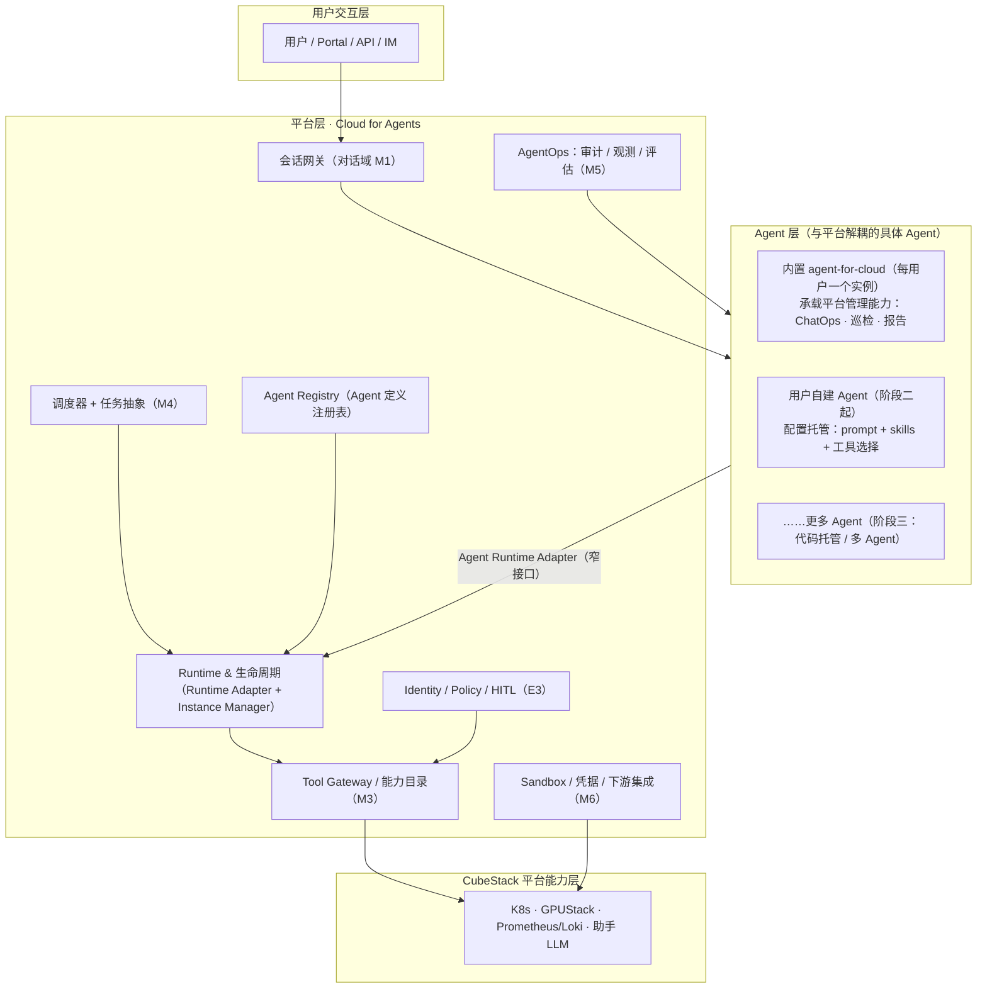
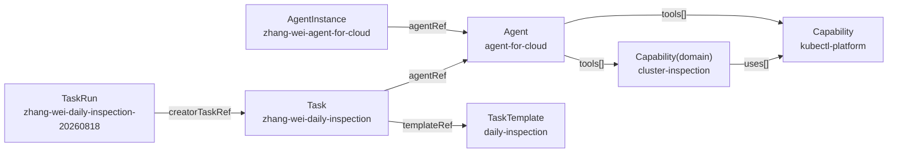
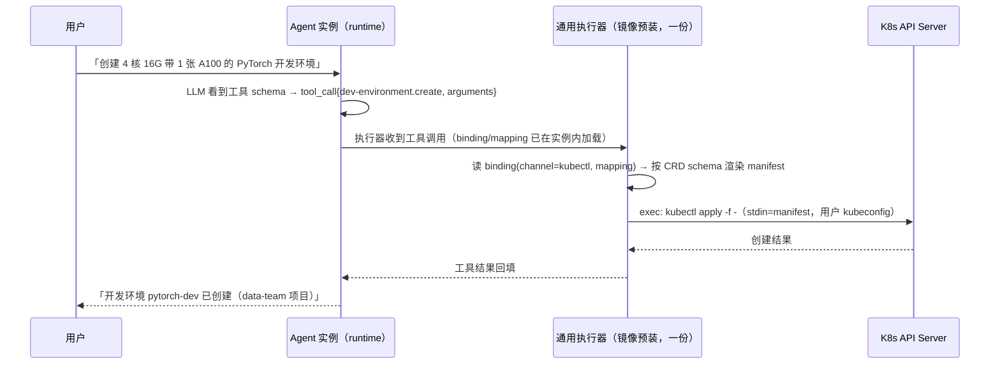

# CubePilot · Agent 云平台设计（Cloud for Agents × Agents for Cloud）

**文档状态：** Draft（新框架稿，待评审）
**适用范围：** CubeStack 智算云平台 · CubePilot 模块（第一阶段 MVP 及后续演进）
**产品名：** CubePilot（仓库 `cubepilot`）
**文档版本：** v0.1
**架构理念：** 平台能力 API 化，AI Agent 只做编排与决策，不直接操作底层资源

> **本文档定位**：总设计文档。将 CubePilot 重新定位为「**先具备 Cloud for Agents 平台能力，再为每个用户实例化一个 agent for cloud（内置平台管理 Agent）承载现有 CubePilot 平台管理能力，后续支持用户自建 Agent**」的两层架构。
>
> **与既有文档的关系**：
> - 《CubeStack-平台智能助手-CubePilot-模块设计文档.md》（v0.2）的 M1~M6 功能域、E1~E5 扩展点、CRD 与安全/部署设计在本文档框架下**重组归属，内容不推翻、仅重新分层**；本文档是 v0.2 的框架级演进候选稿。
> - 《CubeStack-平台智能助手-CubePilot-功能需求细化文档.md》（v0.5）仍是**需求唯一真源**，本文档与 `FR-M{域}-{序号}` / `NFR-{序号}` 对齐；涉及需求调整时同步更新需求文档。

---

# 1. 引言

## 1.1 背景与问题

CubeStack 战略正从「给 AI 提供算力」走向「给 Agent 提供云」：Cloud for Agents × Agents for Cloud → Agent-Native Cloud。CubePilot 原设计（v0.2）把平台智能助手按 M1~M6 六个功能域组织，核心形态是**每用户一个 OpenClaw 实例 Pod** 管理 CubeStack 平台。

原设计存在一个隐含假设：**「每用户一个 Agent」被硬编码在 Instance Manager 里（实例 key = user），没有把「Agent 是平台第一等对象」显式化**。这带来三个问题：

1. 用户看到的不是一个「Agent」，而是一个「助手实例」——无法自然延伸出「用户自建 Agent」；
2. Agent 的 Runtime / Tool / Memory / Identity / Policy / Ops 能力散落在各功能域里，没有收敛为**与具体 Agent 无关的平台层能力**；
3. 与战略方向（V3 Agent 云）缺少显式对应，后续演进需要重构而非复用。

**本框架的答案**：

```
第一步：CubePilot 首先拥有 Cloud for Agents 能力（平台层）
        为 Agent 提供 Runtime / Tool / Memory / Identity / Policy / Ops / Registry / Sandbox
第二步：为每个用户创建一个 agent for cloud（内置 Agent）
        承载现有设计「管理 CubeStack 平台」的能力（ChatOps + 定时巡检 + 报告）
第三步：后续用户基于同一平台层自建自己的 Agents
```

三件事是同一条演进线上的三个阶段，而不是三个产品。

## 1.2 设计理念

- **两层架构**：
  - **平台层（Cloud for Agents）**：与具体 Agent 无关的 Agent 基础设施——Runtime 生命周期、Tool Gateway、Memory、Identity/Policy、AgentOps、Agent Registry、Sandbox、调度器、平台集成。
  - **Agent 层**：具体 Agent 定义与实例。**内置 agent-for-cloud 是平台预置的第一个 Agent**（每用户一个实例）；用户自建 Agent 是后续扩展，与内置 Agent 共用同一平台层。
- **Agent 一等对象**：Agent（定义）、AgentInstance（实例）、AgentIdentity（身份）、AgentRegistry（注册表）成为平台 UI / API / 权限 / 生命周期 / 监控围绕的核心对象；Agent 不再只是「助手功能」，而是可注册、可实例化、有身份、可治理的对象。
- **平台能力 API 化，AI Agent 只做编排与决策**（沿用 v0.2 架构理念）。
- **数据真源归实例数据目录**（沿用「平台零持有 agent 私有数据」已确认决策）：消息历史 / 执行上下文 / 记忆 / skill 与配置的唯一真源 = 各实例数据目录（PVC），平台不落副本。
- **模板 ≠ 实例 ≠ 执行**（沿用 v0.2 决策）：Agent 定义（模板）≠ AgentInstance（实例）≠ TaskRun（执行）；任务侧沿用 TaskTemplate / Task / TaskRun。

## 1.3 术语表

| 术语 | 说明 |
|---|---|
| Cloud for Agents | 为 Agent 提供运行基础设施、工具、发布、治理、弹性保障的平台能力层（本文档「平台层」） |
| Agent for Cloud | 使用和管理云的 Agent。**内置 agent-for-cloud** = 管理 CubeStack 平台的助手，是本文档框架下的第一个 Agent |
| Agent（定义） | Agent 的声明式定义：模型、指令、工具集（能力目录子集）、记忆、身份与策略、可见性；注册于 Agent Registry |
| AgentInstance（实例） | Agent 定义的运行实例：每实例一 Pod + 独立数据目录 + 独立身份；实例 key = `user + agent` |
| AgentIdentity（身份） | Agent 实例的独立身份，派生自创建者/授权者，映射下游 RBAC / 凭据 |
| AgentRegistry（注册表） | Agent 定义的发布 / 版本 / 可见性 / 审核管理；区别于能力目录（Capability，平台能力清单） |
| Capability（能力目录） | 平台能力（CRD）登记为 Agent 可发现的能力清单（沿用 FR-M3-006） |
| MCP Gateway | 聚合多个 MCP Server 的统一入口，集中做鉴权 / 路由 / 策略 / HITL（沿用 v0.2 §4.2 路径 B） |
| TaskTemplate / Task / TaskRun | 沿用 v0.2 定义：模板（做什么）≠ 任务实例（谁的任务、何时跑）≠ 执行报告（平台写入） |
| HITL | Human-in-the-loop，写/高风险操作由操作人本人确认后执行（沿用 FR-M3-003） |
| Model fallback | 主模型失败 / 超时 / 限流时按 `spec.model` 数组顺序切换备用模型的运行时能力（`model[0]` 为主模型，`model[1:]` 为 fallback；视 runtime 是否支持，如 OpenClaw / Hermes） |

## 1.4 范围与阶段

| 阶段 | 主题 | 交付内容 |
|---|---|---|
| **一 · 首批必须** | 平台层最小闭环 + 内置 agent-for-cloud | 平台层：Runtime 生命周期（Instance Manager）、会话网关、能力目录、凭据/下游、调度器；Agent 层：**内置 agent-for-cloud 每用户实例**，承载 v0.2 阶段一全部内容（对话闭环、平台资源操作、定时巡检、报告） |
| **二 · 次批** | Agent 一等对象落地 + 用户自建 Agent（配置托管） | Agent / AgentInstance / AgentIdentity CRD、Agent Registry（审核发布）、工具层 Policy/HITL（Gateway 统一）、用户自建 Agent（模板化 + 配额 + 配置托管）、Agent 级 AgentOps |
| **三 · 后续** | 平台化与智能演进 | 代码托管（container 形态自定义 Agent）、Agent Evaluation、多 Agent、向 Agent-Native Cloud 过渡 |

> 阶段划分与需求文档 §5.1 对齐：阶段一/二/三 分别承接平台「推理平台 MVP → 微调平台 → 通用训练平台」三阶段。

---

# 2. 总体架构

## 2.1 两层架构



**关键交互**：

- 用户消息经会话网关进入**指定 Agent 的实例**（默认内置 agent-for-cloud）；Agent 编排循环（规划 → 工具调用 → 汇总）在实例内完成，工具调用经平台层 Tool Gateway / 能力目录以**用户身份 + Agent 身份**执行。
- 平台层所有组件**与具体 Agent 无关**：换 Agent（自建/替换）只新增 Agent 定义与实例，平台层不重写。

## 2.2 与既有 M1~M6 功能域的映射

v0.2 的六个功能域在本文档框架下重新归属——**内容不变，归属上移为平台层能力，内置 agent-for-cloud 是它们的首个消费者**：

| 既有功能域 | 新归属 | 说明 |
|---|---|---|
| M1 对话域 | 平台层 · 会话网关 | 会话/消息/SSE/上下文组装是平台能力，任何 Agent 可复用；内置 agent 是首个消费者 |
| M2 Agent 域 | **拆分**：平台层（Runtime Adapter + 实例生命周期）+ Agent 层（Agent 定义/配置） | 实例管理上移到平台层；「配置管理」（模型/工具开关/提示词）落到 Agent 定义与实例配置 |
| M3 工具域 | 平台层 · Tool Gateway + 能力目录 | 与具体 Agent 无关；能力目录按 Agent 定义加载可见子集 |
| M4 定时 AI 任务域 | 平台层 · 调度器 + 任务抽象 | 任何 Agent 可被调度；Task 增加 `agentRef` 后，巡检显式绑定内置 agent |
| M5 审计域 | 平台层 · AgentOps | 溯源/台账/归档按 **Agent 粒度** 记录（v0.2 为按用户粒度） |
| M6 平台集成 | 平台层 · 凭据 / 下游 / Sandbox | 沿用；凭据按 Agent 身份最小化派生 |

## 2.3 组件清单

| 组件 | 选型 / 形态 | 归属层 | 职责 | 关键交互 |
|---|---|---|---|---|
| Portal 前端 | Web 静态资源 | 交互层 | 对话页 / 任务报告 / 审计查询 / **Agent 管理（列表、创建、配置）** | → 会话网关、Agent Registry |
| 会话网关（助手服务） | 无状态 Deployment ×2 | 平台层 | 会话/消息/上下文组装、Agent 路由、SSE | → Agent 实例、Instance Manager、PG/Redis |
| Instance Manager | 控制器化（`AgentInstance` CRD + controller-runtime，§13 备选落地） | 平台层 | Agent 实例拉起/自愈/回收/预热池、数据目录 GC | → K8s API（拉起 Agent Pod） |
| Agent 实例池 | OpenClaw Pod 0~N（每用户每 Agent 单例） | Agent 层 | 编排循环（规划 → 工具调用 → 汇总） | → 助手 LLM、Tool Gateway、数据目录 |
| Agent Registry | 服务 + `Agent` CRD | 平台层 | Agent 定义发布/版本/可见性/审核 | → 会话网关、Instance Manager |
| 调度器 | 单副本起步（控制器化后多副本） | 平台层 | 读 Task/TaskTemplate CRD，到点拉起 Agent 实例注入任务，平台身份回写 TaskRun | → Instance Manager、Agent 实例 |
| Tool Gateway | 阶段一：kubectl 直连；阶段二：MCP Gateway | 平台层 | 工具路由 / 鉴权 / 策略 / HITL | → 平台能力层 |
| 助手 LLM | InferenceService 1~N | 平台层 | 模型无关推理（FR-M6-003）：平台内置推理池 + 平台外自定义端点；凭据平台托管 | ← Agent 实例 |
| 存储 | PostgreSQL + Redis + 每 Agent 独立 PVC | 平台层 | 平台自产数据 + 实例数据目录 | ← 会话网关、Agent 实例 |

> **Leader Election 边界**（沿用 v0.2 §3.3）：多副本 Leader Election 仅适用于控制面组件（Instance Manager、调度器）；Agent 实例是**每用户每 Agent 有状态单例**（单副本、单写者），不做副本复制，可靠性由 K8s 自愈 + 数据目录持久承接。

---

# 3. 核心对象与数据模型

## 3.0 Agent 与 AgentInstance：定义 vs 实例（先读）

**一句话**：`Agent` 是「类」（这个 Agent **是什么、需要什么能力**）；`AgentInstance` 是「对象」（这个 Agent **现在为谁、以什么身份、用什么资源在跑**）。与任务域 `TaskTemplate / Task` 的拆分完全同构：**模板 ≠ 实例**（§4.5 沿用）。

**判断规则（只看一条）**：配置放哪边，取决于它是否**因用户 / 身份 / 运行环境而异**——

- 放 `Agent`（定义）：**所有实例共享、可复用、可版本化、与具体用户无关**；
- 放 `AgentInstance`（实例）：**因用户 / 身份 / 环境而异，或属于运行态**。

| 配置 | Agent | AgentInstance | 说明 |
|---|---|---|---|
| displayName / description / runtime | ✓ | | 定义级元数据与运行时选型 |
| model[]（provider + name + fallback 顺序） | ✓（唯一一份 = 模型 allowlist） | 可「选」（modelRef） | **model 只定义在 Agent**；实例在 allowlist 内切换（默认 model[0]），不重复定义；切到 allowlist 外需改定义发布新版本 |
| model[].endpoint / apiKeyRef | 默认凭据引用（共享） | 个人凭据覆盖 | **key 是凭据、不属于 model**：定义放共享默认引用，实例 credentials[] 放个人覆盖；实例化时按 实例 > 定义 > 平台默认 解析注入（§4.4） |
| instructions（默认系统提示词） | ✓ | 可覆盖 | 定义给默认；实例可用户定制（受能力边界约束） |
| tools[]（能力目录声明） | ✓ | 可开关 | 定义声明能力边界；实例可开关可见子集（FR-M2-005） |
| memory.enabled | ✓ | | 能力声明 |
| identity.mode / scope | ✓（声明） | | 定义声明「以什么身份模式运行、需要什么权限范围」 |
| identity.principalRef（userRef / serviceRef） | | ✓ | 绑定具体用户 / 服务身份 |
| credentials[]（target / type / ref） | | ✓ | 实际凭据引用，因 owner / 环境而异（§4.4） |
| dataVolume / PVC / 资源限额 | 默认 | ✓ 实际 | 定义给默认资源档；实例落实际 PVC 与限额 |
| lifecycle（常驻 / 按需 / idleTTL） | 默认 | ✓ 实际 | 定义给默认策略；实例可覆盖（配额约束内） |
| owner | | ✓ | 实例归属用户 |
| registry（builtin / visibility / 版本 / 配额） | ✓ | | 发布与配额元数据 |
| status（phase / podName） | | ✓ | 运行态，由 Instance Manager 控制器写入 |

**model 与 key 分开理解**：`model[]` 是「用什么模型」（定义级，实例只能选不能定义）；`apiKeyRef` 只是「该模型默认用哪个凭据」的**引用（不是凭据本身）**——共享默认引用放定义，个人覆盖放实例，最终 key 在实例化时解析并注入实例运行时配置，定义与实例都不落明文。

**模型切换规则**：

| 问题 | 答案 |
|---|---|
| AgentInstance 能切换模型吗？ | **能**——改 `modelRef`（在 Agent 定义 `model[]` allowlist 内选择，默认 `model[0]`），持久化、即时生效（FR-M2-005） |
| 能切到定义外的模型吗？ | **不能直接切**——`model[]` 是能力边界；需更新 Agent 定义（发布新版本，Registry §4.6）或由平台扩展 allowlist |
| 使用 agent 的用户能切换吗？ | **能**——owner 通过 Portal「Agent 管理」配置实例 `modelRef`（内置 agent 的用户即 owner）；非 owner 需 owner / 管理员授权 |
| 动态按会话 / 用户切换？ | 阶段三多模型路由（FR-M2-010）：运行时按会话 / 用户路由，不改配置（与上面的静态配置切换互补） |

**覆盖规则**：`AgentInstance` 可覆盖 `Agent` 定义中**允许定制**的字段（instructions / tools 开关 / **model 选择（modelRef）** / 个人凭据 / lifecycle），但覆盖不得超出定义声明的能力边界（`tools ⊆` 定义声明集）、**身份模式不可改**（mode 与定义一致）、并受平台配额约束。

**版本规则**：`Agent` 定义变更 = 发布新版本（Registry 版本化，§4.6）；存量实例按发布策略升级或保持。`AgentInstance` 的运行态字段（phase / podName）由控制器维护，用户不直接改。

## 3.1 Agent（定义）——平台第一等对象

```yaml
apiVersion: assistant.suanova.io/v1alpha1
kind: Agent
metadata:
  name: agent-for-cloud          # 内置 Agent；用户自建为自定义名
spec:
  displayName: 平台管理助手
  description: 管理 CubeStack 平台的默认助手（ChatOps + 巡检 + 报告）
  runtime: openclaw              # openclaw | hermes | deepseek-harness | custom（E1 Adapter）
  model:                         # 模型接入：有序数组，模型无关（FR-M2-003），支持自定义大模型
    - provider: platform         # model[0] = primary（主模型）；provider: platform | external
      name: deepseek-v4-flash    # 模型名 / 端点模型名
      endpoint: ""               # provider=external 时必填：OpenAI 兼容端点（公司已有/公网）
      apiKeyRef: ""              # external 必填：平台托管凭据 Secret 引用（实例启动时注入）
    - provider: external         # model[1:] = fallback 链（运行时支持时生效；只有一项则无 fallback）
      name: deepseek-chat
      endpoint: https://api.example.com/v1
      apiKeyRef: cubepilot/cred-llm-org-gateway   # 定义级「默认凭据引用」：组织共享 key（所有实例共用）
                                                  # 留空 → 实例 credentials[] 提供个人 key（覆盖，§4.4）
  instructions: |                # 系统提示词（真源 = 实例数据目录，此处为定义级默认）
    ...
  tools:                         # 能力引用（Capability refs：atomic + domain 统一，阶段一起）
    - kubectl-platform            # atomic：原子读操作
    - inference-service           # atomic：推理服务操作
    - cluster-inspection          # domain：集群智能巡检（领域知识）
  memory: { enabled: true }
  identity:                      # 身份模式（§4.4）
    mode: user                   # user = 以用户身份执行；service = 独立服务身份
    scope: { level: project-write }
  policyRefs: [default-confirm-rules]   # 确认规则引用（E3）
  registry:
    builtin: true                # 内置 Agent：平台预置、不可删除、每用户自动实例化
    visibility: system           # system | platform-reviewed | public
  quotas: { maxInstancesPerUser: 1 }
```

**关键点**：

- **内置 agent-for-cloud 是平台预置的第一个 `Agent` 定义**（`builtin: true`）：每用户自动实例化一个，不可删除，可被用户配置（模型/工具开关/提示词，FR-M2-005）。
- **模型接入（模型无关，FR-M2-003 / FR-M6-003）**：`spec.model` 为**有序模型数组**，同时是该 Agent 的**模型 allowlist**——`model[0]` 为主模型（primary），`model[1:]` 为降级模型链（fallback）；**只有一项时即仅主模型、无 fallback**；实例在 allowlist 内切换（`modelRef`），切到 allowlist 外需改定义发布新版本；运行期按会话 / 用户路由属 FR-M2-010（阶段三）。每项支持平台内置推理池（`provider: platform`，默认 DeepSeek V4 Flash 同级）或**平台外自定义大模型端点**（`provider: external`，OpenAI 兼容，含公司已有/公网推理服务）；端点凭据支持**两层**：定义级**共享凭据**（组织统一模型网关，所有实例共用同一 key，`apiKeyRef` 引用平台共享 Secret）与实例级**个人凭据**（用户自带 key，`credentials[]` 覆盖共享凭据），解析优先级**实例级 > 定义级 > 平台默认**（§4.4）；凭据一律平台托管，**Agent 定义不落明文密钥**。
- **Model fallback（视运行时能力）**：运行时在主模型**失败 / 超时 / 限流**时按数组顺序依次切换后续模型；是否生效取决于 runtime 是否原生支持（OpenClaw / Hermes 支持，DeepSeek-Harness 待验证，§10）；模型切换作为 trajectory 观测数据记录（可选增强事件，不新增必选事件），供 AgentOps 观测「实际用了哪个模型」。
- Agent 定义与实例分离：定义是「做什么、用什么工具、什么身份、什么模型」，实例是「谁的、跑在哪、状态如何」。
- **AgentRegistry 与能力目录的区别**：Registry 管「Agent 定义」（谁能创建什么 Agent）；Capability CRD 管「平台能力」（Agent 能用什么工具）。阶段一 Registry 简化为内置 Agent 列表；阶段二开放用户创建/审核发布。

## 3.2 AgentInstance（实例）

| 维度 | 设计 |
|---|---|
| 实例 key | `agentKey = user + agent`（每用户每 Agent 单实例、单写者）——从 v0.2 的 `user` 泛化，为 1:N（一个用户多个 Agent）预留 |
| spec | `agentRef` + `owner`(user) + `identity`（主体：mode + principalRef）+ `credentials[]`（类型化下游凭据）+ 数据目录 PVC |
| status | Creating / Warm / Idle / Reclaiming / Failed（沿用 v0.2 生命周期状态图） |
| 生命周期 | Instance Manager（控制器）reconcile：拉起、自愈、闲置回收（可配置）、预热池 |
| 数据目录 | 每实例独立 PVC（默认 1 GB，水位 >70% 触发清理/告警，FR-M6-004）；真源归属数据目录 |

**示例（用户 zhang.wei 的内置 agent 实例）**：

```yaml
apiVersion: assistant.suanova.io/v1alpha1
kind: AgentInstance
metadata:
  name: zhang-wei-agent-for-cloud      # 实例名 = <user>-<agent>，由平台控制器生成
spec:
  agentRef: agent-for-cloud            # → Agent 定义（§3.1 示例）
  owner: zhang.wei                     # 实例归属用户
  identity:                            # 平台侧「我是谁」：单一语义，不按下游区分
    mode: user                         # user（以用户身份执行）| service（独立服务身份，阶段二）
    principalRef:
      userRef: zhang.wei               # mode=user：绑定用户
      serviceRef: ""                   # mode=service：绑定服务身份（阶段二）
  credentials:                         # 「我怎么认证到下游」：类型化凭据列表，可多个并存
    - target: k8s                      # 目标下游：k8s | gputack | prometheus | harbor | llm | itsm | ...
      type: kubeconfig                 # 凭据类型：kubeconfig | api-key | oauth2 | bearer-token | basic-auth | x509 | ...
      ref: cubepilot/cred-k8s-zhang-wei         # → Secret：最小权限、0600、轮换/吊销
    - target: llm                      # 平台外模型端点
      type: api-key
      modelRef: deepseek-chat          # 绑定：给 Agent 定义 model[] 中 name=deepseek-chat 的条目（§4.4）
                                       # 或改 endpoint: https://... 按端点绑定（同网关多模型共用一把 key）
      ref: cubepilot/cred-llm-external # 个人 key：覆盖该模型条目的定义级默认（§4.4）
  # modelRef: model[1]                 # 可选：切换模型（在 Agent 定义 model[] allowlist 内选择，默认 model[0]）；仅选择、不定义
  dataVolume:
    pvc: pvc-zhang-wei-agent-for-cloud # 每实例独立 PVC（真源 = 数据目录）
    size: 1Gi
  lifecycle:
    strategy: resident                 # resident（常驻，阶段一内置 agent）| on-demand（阶段二）
    idleTTL: 0                         # 常驻不回收
status:
  phase: Warm                          # Creating / Warm / Idle / Reclaiming / Failed
  podName: agent-zhang-wei-agent-for-cloud
```

**与 v0.2 的差异**：Pod 名从 `agent-<user>` 变为 `agent-<user>-<agent>`（或 CR 名）；`active` 映射从 `user -> lastActivity` 变为 `agentKey -> lastActivity`。内置 agent 阶段一常驻（FR-M2-002 决策），用户自建 Agent 阶段二起按配额 + 按需启停。

## 3.3 Capability / TaskTemplate / Task / TaskRun（沿用并微调）

| 对象 | v0.2 定义 | 本文档调整 |
|---|---|---|
| `Capability` | 能力目录：用途/参数/示例/toolRef（§7.2） | 增加 `spec.agents[]`（可选：可见 Agent 范围；为空 = 全部可见） |
| `TaskTemplate` | 任务模板：参数化指令 + 参数 Schema + 权限提示 + 默认触发（§4.5） | 不变 |
| `Task` | 任务实例：templateRef/instruction + creator + trigger + cron（§4.5） | 增加 `spec.agentRef`（执行 Agent，默认 `agent-for-cloud`） |
| `TaskRun` | 执行报告：调度器以平台身份写入（§4.5/§7.2） | 不变（平台身份写入，用户凭据无需 CRD 写权限） |

### 3.3.1 Capability 示例（统一形状：`operations[]`）

> 所有 Capability 用**同一套 spec 形状**：`operations[]`（操作集，每个操作编译为一个工具；单操作也写在这里）。区别只在执行绑定用的通道，而不是字段形状。

```yaml
apiVersion: assistant.suanova.io/v1alpha1
kind: Capability
metadata:
  name: kubectl-platform
spec:
  type: atomic                     # 原子能力原语
  title: 平台资源操作
  description: 以用户身份查询/操作 K8s 平台资源（Pod / PVC / InferenceService / DevEnvironment 等 CRD）
  agents: []                        # 可见性：为空 = 全部 Agent 可见；可限定到具体 Agent
  operations:                       # 操作集（统一形状）：每个操作编译为一个独立工具
    - name: query                   # 工具名 = <capability>.<operation>；单操作时 = 能力名（本示例即 kubectl-platform）
      title: 查询资源
      description: 以用户身份查询 K8s 平台资源（只读）
      level: L0                     # L0 只读 / L1 写/高风险（策略与 HITL 挂钩）
      params:                       # 语义参数：编译为工具 Schema
        - { name: verb, type: string, description: 操作类型（get/list/describe 等只读类） }
        - { name: resource, type: string, description: 目标资源类型（pods/pvc/nodes/inference-service 等） }
        - { name: name, type: string, description: 资源名（可选） }
        - { name: namespace, type: string, description: 命名空间（可选） }
        - { name: subresource, type: string, description: 子资源（可选，如 pods/status、pods/log） }
        - { name: selector, type: string, description: 标签选择器（可选，如 app=llm,env=prod） }
        - { name: output, type: string, enum: [yaml, json, wide, name], description: 输出格式（可选，对应 -o） }
      examples:                     # 语义示例：帮 LLM 判断「何时用、用户话怎么映射」
        - "查询所有异常的 Pod"
        - "查看 InferenceService 运行状态"
      bindings:                     # 执行绑定（E2 通道）；生效通道由平台部署配置决定，Agent 侧无感知
        - channel: kubectl          # 阶段一：kubectl 直连（实例内 exec）
          command: kubectl
          argTemplate: "{{.verb}} {{.resource}} {{.name}} -n {{.namespace}}"
        - channel: mcp              # 阶段二：K8s MCP Server
          server: k8s
          tool: run_kubectl
---
apiVersion: assistant.suanova.io/v1alpha1
kind: Capability
metadata:
  name: inspection
spec:
  type: atomic                     # 原子能力原语
  title: 集群健康巡检
  description: 节点 / GPU / Pod / 存储 / 平台组件健康检查与 AI 智能巡检（FR-M4-003/007）
  agents: []
  operations:
    - name: inspect
      title: 集群健康巡检
      description: 按范围巡检集群健康，输出 P0/P1/P2 分级报告（只读）
      level: L0
      params:
        - { name: scope, type: string, enum: [all, node-pool, project], description: 巡检范围 }
      examples:
        - "巡检集群健康，输出 P0/P1/P2 分级报告"
        - "检查 GPU 节点健康与利用率"
      bindings:
        - channel: kubectl
          command: kubectl
          argTemplate: "get nodes,pods,pvc -A"
      # 说明：AI 智能巡检的「自主探索 + 归因」是领域知识 → Skill cluster-inspection（§4.2.1），
      #       其步骤使用本 Capability 的原子读操作与 kubectl-platform 等原子 Capability
---
apiVersion: assistant.suanova.io/v1alpha1
kind: Capability
metadata:
  name: kubectl-raw
spec:
  type: atomic                     # 原子能力原语
  title: 高级只读命令（逃生门）
  description: 覆盖结构化参数覆盖不到的长尾场景（api-resources / explain / 组合 flags / 子资源等），
               以自由命令串执行；只读白名单 + 高危拦截，默认不开启
  agents: []                        # Agent 定义需显式声明才注入（默认关闭）
  operations:
    - name: run
      title: 执行高级只读命令
      description: 以自由命令串执行 kubectl 只读命令
      level: L0                      # 白名单内直放；歧义走 HITL（policy 兜底）
      params:
        - { name: command, type: string, description: 自由命令串（如 api-resources、get pods/status -o yaml） }
      examples:
        - "列出集群支持的 API 资源"
        - "查看某个 Pod 的 status 子资源"
      bindings:
        - channel: kubectl
          command: kubectl
          argTemplate: "{{.command}}"
      policy:                        # 操作级策略（逃生门特有，Tool Gateway 强制）
        allowReadOnly: true          # 只读命令白名单：get/list/describe/api-resources/explain/version/...
        denyWrites: true             # 写/高危（delete/apply/exec/scale/...）一律拦截
        hitlForAmbiguous: true       # 无法判定 → HITL，默认拒绝（fail-closed）
```

**字段说明（统一形状）**：

| 字段 | 含义 | 谁消费 | 示例 |
|---|---|---|---|
| `metadata.name` | 能力唯一标识，Agent 用这个名字引用（`tools[]` / `agents[]`） | 平台（引用匹配） | `kubectl-platform` |
| `spec.type` | `atomic`（原子操作）/ `domain`（领域知识）；差异字段按 type 条件出现（atomic: operations/bindings；domain: uses/contentRef） | 平台（编译方式）+ 审核 | `atomic` / `domain` |
| `spec.title` / `spec.description` | 能力名 / 用途说明 | LLM（工具名 + 注入系统提示词） | 平台资源操作 / … |
| `spec.agents[]` | 可见性：允许哪些 Agent 用（为空 = 全部可见） | 平台（可见性过滤） | `[]` |
| └ `operation.instructions`（domain） | **领域指令内联**（SKILL.md 文本直接写 CRD，默认）；`files[]` 内联小脚本（可选） | Adapter（编译为领域工具）+ runtime | `诊断步骤…` |
| └ `operation.contentRef`（domain，可选） | 内容大 / 二进制 / 需独立版本复用时指向外部载体（ConfigMap / OCI）；**不强制**，内联优先 | 平台（实例化时下发）+ 审核 | `configMap: cubepilot/...` |
| `spec.manages`（可选） | 关联平台资源（group/version/kind）——**元数据，不改变形状** | 平台（资源绑定校验） | `kind: DevEnvironment` |
| `spec.operations[]` | **操作集（统一形状）**：每个操作编译为一个独立工具；单操作也写在这里 | Adapter（编译 schema） | `query` / `inspect` / `run` / `create` |
| └ `operation.name` | 工具名后缀；多操作时工具名 = `<capability>.<name>`，单操作时 = 能力名 | Adapter | `kubectl-platform.query` |
| └ `operation.level` | L0 只读 / L1 写/高风险（策略与 HITL 挂钩） | 策略引擎 | `create: L1` |
| └ `operation.params[]` | 语义参数 Schema（给 LLM 的填参契约） | LLM + 平台校验 | `verb` / `resource` / `subresource` |
| └ `operation.mapping` | 写操作：**参数 → CRD 字段路径**映射（body 由平台按 CRD OpenAPI schema 渲染，替代手写 bodyTemplate） | 平台（渲染 + schema 校验，fail-fast） | `image → spec.image` |
| └ `operation.examples[]` | 语义化示例（用户语言，非命令语法） | LLM | "查询所有异常的 Pod" |
| └ `operation.bindings[]` | 执行绑定（`channel: kubectl / kube-api / mcp / skill`） | 工具实现层 | `{channel: kubectl, command: kubectl}` |
| └ `operation.policy`（可选） | 操作级策略（如 raw 白名单） | 策略引擎 | `denyWrites: true` |

**执行通道说明**：CubeStack 模块能力均为 **K8s CRD**，最终都走 **K8s API Server**——`channel` 只是「怎么调用」：

| channel | 含义 | 阶段 |
|---|---|---|
| `kubectl` | **默认首选**：实例内 exec kubectl（读 + 写 `apply -f -`；kubectl 底层就是调 K8s API Server）。**能用 kubectl 就用 kubectl** | 一（默认） |
| `kube-api` | **备选**：直连 K8s API Server（body 由平台按 CRD OpenAPI schema + `mapping` 渲染后 POST/PUT/DELETE）——仅当 kubectl 表达不了或需要结构化控制时 | 一 |
| `mcp` | K8s MCP Server（kubectl / kube-api 的统一网关封装），凭据托管于 Gateway | 二 |

> `Skill` 不是 Capability 的执行通道——它是**领域层**，使用 Capability（§4.2.1）。

**Capability 设计原则（回应：CRD 变化怎么办 / 复合能力怎么表达）**：

1. **原语原则**：Capability 的粒度 = **一个操作（平台原语）**；"一系列过程"的复合能力**不靠一个超大 Capability**，而是组合（§4.2.4）；
2. **声明式 + 自动生成（CRD 变化不用手动改）**：
   - `manages` 声明资源后，平台从 **CRD OpenAPI schema**（K8s API discovery）自动生成：get / list 等通用读操作的 params 与执行、创建 body 的默认骨架（apiVersion / kind / 必填字段 / 默认值）；
   - 写操作只声明 **`mapping`（参数 → CRD 字段路径）**，如 `image → spec.image`，**不手写整份 bodyTemplate**——body 由平台在运行时按 CRD schema + mapping 渲染；
   - **CRD 变化 → 平台登记时 / 运行时自动校验**：字段还在 → 自动适配；字段被删 / 类型变 → 校验失败并明确提示更新 mapping（**fail-fast**），不会默默失效；
3. **读操作自动生成**：get / list / 查看状态类操作，模块声明 `manages` 即可，不必手写 params 与 argTemplate。

> `examples[]` 特意存**语义示例**而非命令语法：切换通道（kubectl ↔ mcp）时示例不用重写、Agent 侧无感知（语法翻译收敛在工具实现层，E2）。

### 3.3.2 TaskTemplate 示例（预置巡检模板）

```yaml
apiVersion: assistant.suanova.io/v1alpha1
kind: TaskTemplate
metadata:
  name: daily-inspection
spec:
  displayName: 每日集群巡检
  description: 预置巡检：节点 / GPU / Pod / 存储 / 平台组件 + AI 智能巡检
  instruction: |
    以只读方式巡检集群（get/list/watch/logs）：
    1. 检查节点 Ready 与压力（Disk / Mem / PID）
    2. 检查 GPU 健康与利用率（nvidia.com/gpu）
    3. 检查异常 Pod（CrashLoopBackOff / Pending / ImagePullBackOff / OOM）
    4. 检查存储（PVC 使用率）
    5. 检查平台组件健康（GPUStack / Harbor / Keycloak / Prometheus）
    发现异常附证据链，按 P0/P1/P2 分级；禁止任何写操作。
  paramsSchema:
    - name: scope
      type: string
      default: all
      enum: [all, node-pool, project]
  requiredPermissions:
    level: cluster-read
    note: 全集群巡检需创建者具备集群级只读权限
  defaults:
    trigger: cron
    cron: "0 2 * * *"                # 默认每日 02:00
```

### 3.3.3 Task 示例（用户的任务实例）

```yaml
apiVersion: assistant.suanova.io/v1alpha1
kind: Task
metadata:
  name: zhang-wei-daily-inspection
spec:
  templateRef: daily-inspection      # → TaskTemplate（§3.3.2 示例）
  params:
    scope: all                       # 覆盖模板参数默认值
  agentRef: agent-for-cloud          # → Agent（§3.1 示例）：由哪个 Agent 执行（默认内置）
  creator: zhang.wei                 # 执行身份 = 创建者（RBAC 与创建者一致）
  trigger: cron
  cron: "0 2 * * *"
status:
  phase: Ready                       # Ready / Paused / ...
  lastRunTime: "2026-08-18T02:00:00Z"
  nextTaskRunName: zhang-wei-daily-inspection-20260818
```

### 3.3.4 TaskRun 示例（执行报告，平台身份写入）

```yaml
apiVersion: assistant.suanova.io/v1alpha1
kind: TaskRun
metadata:
  name: zhang-wei-daily-inspection-20260818
spec:
  type: inspection                   # inspection / verification / ...
  scope: all
  creatorTaskRef:                    # → Task（§3.3.3 示例）
    name: zhang-wei-daily-inspection
    uid: 3f2a1c0e-9b4d-4f6e-8a5c-1e2d3f4a5b6c
status:
  phase: Completed                   # Pending / Running / Completed / Failed / Cancelled
  summary:
    total: 6
    abnormal: 1
    p0: 0
    p1: 1
    p2: 0
  items:
    - category: pod
      level: P1
      finding: "inference-llm-7b-5f8c9 pod CrashLoopBackOff"
      evidence:
        - command: kubectl get pods -A
          output: "..."
          ts: "2026-08-18T02:00:11Z"
  conditions:
    - type: Inspected
      status: "True"
```

> `TaskRun` 由**调度器以平台身份**创建并写入，Agent 实例与用户凭据不直接写 CRD（凭据最小化，沿用 v0.2 §4.5）。

## 3.4 存储策略

沿用 v0.2 §7「平台零持有 agent 私有数据」：

- **agent 私有数据**（会话 / 消息 / 轨迹 / 记忆 / skill 与配置）：任何阶段不建表、不落 DB，唯一真源 = 实例数据目录（经 runtime 会话接口读取，冷时先冷启动）。
- **平台自产数据**（Agent 定义、AgentInstance、Registry 元数据、TaskTemplate/Task/TaskRun、Capability（`type: atomic | domain`）、确认台账、多租户元数据）：CRD（`assistant.suanova.io/v1alpha1`）+ PostgreSQL + Redis。
- **换运行时 = 丢或迁**（沿用 §4.1）：agent 私有数据接受丢弃，或以旧 PVC 为原料写一次性迁移工具。

## 3.5 示例串联（贯穿示例：内置 agent-for-cloud + 每日巡检）

上文各 CRD 示例同属一个贯穿场景，通过字段引用真实关联：



| CRD | 示例名 | 关键引用字段 | 指向 |
|---|---|---|---|
| `Capability` | `kubectl-platform` | `toolRef` → 平台 CRD/API；被 `Agent.tools[]` 引用 | 平台能力层 |
| `Capability`(domain) | `cluster-inspection` | `uses[]` → Capability(atomic)；`contentRef` → ConfigMap/OCI；被 `Agent.tools[]` 引用 | → `kubectl-platform` |
| `Agent` | `agent-for-cloud` | `tools[]` → Capability（atomic + domain 统一） | → `kubectl-platform` / `cluster-inspection` |
| `AgentInstance` | `zhang-wei-agent-for-cloud` | `agentRef` → Agent；`identity.principalRef` → 用户；`credentials[].ref` → Secret | → `agent-for-cloud` |
| `TaskTemplate` | `daily-inspection` | 被 `Task.templateRef` 引用 | — |
| `Task` | `zhang-wei-daily-inspection` | `templateRef` → TaskTemplate；`agentRef` → Agent；`creator` → 用户 | → `daily-inspection` / `agent-for-cloud` |
| `TaskRun` | `zhang-wei-daily-inspection-20260818` | `creatorTaskRef` → Task | → `zhang-wei-daily-inspection` |

**引用关系要点**：

- `Agent.tools[]` 与 `Capability.agents[]` 是**双向可见性约束**：Agent 声明用哪些能力（`tools[]`），Capability 声明对哪些 Agent 可见（`agents[]`，为空 = 全部可见）；实际生效子集取交集。
- `AgentInstance` 是 `Agent` 的**每用户实例化**：`agentRef` 指向定义，`owner` 决定身份派生；同一 Agent 定义可被多个用户实例化（`zhang-wei-agent-for-cloud`、`li-ming-agent-for-cloud`…）。
- `Task` 同时关联「执行主体」（`agentRef` → Agent）与「任务内容」（`templateRef` → TaskTemplate），`creator` 决定执行身份；`TaskRun` 由调度器以平台身份按 `creatorTaskRef` 回写，形成 模板 → 任务 → 执行报告 的完整闭环。

---

# 4. 平台层设计（Cloud for Agents）

> 本章是本文档的重点：**平台层与具体 Agent 无关**，是「用户自建 Agent」成立的前提。每项沿用 v0.2 扩展点（E1~E5），仅调整归属与粒度。

## 4.1 Runtime & 生命周期（E1 上移）

**Agent Runtime Adapter（窄接口，沿用 v0.2 §4.1）**：

| 方向 | 内容 |
|---|---|
| **进入** | 新消息 + 会话引用（每次请求动态）；Agent 定义（身份 / 能力目录子集 / 确认规则 + 工具清单）启动时加载 |
| **返回** | 事件流（`message_start / agent_thinking / tool_call / tool_result / confirm_pending / confirm_resolved / message_delta / message_done`，可降级为最少 4 类） |

- 契约层（平台拥有，与运行时无关）：Agent 定义、能力目录、任务域资产、知识注入源（RAG，阶段二起）。
- 实例层（运行时拥有）：执行态、原生 session、私有 memory、实例配置（数据目录）。
- **Instance Manager 控制器化**：落地为 K8s Operator（`AgentInstance` CRD + controller-runtime，v0.2 §13 备选），`spec.runtime` 区分 OpenClaw / Hermes / DeepSeek-Harness / custom；常驻与回收策略由 CR spec 声明。职责：安装 / 启动 / 停止 / 自愈 / 闲置回收 / 数据目录 GC / 预热池。
- **模型接入与 fallback（运行时级）**：`spec.model`（有序数组，`model[0]` primary、`model[1:]` fallback）作为实例级配置注入运行时（provider 配置，真源 = 数据目录），由 runtime 网关负责模型路由与降级切换；平台只负责**凭据托管与配置下发**，不代理模型请求（external 端点出网由 NetworkPolicy egress 白名单管控，§8）。
- 实例池模型：内置 agent 阶段一常驻（注册即拉起）；用户自建 Agent 按配额 + 按需启停（阶段二）。实例数上限受 Infra 容量约束（NFR-015 扩展：每用户配额 + 全平台上限）。

## 4.2 Tool Gateway / 能力目录（M3 上移）

- **双路径（沿用 v0.2 §4.2）**：路径 A kubectl 直连（阶段一，内置 agent 默认）；路径 B MCP Gateway（阶段二，聚合 K8s MCP / GPUStack MCP / Prometheus MCP 等 + 统一鉴权 / 路由 / 限流 / 策略 / HITL）。两条路径对 Agent 是同一抽象（工具调用），切换 Agent 侧无感知。
- **能力目录**：Capability CRD，按「用户可见范围（RBAC）+ Agent 定义 tools 子集」加载；内置 agent 加载平台管理相关子集，用户自建 Agent 只加载其声明并审核通过的能力。
- **确认模型（沿用 v0.2 §5.3）**：L0 只读直放；L1 写/高风险——阶段一内置 agent 直放（借运行时原生命令审批兜底），阶段二起统一 HITL（fail-closed）；dry-run 随 HITL 一并展示（FR-M3-004）。

**Capability 如何被 Agent 最终使用（端到端）**：

```text
① 登记：模块方/管理员创建 Capability CRD（如 kubectl-platform、inspection）
② 声明：Agent 定义 tools[] 声明使用这些能力（能力边界）
③ 实例化：平台为该 AgentInstance 计算「可见能力子集」
        = Agent.tools[] ∩ Capability.agents[] 可见性 ∩ 用户 RBAC 可见范围
   并组装成两样东西注入实例运行时配置：
       a) 工具定义（Function Calling schema：title + params）→ 模型知道怎么调
       b) 能力说明（description + examples 注入系统提示词）→ 模型知道何时用
④ 对话：用户说「查询有哪些异常的 Pod」
⑤ 决策：LLM 读到能力说明 → 判定该用 kubectl-platform → 发出 tool_call(command=...)
⑥ 执行：工具实现层把语义参数翻译成实际命令（kubectl get pods / MCP 调用），
         以 AgentInstance 的 credentials[]（用户身份）执行，权限受 RBAC 强制
⑦ 返回：工具结果回填 LLM → 汇总成自然语言回答流式返回
⑧ 审计：这次调用「哪个 Agent / 哪个能力 / 什么参数 / 什么结果」记入轨迹（AgentOps）
```

**一条完整链路示例**：

```text
Capability kubectl-platform（登记）
   ↑ tools[]
Agent agent-for-cloud（定义：声明能用它）
   ↑ agentRef
AgentInstance zhang-wei-agent-for-cloud（实例：继承工具集 + 用户身份凭据）
   ↑ 对话
用户: 查询有哪些异常的 Pod
   → LLM 依能力说明调用 kubectl-platform(command="get pods -A")
   → 平台以 zhang.wei 身份执行 kubectl
   → 返回 CrashLoopBackOff 列表
   → LLM 汇总: 「发现 2 个异常 Pod（inference-llm-7b…）」
```

> **关键**：AgentInstance 不直接引用 Capability——它通过 `agentRef` 继承 Agent 定义的 `tools[]`，实例上只能**开关**工具（FR-M2-005），不能引入定义没声明的能力（能力边界在定义，§3.0）。

**Agent 到底怎么"知道怎么用"一个 Capability？（以 kubectl-platform 为例）**

Capability 被实例化后编译成**两样东西**，分别回答 LLM 和 runtime 各自的问题：

**A. 工具 Schema（给 LLM——"怎么填参"）**：`params[]` 编译成 Function Calling 工具定义，注入运行时；LLM 只看到这个、不需要知道 kubectl 语法：

```json
{
  "name": "kubectl-platform",
  "description": "以用户身份查询/操作 K8s 平台资源。支持 get/list/logs/describe 等只读操作。",
  "parameters": {
    "type": "object",
    "properties": {
      "verb":      { "type": "string", "enum": ["get","list","describe"], "description": "操作类型" },
      "resource":  { "type": "string", "description": "目标资源类型（pods/pvc/nodes/...）" },
      "name":      { "type": "string", "description": "资源名（可选）" },
      "namespace": { "type": "string", "description": "命名空间（可选）" },
      "subresource": { "type": "string", "description": "子资源（可选，如 pods/status）" },
      "selector":  { "type": "string", "description": "标签选择器（可选）" },
      "output":    { "type": "string", "enum": ["yaml","json","wide","name"], "description": "输出格式（可选）" }
    },
    "required": ["verb", "resource"]
  }
}
```

**B. 工具调用（LLM 发出的意图）**：模型按 Schema 填参，发出结构化 tool_call——**模型只声明意图，不执行**：

```json
{ "name": "kubectl-platform",
  "arguments": { "verb": "get", "resource": "pods", "namespace": "cubepilot" } }
```

**C. 执行（runtime 依据 toolRef 找 handler）**：运行时收到 tool_call 后，按 `toolRef` 找到实现执行：

| `toolRef.bindings[]` | handler 做的事 |
|---|---|
| `channel: kubectl` | 按 `argTemplate` 把语义参数翻译成 `kubectl get pods -n cubepilot`，用该实例 `credentials[]`（用户 kubeconfig）执行 |
| `channel: mcp` | 调用 `k8s` MCP Server 的 `run_kubectl` 工具，凭据托管于 Gateway |

**所以**：`params` 是「给 LLM 的填参契约」，`toolRef` 是「给 runtime 的执行绑定」；**翻译（语义参数 → kubectl 命令）只发生在 toolRef 指向的实现层**，模型和 Capability 定义都不碰命令语法——这正是架构理念「平台能力 API 化，AI Agent 只做编排与决策」的落地点。

**结构化参数覆盖不到的长尾怎么办？（api-resources / 子资源 / -o yaml 等）**

kubectl 能力远多于固定参数集，采用**两条腿**：

| | 结构化 Capability（如 `kubectl-platform`） | raw 逃生门（`kubectl-raw`） |
|---|---|---|
| 覆盖 | 高频操作：get / list / describe + 常见资源 + 子资源 + 标签 + 输出格式 | 长尾：`api-resources`、`explain`、`pods/status`、组合 flags、`-o yaml` 等自由命令 |
| 参数 | 语义字段（verb/resource/...），LLM 按 Schema 填参，天然防语法错 | `command` 自由命令串 |
| 安全 | 参数级校验 + RBAC | **策略引擎**：只读命令白名单（get/list/describe/api-resources/explain/version/...）；写/高危（delete/apply/exec/scale/...）一律拦截；无法判定 → HITL，默认拒绝（fail-closed） |
| 开启 | Agent 定义 `tools[]` 声明即用 | 需 Agent 定义**显式声明**才注入（默认关闭） |
| 新增覆盖 | 常用操作没覆盖时 = 给结构化加参数 / 登记新 Capability（Agent 侧无感） | — |

**处理用户问题的三个具体场景**：

- `kubectl api-resources` → `kubectl-raw(command: "api-resources")`，白名单放行；
- 子资源 `kubectl get pods/status` → 结构化 `subresource: pods/status` 或 raw；
- `-o yaml` → 结构化 `output: yaml` 或 raw。

**为什么要有 raw**：结构化参数永远追不上 kubectl 的全部能力（长尾会持续增长）；把长尾收进**受策略约束的逃生门**，既保证模型能用，又把风险控制住——策略引擎在 Tool Gateway 强制执行（E3 方案 B 统一 HITL 的同一位置）。

**kubectl-raw 的安全机制（为什么能放行 api-resources / pods/status / -o yaml，同时拦得住 delete / exec）**：

```text
命令串
  → ① 词法解析：按 kubectl 语法拆成结构化 token（verb + resource[/subresource] + name + flags），
      不做字符串前缀匹配（前缀匹配可被绕过）
  → ② 策略引擎校验（Tool Gateway）：
       verb 白名单：get / list / describe / api-resources / explain / version / ...
       flag 白名单：-o / -n / -l / --field-selector / --no-headers / --show-labels / ...
       flag 黑名单：--raw（默认禁）、-w / --watch（禁或 HITL）、未知 flag（拒绝）
  → ③ argv 直 exec：解析出的 token 以「参数数组」直接 exec kubectl，不经 shell；
      任何 shell 元字符（; | && || ` $() > < 换行）在 ① 即拒绝 —— 无 shell 即无命令注入
  → ④ 无法判定（未知 verb / flag / 语法异常）→ HITL 或默认拒绝（fail-closed）
```

| case | 解析结果 | 判定 |
|---|---|---|
| `api-resources` | verb=api-resources（无资源） | 白名单 ✓ 放行 |
| `explain deployment.spec` | verb=explain | 白名单 ✓ 放行 |
| `get pods/status -o yaml` | verb=get + pods + subresource=status + flag -o yaml | 全在白名单 ✓ 放行 |
| `delete pod x` | verb=delete | 不在白名单 ✗ 拒绝 |
| `exec -it pod -- bash` | verb=exec | 不在白名单 ✗ 拒绝 |
| `get pods; rm -rf /` | 词法解析检出 `;` | 拒绝（不经 shell） |

**纵深防御兜底**：即使白名单有漏判，执行仍用该实例 `credentials[]`（用户最小权限 kubeconfig），受 **API Server RBAC** 约束 + **K8s Audit Log** 全程留痕——白名单是第一道闸，RBAC 是最后一道。

**对照字段：agent 引用 kubectl-raw 后，为什么就知道怎么调用它？（以「列出集群支持的 API 资源」为例）**

`kubectl-raw` 被实例化后和 `kubectl-platform` 走**完全相同的编译链路**——只是把「填参的知识负担」从结构化字段换成了自由命令串：

**A. 编译出的工具 Schema（来自 `params[]` + `title` + `description` + `examples[]`）**：

```json
{
  "name": "kubectl-raw",
  "description": "覆盖结构化参数覆盖不到的长尾场景（kubectl api-resources / explain / 组合 flags / 子资源等），以自由命令串执行",
  "parameters": {
    "type": "object",
    "properties": {
      "command": { "type": "string",
                   "description": "自由命令串（如 api-resources、get pods/status -o yaml）" }
    },
    "required": ["command"]
  }
}
```

**B. LLM 的调用过程**：

| 步骤 | 依据的字段 | 行为 |
|---|---|---|
| 判断「该用这个能力」 | `description` + `examples[]`（"列出集群支持的 API 资源"） | 用户说同样的话 → 命中示例 → 选择 `kubectl-raw` |
| 知道「填什么参」 | `params[]`（只有一个 `command: string`） | 模型**自己会 kubectl 语法**（训练知识）→ 填 `command: "api-resources"` |
| 发出意图 | — | `{ "name": "kubectl-raw", "arguments": { "command": "api-resources" } }` |
| 执行 | `toolRef.pathA`（command=kubectl, argTemplate="{{.command}}"） | handler 按 `argTemplate` 翻译并 argv 直 exec `kubectl api-resources`，先过 `policy`（verb=api-resources 在白名单 ✓） |

**C. 为什么 kubectl-platform 做不了这个 case（对比）**：

```text
用户: 列出集群支持的 API 资源
→ kubectl-platform 的 Schema 只有 verb(resource 类) / resource / name / subresource / selector / output
   —— 没有能表达「api-resources」的字段，LLM 无法填出合法参数 → 做不了
→ kubectl-raw 的 Schema 只有 command: string
   —— 自由命令串，模型直接写 "api-resources" → 做得了
```

**一句话**：`kubectl-raw` 让 LLM 用**自己的 kubectl 语法知识**填一个自由命令串（`params` 只约束"这是一个命令字符串"），平台用 `policy` + `toolRef` 在**执行侧**兜住安全——模型负责"会写命令"，平台负责"只允许安全命令"。这正是两条腿的分工：结构化 Capability 防模型写错，raw 逃生门给模型自由，两者都由平台强制边界。
- **错误标准化（沿用 §5.3）**：`{success, data | error}` + 错误分类（`PERMISSION_DENIED` / `USER_DENIED` / `CONFIRM_TIMEOUT` / `RESOURCE_NOT_FOUND` / `RATE_LIMITED` / `UPSTREAM_ERROR`）。

### 4.2.1 Capability 与 Skill：原子能力 × 领域知识（分层，不是两个视图）

**领域知识应该使用基础能力——分层如下**：

| 层 | 对象（同一 `Capability` CRD，`spec.type` 区分） | 回答 | 谁提供 | 引用 |
|---|---|---|---|---|
| **领域层** | `type: domain`（领域知识） | 这个领域怎么干活（诊断步骤 / 推荐逻辑 / 解读规则） | 模块（SKILL.md 指令 + 可选脚本） | **uses[] 编排原子 Capability** |
| **能力层** | `type: atomic`（原子能力原语） | 平台能做的单步操作（kubectl 读 / CRD CRUD / 查询） | 模块登记（契约）+ 平台执行 | 绑定执行通道（kubectl / kube-api / mcp） |
| **执行层** | 通用执行器 | 把参数变成实际命令 / manifest 并执行 | 平台（镜像预装一份，所有 Capability 复用） | — |

**引用方向：Skill → Capability**（领域知识使用基础能力），不是 Capability 引用 Skill：

```text
Skill（领域知识：诊断步骤 + 提示词）
   │ uses（编排 / 引用一个或多个原子操作）
   ▼
Capability（原子原语：kubectl-platform.query、dev-environment.create）
   │ binding
   ▼
通用执行器（kubectl / kube-api / mcp，镜像预装一份）
```

**对 LLM 的呈现**：`Capability` 编译为**原子工具**（schema + 执行绑定）；`Skill` 编译为**领域工具 / 提示词包**（SKILL.md 指导 LLM 按步骤调用原子工具）。LLM 看到的都是「工具」，但 **Skill 内部会编排多个 Capability 工具**——「领域知识使用基础能力」，对 LLM 透明（它只是按 SKILL.md 的步骤调工具）。

**Skill 到底什么时候被「用」**：① **实例化加载时**——注册为 LLM 可见的领域工具（SKILL.md 指令注入上下文）；② **对话时**——LLM 按 SKILL.md 步骤调用其编排的 Capability 工具执行。

**「Capability 最终翻译成 skill 吗？」——是，但只是「运行时载体格式」**：

OpenClaw 只认一种工具格式（SKILL.md 目录 = skill），所以平台侧所有概念**最终都落在 skill 格式上**：

| 语义层 | 运行时（OpenClaw）形态 |
|---|---|
| `Capability`（`type: atomic`） | 编译为**原子工具 skill**：SKILL.md（schema）+ config.yaml（mapping）+ 脚本入口指向通用执行器 |
| `Capability`（`type: domain`） | 编译为**领域工具 skill**：SKILL.md（领域指令）+ 脚本 + `uses[]` 引用原子工具 skill |

「skill」在这里是**文件格式**（SKILL.md 目录），不是语义——Capability **不是"变成了领域知识"**，只是用 skill 格式承载原子能力；领域 Skill 也用同一格式承载知识。**格式统一的好处**：OpenClaw 只认一种格式，平台通过 Adapter 把 Capability 编译成该格式；换 runtime（Hermes / 自研）只换编译目标格式，Capability / 领域 Skill 的语义不变。

**Skill 存哪里、告诉谁？——「元数据在平台，内容在 runtime，源在模块」**：

| 对象 | 存哪 | 谁消费 | 形式 |
|---|---|---|---|
| 领域内容源（domain Capability 的 SKILL.md + 脚本） | **平台侧内容仓库**（模块发布资产，版本 / 哈希 / 审核） | 平台（实例化时下发） | 目录包（SKILL.md 为通用载体） |
| 运行副本 | **实例数据目录（PVC）** | **runtime**（OpenClaw 启动时扫描加载） | 数据目录 `skills/` 下 |
| 元数据 / 登记 | **`Capability` CRD**（`type: domain`：name / version / contentRef / hash / visibility / status + `uses[]`） | 平台（登记 / 审核 / 可见性 / 审计）+ Adapter（下发编排） | CRD |

**怎么告诉**：

- **告诉平台（编排侧）**：模块发布领域内容 → 平台内容仓库登记（版本 / 哈希 / 审核）；Capability（`type: domain`）的 `contentRef` 指向它——平台知道「有哪些领域能力、哪个 Agent 引用哪个」；
- **告诉 runtime（执行侧）**：**实例化时**平台把该 Agent 引用的 domain Capability 内容**下发到实例数据目录（PVC）**，runtime 启动时扫描加载——不是对话时临时传；
- 阶段一简化：内容烘焙进 agent 镜像；生产：内容仓库 → 实例启动拉取 / ConfigMap 挂载到数据目录。

**平台侧需要单独的 `Skill` CRD 吗？——不需要，合并进 Capability（`spec.type: atomic | domain`）**：

| 维度 | 单独 Skill CRD | 合并（推荐） |
|---|---|---|
| 运行时 | 两者都是 SKILL.md 格式，无差别 | 同左 |
| 字段重叠 | title / description / agents / version / visibility / 审核 大部分相同 | 一个 CRD，差异字段按 type 条件出现 |
| 登记 / 审核 | 两套流程 | 一套流程 |
| Agent 引用 | tools[] + skills[] 两个列表 | tools[] 一个列表 |

**结论：语义分层保留（atomic × domain），物理一个 `Capability` CRD**——差异字段按 `type` 条件出现：

```yaml
apiVersion: assistant.suanova.io/v1alpha1
kind: Capability
metadata:
  name: train-diagnosis
spec:
  type: domain                    # atomic（原子操作）| domain（领域知识）
  title: 训练失败诊断
  description: 按「查日志 → 查 GPU → 查指标 → 归因」诊断训练失败
  ownerModule: training
  version: v1
  visibility: platform-reviewed
  agents: []
  # type=atomic 时：manages / operations[]（params / level / examples / bindings / policy）
  # type=domain 时：
  uses:                           # 编排哪些原子 Capability
    - kubectl-platform.query
    - inference.get
  # 领域内容两种承载，按内容大小 / 复用性二选一（不强制 contentRef）：
  instructions: |                 # ① 内联（默认，最简单）：SKILL.md 指令文本直接写在 CRD 里
    # 训练失败诊断步骤：
    # 1. 用 kubectl-platform.query 查任务与 Pod 状态
    # 2. 用 inference.get 查训练任务详情
    # 3. 归因：OOM / 数据问题 / 资源不足…
  # files:                        # ② 内联脚本（可选）：小脚本可直接内嵌，无需外部载体
  #   - name: log_analyzer.py
  #     content: |
  #       ...
  # contentRef:                   # ③ 外部（可选）：内容大 / 二进制 / 需独立版本与复用时
  #   configMap: cubepilot/skill-train-diagnosis   # 阶段一：ConfigMap
  #   # oci: registry:5000/skills/train-diagnosis:v1   # 阶段二：OCI 镜像 / 对象存储
  # sourceHash: sha256:...        # 仅外部内容需要校验（内联时不需要）
status:
  phase: Published                 # Draft / Reviewing / Published / Deprecated
```

**登记流程**（一套）：

```text
① 模块打包领域内容（SKILL.md + 脚本）→ 内容上传到载体（ConfigMap / OCI）
② 创建 Capability（type: domain）：uses[] 声明编排的原子能力，contentRef 指向内容
③ 平台审核（阶段二，复用 Q-010 审核流程）→ Published
④ 被 Agent.tools[] 引用（atomic / domain 统一引用）
⑤ 实例化时平台读 CRD → 按 contentRef 拉取内容 → 下发到实例数据目录 → runtime 加载
```

**引用方向链（合并后）**：

```text
Agent.tools[] → Capability(type=atomic)   # 暴露原子能力工具（契约）
Agent.tools[] → Capability(type=domain)   # 注入领域知识（SKILL.md 指令）
Capability(type=domain).uses[] → Capability(type=atomic)  # 领域知识编排原子操作
Capability(type=atomic).binding → kubectl/kube-api/mcp    # 原子操作绑定执行通道
Capability(type=domain).instructions → 内联（默认）| contentRef → ConfigMap/OCI（大内容可选）
```

**与「平台零持有」的关系**：skill 源是模块发布的**程序资产**（不是用户私有数据），平台持有源不违背零持有原则；运行副本在实例数据目录，与私有数据同位置、同生命周期管理（GC / 重建）。

### 4.2.2 模块如何告诉内置 agent 使用各模块（对接机制）

对齐 v0.2 §5.7 / 需求 §8.3 通用 4 步 + 三路径，模块接入内置 agent 的完整链路：

```text
模块 → ① 能力 API 化：模块能力遵循 API/CLI-First，提供标准化接口（CRD / API）
     → ② 登记 Capability：用途 / 关键参数 / 调用示例 / toolRef ——「契约」：告诉 agent 有什么能力、怎么用
     → ③ 提供实现（三路径之一，见下）——「载体」：skill / API / 数据
     → ④ 实例化时平台按可见性加载 Capability 子集，编译工具 Schema + 能力说明注入系统提示词
     → 内置 agent 即「知道」各模块有什么、怎么调（FR-M2-005 即时生效，模块更新 Agent 侧无感）
```

**两条信息通道**（对应 v0.2 §5.7.3 三路径的落地方式）：

| 通道 | 覆盖 | 载体 |
|---|---|---|
| **工具 Schema** | 操作类能力（创建开发环境、提交训练、部署推理） | 模块登记 Capability → params 编译为 function calling schema，模型知道怎么调 |
| **领域提示词** | 领域智能（诊断、推荐、解读、巡检逻辑） | 模块提供**领域 Skill**（SKILL.md：领域提示词 + 查询工具）→ 基座场景化加载注入上下文，模型知道领域规则 |

**模块自带领域智能的三条路径**（Q-009 已确认倾向 B）：

| 方式 | 说明 | 适用 | 阶段一 |
|---|---|---|---|
| A. 能力 API 化 | 封装领域逻辑为 API → 登记 Capability → 工具化调用 | 操作类 | ✓ 主 |
| B. 领域 Skill | 打包查询工具 + 领域提示词（SKILL.md）→ 基座场景化加载 | 诊断 / 推荐 / 解读 | ✓ 倾向 |
| C. 数据开放 + 基座推理 | 暴露数据 / API → 基座 LLM 直接分析 | 数据问答 / 血缘问答 | 阶段二起 |

**用户视角**：终端用户不接触 Skill——用户只和 Agent 对话，看到的是「能力」（Capability 编译出的工具与说明）；Skill 是模块 / 开发者侧的实现载体，经 Adapter 映射后对用户和 Agent 透明。

**具体例子：开发环境模块如何告诉内置 agent（managed DevEnvironment：CRUD + 更多）**

① 模块把能力 API 化（DevEnvironment 已是平台 CRD）；② 模块登记**资源级 Capability**（一个 Capability 管理一类资源，`operations[]` 覆盖 CRUD 与自定义操作）：

```yaml
apiVersion: assistant.suanova.io/v1alpha1
kind: Capability
metadata:
  name: dev-environment
spec:
  type: atomic                    # 原子能力原语（资源级：一个 Capability 管理一类 CRUD）
  title: 开发环境管理
  description: 管理开发环境（DevEnvironment CRD）：创建 / 查询 / 删除 / 更新
  manages:                          # 管理哪个平台资源
    group: dev.suanova.io
    version: v1alpha1
    kind: DevEnvironment
  operations:                       # 该资源上的操作集：每个操作编译为一个独立工具
    - action: create
      title: 创建开发环境
      description: 按描述创建开发环境（镜像 / 资源规格 / 项目归属）；写操作
      params:
        - name: name
          type: string
          description: 环境名
        - name: image
          type: string
          description: 基础镜像（如 pytorch:2.3-cuda12.1）
        - name: cpu
          type: string
          description: CPU 规格（如 4）
        - name: memory
          type: string
          description: 内存规格（如 16Gi）
        - name: gpu
          type: string
          description: GPU 规格（如 1×A100，可选）
        - name: project
          type: string
          description: 所属项目 / 命名空间
      examples:
        - "创建一个 4 核 16G 带 1 张 A100 的 PyTorch 开发环境"
      level: L1                      # 写操作：阶段二起 HITL
      bindings:
        - channel: kubectl           # 默认：能用 kubectl 就用 kubectl（kubectl 底层即调 K8s API）
          command: kubectl
          argTemplate: "apply -f -"  # manifest 由平台按 CRD schema + mapping 渲染，经 stdin 提交
          body:
            mapping:                 # 声明式字段映射：参数 → CRD 字段路径（不手写整份 manifest）
              metadata.name: name
              metadata.namespace: project
              spec.image: image
              spec.resources.cpu: cpu
              spec.resources.memory: memory
              spec.resources.gpu: gpu
            # manifest 骨架（apiVersion/kind、未映射字段默认值）由平台从 CRD OpenAPI schema 生成；
            # CRD 字段变化 → 登记/运行时 schema 校验失败并提示更新 mapping（fail-fast）
        - channel: kube-api           # 备选：需结构化控制 / 无 kubectl 环境时直连 K8s API Server
          method: POST
          pathTemplate: "/apis/dev.suanova.io/v1alpha1/namespaces/{{.project}}/devenvironments"
          body: { mapping: { metadata.name: name, metadata.namespace: project, spec.image: image, spec.resources.cpu: cpu, spec.resources.memory: memory, spec.resources.gpu: gpu } }
    - action: get
      title: 查询开发环境
      description: 查询单个开发环境的状态
      params:
        - { name: name, type: string, description: 环境名 }
        - { name: project, type: string, description: 所属项目 }
      level: L0
      bindings:
        - channel: kubectl
          command: kubectl
          argTemplate: "get devenvironment {{.name}} -n {{.project}} -o yaml"
    - action: list
      title: 列出开发环境
      description: 列出项目下的开发环境
      params:
        - { name: project, type: string, description: 所属项目 }
      level: L0
      bindings:
        - channel: kubectl
          command: kubectl
          argTemplate: "get devenvironments -n {{.project}}"
    - action: delete
      title: 删除开发环境
      description: 删除指定开发环境；写操作
      params:
        - { name: name, type: string, description: 环境名 }
        - { name: project, type: string, description: 所属项目 }
      level: L1
      bindings:
        - channel: kube-api
          method: DELETE
          pathTemplate: "/apis/dev.suanova.io/v1alpha1/namespaces/{{.project}}/devenvironments/{{.name}}"
  agents: [agent-for-cloud]          # 先只开放给内置 agent
```

③ 实例化时编译：**一个 Capability → N 个工具**（Adapter 把每个 operation 编译为一个独立 function calling 工具，`dev-environment.create` / `.get` / `.list` / `.delete`……），每个工具有自己的 schema、`level`（策略 / HITL 挂钩）、`bindings`（执行绑定）。

④ 用户对话：**「创建一个 4 核 16G 带 1 张 A100 的 PyTorch 开发环境」**

⑤ LLM 依据 `dev-environment.create` 的 description / examples → 填参：

```json
{ "name": "dev-environment.create",
  "arguments": { "name": "pytorch-dev", "image": "pytorch:2.3-cuda12.1",
                  "cpu": "4", "memory": "16Gi", "gpu": "1×A100", "project": "data-team" } }
```

⑥ Tool Gateway：命中 L1 → 阶段一直放 / 阶段二 HITL → handler 执行。

**manifest / body 到底是谁渲染的？它怎么知道如何渲染？**——**平台侧通用实现渲染，渲染知识 = CRD OpenAPI schema + mapping（都不是 LLM）**，不是运行时"猜"的：

| 问题 | 答案 |
|---|---|
| 谁渲染 manifest / body？ | 平台侧通用实现（kubectl 执行器 / K8s API 调用器），**不是 LLM** |
| 它怎么知道如何渲染？ | 平台从 **CRD OpenAPI schema** 拿到结构（apiVersion / kind / 必填字段 / 默认值），按 `bindings[].body.mapping`（参数 → 字段路径）把 LLM 参数填进对应字段——「如何渲染」由 **CRD schema + mapping** 决定，不是手写整份 manifest |
| CRD 字段变化？ | 登记时 / 运行时平台按 OpenAPI schema 校验 mapping 路径：字段还在 → 自动适配；被删 / 类型变 → 校验失败提示更新 mapping（fail-fast），不会默默失效 |
| LLM 接触模板吗？ | 不接触——LLM 只输出语义参数 JSON，manifest / body 不经 LLM 拼接 → **无注入面** |
| 渲染后的实际 body | `{"apiVersion":"dev.suanova.io/v1alpha1","kind":"DevEnvironment","metadata":{"name":"pytorch-dev","namespace":"data-team"},"spec":{"image":"pytorch:2.3-cuda12.1","resources":{"cpu":"4","memory":"16Gi","gpu":"1×A100"}}}` |
| 然后呢？ | 默认走 kubectl：handler 把渲染出的 manifest 经 stdin 提交 `kubectl apply -f -`（用该实例用户 kubeconfig），K8s API Server 以 RBAC 校验后创建；备选直连 K8s API Server POST（`pathTemplate`） |

**渲染器机制（具体到「谁、怎么知道」）**——渲染者是**平台镜像预装的通用执行器（一份，所有 Capability 复用，如同预装 kubectl 一样）**，**不需要给 runtime 注入自定义代码**。Capability 只是**数据**（实例化时平台编译为 skill 目录：SKILL.md + mapping/argTemplate 模板，下发到数据目录）；执行器读数据 + 参数 → 渲染 → 执行。它的输入全是**声明好的数据**，机械执行、无任何"猜测"：

```text
输入（三个都是数据，不是 AI 生成的）：
  ① CRD OpenAPI schema ← K8s API discovery 自动获取（apiVersion/kind/必填字段/默认值/字段类型）
  ② body.mapping       ← 模块注册 Capability 时写的几行「参数 → 字段路径」
  ③ LLM 参数值         ← tool_call 的 arguments（JSON）
        ↓ 平台渲染器（通用代码：schema 骨架 + 按 mapping 写入字段值 + schema 校验）
  渲染结果 manifest：
    apiVersion: dev.suanova.io/v1alpha1
    kind: DevEnvironment
    metadata: { name: pytorch-dev, namespace: data-team }
    spec: { image: pytorch:2.3-cuda12.1,
            resources: { cpu: "4", memory: 16Gi, gpu: 1×A100 } }
        ↓
  kubectl apply -f -（stdin，用户 kubeconfig）→ K8s API Server RBAC 校验 → 创建
```

「它怎么知道如何渲染」的答案：**schema 告诉它结构，mapping 告诉它参数填到哪**——渲染器只是「读 schema 建骨架 → 按 mapping 填值 → 校验」，这段逻辑是平台代码写死的，与 LLM 无关。

**通用执行器到底是什么？（具体到 OpenClaw 实例里）**

Agent 实例 Pod 里「预装的通用件」就 3 样：

| 预装件 | 是什么 | 谁提供 |
|---|---|---|
| exec 工具 | OpenClaw **原生**的命令执行工具（runtime 自带，天然会执行命令、返回输出） | OpenClaw |
| kubectl | kubectl 二进制（被 exec 调用） | 平台（agent 镜像） |
| `kubectl-run.sh` | **一份**通用脚本：读参数 → 按 mapping 渲染 manifest → exec kubectl（所有 Capability 共用同一份） | 平台（agent 镜像） |

**runtime 如何知道要使用 / 如何使用？——它不需要知道**。OpenClaw 只做两件**原生**的事：① 启动时扫描数据目录加载 skill（注册为 LLM 可见工具）；② LLM 调用工具时执行该 skill 声明的脚本入口。整个「通用执行器」对 runtime 透明：

```text
数据目录 skills/
  └── dev-environment.create/          ← 平台实例化时编译下发（全部是数据，没有自定义代码）
        ├── SKILL.md                   # 给 LLM：工具说明 + 参数 schema
        └── config.yaml                # 数据：mapping / channel / argTemplate
        # 无 run.sh——skill 的「脚本入口」直接指向镜像预装的 kubectl-run.sh（一份通用件）

LLM 决定调用 dev-environment.create（依据 SKILL.md 的 schema）
  → OpenClaw 找到该 skill 目录（原生①：加载 skill，注册工具）
  → OpenClaw 执行 skill 声明的脚本入口 = 预装的 kubectl-run.sh（原生②：执行脚本）
  → kubectl-run.sh 读该 skill 目录的 config.yaml（mapping）+ LLM 参数
       → 渲染 manifest → exec kubectl apply -f -（用户 kubeconfig）
  → 输出回 LLM
```

**一句话**：runtime 不知道也不关心「通用执行器」——它只负责「加载 skill + 跑脚本」这两件 OpenClaw 原生的事。「通用执行器」= 镜像预装的 **exec + kubectl + 一份 kubectl-run.sh**；skill 目录里只有 SKILL.md 和 config.yaml 数据，脚本入口指向那份通用件。**平台不注入任何自定义代码**——所有 Capability（atomic / domain 都一样）共用同一份执行器，差异全在 config.yaml 数据里。

**阶段一完整数据流（渲染与执行都在实例内，对话时不回平台）**：



**平台在什么时候参与**：① **实例化时**——平台把 Capability 编译为「skill 目录数据」（SKILL.md + mapping/argTemplate 模板）下发到实例数据目录，runtime 加载；**通用执行器是镜像预装的（一份，所有 Capability 复用），读取这些数据执行，不注入任何自定义代码**；② **阶段二起**——策略 / HITL / 凭据托管收敛到 Gateway 后，工具调用才经 `runtime → Gateway` 往返（E3 方案 B）。**阶段一对话链路在实例内闭环，不需要 runtime 先调平台再跑 kubectl**。

> 补充：Capability 统一用 `operations[]` 形状，粒度可自由选择——**资源级**（一个 Capability 管理一类资源的 CRUD，如 `dev-environment`）或**命令级**（单操作，工具名 = 能力名，如 `kubectl-platform`）；`operations[]` 可随时增补（`status` / `restart` / `resize`…），编译结果对 LLM 都是独立工具。

### 4.2.3 模块什么时候需要提供 Skill 脚本？（完整流程）

**先厘清：一个工具 = Schema（给 LLM「怎么调」）+ 实现（谁真正干活）**。

- **Schema 永远来自 Capability**（params → function calling，§4.2 机制拆解）；
- **实现分两类（按「所有权 / 复用性」划分，而不是按运行位置）**：
  - **通用工具实现层（generic，平台提供、多模块 / 多实例复用）**：kubectl 执行、api 调用（bodyTemplate 渲染 + 调平台 API）、mcp 客户端——Capability 的 `toolRef.bindings` 声明用哪个。**它不是一个"平台服务进程里的函数"，而是"平台提供的通用执行能力"**，运行位置有两种（见下）；
  - **模块 Skill 包（专属，模块提供）**：SKILL.md（领域指令）+ 脚本（领域实现）。

**通用实现到底跑在哪？——两种位置都叫"平台通用"**（所有权是平台的 ≠ 必须在平台服务进程里）：

| 通用实现 | 阶段一（运行时内置） | 阶段二（平台侧 Gateway） |
|---|---|---|
| kubectl 执行（**默认首选**） | **Agent 实例 Pod 内**：OpenClaw 自带 exec skill 直接跑 kubectl（kubectl 二进制在 agent 镜像、用户 kubeconfig 挂载）——即「runtime 直接调用」；读 + 写 `apply -f -` | 切 K8s MCP Server（Gateway 侧），runtime 经 MCP 调用 |
| K8s API 调用（kube-api，**备选**） | 可实例内 http skill 或平台侧 | **平台侧 Tool Gateway**：mapping 渲染 CRD → 调 K8s API Server + 凭据 + 策略 / HITL / 审计集中 |
| mcp 客户端 | — | Tool Gateway / MCP Gateway |

> **原则：能用 kubectl 就用 kubectl**——模块能力都是 CRD，kubectl 是首选表达（读 + 写 apply）；`kube-api` 仅在 kubectl 表达不了（结构化控制、无 kubectl 环境）时使用；两者底层都是同一个 K8s API Server。

> **关于 `kube-api`**：CubeStack 模块能力均为 K8s CRD，**没有模块自定义 REST API**——`kube-api` 通道直连的是 **K8s API Server**（`/apis/<group>/<version>/...`），不是某个模块的独立服务；`channel: api`（模块自定义 API）在本平台**不成立**，已从设计中移除。

**为什么 K8s API 调用器放平台侧（而不是塞进实例）**：结构化写操作需要策略 / HITL（E3）、凭据托管（阶段二 Gateway 持有）、审计——集中在网关比塞进每个实例 Pod 更安全可控；且同一份实现被所有实例复用（不是每个模块各写一份 HTTP 客户端）。

**关键澄清（kubectl 也在实例内，Capability 还有用吗）**：即使 kubectl 在实例内 exec 执行，Capability 仍然必要——它把「任意 exec」收敛成「**具名受限工具**」（schema + argTemplate 渲染 + policy 白名单），避免 LLM 直接裸跑任意命令；「把 Capability 编译成工具定义并下发 runtime」这一步由平台 / Adapter 完成，不是模块代码。

**决策规则（一句话）**：把「LLM 参数 → 实际结果」这一步，**平台通用 handler 能不能表达？**

- 能（= 调一个 API / 跑一个标准命令 / 调 MCP）→ **纯 Capability，模块零代码**；
- 不能（需要领域逻辑：多步、计算、解析、判断，或需要领域提示词指导推理）→ **Capability（`type: domain`）领域知识（`uses[]` 编排原子操作）**。

**形态 A：纯 Capability（不需要 skill 脚本）**——以 `dev-environment.create` 为例：

```text
模块：写一份 Capability YAML（params + examples + toolRef.bindings: channel=api + bodyTemplate）
  ↓ 实例化
平台 Adapter：Capability → 工具 schema（LLM 看到）+ 绑定平台 api handler
  ↓ 对话
LLM 填参 → tool_call → 平台 api handler：bodyTemplate 渲染 body → 用用户凭据 POST → 返回
  ↓ 结论
执行逻辑 = 平台通用代码（渲染模板 + 调 API）；模块只写 YAML
```

**形态 B：Capability（`type: domain`）领域知识（需要 skill 脚本，uses[] 编排原子操作）**——以「训练失败智能诊断」为例：

```text
模块：① 写领域内容：SKILL.md（诊断步骤「查日志 → 查 GPU → 查指标 → 归因」+ 各步骤指令）
         + 脚本 log_analyzer.py（拉日志、算指标、模式识别）
      ② 登记 Capability（type: domain）：contentRef 指向内容；uses: [kubectl-platform.query, inference.get]
  ↓ 实例化
平台 Adapter：加载为领域工具；SKILL.md 指令注入上下文；原子 Capability 工具照常暴露
  ↓ 对话
用户：「为什么训练任务 xxx 失败了？」
LLM 按 SKILL.md 步骤调用其编排的原子 Capability 工具（kubectl-platform.query 查日志等）→ 归因 → 汇总
  ↓ 结论
领域知识 = 模块（SKILL.md + 脚本）；原子执行 = 平台通用执行器；**domain 使用 atomic**
```

**LLM 视角完全一致**：两种形态 LLM 看到的都是「工具」（name / description / params），**skill 与否对 LLM 透明**——只是「谁实现」不同（平台代码 vs 模块代码）。

**判断清单（给模块方）**：

| 情况 | 需要 skill 脚本？ | 原因 |
|---|---|---|
| 读操作（get / list / logs 标准命令） | 否 | 平台 kubectl handler 够 |
| 写操作（创建 / 删除 CRD） | 否 | 平台 K8s API 调用器（kube-api）+ bodyTemplate 够（直连 K8s API Server） |
| 外部系统工具（ITSM / 监控） | 否（用 MCP） | 平台 mcp 客户端够 |
| 多步领域逻辑（诊断、推荐、解读） | **是** | 平台 handler 表达不了，需模块代码 + 领域提示词 |
| 领域计算 / 解析（日志模式、容量估算） | **是** | 需模块脚本 |
| 领域提示词指导模型推理 | **是** | 需 SKILL.md 指令 |

### 4.2.4 复合能力（多步过程）如何表达

Capability 定位为**原语**（一个操作）。需要"一系列过程"完成的能力（如：部署推理服务 = 创建 InferenceService → 等待 Ready → 创建暴露 → 校验）用三种方式组合：

| 方式 | 机制 | 适用 | 阶段 |
|---|---|---|---|
| **A. Agent 编排** | Agent 按序调用多个原语操作（create → wait → expose → verify） | 线性几步、无强可靠性要求 | 一（架构理念：Agent 只做编排与决策） |
| **B. 任务抽象（TaskTemplate / Task）** | 复合流程固化为 TaskTemplate 指令（含步骤 / 条件 / 超时），平台调度器驱动，TaskRun 报告 / 重试 | 需要可靠性、重试、报告、定时 | 一~二（复用 §4.5） |
| **C. 领域能力（Capability `type: domain`）** | 多步逻辑写进 SKILL.md + 脚本（脚本内部编排），**uses[] 编排多个 atomic Capability** | 逻辑复杂、领域专属、平台原语组合表达不了 | 一~二 |

**判断规则**：线性几步 → A（Agent 编排，最简单）；需要重试 / 报告 / 定时 → B（任务抽象）；逻辑复杂且平台原语拼不出来 → C（领域 Skill）。

**举例（部署推理服务）**：

```text
A：inference.create → inference.wait-ready → service.expose → inference.verify（4 个原语操作，Agent 编排）
B：TaskTemplate「部署推理服务」指令模板（含等待 / 校验步骤）→ 调度器执行 + TaskRun 报告
C：Skill「推理部署专家」：脚本处理多步与异常回滚（SKILL.md 指令 + deploy.py）
```

## 4.3 Memory

- **短期**：runtime 会话（数据目录）。
- **长期**：数据目录私有 memory（阶段一）；阶段二起抽象 **Memory Provider**（向量库等），仍以「平台零持有」为原则，或对显式声明的共享记忆（多 Agent 共享上下文）单独建模并说明例外。
- 内置 agent 与用户自建 Agent 的记忆默认互相隔离（每实例独立 PVC）。

## 4.4 Identity / Policy / HITL

**AgentIdentity（新，阶段二核心）——身份 ≠ 凭据**：

`identity` 回答「**我是谁**」（平台侧主体，单一语义、不按下游区分）；`credentials[]` 回答「**我如何认证到某个下游**」（类型化、可多个并存）。两者分离后，未来新增下游接入**不需要改动 Agent 身份模型**。

| 维度 | 设计 |
|---|---|
| `identity.mode` | `user`：以创建者/用户身份执行（内置 agent-for-cloud，阶段一）；`service`：独立服务身份，凭据由创建者授予的范围化 RoleBinding 派生（用户自建 Agent，阶段二起） |
| `identity.principalRef` | mode=user → `userRef`；mode=service → `serviceRef`（阶段二） |
| `credentials[].target` | 凭据目标下游：`k8s` / `gputack` / `prometheus` / `harbor` / `llm` / `itsm` / …（**按目标系统命名，而非客户端**——kubectl 是客户端，目标应为 `k8s`） |
| `credentials[].type` | 凭据类型：`kubeconfig` / `api-key` / `oauth2` / `bearer-token` / `basic-auth` / `x509` / … |
| `credentials[].ref` | → Secret（最小权限、0600、轮换/吊销、失效即时吊销）；Agent 定义不落明文 |
| `credentials[].modelRef` | 仅 `target: llm` 时用于**绑定到具体模型**：指向 Agent 定义 `model[]` 中某条目（按 `name`）；也可用 `endpoint` 按端点绑定（同一网关端点的多个模型共用一把 key）。缺省时仅当定义中**只有一个 external 模型**才允许隐式绑定；多个 external 模型必须显式绑定，否则校验拒绝（fail-closed） |

**示例（kubectl 只是 `k8s` 目标的一种凭据类型，不是身份）**：

```yaml
identity:
  mode: user
  principalRef: { userRef: zhang.wei }
credentials:
  - { target: k8s, type: kubeconfig, ref: cubepilot/cred-k8s-zhang-wei }
  - { target: llm, type: api-key,    ref: cubepilot/cred-llm-external }
```

**未来会有哪些 identity / 凭据？**：

- **身份（identity）不扩展**：平台侧主体只有 `user` / `service` 两种语义，不按下游拆分；
- **凭据（credentials）持续扩展**：GPUStack（api-key）、Prometheus/Loki（basic-auth / bearer-token）、Harbor（basic-auth）、Keycloak（oauth2 委托）、外部 LLM（api-key）、ITSM/工单（oauth2 client-credentials）、数据库（basic-auth）等——新增下游 = 新增 `target`/`type` 条目 + 对应 Secret，不改 Agent 结构（对齐 v0.2 §5.6 M6「阶段二接入 GPUStack/Prometheus/Loki 等非 K8s 数据源」）；
- **与 `spec.model[].apiKeyRef` 的关系（共享 vs 个人）**：external 模型端点凭据分两层——①**定义级共享凭据**：组织统一模型网关 / 平台统一外接端点时，API key 放 Agent 定义层（`apiKeyRef` 引用平台共享 Secret 或 `Credential` CRD），所有实例共用、用户无需各自配置；②**实例级个人凭据**：用户自带 key 时放 `credentials[]`（`target: llm` + `modelRef` / `endpoint` 绑定），覆盖定义级。解析优先级：**实例级 > 定义级 > 平台默认**；解析在**实例化时**完成，结果注入实例运行时配置（数据目录），运行期改动即时生效（FR-M2-005）；阶段二统一收敛到 `Credential` 机制（`scope: shared | instance`，§10）；
- **llm 凭据如何定位到模型**：定义层 `model[].apiKeyRef` 已**按模型条目逐一绑定**（无歧义）；实例层个人 key 必须通过 `modelRef`（指向定义 `model[]` 中某条目）或 `endpoint`（匹配 `model[].endpoint`）**显式绑定到具体模型**，覆盖该条目的定义默认——回答「这把 key 是给哪个模型的」；唯一 external 模型时可省略（隐式绑定），多个 external 模型时缺绑定按校验拒绝（fail-closed）。
- **Credential 建模（阶段二）**：引入平台级 `Credential` CRD（`scope: shared | instance`、`target`、`type`、`secretRef`、`owner`）——Agent 定义引用 `shared` 凭据，AgentInstance 引用 `instance` 凭据，统一授权 / 审计 / 轮换。**共享凭据安全约束**：仍平台托管、不落明文；共享 key 无法区分调用者 → 平台侧审计记录「哪个 Agent / 实例 / 用户何时使用」；轮换影响所有引用实例（滚动更新）；external 端点经 NetworkPolicy egress 白名单放行。
- **凭据持有位置可演进**（沿用 E2 双路径）：阶段一凭据直连（实例挂载 Secret）；切 MCP Gateway 后凭据托管于 Gateway 侧，Agent 实例不再直持写权限凭据——`target` / `type` 语义不变，仅持有位置变化。

- **Policy（对标 AgentCore Policy，阶段二）**：在 Tool Gateway 层拦截工具调用，按策略 Allow / Deny / RequireApproval；内置 agent 默认「用户身份 + 确认规则表」；用户自建 Agent 默认 fail-closed + 创建者审核确认规则。
- **HITL（E3）**：阶段二起默认收敛到 Gateway 统一 HITL（方案 B），Agent 运行时成为「无确认能力的纯 MCP 客户端」——内置 agent 与用户自建 Agent 的确认逻辑零迁移、零差异。确认台账平台自留（谁 / 何时 / 批准或拒绝 / 命中规则）。

## 4.5 AgentOps（M5 上移 + Evaluation）

- **溯源（按 Agent 粒度）**：runtime trajectory（transcript + sidecar），平台零复制；任意一次执行可回放工具调用序列（FR-M5-001）。
- **审计**：确认台账（平台自产、低频）+ 导出归档（`export-trajectory` bundle → 对象存储）；审计查询按 agent + user 双维度。
- **观测**：对话 / 工具 / 成本 / 实例池指标沿用 v0.2 §9，增加 **agent 维度标签**（agent 名、版本、builtin/custom）。
- **评估（阶段三，对标 AgentCore Evaluations）**：任务完成度 / 工具选择正确性 / 安全合规 / 质量；内置 agent 评测集先行，用户自建 Agent 上线前必须过基础评测。Observability 与 Evaluation 共用 trajectory（对齐行业趋势）。

## 4.6 Agent Registry

- **阶段一**：内置 Agent 列表（`agent-for-cloud`，`builtin: true`），平台预置。
- **阶段二**：Agent 定义发布 / 版本 / 可见性（system / platform-reviewed / public）/ 审核（平台或管理员审核，复用 Q-010 能力目录审核流程）。
- **阶段三**：Agent 模板市场（参数化模板 + 一键实例化，复用 TaskTemplate 的「模板 ≠ 实例」模式）、跨用户共享、多版本灰度。
- **与能力目录的分工**：Registry 回答「可以创建哪些 Agent」；Capability 回答「Agent 可以用哪些工具」；两者通过 Agent 定义 `tools[]` 关联。

## 4.7 Sandbox

- 沿用 NFR-004：非 root、seccomp RuntimeDefault、drop ALL capabilities、readOnlyRootFilesystem、NetworkPolicy egress 白名单（仅 K8s API / 工具下游 / LLM）。
- **自定义 Agent 边界（新增）**：
  - 阶段二 **配置托管**：prompt + skills + 工具选择，工具必须来自能力目录，默认 Policy/HITL——沙箱与内置 agent 同级。
  - 阶段三 **代码托管**：container 镜像 + 强化沙箱（网络 egress 白名单、凭据最小化、资源限制、镜像审核）。

---

# 5. 内置 Agent：agent-for-cloud（每用户）

## 5.1 定位

`agent-for-cloud` 是**平台预置的第一个 Agent**，是用户管理 CubeStack 平台的默认入口（ChatOps + 定时巡检 + 报告）。它同时承担双重角色：

1. **产品角色**：承载 v0.2 设计的全部平台管理能力（对话、资源操作、巡检、报告）；
2. **验证角色**：作为 Cloud for Agents 平台层的第一个生产消费者，验证 Runtime / Tool / Identity / Ops 等平台能力是否成立（「先吃自己的狗粮」）。

## 5.2 能力清单（承载现设计）

| 能力 | 来源 | 阶段 |
|---|---|---|
| 对话问答 / 自然语言操作（ChatOps） | v0.2 M1 / FR-M1 | 一 |
| 平台资源操作 + 能力目录 | v0.2 M3 / FR-M3-001/006 | 一 |
| 定时 AI 任务（预置巡检 + AI 巡检 + 分级报告） | v0.2 M4 / FR-M4 | 一 |
| 配置管理（模型 / 工具开关 / 系统提示词，即时生效） | v0.2 M2 / FR-M2-005 | 一 |
| 模块 Agent 对接（开发环境 / 推理 / 模型 / 运维） | v0.2 §5.7 / 需求 §8 | 一~二 |
| 写操作 HITL + dry-run | v0.2 E3 / FR-M3-002~004 | 二 |
| RAG 知识注入、长期记忆、多模型路由 | v0.2 E4 / FR-M1-008、M2-007/010/011 | 二~三 |

## 5.3 实例化模型

- **每用户一个实例**：`agentKey = (user, agent-for-cloud)`，注册即拉起（阶段一常驻），生命周期由平台层 Instance Manager 管理。
- 数据目录独立 PVC；kubeconfig 按用户 RBAC 最小权限生成 / 注入 / 轮换（FR-M6-001）；阶段一写操作直放（FR-M3-001 决策），凭据直连 + API Server RBAC + K8s Audit Log 兜底。
- 用户通过 Portal「Agent 管理」查看 / 配置自己的 agent-for-cloud（模型列表：首个为主模型、其余为 fallback / 工具开关 / 提示词），改动即时生效（FR-M2-005）。

## 5.4 定时 AI 任务（M4 承载）

- 调度器读 `Task` CRD（`agentRef: agent-for-cloud`）到点触发；拉取 TaskTemplate 渲染指令，拉起创建者实例注入执行；结果由调度器**以平台身份**写入 `TaskRun`，Agent 实例不直接写 CRD（凭据最小化，沿用）。
- 巡检以创建者身份执行、权限与创建者一致；模板限定只读命令（`get/list/watch/logs`），写命令在模板 / 工具层被拒；输出附证据链，疑似发现标记「AI 疑似，需人工复核」（沿用 v0.2 §5.4）。
- 阶段二起：Task 增加 `agentRef` 支持将巡检绑定到用户自建 Agent（如用户自己的专项巡检 Agent）。

## 5.5 与「用户自建 Agent」的关系

内置 agent-for-cloud 不是特例，而是 Agent 抽象的第一个实例：它**没有**任何「内置专属」的平台机制——所有能力均来自平台层（Runtime / Tool / Identity / Ops）。因此：

- 用户自建 Agent 与内置 Agent 的能力差异 = **Agent 定义（tools / instructions / identity / policy）的差异**，而非平台能力的差异；
- 平台层新增任何能力，内置 agent 与用户自建 Agent 同时受益；
- 内置 agent 的「特权」仅限：平台预置、每用户自动实例化、不可删除（可被用户停用）、默认获得用户身份。

---

# 6. 用户自建 Agent（阶段二 / 三）

## 6.1 创建模型

```
用户选择 Agent 模板 / 空白定义
        ↓
Agent Registry 校验（可见性 / 配额 / 审核）
        ↓
创建 Agent 定义（model：有序数组，首个为主模型、其余为 fallback；tools ⊆ 能力目录；identity、policy）
        ↓
Instance Manager 实例化 AgentInstance（agentKey = user + agent）
        ↓
Portal 对话 / 配置 / 观测 / 审计（与内置 agent 同一套入口）
```

- **模板化**：复用 TaskTemplate 的「模板 ≠ 实例」模式，支持参数化 Agent 模板（`{{param}}` 插值 instructions / tools），阶段三开放平台级 Agent 模板市场。
- **配额**：每用户默认内置 1 个 + 自定义 N 个（NFR-015 扩展，默认值待容量评估）；全平台实例数上限受 Infra 容量约束。
- **生命周期**：与内置 agent 相同（自愈 / 回收 / 预热池），按需启停为可配置策略。

## 6.2 托管边界

| 维度 | 阶段二（配置托管） | 阶段三（代码托管） |
|---|---|---|
| Agent 内容 | prompt + skills（SKILL.md）+ 工具选择 | + container 镜像（对齐 Azure Hosted Agent / AWS AgentCore Runtime） |
| 工具 | 必须来自能力目录（平台审核） | 能力目录 + 自定义 MCP Server（经 Gateway 注册审核） |
| 沙箱 | 与内置 agent 同级（NFR-004） | 强化沙箱（egress 白名单 / 凭据最小化 / 资源限制 / 镜像扫描） |
| 身份 | `user` 或 `service` 派生范围化凭据 | 同左 |
| Policy/HITL | 默认 fail-closed + 创建者审核确认规则 | 同左，Gateway 统一 HITL 强制执行 |

## 6.3 治理

- Agent 定义创建 / 发布需经 Registry 审核（阶段二：平台 / 管理员；阶段三：可配置组织内审核链）。
- Agent 级审计 / 指标（AgentOps 按 agent 维度）；任何 Agent 的工具调用均受 Policy 约束、可溯源。
- 上线前基础 Evaluation（阶段三起）；内置 agent 评测集作为用户自建 Agent 的基准之一。

---

# 7. 扩展点与演进路径

## 7.1 扩展点总览（v0.2 E1~E5 在两层架构下的归属）

| # | 扩展点 | 归属 | 阶段一形态 | 演进目标 |
|---|---|---|---|---|
| E1 | Agent Runtime Adapter | 平台层 | OpenClaw | Hermes / DeepSeek-Harness / 自研（内置与自建 Agent 共用） |
| E2 | 工具接入双路径 | 平台层 | kubectl 直连 | MCP Gateway 聚合多 Server + 统一 Policy/HITL |
| E3 | HITL 确认 | 平台层 | 写直放（借运行时原生审批） | Gateway 统一 HITL（用户自建 Agent 的默认护栏） |
| E4 | 知识注入 hook | 平台层 | 返回空 | RAG 知识库问答（所有 Agent 可注入） |
| E5 | 定时任务 | 平台层 | 预置 + AI 巡检 | 推理验证 / RCA / 自定义任务（Task 支持 agentRef） |
| E6（新） | Agent 定义与注册 | 平台层 | 内置 Agent 列表 | Agent Registry（发布 / 版本 / 审核 / 模板市场） |
| E7（新） | Agent Identity | 平台层 | 用户身份（现状） | user + service 双模式，范围化凭据派生 |
| E8（新） | Agent Evaluation | 平台层 | — | 任务完成度 / 工具选择 / 安全评测（阶段三） |
| E9（新） | 模型接入与 fallback | 平台层 | 平台内置推理池 + 平台外端点配置（模型无关 FR-M2-003） | 运行时 model fallback（阶段二 PoC 验证）→ 多模型路由（FR-M2-010，阶段三） |

## 7.2 演进路径

```text
阶段一：平台层最小闭环 + 内置 agent-for-cloud 每用户实例
        Runtime 生命周期（IM）· 会话网关 · 能力目录 · 凭据/下游 · 调度器
        Agent 层：内置 agent-for-cloud（承载 v0.2 阶段一全部内容）
    │
    ├──► 阶段二：Agent 一等对象落地
             Agent / AgentInstance / AgentIdentity CRD（IM → Operator）
             Agent Registry（审核发布）· 工具层 Policy/HITL（Gateway 统一）
             用户自建 Agent（模板化 + 配额 + 配置托管）· Agent 级 AgentOps
             模型接入完善：运行时 model fallback（PoC 验证后落地）
    │
    └──► 阶段三：平台化与智能演进
             代码托管（container）· Agent Evaluation · 多 Agent · 模板市场
             向 Agent-Native Cloud 过渡（Goal → Agent 调度）
```

**与既有文档的阶段对齐**：

| 本文档 | v0.2 设计文档 | 需求文档 v0.5 |
|---|---|---|
| 阶段一 | 阶段一（M1~M6 主体） | 阶段一（首批必须） |
| 阶段二 | 阶段二（安全与 AI Ops 扩展）+ §13 控制器化备选 | 阶段二（次批） |
| 阶段三 | 阶段三（智能演进） | 阶段三（后续） |

---

# 8. 安全设计

| 维度 | 设计 | 需求 |
|---|---|---|
| 身份与授权 | Keycloak OIDC 鉴权；工具资源归属校验复用平台 RBAC；**Agent 维度**：Agent 定义 owner、AgentInstance owner、AgentIdentity 派生关系可审计 | NFR-001（阶段二） |
| 凭据最小化 | 实例仅持 `credentials[]` 中声明且经授权的类型化凭据（按 target/type 最小授权；内置 agent = 用户 kubeconfig；自建 agent = service 范围化凭据），定期轮换、失效即时吊销；禁止集群管理员凭据 | FR-M6-001 |
| 物理隔离 | 一 Agent 实例一 Pod 一数据目录；内置与自建 Agent 数据互相隔离 | NFR-002（阶段一） |
| Prompt 注入防护 | 用户输入与系统指令区分；工具返回非信任内容作为数据而非指令；即使注入，权限受 RBAC + Policy 约束、高危操作须确认 | NFR-003（阶段一） |
| 实例最小权限 | 非 root、seccomp RuntimeDefault、drop ALL capabilities、readOnlyRootFilesystem、NetworkPolicy egress 白名单 | NFR-004（阶段一） |
| 确认护栏 | L1 操作 HITL 拦截，操作人本人确认；拒绝/超时默认不执行（fail-closed）；Agent 不得重试被拒操作 | FR-M3-003（阶段二） |
| Agent 配额 | 每用户 Agent 数配额 + 全平台实例数上限；超限拒绝创建并提示 | NFR-015（阶段三） |
| 自定义 Agent 边界 | 阶段二配置托管（工具来自能力目录）；阶段三代码托管需镜像审核 + 强化沙箱 + 基础评测 | 新增 |
| 模型凭据 | 平台外模型端点 API Key 由平台托管（Secret / `Credential` CRD，`scope: shared | instance`），实例启动时注入运行时配置，Agent 定义不落明文；**共享凭据记录使用方审计**；密钥轮换/吊销与用户失效联动；external 端点经 NetworkPolicy egress 白名单放行 | FR-M6-003 |
| 限流防滥用 | 按用户 / Agent / 工具 / LLM 维度控制调用速率 | NFR-005（阶段三） |

**错误处理与降级**：沿用 v0.2 §8.1（助手模块「锦上添花」，任何情况下不得反向拖垮平台）；新增——Agent 实例故障仅影响该 Agent，不影响其他用户 / 其他 Agent 实例。

---

# 9. 部署设计

以 Helm Chart（`cubepilot`）交付，纳入平台总装 Chart 依赖管理：

| 组件 | Chart 子项 | 副本 | 说明 |
|---|---|---|---|
| 会话网关 | `assistant-service` | 2 | 无状态，水平扩展（对话 / Agent 路由 / 工具服务 / 审计写入） |
| Instance Manager | `assistant-instance-manager` | 1（可升 2，控制器化） | AgentInstance CRD 控制器：生命周期 / 数据目录 GC |
| Agent 实例池 | `agent-runtime` | 按需 0~N | 每 Agent 实例单例 Pod + 数据目录 + 派生凭据（内置 agent 常驻） |
| Agent Registry | `agent-registry` | 1~2 | Agent 定义 / 版本 / 审核 API（阶段二起） |
| 调度器 | `assistant-scheduler` | 1（可升 2，控制器化） | 读 Task/TaskTemplate CRD，到点拉起实例执行，平台身份回写 TaskRun |
| Tool Gateway | `tool-gateway` | 1~2 | MCP Gateway 聚合 + 统一 Policy/HITL（阶段二起） |
| 助手 LLM 服务 | `assistant-llm`（InferenceService） | 1~N | 独立推理池，HPA 扩缩 |

**依赖与离线交付**：平台既有（Keycloak、PostgreSQL、Redis、K8s、GPUStack、Prometheus/Loki）+ 新增（助手 LLM 模型镜像、Agent 实例镜像（OpenClaw + kubectl）、凭据生成与轮换机制）；所有镜像、模型、Helm Chart 随安装包内化（沿用 v0.2 §11.2）。

---

# 10. 待解决问题

- **Agent / AgentInstance CRD 形态与 Instance Manager 控制器化落地**：`AgentInstance` CRD 的 `spec.runtime` 区分多运行时；内置 agent 的「每用户自动实例化」由平台控制器生成（`builtin: true` → 用户创建时自动 reconcile 实例），实现细节 PoC 验证（v0.2 §13 待定项收敛）。
- **Agent 定义参数化与用户自建流程**：Agent 模板（参数化 instructions / tools）的 Schema 设计；用户创建 Agent 的 UI / API 流程与审核链（阶段二 PoC）。
- **自定义 Agent 代码托管边界**：container 形态的镜像审核、沙箱强化、资源限制的具体基线（阶段三前置研究）。
- **AgentIdentity `service` 模式**：服务身份与 Keycloak / K8s RBAC 的映射、凭据轮换与吊销语义（阶段二 PoC）。
- **Agent Evaluation 引入时机**：内置 agent 评测集范围、用户自建 Agent 上线门槛（阶段三）。
- **配额模型**：每用户自定义 Agent 数默认值、全平台实例上限与 Infra 容量关系（NFR-015 细化）。
- **Model fallback 契约与运行时能力映射**：OpenClaw / Hermes 原生 model fallback 的触发条件（失败/超时/限流）、切换粒度与事件暴露需 PoC 实测后回填；DeepSeek-Harness 是否支持待验证；Adapter 进入契约（模型配置注入）与返回契约（模型切换观测）并入 v0.2 §4.1 PoC 验证清单。
- **自定义模型凭据托管**：external 端点 API Key 的托管 / 注入 / 轮换语义、与用户失效联动、egress 白名单（NFR-004 扩展：external LLM 端点入白名单）。
- **凭据类型清单与 target 映射**：阶段二接入 GPUStack / Prometheus / Loki / Harbor / ITSM 等下游时，`credentials[].target/type` 枚举范围、各类型 Secret 结构、以及 `model[].apiKeyRef` 收敛到 `credentials` 机制的迁移语义（§4.4）。
- **共享凭据的审计与轮换**：定义级共享凭据（组织统一模型网关）的使用方审计（哪些 Agent / 实例 / 用户）、轮换对存量实例的影响与滚动更新、个人凭据覆盖共享凭据的语义（§4.4）。
- **llm 凭据绑定的校验**：`credentials[].modelRef` / `endpoint` 与 `spec.model[]` 的解析规则（显式绑定、唯一 external 隐式绑定、歧义拒绝）与缺省行为 PoC 验证（§4.4）。
- **Task 的 `agentRef` 语义**：巡检绑定用户自建 Agent 时的权限边界（以创建者身份 vs service 身份）需与 FR-M4 授权约定对齐。
- **「平台零持有 agent 数据」在 1:N（多 Agent）下的验证**：每 Agent 独立 PVC + 会话接回 / 配置写路径 / trajectory 溯源，在用户自建 Agent 场景复测（v0.2 §13 验证清单扩展）。
