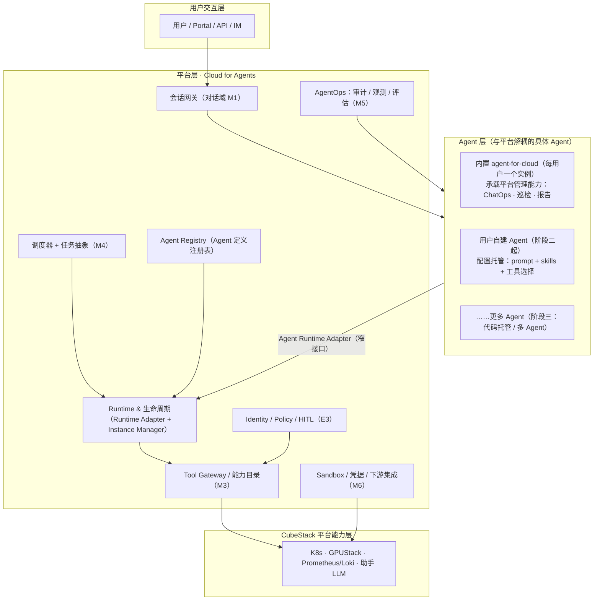
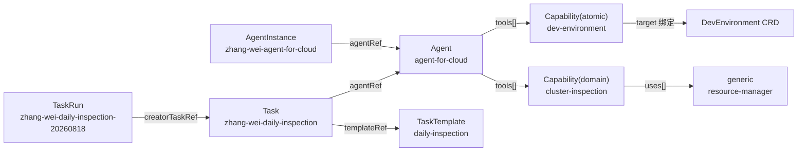
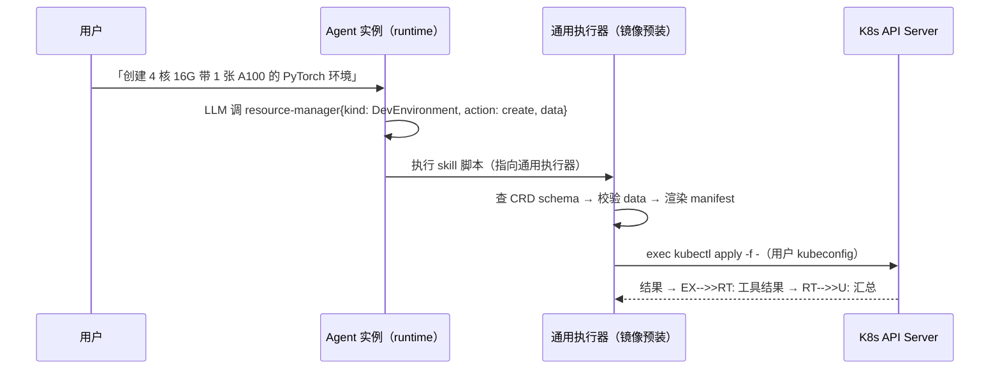

# CubePilot · Agent 云平台设计（Cloud for Agents × Agents for Cloud）

**文档状态：** Draft（新框架稿，待评审）
**适用范围：** CubeStack 智算云平台 · CubePilot 模块（第一阶段 MVP 及后续演进）
**产品名：** CubePilot（仓库 `cubepilot`）
**文档版本：** v0.1
**架构理念：** 平台能力 API 化，AI Agent 只做编排与决策，不直接操作底层资源

> **本文档定位**：总设计文档。将 CubePilot 重新定位为「**先具备 Cloud for Agents 平台能力，再为每个用户实例化一个 agent for cloud（内置平台管理 Agent）承载现有 CubePilot 平台管理能力，后续支持用户自建 Agent**」的两层架构。
>
> **与既有文档的关系**：
> - 《CubeStack-平台智能助手-CubePilot-模块设计文档.md》（v0.2）的 M1~M6 功能域、E1~E5 扩展点、CRD 与安全/部署设计在本文档框架下**重组归属，内容不推翻、仅重新分层**；本文档是 v0.2 的框架级演进候选稿。
> - 《CubeStack-平台智能助手-CubePilot-功能需求细化文档.md》（v0.5）仍是**需求唯一真源**，本文档与 `FR-M{域}-{序号}` / `NFR-{序号}` 对齐；涉及需求调整时同步更新需求文档。

---

# 1. 引言

## 1.1 背景与问题

CubeStack 战略正从「给 AI 提供算力」走向「给 Agent 提供云」：Cloud for Agents × Agents for Cloud → Agent-Native Cloud。CubePilot 原设计（v0.2）把平台智能助手按 M1~M6 六个功能域组织，核心形态是**每用户一个 OpenClaw 实例 Pod** 管理 CubeStack 平台。

原设计存在一个隐含假设：**「每用户一个 Agent」被硬编码在 Instance Manager 里（实例 key = user），没有把「Agent 是平台第一等对象」显式化**。这带来三个问题：

1. 用户看到的不是一个「Agent」，而是一个「助手实例」——无法自然延伸出「用户自建 Agent」；
2. Agent 的 Runtime / Tool / Memory / Identity / Policy / Ops 能力散落在各功能域里，没有收敛为**与具体 Agent 无关的平台层能力**；
3. 与战略方向（V3 Agent 云）缺少显式对应，后续演进需要重构而非复用。

**本框架的答案**：

```
第一步：CubePilot 首先拥有 Cloud for Agents 能力（平台层）
        为 Agent 提供 Runtime / Tool / Memory / Identity / Policy / Ops / Registry / Sandbox
第二步：为每个用户创建一个 agent for cloud（内置 Agent）
        承载现有设计「管理 CubeStack 平台」的能力（ChatOps + 定时巡检 + 报告）
第三步：后续用户基于同一平台层自建自己的 Agents
```

三件事是同一条演进线上的三个阶段，而不是三个产品。

## 1.2 设计理念

- **两层架构**：
  - **平台层（Cloud for Agents）**：与具体 Agent 无关的 Agent 基础设施——Runtime 生命周期、Tool Gateway、Memory、Identity/Policy、AgentOps、Agent Registry、Sandbox、调度器、平台集成。
  - **Agent 层**：具体 Agent 定义与实例。**内置 agent-for-cloud 是平台预置的第一个 Agent**（每用户一个实例）；用户自建 Agent 是后续扩展，与内置 Agent 共用同一平台层。
- **Agent 一等对象**：Agent（定义）、AgentInstance（实例）、AgentIdentity（身份）、AgentRegistry（注册表）成为平台 UI / API / 权限 / 生命周期 / 监控围绕的核心对象；Agent 不再只是「助手功能」，而是可注册、可实例化、有身份、可治理的对象。
- **平台能力 API 化，AI Agent 只做编排与决策**（沿用 v0.2 架构理念）。
- **数据真源归实例数据目录**（沿用「平台零持有 agent 私有数据」已确认决策）：消息历史 / 执行上下文 / 记忆 / skill 与配置的唯一真源 = 各实例数据目录（PVC），平台不落副本。
- **模板 ≠ 实例 ≠ 执行**（沿用 v0.2 决策）：Agent 定义（模板）≠ AgentInstance（实例）≠ TaskRun（执行）；任务侧沿用 TaskTemplate / Task / TaskRun。

## 1.3 术语表

| 术语 | 说明 |
|---|---|
| Cloud for Agents | 为 Agent 提供运行基础设施、工具、发布、治理、弹性保障的平台能力层（本文档「平台层」） |
| Agent for Cloud | 使用和管理云的 Agent。**内置 agent-for-cloud** = 管理 CubeStack 平台的助手，是本文档框架下的第一个 Agent |
| Agent（定义） | Agent 的声明式定义：模型、指令、工具集（能力目录子集）、记忆、身份与策略、可见性；注册于 Agent Registry |
| AgentInstance（实例） | Agent 定义的运行实例：每实例一 Pod + 独立数据目录 + 独立身份；实例 key = `user + agent` |
| AgentIdentity（身份） | Agent 实例的独立身份，派生自创建者/授权者，映射下游 RBAC / 凭据 |
| AgentRegistry（注册表） | Agent 定义的发布 / 版本 / 可见性 / 审核管理；区别于能力（generic 自动 + Capability 薄覆盖 / domain） |
| Capability（能力目录） | 平台能力（CRD）登记为 Agent 可发现的能力清单（沿用 FR-M3-006） |
| MCP Gateway | 聚合多个 MCP Server 的统一入口，集中做鉴权 / 路由 / 策略 / HITL（沿用 v0.2 §4.2 路径 B） |
| TaskTemplate / Task / TaskRun | 沿用 v0.2 定义：模板（做什么）≠ 任务实例（谁的任务、何时跑）≠ 执行报告（平台写入） |
| HITL | Human-in-the-loop，写/高风险操作由操作人本人确认后执行（沿用 FR-M3-003） |
| Model fallback | 主模型失败 / 超时 / 限流时按 `spec.model` 数组顺序切换备用模型的运行时能力（`model[0]` 为主模型，`model[1:]` 为 fallback；视 runtime 是否支持，如 OpenClaw / Hermes） |

## 1.4 范围与阶段

| 阶段 | 主题 | 交付内容 |
|---|---|---|
| **一 · 首批必须** | 平台层最小闭环 + 内置 agent-for-cloud | 平台层：Runtime 生命周期（Instance Manager）、会话网关、能力目录、凭据/下游、调度器；Agent 层：**内置 agent-for-cloud 每用户实例**，承载 v0.2 阶段一全部内容（对话闭环、平台资源操作、定时巡检、报告） |
| **二 · 次批** | Agent 一等对象落地 + 用户自建 Agent（配置托管） | Agent / AgentInstance / AgentIdentity CRD、Agent Registry（审核发布）、工具层 Policy/HITL（Gateway 统一）、用户自建 Agent（模板化 + 配额 + 配置托管）、Agent 级 AgentOps |
| **三 · 后续** | 平台化与智能演进 | 代码托管（container 形态自定义 Agent）、Agent Evaluation、多 Agent、向 Agent-Native Cloud 过渡 |

> 阶段划分与需求文档 §5.1 对齐：阶段一/二/三 分别承接平台「推理平台 MVP → 微调平台 → 通用训练平台」三阶段。

---

# 2. 总体架构

## 2.1 两层架构



**关键交互**：

- 用户消息经会话网关进入**指定 Agent 的实例**（默认内置 agent-for-cloud）；Agent 编排循环（规划 → 工具调用 → 汇总）在实例内完成，工具调用经平台层 Tool Gateway / 能力目录以**用户身份 + Agent 身份**执行。
- 平台层所有组件**与具体 Agent 无关**：换 Agent（自建/替换）只新增 Agent 定义与实例，平台层不重写。

## 2.2 与既有 M1~M6 功能域的映射

v0.2 的六个功能域在本文档框架下重新归属——**内容不变，归属上移为平台层能力，内置 agent-for-cloud 是它们的首个消费者**：

| 既有功能域 | 新归属 | 说明 |
|---|---|---|
| M1 对话域 | 平台层 · 会话网关 | 会话/消息/SSE/上下文组装是平台能力，任何 Agent 可复用；内置 agent 是首个消费者 |
| M2 Agent 域 | **拆分**：平台层（Runtime Adapter + 实例生命周期）+ Agent 层（Agent 定义/配置） | 实例管理上移到平台层；「配置管理」（模型/工具开关/提示词）落到 Agent 定义与实例配置 |
| M3 工具域 | 平台层 · Tool Gateway + 能力目录 | 与具体 Agent 无关；能力目录按 Agent 定义加载可见子集 |
| M4 定时 AI 任务域 | 平台层 · 调度器 + 任务抽象 | 任何 Agent 可被调度；Task 增加 `agentRef` 后，巡检显式绑定内置 agent |
| M5 审计域 | 平台层 · AgentOps | 溯源/台账/归档按 **Agent 粒度** 记录（v0.2 为按用户粒度） |
| M6 平台集成 | 平台层 · 凭据 / 下游 / Sandbox | 沿用；凭据按 Agent 身份最小化派生 |

## 2.3 组件清单

| 组件 | 选型 / 形态 | 归属层 | 职责 | 关键交互 |
|---|---|---|---|---|
| Portal 前端 | Web 静态资源 | 交互层 | 对话页 / 任务报告 / 审计查询 / **Agent 管理（列表、创建、配置）** | → 会话网关、Agent Registry |
| 会话网关（助手服务） | 无状态 Deployment ×2 | 平台层 | 会话/消息/上下文组装、Agent 路由、SSE | → Agent 实例、Instance Manager、PG/Redis |
| Instance Manager | 控制器化（`AgentInstance` CRD + controller-runtime，§13 备选落地） | 平台层 | Agent 实例拉起/自愈/回收/预热池、数据目录 GC | → K8s API（拉起 Agent Pod） |
| Agent 实例池 | OpenClaw Pod 0~N（每用户每 Agent 单例） | Agent 层 | 编排循环（规划 → 工具调用 → 汇总） | → 助手 LLM、Tool Gateway、数据目录 |
| Agent Registry | 服务 + `Agent` CRD | 平台层 | Agent 定义发布/版本/可见性/审核 | → 会话网关、Instance Manager |
| 调度器 | 单副本起步（控制器化后多副本） | 平台层 | 读 Task/TaskTemplate CRD，到点拉起 Agent 实例注入任务，平台身份回写 TaskRun | → Instance Manager、Agent 实例 |
| Tool Gateway | 阶段一：kubectl 直连；阶段二：MCP Gateway | 平台层 | 工具路由 / 鉴权 / 策略 / HITL | → 平台能力层 |
| 助手 LLM | InferenceService 1~N | 平台层 | 模型无关推理（FR-M6-003）：平台内置推理池 + 平台外自定义端点；凭据平台托管 | ← Agent 实例 |
| 存储 | PostgreSQL + Redis + 每 Agent 独立 PVC | 平台层 | 平台自产数据 + 实例数据目录 | ← 会话网关、Agent 实例 |

> **Leader Election 边界**（沿用 v0.2 §3.3）：多副本 Leader Election 仅适用于控制面组件（Instance Manager、调度器）；Agent 实例是**每用户每 Agent 有状态单例**（单副本、单写者），不做副本复制，可靠性由 K8s 自愈 + 数据目录持久承接。

---

# 3. 核心对象与数据模型

## 3.0 Agent 与 AgentInstance：定义 vs 实例（先读）

**一句话**：`Agent` 是「类」（这个 Agent **是什么、需要什么能力**）；`AgentInstance` 是「对象」（这个 Agent **现在为谁、以什么身份、用什么资源在跑**）。与任务域 `TaskTemplate / Task` 的拆分完全同构：**模板 ≠ 实例**（§4.5 沿用）。

**判断规则（只看一条）**：配置放哪边，取决于它是否**因用户 / 身份 / 运行环境而异**——

- 放 `Agent`（定义）：**所有实例共享、可复用、可版本化、与具体用户无关**；
- 放 `AgentInstance`（实例）：**因用户 / 身份 / 环境而异，或属于运行态**。

| 配置 | Agent | AgentInstance | 说明 |
|---|---|---|---|
| displayName / description / runtime | ✓ | | 定义级元数据与运行时选型 |
| model[]（provider + name + fallback 顺序） | ✓（唯一一份 = 模型 allowlist） | 可「选」（modelRef） | **model 只定义在 Agent**；实例在 allowlist 内切换（默认 model[0]），不重复定义；切到 allowlist 外需改定义发布新版本 |
| model[].endpoint / apiKeyRef | 默认凭据引用（共享） | 个人凭据覆盖 | **key 是凭据、不属于 model**：定义放共享默认引用，实例 credentials[] 放个人覆盖；实例化时按 实例 > 定义 > 平台默认 解析注入（§4.4） |
| instructions（默认系统提示词） | ✓ | 可覆盖 | 定义给默认；实例可用户定制（受能力边界约束） |
| tools[]（能力目录声明） | ✓ | 可开关 | 定义声明能力边界；实例可开关可见子集（FR-M2-005） |
| memory.enabled | ✓ | | 能力声明 |
| identity.mode / scope | ✓（声明） | | 定义声明「以什么身份模式运行、需要什么权限范围」 |
| identity.principalRef（userRef / serviceRef） | | ✓ | 绑定具体用户 / 服务身份 |
| credentials[]（target / type / ref） | | ✓ | 实际凭据引用，因 owner / 环境而异（§4.4） |
| dataVolume / PVC / 资源限额 | 默认 | ✓ 实际 | 定义给默认资源档；实例落实际 PVC 与限额 |
| lifecycle（常驻 / 按需 / idleTTL） | 默认 | ✓ 实际 | 定义给默认策略；实例可覆盖（配额约束内） |
| owner | | ✓ | 实例归属用户 |
| registry（builtin / visibility / 版本 / 配额） | ✓ | | 发布与配额元数据 |
| status（phase / podName） | | ✓ | 运行态，由 Instance Manager 控制器写入 |

**model 与 key 分开理解**：`model[]` 是「用什么模型」（定义级，实例只能选不能定义）；`apiKeyRef` 只是「该模型默认用哪个凭据」的**引用（不是凭据本身）**——共享默认引用放定义，个人覆盖放实例，最终 key 在实例化时解析并注入实例运行时配置，定义与实例都不落明文。

**模型切换规则**：

| 问题 | 答案 |
|---|---|
| AgentInstance 能切换模型吗？ | **能**——改 `modelRef`（在 Agent 定义 `model[]` allowlist 内选择，默认 `model[0]`），持久化、即时生效（FR-M2-005） |
| 能切到定义外的模型吗？ | **不能直接切**——`model[]` 是能力边界；需更新 Agent 定义（发布新版本，Registry §4.6）或由平台扩展 allowlist |
| 使用 agent 的用户能切换吗？ | **能**——owner 通过 Portal「Agent 管理」配置实例 `modelRef`（内置 agent 的用户即 owner）；非 owner 需 owner / 管理员授权 |
| 动态按会话 / 用户切换？ | 阶段三多模型路由（FR-M2-010）：运行时按会话 / 用户路由，不改配置（与上面的静态配置切换互补） |

**覆盖规则**：`AgentInstance` 可覆盖 `Agent` 定义中**允许定制**的字段（instructions / tools 开关 / **model 选择（modelRef）** / 个人凭据 / lifecycle），但覆盖不得超出定义声明的能力边界（`tools ⊆` 定义声明集）、**身份模式不可改**（mode 与定义一致）、并受平台配额约束。

**版本规则**：`Agent` 定义变更 = 发布新版本（Registry 版本化，§4.6）；存量实例按发布策略升级或保持。`AgentInstance` 的运行态字段（phase / podName）由控制器维护，用户不直接改。

## 3.1 Agent（定义）——平台第一等对象

```yaml
apiVersion: assistant.suanova.io/v1alpha1
kind: Agent
metadata:
  name: agent-for-cloud          # 内置 Agent；用户自建为自定义名
spec:
  displayName: 平台管理助手
  description: 管理 CubeStack 平台的默认助手（ChatOps + 巡检 + 报告）
  runtime: openclaw              # openclaw | hermes | deepseek-harness | custom（E1 Adapter）
  model:                         # 模型接入：有序数组，模型无关（FR-M2-003），支持自定义大模型
    - provider: platform         # model[0] = primary（主模型）；provider: platform | external
      name: deepseek-v4-flash    # 模型名 / 端点模型名
      endpoint: ""               # provider=external 时必填：OpenAI 兼容端点（公司已有/公网）
      apiKeyRef: ""              # external 必填：平台托管凭据 Secret 引用（实例启动时注入）
    - provider: external         # model[1:] = fallback 链（运行时支持时生效；只有一项则无 fallback）
      name: deepseek-chat
      endpoint: https://api.example.com/v1
      apiKeyRef: cubepilot/cred-llm-org-gateway   # 定义级「默认凭据引用」：组织共享 key（所有实例共用）
                                                  # 留空 → 实例 credentials[] 提供个人 key（覆盖，§4.4）
  instructions: |                # 系统提示词（真源 = 实例数据目录，此处为定义级默认）
    ...
  tools:                         # 能力引用（Capability refs：atomic + domain 统一，阶段一起）
    - kubectl-platform            # atomic：原子读操作
    - inference-service           # atomic：推理服务操作
    - cluster-inspection          # domain：集群智能巡检（领域知识）
  memory: { enabled: true }
  identity:                      # 身份模式（§4.4）
    mode: user                   # user = 以用户身份执行；service = 独立服务身份
    scope: { level: project-write }
  policyRefs: [default-confirm-rules]   # 确认规则引用（E3）
  registry:
    builtin: true                # 内置 Agent：平台预置、不可删除、每用户自动实例化
    visibility: system           # system | platform-reviewed | public
  quotas: { maxInstancesPerUser: 1 }
```

**关键点**：

- **内置 agent-for-cloud 是平台预置的第一个 `Agent` 定义**（`builtin: true`）：每用户自动实例化一个，不可删除，可被用户配置（模型/工具开关/提示词，FR-M2-005）。
- **模型接入（模型无关，FR-M2-003 / FR-M6-003）**：`spec.model` 为**有序模型数组**，同时是该 Agent 的**模型 allowlist**——`model[0]` 为主模型（primary），`model[1:]` 为降级模型链（fallback）；**只有一项时即仅主模型、无 fallback**；实例在 allowlist 内切换（`modelRef`），切到 allowlist 外需改定义发布新版本；运行期按会话 / 用户路由属 FR-M2-010（阶段三）。每项支持平台内置推理池（`provider: platform`，默认 DeepSeek V4 Flash 同级）或**平台外自定义大模型端点**（`provider: external`，OpenAI 兼容，含公司已有/公网推理服务）；端点凭据支持**两层**：定义级**共享凭据**（组织统一模型网关，所有实例共用同一 key，`apiKeyRef` 引用平台共享 Secret）与实例级**个人凭据**（用户自带 key，`credentials[]` 覆盖共享凭据），解析优先级**实例级 > 定义级 > 平台默认**（§4.4）；凭据一律平台托管，**Agent 定义不落明文密钥**。
- **Model fallback（视运行时能力）**：运行时在主模型**失败 / 超时 / 限流**时按数组顺序依次切换后续模型；是否生效取决于 runtime 是否原生支持（OpenClaw / Hermes 支持，DeepSeek-Harness 待验证，§10）；模型切换作为 trajectory 观测数据记录（可选增强事件，不新增必选事件），供 AgentOps 观测「实际用了哪个模型」。
- Agent 定义与实例分离：定义是「做什么、用什么工具、什么身份、什么模型」，实例是「谁的、跑在哪、状态如何」。
- **AgentRegistry 与能力目录的区别**：Registry 管「Agent 定义」（谁能创建什么 Agent）；Capability CRD 管「平台能力」（Agent 能用什么工具）。阶段一 Registry 简化为内置 Agent 列表；阶段二开放用户创建/审核发布。

## 3.2 AgentInstance（实例）

| 维度 | 设计 |
|---|---|
| 实例 key | `agentKey = user + agent`（每用户每 Agent 单实例、单写者）——从 v0.2 的 `user` 泛化，为 1:N（一个用户多个 Agent）预留 |
| spec | `agentRef` + `owner`(user) + `identity`（主体：mode + principalRef）+ `credentials[]`（类型化下游凭据）+ 数据目录 PVC |
| status | Creating / Warm / Idle / Reclaiming / Failed（沿用 v0.2 生命周期状态图） |
| 生命周期 | Instance Manager（控制器）reconcile：拉起、自愈、闲置回收（可配置）、预热池 |
| 数据目录 | 每实例独立 PVC（默认 1 GB，水位 >70% 触发清理/告警，FR-M6-004）；真源归属数据目录 |

**示例（用户 zhang.wei 的内置 agent 实例）**：

```yaml
apiVersion: assistant.suanova.io/v1alpha1
kind: AgentInstance
metadata:
  name: zhang-wei-agent-for-cloud      # 实例名 = <user>-<agent>，由平台控制器生成
spec:
  agentRef: agent-for-cloud            # → Agent 定义（§3.1 示例）
  owner: zhang.wei                     # 实例归属用户
  identity:                            # 平台侧「我是谁」：单一语义，不按下游区分
    mode: user                         # user（以用户身份执行）| service（独立服务身份，阶段二）
    principalRef:
      userRef: zhang.wei               # mode=user：绑定用户
      serviceRef: ""                   # mode=service：绑定服务身份（阶段二）
  credentials:                         # 「我怎么认证到下游」：类型化凭据列表，可多个并存
    - target: k8s                      # 目标下游：k8s | gputack | prometheus | harbor | llm | itsm | ...
      type: kubeconfig                 # 凭据类型：kubeconfig | api-key | oauth2 | bearer-token | basic-auth | x509 | ...
      ref: cubepilot/cred-k8s-zhang-wei         # → Secret：最小权限、0600、轮换/吊销
    - target: llm                      # 平台外模型端点
      type: api-key
      modelRef: deepseek-chat          # 绑定：给 Agent 定义 model[] 中 name=deepseek-chat 的条目（§4.4）
                                       # 或改 endpoint: https://... 按端点绑定（同网关多模型共用一把 key）
      ref: cubepilot/cred-llm-external # 个人 key：覆盖该模型条目的定义级默认（§4.4）
  # modelRef: model[1]                 # 可选：切换模型（在 Agent 定义 model[] allowlist 内选择，默认 model[0]）；仅选择、不定义
  dataVolume:
    pvc: pvc-zhang-wei-agent-for-cloud # 每实例独立 PVC（真源 = 数据目录）
    size: 1Gi
  lifecycle:
    strategy: resident                 # resident（常驻，阶段一内置 agent）| on-demand（阶段二）
    idleTTL: 0                         # 常驻不回收
status:
  phase: Warm                          # Creating / Warm / Idle / Reclaiming / Failed
  podName: agent-zhang-wei-agent-for-cloud
```

**与 v0.2 的差异**：Pod 名从 `agent-<user>` 变为 `agent-<user>-<agent>`（或 CR 名）；`active` 映射从 `user -> lastActivity` 变为 `agentKey -> lastActivity`。内置 agent 阶段一常驻（FR-M2-002 决策），用户自建 Agent 阶段二起按配额 + 按需启停。

## 3.3 Capability / TaskTemplate / Task / TaskRun（沿用并微调）

| 对象 | v0.2 定义 | 本文档调整 |
|---|---|---|
| `Capability` | 能力目录：用途/参数/示例/toolRef（§7.2） | 重构为三层：generic 自动（非 CRD）；atomic 薄覆盖（override + target + semantics / security，不碰字段）；domain（uses[] + instructions） |
| `TaskTemplate` | 任务模板：参数化指令 + 参数 Schema + 权限提示 + 默认触发（§4.5） | 不变 |
| `Task` | 任务实例：templateRef/instruction + creator + trigger + cron（§4.5） | 增加 `spec.agentRef`（执行 Agent，默认 `agent-for-cloud`） |
| `TaskRun` | 执行报告：调度器以平台身份写入（§4.5/§7.2） | 不变（平台身份写入，用户凭据无需 CRD 写权限） |

### 3.3.1 能力与示例（三层：平台 generic / atomic 薄覆盖 / domain）

**能力来源分三层，模块负担递减**：

| 层 | 是什么 | 谁提供 | 需要模块登记吗 |
|---|---|---|---|
| **generic 层** | 动态发现工具（list-kinds / describe-kind / resource-manager 通用 CRUD）+ 逃生门（kubectl-raw） | 平台自带，启动即用 | **不需要** |
| **atomic 薄覆盖** | 绑定某个 CRD，只补语义 / 安全（不碰字段） | 模块可选（几行） | 可选 |
| **domain** | 领域知识（uses[] 编排 + 提示词 + 脚本） | 模块必须 | 需要 |

**generic 层（平台自带，零登记）——runtime 动态查集群 CRD 定义**：

```text
list-kinds       列出用户可见的 CRD（group / kind / 描述）
describe-kind    取某 CRD 的字段 schema（给 LLM 看，补填参精度）
resource-manager 通用 CRUD：{kind, action, data}
                 → 内部查该 CRD schema → 校验 data → 渲染 → exec kubectl
kubectl-raw      逃生门（默认关闭）：自由命令串，策略白名单兜底
```

**atomic 薄覆盖示例（绑定 CRD，不碰字段）**：

```yaml
apiVersion: assistant.suanova.io/v1alpha1
kind: Capability
metadata:
  name: dev-environment
spec:
  type: atomic
  override: true                    # 覆盖层：不是全新定义
  target:                           # 绑定哪个 CRD（登记时平台校验存在 + schema）
    group: dev.suanova.io
    version: v1alpha1
    kind: DevEnvironment
  semantics:                        # 只碰语义（不碰字段）
    title: 开发环境管理
    description: 按自然语言描述创建 / 查询 / 删除开发环境（PyTorch / Jupyter 等镜像，可按需配 GPU）
    examples:
      - "创建一个 4 核 16G 带 1 张 A100 的 PyTorch 开发环境"
      - "看看 data-team 项目下有哪些开发环境"
  security:                         # 只碰安全
    denyOperations: [delete]        # 禁用 delete（即使 CRD 存在）
    confirmWrites: true             # 写操作强制 HITL（默认已如此）
```

> **不碰字段**：文件里没有 `params` / `mapping` / `bindings`——`parameters` 由平台从 CRD OpenAPI schema 自动生成并注入，执行走通用执行器（kubectl 优先）；`target` 指向的 CRD 不存在 / 无 schema → 登记校验 fail-fast。

**domain 示例（领域知识，uses 编排 generic / atomic / MCP）**：

```yaml
apiVersion: assistant.suanova.io/v1alpha1
kind: Capability
metadata:
  name: train-diagnosis
spec:
  type: domain
  title: 训练失败诊断
  description: 按「查日志 → 查 GPU → 查指标 → 归因」诊断训练失败
  ownerModule: training
  agents: []
  uses:                             # 编排 generic / atomic / MCP
    - resource-manager              # 通用 CRUD（查 TrainingJob / Pod）
    - kubectl-raw                   # 逃生门（查日志，若开启）
  instructions: |                   # 领域指令内联（默认；大内容可选 contentRef）
    # 1. 用 resource-manager 查任务与 Pod 状态
    # 2. 用 kubectl-raw / resource-manager 查日志与指标
    # 3. 归因：OOM / 数据问题 / 资源不足…
  # files:                          # 可选：小脚本内联
  #   - name: log_analyzer.py
  #     content: |...
  # contentRef:                     # 大内容 / 二进制 / 复用时可选
  #   configMap: cubepilot/skill-train-diagnosis
```

**字段说明**：

| 字段 | 含义 | 谁消费 |
|---|---|---|
| `spec.type` | `atomic`（绑定 CRD 的薄覆盖）/ `domain`（领域知识） | 平台（编译方式）+ 审核 |
| `spec.override` / `spec.target` | atomic：标记覆盖层 + 绑定 CRD（group / version / kind），登记时平台校验存在 + schema | 平台（校验 + 合并） |
| `spec.semantics` | atomic：title / description / examples——只改 LLM 看到的语义（何时用 / 用户话怎么映射） | LLM |
| `spec.security` | atomic：denyOperations / confirmWrites / level——只改安全 | 策略引擎 |
| `spec.uses[]` | domain：编排哪些能力（generic / atomic / MCP） | Adapter + LLM |
| `spec.instructions` / `files` / `contentRef` | domain：领域内容（内联默认 / 大内容外部） | Adapter + runtime |
| `spec.agents[]` | 可见性：允许哪些 Agent 用（为空 = 全部可见） | 平台 |

**加载策略（解决工具爆炸，三层分片）**：

```text
① group 分片：Agent 声明 groups + RBAC 过滤，上下文只放需要的模块
② 操作分片：读（get / list）常驻；写（create / delete / update）按需加载 + 默认 L1 / HITL
③ 发现兜底：常驻 list-kinds / describe-kind / resource-manager，长尾 CRD 动态发现即用
```

> **工具集变更治理**：generic 工具由平台启动时读全部 CRD schema 自动生成；CRD 增删改 → 工具集自动变，AgentOps 记录「哪个 agent 用了哪些工具、来自哪些 CRD、何时变」，防止 Agent 行为意外漂移。

### 3.3.2 TaskTemplate 示例（预置巡检模板）

```yaml
apiVersion: assistant.suanova.io/v1alpha1
kind: TaskTemplate
metadata:
  name: daily-inspection
spec:
  displayName: 每日集群巡检
  description: 预置巡检：节点 / GPU / Pod / 存储 / 平台组件 + AI 智能巡检
  instruction: |
    以只读方式巡检集群（get/list/watch/logs）：
    1. 检查节点 Ready 与压力（Disk / Mem / PID）
    2. 检查 GPU 健康与利用率（nvidia.com/gpu）
    3. 检查异常 Pod（CrashLoopBackOff / Pending / ImagePullBackOff / OOM）
    4. 检查存储（PVC 使用率）
    5. 检查平台组件健康（GPUStack / Harbor / Keycloak / Prometheus）
    发现异常附证据链，按 P0/P1/P2 分级；禁止任何写操作。
  paramsSchema:
    - name: scope
      type: string
      default: all
      enum: [all, node-pool, project]
  requiredPermissions:
    level: cluster-read
    note: 全集群巡检需创建者具备集群级只读权限
  defaults:
    trigger: cron
    cron: "0 2 * * *"                # 默认每日 02:00
```

### 3.3.3 Task 示例（用户的任务实例）

```yaml
apiVersion: assistant.suanova.io/v1alpha1
kind: Task
metadata:
  name: zhang-wei-daily-inspection
spec:
  templateRef: daily-inspection      # → TaskTemplate（§3.3.2 示例）
  params:
    scope: all                       # 覆盖模板参数默认值
  agentRef: agent-for-cloud          # → Agent（§3.1 示例）：由哪个 Agent 执行（默认内置）
  creator: zhang.wei                 # 执行身份 = 创建者（RBAC 与创建者一致）
  trigger: cron
  cron: "0 2 * * *"
status:
  phase: Ready                       # Ready / Paused / ...
  lastRunTime: "2026-08-18T02:00:00Z"
  nextTaskRunName: zhang-wei-daily-inspection-20260818
```

### 3.3.4 TaskRun 示例（执行报告，平台身份写入）

```yaml
apiVersion: assistant.suanova.io/v1alpha1
kind: TaskRun
metadata:
  name: zhang-wei-daily-inspection-20260818
spec:
  type: inspection                   # inspection / verification / ...
  scope: all
  creatorTaskRef:                    # → Task（§3.3.3 示例）
    name: zhang-wei-daily-inspection
    uid: 3f2a1c0e-9b4d-4f6e-8a5c-1e2d3f4a5b6c
status:
  phase: Completed                   # Pending / Running / Completed / Failed / Cancelled
  summary:
    total: 6
    abnormal: 1
    p0: 0
    p1: 1
    p2: 0
  items:
    - category: pod
      level: P1
      finding: "inference-llm-7b-5f8c9 pod CrashLoopBackOff"
      evidence:
        - command: kubectl get pods -A
          output: "..."
          ts: "2026-08-18T02:00:11Z"
  conditions:
    - type: Inspected
      status: "True"
```

> `TaskRun` 由**调度器以平台身份**创建并写入，Agent 实例与用户凭据不直接写 CRD（凭据最小化，沿用 v0.2 §4.5）。

## 3.4 存储策略

沿用 v0.2 §7「平台零持有 agent 私有数据」：

- **agent 私有数据**（会话 / 消息 / 轨迹 / 记忆 / skill 与配置）：任何阶段不建表、不落 DB，唯一真源 = 实例数据目录（经 runtime 会话接口读取，冷时先冷启动）。
- **平台自产数据**（Agent 定义、AgentInstance、Registry 元数据、TaskTemplate/Task/TaskRun、Capability（`type: atomic | domain`）、确认台账、多租户元数据）：CRD（`assistant.suanova.io/v1alpha1`）+ PostgreSQL + Redis。
- **换运行时 = 丢或迁**（沿用 §4.1）：agent 私有数据接受丢弃，或以旧 PVC 为原料写一次性迁移工具。

## 3.5 示例串联（贯穿示例：内置 agent-for-cloud + 每日巡检）

上文各 CRD 示例同属一个贯穿场景，通过字段引用真实关联：



| CRD | 示例名 | 关键引用字段 | 指向 |
|---|---|---|---|
| `Capability`(atomic) | `dev-environment` | `override` + `target` → DevEnvironment CRD（schema 驱动）；被 `Agent.tools[]` 引用 | → CRD |
| `Capability`(domain) | `cluster-inspection` | `uses[]` → generic / atomic / MCP；`instructions`；被 `Agent.tools[]` 引用 | → `resource-manager` |
| generic 工具 | `resource-manager` / `list-kinds` / `describe-kind` / `kubectl-raw` | 平台自带（非 CRD）；动态查 CRD schema | → 平台 CRD |
| `Agent` | `agent-for-cloud` | `tools[]` → Capability（atomic + domain）；generic 工具默认可用 | → `dev-environment` / `cluster-inspection` |
| `AgentInstance` | `zhang-wei-agent-for-cloud` | `agentRef` → Agent；`identity.principalRef` → 用户；`credentials[].ref` → Secret | → `agent-for-cloud` |
| `TaskTemplate` | `daily-inspection` | 被 `Task.templateRef` 引用 | — |
| `Task` | `zhang-wei-daily-inspection` | `templateRef` → TaskTemplate；`agentRef` → Agent；`creator` → 用户 | → `daily-inspection` / `agent-for-cloud` |
| `TaskRun` | `zhang-wei-daily-inspection-20260818` | `creatorTaskRef` → Task | → `zhang-wei-daily-inspection` |

**引用关系要点**：

- **generic 工具默认可用**（平台自带，不进 `tools[]`）；`Agent.tools[]` 只引用 Capability——atomic 薄覆盖（绑定 CRD，`target` 校验）与 domain（领域知识）。`Capability.agents[]` 与 RBAC 共同决定可见子集。
- `AgentInstance` 是 `Agent` 的**每用户实例化**：`agentRef` 指向定义，`owner` 决定身份派生；同一 Agent 定义可被多个用户实例化（`zhang-wei-agent-for-cloud`、`li-ming-agent-for-cloud`…）。
- `Task` 同时关联「执行主体」（`agentRef` → Agent）与「任务内容」（`templateRef` → TaskTemplate），`creator` 决定执行身份；`TaskRun` 由调度器以平台身份按 `creatorTaskRef` 回写，形成 模板 → 任务 → 执行报告 的完整闭环。

---

# 4. 平台层设计（Cloud for Agents）

> 本章是本文档的重点：**平台层与具体 Agent 无关**，是「用户自建 Agent」成立的前提。每项沿用 v0.2 扩展点（E1~E5），仅调整归属与粒度。

## 4.1 Runtime & 生命周期（E1 上移）

**Agent Runtime Adapter（窄接口，沿用 v0.2 §4.1）**：

| 方向 | 内容 |
|---|---|
| **进入** | 新消息 + 会话引用（每次请求动态）；Agent 定义（身份 / 能力目录子集 / 确认规则 + 工具清单）启动时加载 |
| **返回** | 事件流（`message_start / agent_thinking / tool_call / tool_result / confirm_pending / confirm_resolved / message_delta / message_done`，可降级为最少 4 类） |

- 契约层（平台拥有，与运行时无关）：Agent 定义、能力目录、任务域资产、知识注入源（RAG，阶段二起）。
- 实例层（运行时拥有）：执行态、原生 session、私有 memory、实例配置（数据目录）。
- **Instance Manager 控制器化**：落地为 K8s Operator（`AgentInstance` CRD + controller-runtime，v0.2 §13 备选），`spec.runtime` 区分 OpenClaw / Hermes / DeepSeek-Harness / custom；常驻与回收策略由 CR spec 声明。职责：安装 / 启动 / 停止 / 自愈 / 闲置回收 / 数据目录 GC / 预热池。
- **模型接入与 fallback（运行时级）**：`spec.model`（有序数组，`model[0]` primary、`model[1:]` fallback）作为实例级配置注入运行时（provider 配置，真源 = 数据目录），由 runtime 网关负责模型路由与降级切换；平台只负责**凭据托管与配置下发**，不代理模型请求（external 端点出网由 NetworkPolicy egress 白名单管控，§8）。
- 实例池模型：内置 agent 阶段一常驻（注册即拉起）；用户自建 Agent 按配额 + 按需启停（阶段二）。实例数上限受 Infra 容量约束（NFR-015 扩展：每用户配额 + 全平台上限）。

## 4.2 能力层：三层能力（generic / atomic / domain）+ 执行

> 回答三个问题：能力从哪来（三层）、工具怎么执行（通用执行器）、模块要做什么（极少）。

### 4.2.1 能力来源与分层

| 层 | 形态 | 需要模块做什么 |
|---|---|---|
| **generic** | 平台自带：list-kinds / describe-kind / resource-manager（通用 CRUD，动态查 schema）/ kubectl-raw（逃生门） | **零登记** |
| **atomic 薄覆盖** | Capability（`type: atomic` + `override` + `target` + `semantics` / `security`） | 可选：只补语义 / 安全，几行 |
| **domain** | Capability（`type: domain` + `uses[]` + `instructions` / 脚本） | 必须：领域知识 |

**generic 层就是「runtime 自动懂平台」的落地点**：平台启动读全部 CRD schema 缓存；运行时 LLM 调 `resource-manager{kind, action, data}` → 平台查该 CRD schema → 校验 data → 渲染 → exec kubectl。**不需要为每个 CRD 预登记工具**；长尾 CRD 用 `list-kinds` / `describe-kind` 动态发现即用。

**atomic 薄覆盖为什么存在**：CRD schema 只有字段，没有「何时用、用户话怎么映射」；薄覆盖只补 `semantics`（description / examples）与 `security`（deny / confirm），**不碰字段**——`parameters` 永远来自 CRD schema + 平台注入；`target` 绑定校验保证「背后必有 schema」。

**引用方向**：

```text
Agent.tools[] → Capability(atomic)      # 薄覆盖（绑定 CRD）
Agent.tools[] → Capability(domain)      # 领域知识
Capability(domain).uses[] → generic 工具 | atomic | MCP   # 领域编排
generic 工具（resource-manager 等）→ CRD schema（动态查询）
MCP 工具（外部系统）→ 独立接入（E2 路径 B，非 Capability）
```

### 4.2.2 执行：通用执行器 + 数据驱动渲染

**执行器 = 镜像预装的 3 样通用件**（所有工具共用，零自定义代码注入）：

| 预装件 | 作用 |
|---|---|
| OpenClaw 原生 exec | 执行命令、返回输出（runtime 自带） |
| kubectl 二进制 | 被 exec 调用 |
| `kubectl-run.sh`（一份） | 读工具定义（kind + data）+ 查 CRD schema → 渲染 manifest → exec kubectl |

**runtime 不需要知道「执行器」**：OpenClaw 只做两件原生事——加载 skill（注册工具）+ 执行 skill 脚本（脚本入口指向通用执行器）。工具只是数据。

**写操作怎么渲染 manifest**：三个输入全是数据——① CRD OpenAPI schema（K8s discovery 自动获取）② `data`（LLM 填的字段值）③ schema 校验（必填 / 类型 / 默认值）。执行器「读 schema 建骨架 → 填 data → 校验」：机械执行、零猜测；**CRD 变化 → 自动适配（schema 驱动），无手写字段可漂移**。

**阶段一数据流（实例内闭环，对话不回平台）**：



阶段二起：策略 / HITL / 凭据托管收敛到 Tool Gateway（MCP 路径），工具调用才经 `runtime → Gateway` 往返（E3 方案 B）。

**两条腿（结构化 vs 逃生门）**：

| | 结构化（默认） | `kubectl-raw`（逃生门，默认关闭） |
|---|---|---|
| 参数 | `resource-manager` 的 kind + data（schema 校验） | `command` 自由命令串 |
| 覆盖 | 任意 CRD 的 CRUD + 常见读 | 长尾（api-resources / explain / 子资源 / 组合 flags） |
| 安全 | schema 校验 + RBAC；写默认 L1 / HITL | 策略引擎：词法解析成 token → verb / flag 白名单 → argv 直 exec（无 shell 即无注入）→ 歧义 HITL fail-closed；RBAC 是最后一道 |

**确认模型**：`L0` 只读直放；`L1` 写 / 高风险——**generic 写操作默认 L1**，阶段一先放行 / 阶段二起 HITL（本人确认，拒绝 / 超时默认不执行 fail-closed，E3）。错误统一 `{success, data | error}`（`PERMISSION_DENIED` / `USER_DENIED` / `CONFIRM_TIMEOUT` / `RESOURCE_NOT_FOUND` / `RATE_LIMITED` / `UPSTREAM_ERROR`）。

**能用 kubectl 就用 kubectl**：执行通道 `kubectl`（默认，实例内 exec）> `kube-api`（备选，直连 K8s API Server，结构化写 / 无 kubectl 环境）> `mcp`（阶段二网关封装）。模块能力都是 CRD，最终都走 K8s API Server。

### 4.2.3 模块要做什么 + 何时写 Capability + 复合能力

**模块日常：什么都不做**（CRD 存在即能力，generic 工具自动可用）。四种情况才写东西：

| 情况 | 写什么 |
|---|---|
| 语义差 / 要引导（描述、示例、用户话映射） | atomic 薄覆盖 `semantics`（几行） |
| 要收紧安全（禁用操作、强制确认） | atomic 薄覆盖 `security`（一行） |
| 复合 / 领域逻辑（诊断、推荐、解读、多步） | domain（uses[] + instructions + 脚本） |
| 外部系统（GPUStack / Prometheus / ITSM） | MCP 工具（独立于 Capability） |

**判断规则**：这个能力是不是「对某个 CRD 的通用操作」？是 → 什么都不写 / 顶多薄覆盖；不是 → domain 或 MCP。

**复合能力（多步过程）**：

| 方式 | 机制 | 适用 |
|---|---|---|
| A. Agent 编排 | Agent 按序调用多个工具（resource-manager create → wait → verify） | 线性几步 |
| B. 任务抽象（TaskTemplate / Task） | 流程固化为模板指令，调度器驱动 + TaskRun 报告 / 重试 | 需重试 / 报告 / 定时 |
| C. domain Capability | SKILL.md + 脚本编排多个工具 | 逻辑复杂、领域专属 |

**用户视角**：终端用户只和 Agent 对话，看到「能力」；不接触 CRD / Capability / 执行器。

## 4.3 Memory

- **短期**：runtime 会话（数据目录）。
- **长期**：数据目录私有 memory（阶段一）；阶段二起抽象 **Memory Provider**（向量库等），仍以「平台零持有」为原则，或对显式声明的共享记忆（多 Agent 共享上下文）单独建模并说明例外。
- 内置 agent 与用户自建 Agent 的记忆默认互相隔离（每实例独立 PVC）。

## 4.4 Identity / Policy / HITL

**AgentIdentity（新，阶段二核心）——身份 ≠ 凭据**：

`identity` 回答「**我是谁**」（平台侧主体，单一语义、不按下游区分）；`credentials[]` 回答「**我如何认证到某个下游**」（类型化、可多个并存）。两者分离后，未来新增下游接入**不需要改动 Agent 身份模型**。

| 维度 | 设计 |
|---|---|
| `identity.mode` | `user`：以创建者/用户身份执行（内置 agent-for-cloud，阶段一）；`service`：独立服务身份，凭据由创建者授予的范围化 RoleBinding 派生（用户自建 Agent，阶段二起） |
| `identity.principalRef` | mode=user → `userRef`；mode=service → `serviceRef`（阶段二） |
| `credentials[].target` | 凭据目标下游：`k8s` / `gputack` / `prometheus` / `harbor` / `llm` / `itsm` / …（**按目标系统命名，而非客户端**——kubectl 是客户端，目标应为 `k8s`） |
| `credentials[].type` | 凭据类型：`kubeconfig` / `api-key` / `oauth2` / `bearer-token` / `basic-auth` / `x509` / … |
| `credentials[].ref` | → Secret（最小权限、0600、轮换/吊销、失效即时吊销）；Agent 定义不落明文 |
| `credentials[].modelRef` | 仅 `target: llm` 时用于**绑定到具体模型**：指向 Agent 定义 `model[]` 中某条目（按 `name`）；也可用 `endpoint` 按端点绑定（同一网关端点的多个模型共用一把 key）。缺省时仅当定义中**只有一个 external 模型**才允许隐式绑定；多个 external 模型必须显式绑定，否则校验拒绝（fail-closed） |

**示例（kubectl 只是 `k8s` 目标的一种凭据类型，不是身份）**：

```yaml
identity:
  mode: user
  principalRef: { userRef: zhang.wei }
credentials:
  - { target: k8s, type: kubeconfig, ref: cubepilot/cred-k8s-zhang-wei }
  - { target: llm, type: api-key,    ref: cubepilot/cred-llm-external }
```

**未来会有哪些 identity / 凭据？**：

- **身份（identity）不扩展**：平台侧主体只有 `user` / `service` 两种语义，不按下游拆分；
- **凭据（credentials）持续扩展**：GPUStack（api-key）、Prometheus/Loki（basic-auth / bearer-token）、Harbor（basic-auth）、Keycloak（oauth2 委托）、外部 LLM（api-key）、ITSM/工单（oauth2 client-credentials）、数据库（basic-auth）等——新增下游 = 新增 `target`/`type` 条目 + 对应 Secret，不改 Agent 结构（对齐 v0.2 §5.6 M6「阶段二接入 GPUStack/Prometheus/Loki 等非 K8s 数据源」）；
- **与 `spec.model[].apiKeyRef` 的关系（共享 vs 个人）**：external 模型端点凭据分两层——①**定义级共享凭据**：组织统一模型网关 / 平台统一外接端点时，API key 放 Agent 定义层（`apiKeyRef` 引用平台共享 Secret 或 `Credential` CRD），所有实例共用、用户无需各自配置；②**实例级个人凭据**：用户自带 key 时放 `credentials[]`（`target: llm` + `modelRef` / `endpoint` 绑定），覆盖定义级。解析优先级：**实例级 > 定义级 > 平台默认**；解析在**实例化时**完成，结果注入实例运行时配置（数据目录），运行期改动即时生效（FR-M2-005）；阶段二统一收敛到 `Credential` 机制（`scope: shared | instance`，§10）；
- **llm 凭据如何定位到模型**：定义层 `model[].apiKeyRef` 已**按模型条目逐一绑定**（无歧义）；实例层个人 key 必须通过 `modelRef`（指向定义 `model[]` 中某条目）或 `endpoint`（匹配 `model[].endpoint`）**显式绑定到具体模型**，覆盖该条目的定义默认——回答「这把 key 是给哪个模型的」；唯一 external 模型时可省略（隐式绑定），多个 external 模型时缺绑定按校验拒绝（fail-closed）。
- **Credential 建模（阶段二）**：引入平台级 `Credential` CRD（`scope: shared | instance`、`target`、`type`、`secretRef`、`owner`）——Agent 定义引用 `shared` 凭据，AgentInstance 引用 `instance` 凭据，统一授权 / 审计 / 轮换。**共享凭据安全约束**：仍平台托管、不落明文；共享 key 无法区分调用者 → 平台侧审计记录「哪个 Agent / 实例 / 用户何时使用」；轮换影响所有引用实例（滚动更新）；external 端点经 NetworkPolicy egress 白名单放行。
- **凭据持有位置可演进**（沿用 E2 双路径）：阶段一凭据直连（实例挂载 Secret）；切 MCP Gateway 后凭据托管于 Gateway 侧，Agent 实例不再直持写权限凭据——`target` / `type` 语义不变，仅持有位置变化。

- **Policy（对标 AgentCore Policy，阶段二）**：在 Tool Gateway 层拦截工具调用，按策略 Allow / Deny / RequireApproval；内置 agent 默认「用户身份 + 确认规则表」；用户自建 Agent 默认 fail-closed + 创建者审核确认规则。
- **HITL（E3）**：阶段二起默认收敛到 Gateway 统一 HITL（方案 B），Agent 运行时成为「无确认能力的纯 MCP 客户端」——内置 agent 与用户自建 Agent 的确认逻辑零迁移、零差异。确认台账平台自留（谁 / 何时 / 批准或拒绝 / 命中规则）。

## 4.5 AgentOps（M5 上移 + Evaluation）

- **溯源（按 Agent 粒度）**：runtime trajectory（transcript + sidecar），平台零复制；任意一次执行可回放工具调用序列（FR-M5-001）。
- **审计**：确认台账（平台自产、低频）+ 导出归档（`export-trajectory` bundle → 对象存储）；审计查询按 agent + user 双维度。
- **观测**：对话 / 工具 / 成本 / 实例池指标沿用 v0.2 §9，增加 **agent 维度标签**（agent 名、版本、builtin/custom）。
- **评估（阶段三，对标 AgentCore Evaluations）**：任务完成度 / 工具选择正确性 / 安全合规 / 质量；内置 agent 评测集先行，用户自建 Agent 上线前必须过基础评测。Observability 与 Evaluation 共用 trajectory（对齐行业趋势）。

## 4.6 Agent Registry

- **阶段一**：内置 Agent 列表（`agent-for-cloud`，`builtin: true`），平台预置。
- **阶段二**：Agent 定义发布 / 版本 / 可见性（system / platform-reviewed / public）/ 审核（平台或管理员审核，复用 Q-010 能力目录审核流程）。
- **阶段三**：Agent 模板市场（参数化模板 + 一键实例化，复用 TaskTemplate 的「模板 ≠ 实例」模式）、跨用户共享、多版本灰度。
- **与能力的分工**：Registry 回答「可以创建哪些 Agent」；能力 = generic 自动（CRD 即能力）+ Capability（atomic 薄覆盖 / domain）回答「Agent 能用什么」；两者通过 Agent 定义 `tools[]` + 默认 generic 关联。

## 4.7 Sandbox

- 沿用 NFR-004：非 root、seccomp RuntimeDefault、drop ALL capabilities、readOnlyRootFilesystem、NetworkPolicy egress 白名单（仅 K8s API / 工具下游 / LLM）。
- **自定义 Agent 边界（新增）**：
  - 阶段二 **配置托管**：prompt + skills + 工具选择，工具必须来自能力目录，默认 Policy/HITL——沙箱与内置 agent 同级。
  - 阶段三 **代码托管**：container 镜像 + 强化沙箱（网络 egress 白名单、凭据最小化、资源限制、镜像审核）。

---

# 5. 内置 Agent：agent-for-cloud（每用户）

## 5.1 定位

`agent-for-cloud` 是**平台预置的第一个 Agent**，是用户管理 CubeStack 平台的默认入口（ChatOps + 定时巡检 + 报告）。它同时承担双重角色：

1. **产品角色**：承载 v0.2 设计的全部平台管理能力（对话、资源操作、巡检、报告）；
2. **验证角色**：作为 Cloud for Agents 平台层的第一个生产消费者，验证 Runtime / Tool / Identity / Ops 等平台能力是否成立（「先吃自己的狗粮」）。

## 5.2 能力清单（承载现设计）

| 能力 | 来源 | 阶段 |
|---|---|---|
| 对话问答 / 自然语言操作（ChatOps） | v0.2 M1 / FR-M1 | 一 |
| 平台资源操作 + 能力目录 | v0.2 M3 / FR-M3-001/006 | 一 |
| 定时 AI 任务（预置巡检 + AI 巡检 + 分级报告） | v0.2 M4 / FR-M4 | 一 |
| 配置管理（模型 / 工具开关 / 系统提示词，即时生效） | v0.2 M2 / FR-M2-005 | 一 |
| 模块 Agent 对接（开发环境 / 推理 / 模型 / 运维） | v0.2 §5.7 / 需求 §8 | 一~二 |
| 写操作 HITL + dry-run | v0.2 E3 / FR-M3-002~004 | 二 |
| RAG 知识注入、长期记忆、多模型路由 | v0.2 E4 / FR-M1-008、M2-007/010/011 | 二~三 |

## 5.3 实例化模型

- **每用户一个实例**：`agentKey = (user, agent-for-cloud)`，注册即拉起（阶段一常驻），生命周期由平台层 Instance Manager 管理。
- 数据目录独立 PVC；kubeconfig 按用户 RBAC 最小权限生成 / 注入 / 轮换（FR-M6-001）；阶段一写操作直放（FR-M3-001 决策），凭据直连 + API Server RBAC + K8s Audit Log 兜底。
- 用户通过 Portal「Agent 管理」查看 / 配置自己的 agent-for-cloud（模型列表：首个为主模型、其余为 fallback / 工具开关 / 提示词），改动即时生效（FR-M2-005）。

## 5.4 定时 AI 任务（M4 承载）

- 调度器读 `Task` CRD（`agentRef: agent-for-cloud`）到点触发；拉取 TaskTemplate 渲染指令，拉起创建者实例注入执行；结果由调度器**以平台身份**写入 `TaskRun`，Agent 实例不直接写 CRD（凭据最小化，沿用）。
- 巡检以创建者身份执行、权限与创建者一致；模板限定只读命令（`get/list/watch/logs`），写命令在模板 / 工具层被拒；输出附证据链，疑似发现标记「AI 疑似，需人工复核」（沿用 v0.2 §5.4）。
- 阶段二起：Task 增加 `agentRef` 支持将巡检绑定到用户自建 Agent（如用户自己的专项巡检 Agent）。

## 5.5 与「用户自建 Agent」的关系

内置 agent-for-cloud 不是特例，而是 Agent 抽象的第一个实例：它**没有**任何「内置专属」的平台机制——所有能力均来自平台层（Runtime / Tool / Identity / Ops）。因此：

- 用户自建 Agent 与内置 Agent 的能力差异 = **Agent 定义（tools / instructions / identity / policy）的差异**，而非平台能力的差异；
- 平台层新增任何能力，内置 agent 与用户自建 Agent 同时受益；
- 内置 agent 的「特权」仅限：平台预置、每用户自动实例化、不可删除（可被用户停用）、默认获得用户身份。

---

# 6. 用户自建 Agent（阶段二 / 三）

## 6.1 创建模型

```
用户选择 Agent 模板 / 空白定义
        ↓
Agent Registry 校验（可见性 / 配额 / 审核）
        ↓
创建 Agent 定义（model：有序数组，首个为主模型、其余为 fallback；tools ⊆ 能力目录；identity、policy）
        ↓
Instance Manager 实例化 AgentInstance（agentKey = user + agent）
        ↓
Portal 对话 / 配置 / 观测 / 审计（与内置 agent 同一套入口）
```

- **模板化**：复用 TaskTemplate 的「模板 ≠ 实例」模式，支持参数化 Agent 模板（`{{param}}` 插值 instructions / tools），阶段三开放平台级 Agent 模板市场。
- **配额**：每用户默认内置 1 个 + 自定义 N 个（NFR-015 扩展，默认值待容量评估）；全平台实例数上限受 Infra 容量约束。
- **生命周期**：与内置 agent 相同（自愈 / 回收 / 预热池），按需启停为可配置策略。

## 6.2 托管边界

| 维度 | 阶段二（配置托管） | 阶段三（代码托管） |
|---|---|---|
| Agent 内容 | prompt + skills（SKILL.md）+ 工具选择 | + container 镜像（对齐 Azure Hosted Agent / AWS AgentCore Runtime） |
| 工具 | 必须来自能力目录（平台审核） | 能力目录 + 自定义 MCP Server（经 Gateway 注册审核） |
| 沙箱 | 与内置 agent 同级（NFR-004） | 强化沙箱（egress 白名单 / 凭据最小化 / 资源限制 / 镜像扫描） |
| 身份 | `user` 或 `service` 派生范围化凭据 | 同左 |
| Policy/HITL | 默认 fail-closed + 创建者审核确认规则 | 同左，Gateway 统一 HITL 强制执行 |

## 6.3 治理

- Agent 定义创建 / 发布需经 Registry 审核（阶段二：平台 / 管理员；阶段三：可配置组织内审核链）。
- Agent 级审计 / 指标（AgentOps 按 agent 维度）；任何 Agent 的工具调用均受 Policy 约束、可溯源。
- 上线前基础 Evaluation（阶段三起）；内置 agent 评测集作为用户自建 Agent 的基准之一。

---

# 7. 扩展点与演进路径

## 7.1 扩展点总览（v0.2 E1~E5 在两层架构下的归属）

| # | 扩展点 | 归属 | 阶段一形态 | 演进目标 |
|---|---|---|---|---|
| E1 | Agent Runtime Adapter | 平台层 | OpenClaw | Hermes / DeepSeek-Harness / 自研（内置与自建 Agent 共用） |
| E2 | 工具接入双路径 | 平台层 | kubectl 直连 | MCP Gateway 聚合多 Server + 统一 Policy/HITL |
| E3 | HITL 确认 | 平台层 | 写直放（借运行时原生审批） | Gateway 统一 HITL（用户自建 Agent 的默认护栏） |
| E4 | 知识注入 hook | 平台层 | 返回空 | RAG 知识库问答（所有 Agent 可注入） |
| E5 | 定时任务 | 平台层 | 预置 + AI 巡检 | 推理验证 / RCA / 自定义任务（Task 支持 agentRef） |
| E6（新） | Agent 定义与注册 | 平台层 | 内置 Agent 列表 | Agent Registry（发布 / 版本 / 审核 / 模板市场） |
| E7（新） | Agent Identity | 平台层 | 用户身份（现状） | user + service 双模式，范围化凭据派生 |
| E8（新） | Agent Evaluation | 平台层 | — | 任务完成度 / 工具选择 / 安全评测（阶段三） |
| E9（新） | 模型接入与 fallback | 平台层 | 平台内置推理池 + 平台外端点配置（模型无关 FR-M2-003） | 运行时 model fallback（阶段二 PoC 验证）→ 多模型路由（FR-M2-010，阶段三） |

## 7.2 演进路径

```text
阶段一：平台层最小闭环 + 内置 agent-for-cloud 每用户实例
        Runtime 生命周期（IM）· 会话网关 · 能力目录 · 凭据/下游 · 调度器
        Agent 层：内置 agent-for-cloud（承载 v0.2 阶段一全部内容）
    │
    ├──► 阶段二：Agent 一等对象落地
             Agent / AgentInstance / AgentIdentity CRD（IM → Operator）
             Agent Registry（审核发布）· 工具层 Policy/HITL（Gateway 统一）
             用户自建 Agent（模板化 + 配额 + 配置托管）· Agent 级 AgentOps
             模型接入完善：运行时 model fallback（PoC 验证后落地）
    │
    └──► 阶段三：平台化与智能演进
             代码托管（container）· Agent Evaluation · 多 Agent · 模板市场
             向 Agent-Native Cloud 过渡（Goal → Agent 调度）
```

**与既有文档的阶段对齐**：

| 本文档 | v0.2 设计文档 | 需求文档 v0.5 |
|---|---|---|
| 阶段一 | 阶段一（M1~M6 主体） | 阶段一（首批必须） |
| 阶段二 | 阶段二（安全与 AI Ops 扩展）+ §13 控制器化备选 | 阶段二（次批） |
| 阶段三 | 阶段三（智能演进） | 阶段三（后续） |

---

# 8. 安全设计

| 维度 | 设计 | 需求 |
|---|---|---|
| 身份与授权 | Keycloak OIDC 鉴权；工具资源归属校验复用平台 RBAC；**Agent 维度**：Agent 定义 owner、AgentInstance owner、AgentIdentity 派生关系可审计 | NFR-001（阶段二） |
| 凭据最小化 | 实例仅持 `credentials[]` 中声明且经授权的类型化凭据（按 target/type 最小授权；内置 agent = 用户 kubeconfig；自建 agent = service 范围化凭据），定期轮换、失效即时吊销；禁止集群管理员凭据 | FR-M6-001 |
| 物理隔离 | 一 Agent 实例一 Pod 一数据目录；内置与自建 Agent 数据互相隔离 | NFR-002（阶段一） |
| Prompt 注入防护 | 用户输入与系统指令区分；工具返回非信任内容作为数据而非指令；即使注入，权限受 RBAC + Policy 约束、高危操作须确认 | NFR-003（阶段一） |
| 实例最小权限 | 非 root、seccomp RuntimeDefault、drop ALL capabilities、readOnlyRootFilesystem、NetworkPolicy egress 白名单 | NFR-004（阶段一） |
| 确认护栏 | L1 操作 HITL 拦截，操作人本人确认；拒绝/超时默认不执行（fail-closed）；Agent 不得重试被拒操作 | FR-M3-003（阶段二） |
| Agent 配额 | 每用户 Agent 数配额 + 全平台实例数上限；超限拒绝创建并提示 | NFR-015（阶段三） |
| 自定义 Agent 边界 | 阶段二配置托管（工具来自能力目录）；阶段三代码托管需镜像审核 + 强化沙箱 + 基础评测 | 新增 |
| 模型凭据 | 平台外模型端点 API Key 由平台托管（Secret / `Credential` CRD，`scope: shared | instance`），实例启动时注入运行时配置，Agent 定义不落明文；**共享凭据记录使用方审计**；密钥轮换/吊销与用户失效联动；external 端点经 NetworkPolicy egress 白名单放行 | FR-M6-003 |
| 限流防滥用 | 按用户 / Agent / 工具 / LLM 维度控制调用速率 | NFR-005（阶段三） |

**错误处理与降级**：沿用 v0.2 §8.1（助手模块「锦上添花」，任何情况下不得反向拖垮平台）；新增——Agent 实例故障仅影响该 Agent，不影响其他用户 / 其他 Agent 实例。

---

# 9. 部署设计

以 Helm Chart（`cubepilot`）交付，纳入平台总装 Chart 依赖管理：

| 组件 | Chart 子项 | 副本 | 说明 |
|---|---|---|---|
| 会话网关 | `assistant-service` | 2 | 无状态，水平扩展（对话 / Agent 路由 / 工具服务 / 审计写入） |
| Instance Manager | `assistant-instance-manager` | 1（可升 2，控制器化） | AgentInstance CRD 控制器：生命周期 / 数据目录 GC |
| Agent 实例池 | `agent-runtime` | 按需 0~N | 每 Agent 实例单例 Pod + 数据目录 + 派生凭据（内置 agent 常驻） |
| Agent Registry | `agent-registry` | 1~2 | Agent 定义 / 版本 / 审核 API（阶段二起） |
| 调度器 | `assistant-scheduler` | 1（可升 2，控制器化） | 读 Task/TaskTemplate CRD，到点拉起实例执行，平台身份回写 TaskRun |
| Tool Gateway | `tool-gateway` | 1~2 | MCP Gateway 聚合 + 统一 Policy/HITL（阶段二起） |
| 助手 LLM 服务 | `assistant-llm`（InferenceService） | 1~N | 独立推理池，HPA 扩缩 |

**依赖与离线交付**：平台既有（Keycloak、PostgreSQL、Redis、K8s、GPUStack、Prometheus/Loki）+ 新增（助手 LLM 模型镜像、Agent 实例镜像（OpenClaw + kubectl）、凭据生成与轮换机制）；所有镜像、模型、Helm Chart 随安装包内化（沿用 v0.2 §11.2）。

---

# 10. 待解决问题

- **Agent / AgentInstance CRD 形态与 Instance Manager 控制器化落地**：`AgentInstance` CRD 的 `spec.runtime` 区分多运行时；内置 agent 的「每用户自动实例化」由平台控制器生成（`builtin: true` → 用户创建时自动 reconcile 实例），实现细节 PoC 验证（v0.2 §13 待定项收敛）。
- **Agent 定义参数化与用户自建流程**：Agent 模板（参数化 instructions / tools）的 Schema 设计；用户创建 Agent 的 UI / API 流程与审核链（阶段二 PoC）。
- **自定义 Agent 代码托管边界**：container 形态的镜像审核、沙箱强化、资源限制的具体基线（阶段三前置研究）。
- **AgentIdentity `service` 模式**：服务身份与 Keycloak / K8s RBAC 的映射、凭据轮换与吊销语义（阶段二 PoC）。
- **Agent Evaluation 引入时机**：内置 agent 评测集范围、用户自建 Agent 上线门槛（阶段三）。
- **配额模型**：每用户自定义 Agent 数默认值、全平台实例上限与 Infra 容量关系（NFR-015 细化）。
- **Model fallback 契约与运行时能力映射**：OpenClaw / Hermes 原生 model fallback 的触发条件（失败/超时/限流）、切换粒度与事件暴露需 PoC 实测后回填；DeepSeek-Harness 是否支持待验证；Adapter 进入契约（模型配置注入）与返回契约（模型切换观测）并入 v0.2 §4.1 PoC 验证清单。
- **自定义模型凭据托管**：external 端点 API Key 的托管 / 注入 / 轮换语义、与用户失效联动、egress 白名单（NFR-004 扩展：external LLM 端点入白名单）。
- **凭据类型清单与 target 映射**：阶段二接入 GPUStack / Prometheus / Loki / Harbor / ITSM 等下游时，`credentials[].target/type` 枚举范围、各类型 Secret 结构、以及 `model[].apiKeyRef` 收敛到 `credentials` 机制的迁移语义（§4.4）。
- **共享凭据的审计与轮换**：定义级共享凭据（组织统一模型网关）的使用方审计（哪些 Agent / 实例 / 用户）、轮换对存量实例的影响与滚动更新、个人凭据覆盖共享凭据的语义（§4.4）。
- **llm 凭据绑定的校验**：`credentials[].modelRef` / `endpoint` 与 `spec.model[]` 的解析规则（显式绑定、唯一 external 隐式绑定、歧义拒绝）与缺省行为 PoC 验证（§4.4）。
- **Task 的 `agentRef` 语义**：巡检绑定用户自建 Agent 时的权限边界（以创建者身份 vs service 身份）需与 FR-M4 授权约定对齐。
- **「平台零持有 agent 数据」在 1:N（多 Agent）下的验证**：每 Agent 独立 PVC + 会话接回 / 配置写路径 / trajectory 溯源，在用户自建 Agent 场景复测（v0.2 §13 验证清单扩展）。
- **generic 工具实现**：`list-kinds` / `describe-kind` / `resource-manager`（动态查 CRD schema + 校验 data + 渲染）的具体实现与「先 describe 再操作 / 动态 schema 注入」的填参精度方案（阶段一 PoC，§4.2.2）。
- **atomic 薄覆盖合并规则**：`override` + `target` 与自动生成工具的合并（semantics / security 覆盖、同名冲突检测、target 校验 fail-fast）、以及 CRD 删除后悬空检测（§3.3.1）。
- **工具集变更治理**：CRD 增删改 → generic 工具集自动变化的通知 / 审计（哪些 Agent 受影响、工具集快照），防止 Agent 行为意外漂移（§3.3.1）。

