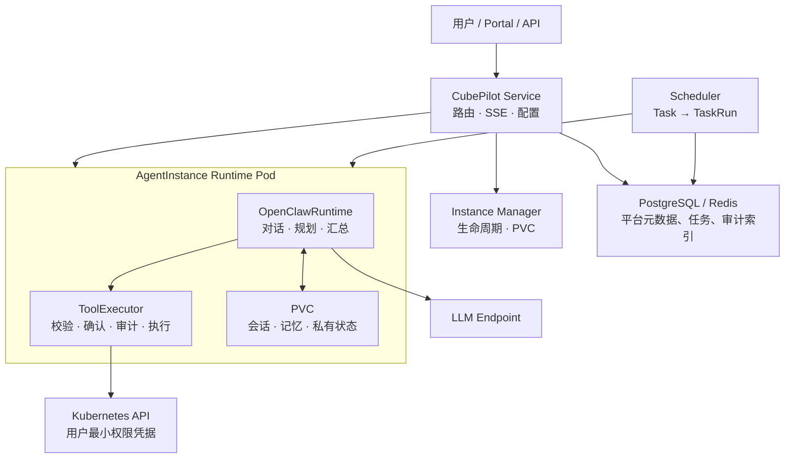

# CubePilot · Cloud for Agents 简化设计

**状态：** Draft
**原则：** 平台能力 API 化；Agent 负责理解、规划和汇总，平台负责执行、授权和记录。

> CubePilot 的核心是“每个用户一个管理 CubeStack 的 Agent”。本文保留未来扩展的接口，但不将 Agent 市场、多 Runtime、代码托管或通用 Agent 云作为当前架构前提。

---

# 1. 目标与边界

## 1.1 核心功能

- Portal/API 中与用户自己的平台管理 Agent 对话，并获得流式回答。
- Agent 以用户最小权限查询或操作已支持的 CubeStack 资源。
- 用户创建定时巡检任务，获得带证据链的报告。
- 每个用户的会话、记忆和运行数据相互隔离，并能跨实例重启保留。
- 平台管理实例生命周期，记录工具调用、确认决定和运行指标。

## 1.2 不属于当前核心

- 不实现 Agent 市场、跨用户共享、用户自定义容器或多 Agent 协作。
- 只运行 OpenClaw，不实现多个 Runtime。
- 不为每个 CRD 编写专用工具；通用 Kubernetes 能力基于用户权限动态发现和执行。
- 不建设独立 Tool Gateway、Credential Registry、统一模型代理或统一 fallback。

这些能力可在不改变本文接口的情况下增加，但不是当前设计的前置条件。

## 1.3 核心决策

1. 一个内置模板：`agent-for-cloud`。
2. 每用户一个实例：`(user, agent-for-cloud)` 对应一个 Runtime Pod 和一个 PVC。
3. 一个 Runtime 接口、一个实现：平台依赖 `AgentRuntime`，当前唯一实现是 `OpenClawRuntime`。
4. 工具在 Runtime Pod 内执行：`ToolExecutor` 直接调用 `kubectl` 或专用客户端。
5. 保留三层能力：generic 自动发现，atomic 补语义/安全，domain 承载领域知识与 Skills。
6. 声明配置在控制面，私有状态在 PVC：PVC 不作为 Agent 配置真源。

---

# 2. 总体架构



| 组件 | 职责 | 不负责什么 |
|---|---|---|
| Portal/API | 认证、对话入口、配置、任务与报告查询 | 不持有 Agent 会话状态 |
| CubePilot Service | Agent 路由、SSE 转发、配置解析、实例查找 | 不执行 LLM 编排或 kubectl |
| Instance Manager | 创建、停止、自愈 Pod；挂载 PVC 和凭据 | 不理解用户自然语言 |
| `OpenClawRuntime` | 对话、规划、工具调用、回答 | 不决定 RBAC 或管理 Pod |
| `ToolExecutor` | generic/Capability 校验、确认、审计、命令执行 | 不做 Agent 规划 |
| Scheduler | 触发任务、调用实例、写入 TaskRun | 不持有用户资源权限 |

## 2.1 请求路径

1. Portal 通过 OIDC 认证，向 Service 发送消息。
2. Service 定位用户实例；不存在或不健康时由 Instance Manager 拉起。
3. Service 调用 `AgentRuntime.chat` 并转发统一事件流。
4. Runtime 需要工具时调用本 Pod 的 ToolExecutor。
5. Executor 按 generic/Capability 规则、用户身份和确认规则执行操作，返回结构化结果。
6. Runtime 汇总结果，将私有会话状态写入 PVC。

---

# 3. 核心对象与数据归属

## 3.1 AgentTemplate

当前只有一个平台内置模板 `agent-for-cloud`。它不是完整 Agent Registry，也不是可由用户创建的市场对象。

```yaml
apiVersion: assistant.suanova.io/v1alpha1
kind: AgentTemplate
metadata:
  name: agent-for-cloud
spec:
  runtime: openclaw
  displayName: 平台管理助手
  defaultModel: { provider: platform, name: deepseek-v4-flash }
  instructions: |
    你是 CubeStack 平台管理助手。优先使用已登记能力；
    不确定资源或权限时先解释并请求用户澄清。
  capabilities: [dev-environment, inference-service, cluster-inspection]
```

模板变更生成不可变 `revision`。实例绑定一个 revision；升级采用显式滚动更新，不能静默改变正在运行的行为。

## 3.2 AgentInstance

每个用户有一个 AgentInstance，保存受模板约束的用户配置和运行状态。

```yaml
apiVersion: assistant.suanova.io/v1alpha1
kind: AgentInstance
metadata:
  name: zhang-wei-agent-for-cloud
spec:
  owner: zhang.wei
  templateRef: { name: agent-for-cloud, revision: 3 }
  selectedModel: deepseek-v4-flash
  enabledCapabilities: [dev-environment, inference-service, cluster-inspection]
  userInstructions: "回答尽量简洁，使用中文。"
  dataVolume: { pvc: pvc-zhang-wei-agent-for-cloud }
  identity: { userRef: zhang.wei }
status:
  phase: Ready
  podName: agent-zhang-wei-agent-for-cloud
```

允许覆盖的字段只有模型选择、Capability 子集和 `userInstructions`。`userInstructions` 仅追加用户偏好，最终指令由平台安全与执行约束、模板 `instructions`、用户指令依次组合；它不能删除、替换或降低模板中的安全边界、工具规则和身份限制，也不得扩大模板定义的能力或权限。

## 3.3 Capability、Skill 与 MCP

三者不是替换关系：Capability 是平台治理和 Agent 可见性模型，Skill 是 Runtime 使用的知识/脚本包，MCP 是外部工具的接入协议。

```text
Agent
  → generic 工具：动态发现 CRD、通用 CRUD、kubectl-raw（可选）
  → Capability(atomic)：为一个 CRD 追加语义与安全规则
  → Capability(domain)：领域知识，引用 generic / atomic / MCP 工具
       → Skill：指令、受控脚本、参考资料
       → MCP：Prometheus、ITSM 等外部系统工具
```

| 层 | 是否为 CRD | 解决的问题 | 模块工作量 |
|---|---|---|---|
| generic | 否，平台内置 | `list-kinds`、`describe-kind`、`resource-manager` 通用 CRUD | 无 |
| atomic | `Capability` | 补充特定 CRD 的名称、说明、示例、禁止操作和确认规则 | 可选的薄 YAML |
| domain | `Capability` | 巡检、诊断、推荐等领域流程 | 指令/Skill，必要时少量脚本 |

generic 是默认能力：ToolExecutor 使用实例 owner 的 kubeconfig 发现其可见资源，并以相同身份执行。RBAC 是授权边界；平台不必为每个新 CRD 登记工具。generic 写操作遵循统一确认默认值，atomic Capability 可对目标资源追加更严格的 deny/confirm 规则。

**atomic 示例：**

```yaml
apiVersion: assistant.suanova.io/v1alpha1
kind: Capability
metadata:
  name: dev-environment
spec:
  type: atomic
  target: { group: dev.suanova.io, version: v1alpha1, kind: DevEnvironment }
  semantics:
    title: 开发环境管理
    description: 按自然语言创建、查询或删除开发环境。
    examples: ["创建一个 4 核 16G、1 张 A100 的 PyTorch 环境"]
  security:
    denyOperations: []
    confirmWrites: true
```

**domain 示例：**

```yaml
apiVersion: assistant.suanova.io/v1alpha1
kind: Capability
metadata:
  name: cluster-inspection
spec:
  type: domain
  uses: [resource-manager, kubectl-raw]
  skillRef: cluster-inspection@4
  instructions: |
    以只读方式检查节点、GPU、异常 Pod、PVC 和平台组件；
    对每项异常附上证据并按 P0/P1/P2 分类。
```

Skill 不新增一个控制面对象：它是 domain Capability 的内容包，可内联，也可引用不可变 ConfigMap/镜像文件。Skill 包含 `SKILL.md`、受控脚本和参考资料；Runtime 只加载当前 Capability 显式引用的 Skill。MCP 是 ToolExecutor 的一种外部执行实现，Capability 可在 `uses[]` 中引用已注册的 MCP 工具。

## 3.4 Task 与 TaskRun

`Task` 定义何时以谁的身份执行什么；`TaskRun` 是一次不可变执行记录。

```yaml
apiVersion: assistant.suanova.io/v1alpha1
kind: Task
metadata:
  name: zhang-wei-daily-inspection
spec:
  owner: zhang.wei
  agentInstanceRef: zhang-wei-agent-for-cloud
  instruction: 以只读方式巡检集群、归类异常并附证据链。
  cron: "0 2 * * *"
  capabilitySnapshot: [cluster-inspection@4]
  templateRevision: 3
```

创建 Task 时固化模板和 Capability revision。每次执行前，Scheduler 重新验证用户有效性与授权；失败时写入 TaskRun，不执行工具操作。

## 3.5 数据真源

| 数据 | 真源 | 说明 |
|---|---|---|
| Template、Instance、Capability、Task、TaskRun | CRD / 控制面数据库 | 声明配置、版本、生命周期、报告 |
| 会话、消息、记忆、Runtime 缓存 | 实例 PVC | Agent 私有数据，不复制到平台业务表 |
| 工具调用索引、确认决定、运行指标 | 平台数据库 / 日志 | 平台自产治理数据，不保存完整私有会话副本 |

启动时，Service 将 Template、Instance 和 Capability 合并为不可变 `ResolvedAgentConfig` 注入 Runtime。PVC 不是配置真源。

---

# 4. Runtime Adapter

平台仅依赖以下窄接口。当前只实现 `OpenClawRuntime`；OpenClaw 的 session、配置文件和原生事件不会泄漏到 Service、Scheduler 或 Instance Manager。

```ts
interface AgentRuntime {
  start(config: ResolvedAgentConfig): Promise<void>
  stop(): Promise<void>
  chat(request: ChatRequest): AsyncIterable<AgentEvent>
  runTask(request: TaskRequest): AsyncIterable<AgentEvent>
  updateConfig(config: ResolvedAgentConfig): Promise<void>
  health(): Promise<RuntimeHealth>
}
```

统一事件：`message_start`、`message_delta`、`tool_call`、`tool_result`、`confirm_pending`、`confirm_resolved`、`message_done`、`error`。

`ResolvedAgentConfig` 包含模型端点、系统指令、可用 Capability、用户身份、凭据挂载位置、PVC 路径和 ToolExecutor 配置；不包含明文密钥。

---

# 5. ToolExecutor

## 5.1 定位

ToolExecutor 是 Runtime 与下游系统之间的本地执行边界，随 Agent Pod 部署。当前由 OpenClaw 的 generic 工具和 Skill 调用受控脚本、`kubectl` 或已登记的 MCP 客户端，不引入独立网络 Gateway。

```text
OpenClaw generic 工具 / Skill
  → ToolExecutor.execute(toolOrCapability, operation, input)
  → 输入与资源范围校验 / 确认 / 审计事件
  → kubectl 或专用客户端（argv 直执行，无 shell）
  → { success, data | error }
```

该接口保持稳定。未来若需要集中 MCP 接入、集中凭据托管或跨 Runtime 策略，可由远程 Gateway 实现同一接口，不改变 AgentRuntime 或 Capability 的调用语义。

## 5.2 执行约束

- 加载平台内置 generic 工具，以及 `ResolvedAgentConfig` 允许的 atomic/domain Capability 与其 Skill。
- Kubernetes 调用使用实例所有者的最小权限短期凭据，禁止集群管理员凭据。
- Kubernetes API 使用用户凭据；Kubernetes RBAC 和资源归属校验是最终授权边界。
- `kubectl-raw` 不作为默认能力；如确有必要，仅允许 token 化 argv、动词和 flag 白名单，并默认要求确认。
- generic 写操作使用统一确认默认值；atomic/domain Capability 可以追加更严格的 deny/confirm 规则。确认拒绝或超时即失败，Executor 不重试被拒操作。
- 每次调用生成 AgentInstance、Capability、操作、目标、结果摘要和时间等审计事件。

## 5.3 通用资源发现与执行

generic 工具包含：

```text
list-kinds       列出当前用户可发现的资源类型
describe-kind    获取资源 Schema，帮助 Agent 正确填参
resource-manager {kind, action, data}
                 按 Schema 校验/渲染后执行通用 CRUD
kubectl-raw      可选逃生门；仅允许白名单 argv，默认要求确认
```

`resource-manager` 不需要为每个 CRD 编写专用代码。它以同一用户 kubeconfig 完成 discovery 与执行，因此无权限资源会由 API Server 拒绝。atomic Capability 只是 generic 工具的薄覆盖，不替换其字段 Schema 或执行器；domain Capability 则为多步问题提供领域知识和 Skill。

---

# 6. 身份、凭据与隔离

当前只支持**用户身份**：AgentInstance 的 `owner` 与 `identity.userRef` 必须一致，ToolExecutor 使用该用户派生的最小权限凭据。

- 用户被禁用、权限回收或凭据轮换时，Instance Manager 更新或撤销实例挂载的凭据。
- TaskRun 在运行前再次校验身份和授权，不依赖创建任务时的权限。
- 凭据由平台托管为 Secret，以文件挂载或短期令牌注入 Pod；Template、Instance、PVC 和审计记录中不存明文密钥。
- 模型使用平台管理默认凭据；用户自带模型凭据、多下游类型和服务身份属于扩展项。
- 每实例独占 Pod 和 PVC，使用非 root、`readOnlyRootFilesystem`、`seccomp RuntimeDefault`、`drop ALL capabilities`、资源限制和 egress 白名单。

---

# 7. 定时任务与报告

Scheduler 只负责触发与记录，不拥有用户资源权限。

1. 到点后读取 Task 的 revision 快照并检查 owner 状态。
2. 确认实例可用，调用 `AgentRuntime.runTask`。
3. Runtime 通过同一 ToolExecutor 执行 generic 工具及 Task 快照允许的 Capability。
4. Scheduler 以平台身份写入 TaskRun；Runtime 不需要 CRD 写权限。

TaskRun 至少记录：Task UID、AgentInstance、Template revision、Capability revision、开始/结束时间、状态、报告摘要、证据引用和失败原因。完整私有会话仍保留在 PVC，需要长期留档时显式导出。

---

# 8. 观测与扩展边界

## 8.1 观测

- 健康检查：Service、Instance Manager、Scheduler、Runtime。
- 实例指标：启动耗时、就绪率、重启次数、PVC 使用率、并发会话数。
- Agent 指标：首 Token 延迟、完成延迟、模型调用量、工具成功率、确认等待时间。
- 审计索引：按用户、实例、Capability、TaskRun 和时间查询工具调用与确认。
- 故障隔离：单实例、PVC 或 LLM 失败不得阻塞其他用户或 CubeStack 控制面。

## 8.2 可扩展而不推翻核心的能力

| 扩展 | 保持不变的边界 |
|---|---|
| 第二个 Runtime | 实现 `AgentRuntime` 与统一 `AgentEvent` |
| 外置 MCP Gateway | 实现 `ToolExecutor`，Capability 语义不变 |
| 用户自建 Agent | 新增可版本化 Template 和 owner，不改变 Instance/PVC/Executor 模型 |
| 服务身份 | 扩展 identity 与凭据派生，仍由 Executor 执行前授权 |
| 外部下游 | 新增专用 Capability/Executor，不将业务逻辑写进 Runtime |
| 模型路由与 fallback | 放在 Runtime 或模型代理内部，不改变 Adapter 事件契约 |

## 8.3 待验证项

- OpenClaw 是否稳定支持事件、任务执行和配置热更新接口。
- 用户最小权限短期凭据的生成、轮换和撤销。
- Capability Schema 到受控 `kubectl` 参数/manifest 的转换与 dry-run。
- 审计索引能否满足排障，同时不复制 Agent 私有会话。
- PVC 容量、水位清理与实例重建后的会话恢复。
