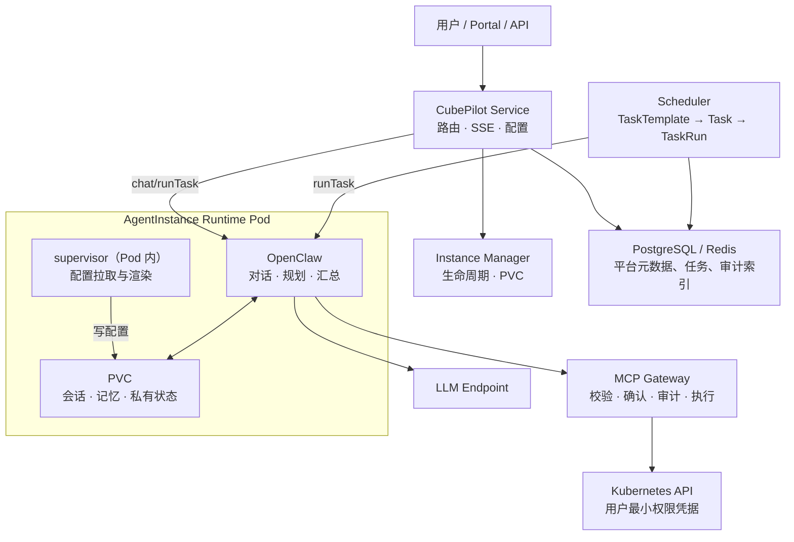

# CubePilot · Cloud for Agents 简化设计

**状态：** Draft
**原则：** 平台能力 API 化；Agent 负责理解、规划和汇总，平台负责执行、授权和记录。

> CubePilot 的核心是“每个用户一个管理 CubeStack 的 Agent”。本文保留未来扩展的接口，但不将 Agent 市场、多 Runtime、代码托管或通用 Agent 云作为当前架构前提。

---

# 1. 目标与边界

## 1.1 核心功能

- Portal/API 中与用户自己的平台管理 Agent 对话，并获得流式回答。
- Agent 以用户最小权限查询或操作已支持的 CubeStack 资源。
- 用户创建定时巡检任务，获得带证据链的报告。
- 每个用户的会话、记忆和运行数据相互隔离，并能跨实例重启保留。
- 平台管理实例生命周期，记录工具调用、确认决定和运行指标。

## 1.2 不属于当前核心

- 不实现 Agent 市场、跨用户共享、用户自定义容器或多 Agent 协作。
- 只运行 OpenClaw，不实现多个 Runtime。
- 不为每个 CRD 编写专用工具；通用 Kubernetes 能力基于用户权限动态发现和执行。
- 不建设独立 Tool Gateway、Credential Registry、统一模型代理或统一 fallback。

这些能力可在不改变本文接口的情况下增加，但不是当前设计的前置条件。

## 1.3 核心决策

1. 一个内置模板：`agent-for-cloud`。
2. 每用户一个实例：`(user, agent-for-cloud)` 对应一个 Runtime Pod 和一个 PVC。
3. 一个 Runtime 接口、一个实现：平台依赖 `AgentRuntime`，当前唯一实现是 `OpenClawRuntime`。
4. 工具统一经 **MCP Gateway** 执行（实现 `ToolExecutor` 接口）；MCP Gateway 阶段一未建，暂由 Runtime 直接 exec kubectl。
5. 保留三层能力：generic 平台内置的 kubectl 执行 + schema 发现，Atomic 补语义，Domain 承载领域知识与脚本。
6. 声明配置在控制面，私有状态在 PVC：PVC 不作为 Agent 配置真源。

---

# 2. 总体架构



> 阶段一尚未建设 MCP Gateway：上图中 `OC → GW → K` 暂由 `OC → K` 替代（OpenClaw 直接 exec kubectl，挂用户 kubeconfig，RBAC 兜底）；MCP Gateway 落地后切换，中间不建过渡组件。

| 组件 | 职责 | 不负责什么 |
|---|---|---|
| Portal/API | 认证、对话入口、配置、任务与报告查询 | 不持有 Agent 会话状态 |
| CubePilot Service | Agent 路由、SSE 转发、chat/runTask 转发（OpenClaw 客户端）、实例查找 | 不执行 LLM 编排或 kubectl |
| Instance Manager | 创建、停止、自愈 Pod；挂载 PVC 和凭据 | 不理解用户自然语言 |
| supervisor（Pod 内） | 配置注入：拉取 ResolvedAgentConfig，渲染 SKILL.md / 系统提示词写入 PVC | 不做 Agent 规划 |
| MCP Gateway（`ToolExecutor` 接口实现） | 工具校验、确认、审计、命令执行 | 不做 Agent 规划；阶段一未建 |
| Scheduler | 触发任务、调用实例、写入 TaskRun | 不持有用户资源权限 |

## 2.1 请求路径

1. Portal 通过 OIDC 认证，向 Service 发送消息。
2. Service 定位用户实例；不存在或不健康时由 Instance Manager 拉起。
3. Service 调用 `AgentRuntime.chat` 并转发统一事件流。
4. Runtime 需要工具时经 MCP 调用 MCP Gateway（阶段一未建时直接 exec kubectl）。
5. MCP Gateway 按 generic/Capability 规则、用户身份和确认规则执行操作，返回结构化结果。
6. Runtime 汇总结果，将私有会话状态写入 PVC。

---

# 3. 核心对象与数据归属

## 3.1 AgentTemplate

当前只有一个平台内置模板 `agent-for-cloud`。它不是完整 Agent Registry，也不是可由用户创建的市场对象。

```yaml
apiVersion: assistant.suanova.io/v1alpha1
kind: AgentTemplate
metadata:
  name: agent-for-cloud
spec:
  runtime: OpenClaw
  displayName: 平台管理助手
  defaultModel: deepseek-v4-flash            # 引用 Model 目录名（§3.3）
  # availableModels: []                      # 可选：限定可选模型清单；缺省 = 目录全部可用
  instructions: |
    你是 CubeStack 平台管理助手。优先使用已登记能力；
    不确定资源或权限时先解释并请求用户澄清。
  capabilities: [dev-environment, inference-service, cluster-inspection]
  confirmPolicy: ConfirmWrites            # 确认策略：写操作需用户确认（读直放）
```

模板变更生成不可变 `revision`，供审计与回滚。实例引用模板名（不钉版），模板更新在下次实例 reconcile 或重启时生效，不能静默改变正在运行的行为。确认策略（`confirmPolicy`）定义在 **Agent 层而非 Capability 层**：不同 Agent 复用同一 Capability 时可有不同确认策略；Capability 只承载语义、不携带权限/确认字段（权限由 RBAC 决定，确认由 Agent 的 `confirmPolicy` + MCP Gateway 统一执行）。

## 3.2 AgentInstance

每个用户有一个 AgentInstance，保存受模板约束的用户配置和运行状态。

```yaml
apiVersion: assistant.suanova.io/v1alpha1
kind: AgentInstance
metadata:
  name: zhang-wei-agent-for-cloud
spec:
  owner: zhang.wei
  templateRef: agent-for-cloud              # 引用模板名（不钉版；模板更新在下次 reconcile/重启时生效）
  selectedModel: deepseek-v4-flash         # 从 Model 目录（§3.3）中选择；切换后经 updateConfig 热生效
  enabledCapabilities: [dev-environment, inference-service, cluster-inspection]
  userInstructions: "回答尽量简洁，使用中文。"
  dataVolume: { pvc: pvc-zhang-wei-agent-for-cloud }
  identity: { userRef: zhang.wei }
status:
  phase: Ready
  podName: agent-zhang-wei-agent-for-cloud
```

允许覆盖的字段只有模型选择（`selectedModel`，候选集 = Model 目录；若模板指定 `availableModels` 则为其子集）、Capability 子集和 `userInstructions`。切换模型 = 改 `selectedModel` → resolver 重新解析、supervisor 重新拉取并注入（§4 配置注入）；skill 类变更靠文件监听热重载，其余配置变更不支持热重载时退化为重启 OpenClaw（会话与记忆在 PVC，不丢失）。`userInstructions` 仅追加用户偏好，最终指令由平台安全与执行约束、模板 `instructions`、用户指令依次组合；它不能删除、替换或降低模板中的安全边界、工具规则和身份限制，也不得扩大模板定义的能力或权限。

**实例开通（自服务）**：用户通过 Portal「Agent 配置」页或 `POST /api/instances` 开通自己的实例（owner 恒为请求者，服务端强制，防越权；读列表同样只返回自己的实例）。重复开通幂等返回已存在实例，不重复拉起 Pod/PVC。operator 控制器负责后续生命周期（Pod/PVC/Service 创建与自愈），API 只写 AgentInstance CR。阶段一预置用户（values 配置的 bootstrap 名单）由 operator 启动时创建；生产环境不依赖该名单，管理员在页面上开通或 `kubectl apply` 均可。

## 3.3 模型目录 (Model)

`Model` 是平台级的 LLM 模型目录，由管理员维护。Agent 模板和实例通过名字引用，不与具体端点或凭据耦合——端点与凭据在 Model 对象内，平台托管、不落明文。

```yaml
apiVersion: assistant.suanova.io/v1alpha1
kind: Model
metadata:
  name: deepseek-chat                 # 目录名，被 selectedModel / defaultModel 引用
spec:
  displayName: DeepSeek Chat
  provider: Platform                  # Platform（平台托管推理）| External（OpenAI 兼容端点）
  endpoint: https://inference.example.com/v1  # 统一可填；Platform 留空 = 内置运行时模型
  credentialRef: { name: cred-llm-org, namespace: cubepilot }  # 引用平台托管 Secret（apiKey）；External 必填，Platform 可选
status:
  phase: Available                    # Available / Unreachable（controller 注册时探测）
```

**provider 语义（统一探测闭环）**：
- `Platform` = 平台托管的推理能力。两种形态：
  - **内置运行时模型**（`endpoint` 留空，如预置的 `deepseek-v4-flash`）：运行时镜像内部解析，无端点可探测 → 直接 `Available`。
  - **手动部署的推理服务**（`endpoint` 填写）：管理员把已部署好的服务登记进目录，controller 与 External 一样探测连通性。
- `External` = OpenAI 兼容端点：`endpoint` + `credentialRef` 必填，controller 探测 `GET {endpoint}/models`（带凭据），2xx/3xx → `Available`，失败/401 → `Unreachable`。
- 探测不通过的模型 `status.phase = Unreachable`，实例不可选用（fail-closed，绝不静默回退）。

平台预置 `deepseek-v4-flash`（`provider: Platform`、无 endpoint）等模型条目。管理员加新模型：`kubectl apply` 一个 Model CRD（或 Portal「模型管理」页填写名字、provider、endpoint、选已有 Secret）→ Controller 校验连通性（有 endpoint 一律探测）→ `status.phase = Available` → 用户立即可在 `selectedModel` 中选到。

新增模型不动任何运行中实例；只有修改实例 `selectedModel` 才触发配置变更（由 resolver 重新解析、supervisor 重新拉取并注入，见 §3.2/§4 配置注入）。

## 3.4 Capability 与 MCP

Capability 是平台治理和 Agent 可见性模型；MCP 是外部工具的接入协议。Skill 不是独立对象——它是 Domain Capability 内容在 Runtime 侧的呈现（见下文）。

```text
Agent
  → generic 能力：kubectl 执行（受控）+ schema 发现
  → Capability(Atomic)：为一个 CRD 追加语义（不碰字段、不带安全）
  → Capability(Domain)：领域知识，内联指令/脚本，编排 generic / Atomic / MCP 工具
       → MCP：Prometheus、ITSM 等外部系统工具
```

| 层 | 是否为 CRD | 解决的问题 | 模块工作量 |
|---|---|---|---|
| generic | 否，平台内置 | kubectl 执行（受控）+ schema 发现 | 无 |
| Atomic | `Capability` | 补充特定 CRD 的名称、说明、示例（纯语义） | 可选的薄 YAML |
| Domain | `Capability` | 巡检、诊断、推荐等领域流程 | 内联指令 + 少量脚本 |

generic 是默认能力：执行以实例 owner 的最小权限凭据进行，schema 发现见 §5.3；RBAC 是授权边界，平台不必为每个新 CRD 登记工具。写操作是否需确认由 Agent 的 `confirmPolicy`（§3.1）决定；Capability 不携带权限/确认字段。

**Atomic 示例：**

```yaml
apiVersion: assistant.suanova.io/v1alpha1
kind: Capability
metadata:
  name: dev-environment
spec:
  type: Atomic
  target: { group: dev.suanova.io, version: v1alpha1, kind: DevEnvironment }
  semantics:
    title: 开发环境管理
    description: 按自然语言创建、查询或删除开发环境。
    examples: ["创建一个 4 核 16G、1 张 A100 的 PyTorch 环境"]
```

**Domain 示例：**

```yaml
apiVersion: assistant.suanova.io/v1alpha1
kind: Capability
metadata:
  name: cluster-inspection
spec:
  type: Domain
  uses: []
  instructions: |
    以只读方式检查节点、GPU、异常 Pod、PVC 和平台组件；
    对每项异常附上证据并按 P0/P1/P2 分类。
```

「Skill」不新增一个控制面对象，也不是独立概念：它就是 Domain Capability 的内联内容（`instructions` + 可选 `files`）在 Runtime 侧的呈现。平台注入 `ResolvedAgentConfig` 时，把这段内联内容渲染成 Runtime 需要的形态（如 OpenClaw 的 SKILL.md）；Runtime 只加载当前 Capability 显式引用的内容。MCP Gateway 是 ToolExecutor 接口的实现，Capability 可在 `uses[]` 中引用已注册的 MCP 工具。

## 3.5 TaskTemplate、Task 与 TaskRun

三者同构「模板 ≠ 实例 ≠ 执行」：`TaskTemplate` 定义「做什么」（参数化、可复用）；`Task` 定义「谁 + 何时做」（用户绑定模板与调度）；`TaskRun` 记录「这次做得怎么样」（一次不可变执行记录）。

```yaml
apiVersion: assistant.suanova.io/v1alpha1
kind: TaskTemplate
metadata:
  name: daily-inspection
spec:
  displayName: 每日集群巡检
  instruction: |
    以只读方式巡检集群（get/list/watch/logs）：检查节点 Ready 与压力、
    GPU 健康、异常 Pod、PVC 使用率与平台组件；异常附证据链并按 P0/P1/P2 分级；禁止写操作。
    巡检范围：{{scope}}。
  paramsSchema:
    - { name: scope, default: All, enum: [All, NodePool, Project] }
  requiredPermissions: { level: ClusterRead }
  capabilities: [cluster-inspection]      # 声明任务所需能力（执行时解析当前版本）
  defaultCron: "0 2 * * *"                # 创建向导的默认调度提示；以 Task.cron 为准
```

```yaml
apiVersion: assistant.suanova.io/v1alpha1
kind: Task
metadata:
  name: zhang-wei-daily-inspection
spec:
  owner: zhang.wei
  templateRef: daily-inspection           # 引用模板名（不钉版，下次执行用当前版本）
  params: { scope: all }                  # 只覆盖 paramsSchema 允许的参数
  cron: "0 2 * * *"                       # 或 Manual（手动触发）
  state: Enabled                          # Enabled | Paused（字符串枚举，不用 bool）
```

```yaml
apiVersion: assistant.suanova.io/v1alpha1
kind: TaskRun
metadata:
  name: zhang-wei-daily-inspection-20260820-020001
spec:
  creatorTaskRef: { name: zhang-wei-daily-inspection, uid: "…" }
  trigger: Cron                           # Cron | Manual
status:
  phase: Completed                        # Pending → Running → Completed / Failed
  startedAt: "2026-08-20T02:00:01Z"
  finishedAt: "2026-08-20T02:02:30Z"
  templateRevision: 7                     # 运行时解析：本次实际用到的模板版本
  capabilityRevision: 4                   # 运行时解析：本次实际用到的 capability/skill 版本
  summary: { p0: 0, p1: 1, p2: 3 }
  content: "巡检报告全文……"
  error: ""                               # 失败原因
```

模板只回答「做什么」，调度与归属放在 Task 上。`templateRef` 只存名字、不钉版本，执行时解析当前模板（模板更新下次执行生效，不影响正在跑的一次）；因此 Task 上**不固化 `capabilitySnapshot`**——审计由 TaskRun 在运行时记录实际用到的 revision（见 §7）。`params` 只能覆盖模板 `paramsSchema` 允许的参数。阶段一每用户只有一个 `agent-for-cloud` 实例，可从 `owner` 推导，故不写 `agentInstanceRef`（阶段二多 Agent 时再加回）。每次执行前，Scheduler 重新验证用户有效性与授权；失败时写入 TaskRun，不执行工具操作。

## 3.6 数据真源

| 数据 | 真源 | 说明 |
|---|---|---|
| AgentTemplate、AgentInstance、Model、Capability、TaskTemplate、Task、TaskRun | CRD / 控制面数据库 | 声明配置、版本、生命周期、报告 |
| 会话、消息、记忆、Runtime 缓存 | 实例 PVC | Agent 私有数据，不复制到平台业务表 |
| 工具调用索引、确认决定 | 平台数据库 | 平台自产治理数据；为 Trajectory 的最小投影，不保存完整私有会话副本 |
| 运行指标 | 监控模块 / 日志 | 平台只产生并暴露，存储/查询/告警交监控 |

启动时，resolver 将 AgentInstance、Agent 定义、Model 和 Capability 合并为不可变 `ResolvedAgentConfig`，supervisor 拉取后渲染成文件注入 Runtime（§4 配置注入）；其中 `selectedModel` 解析到 Model 目录中的端点与凭据引用（明文密钥只在 Secret 中）。PVC 不是配置真源。

---

# 4. Runtime Adapter

平台仅依赖以下窄接口。当前只实现 `OpenClawRuntime`；OpenClaw 的 session、配置文件和原生事件不会泄漏到 Service、Scheduler 或 Instance Manager。

```ts
interface AgentRuntime {
  start(config: ResolvedAgentConfig): Promise<void>
  stop(): Promise<void>
  chat(request: ChatRequest): AsyncIterable<AgentEvent>
  runTask(request: TaskRequest): AsyncIterable<AgentEvent>
  updateConfig(config: ResolvedAgentConfig): Promise<void>
  health(): Promise<RuntimeHealth>
}
```

统一事件：`message_start`、`message_delta`、`tool_call`、`tool_result`、`confirm_pending`、`confirm_resolved`、`message_done`、`error`。

`ResolvedAgentConfig` 包含模型端点、系统指令、可用 Capability、用户身份、凭据挂载位置、PVC 路径和执行边界（MCP Gateway）配置；不包含明文密钥。

`AgentRuntime` 接口的实现分布在两处：**chat/runTask 由 Service 内的 OpenClaw 客户端（HTTP）转发**，**配置注入由控制面 resolve + Pod 内的 supervisor 拉取渲染负责**，生命周期由 operator/K8s 负责；OpenClaw 进程负责对话/规划/汇总。工具执行统一委托 MCP Gateway（§5）。

**配置注入**：OpenClaw 的 skill 与系统提示词以**文件**形式存于 workspace 目录（`SKILL.md` / `SOUL.md`），启动时扫描加载，并对该目录**文件监听、自动热重载**（无需重启）。因此「注入」= 把 `ResolvedAgentConfig` 渲染成文件、写入 PVC 上的 workspace 目录。

- **主方案（当前实现）**：**控制面 resolve + Pod 内 supervisor 拉取**。operator 的 resolver 把 AgentInstance + Agent 定义 + Model 目录 + Capability 合并为不可变 `ResolvedAgentConfig`（内容哈希 revision），API 经 `GET /internal/agents/{user}/config` 暴露；Pod 内的 supervisor（常驻主容器，非 initContainer）启动时拉取、渲染为「每个 Domain Capability 一个 `SKILL.md` + 系统提示词文件」写入 PVC workspace 目录，随后托管 OpenClaw gateway 子进程；revision 变化时优雅重启子进程（会话/记忆在 PVC，不丢失），skill 变更经 OpenClaw 文件监听热重载。operator 只负责 Pod 生命周期，不参与 resolve。
- **备选方案**：改为 Pod 内 injector 以**原生 sidecar** 部署（`initContainers` + `restartPolicy: Always`，先于 OpenClaw 主容器启动并常驻），watch 本实例 AgentInstance 及引用的 AgentTemplate/Capability/Model，自行合并 `ResolvedAgentConfig` 并写文件；代价是每 Pod 一个 watcher 且 sidecar 需持有 CRD 读权限。

---

# 5. 执行边界：MCP Gateway（ToolExecutor 接口）

## 5.1 定位

`ToolExecutor` 是一个稳定接口（`execute`），其**最终实现是 MCP Gateway**——一个平台级组件，集中承接所有 Agent 的工具调用，做校验、确认、审计、执行：

```text
Agent（OpenClaw）─MCP─► MCP Gateway ──► execute(toolOrCapability, operation, input)
                            → 输入与资源范围校验 / 确认 / 审计事件
                            → kubectl 或专用客户端（argv 直执行，无 shell）
                            → { success, data | error }
```

MCP Gateway 集中做 Policy/HITL、凭据托管、审计，是「平台负责执行、授权、记录」的落点；未来多 Runtime、多 Agent 都复用同一 Gateway，不改变 Agent 侧契约。

**阶段一不建 MCP Gateway**：因此阶段一没有统一执行边界、没有 HITL、没有执行时的审计——kubectl 由 OpenClaw 直接 exec（挂用户 kubeconfig，RBAC 兜底）。这是临时缺口，MCP Gateway 落地后切换，中间不建过渡组件。

## 5.2 执行约束

- 加载平台内置 generic 工具，以及 `ResolvedAgentConfig` 允许的 Atomic/Domain Capability（Domain 的内联指令/脚本）。
- Kubernetes 调用使用实例所有者的最小权限短期凭据，禁止集群管理员凭据。
- Kubernetes API 使用用户凭据；Kubernetes RBAC 和资源归属校验是最终授权边界。
- kubectl 执行受控：token 化 argv、动词和 flag 白名单，写操作默认要求确认（阶段一为直接 exec，白名单/确认随 MCP Gateway 落地）。
- 确认策略由 Agent 的 `confirmPolicy` 决定（默认写操作需确认），MCP Gateway 统一执行；确认拒绝或超时即失败，不重试被拒操作。
- 每次调用生成 AgentInstance、Capability、操作、目标、结果摘要和时间等审计事件。

## 5.3 通用资源发现与执行

执行走 kubectl（受控）：阶段一 OpenClaw 直接 exec kubectl（用户 kubeconfig，RBAC 兜底）；MCP Gateway 落地后收敛为受控执行（verb/flag 白名单 + 确认 + RBAC）。

schema 发现分两阶段：

- **阶段一**：runtime Pod 挂**两个 kubeconfig**——用户 kubeconfig（操作）+ 平台只读 CRD kubeconfig（读 schema）。内置一个 skill 教 LLM：查 schema 用 `kubectl --kubeconfig=<只读CRD路径> get crd <kind> -o yaml`（或 `explain`），其余操作一律用默认用户 kubeconfig。
- **最终**：MCP Gateway 用自身只读 CRD 权限 serve schema（`describe-kind`），Pod 内不再需要只读 CRD kubeconfig。

资源类型列表由 LLM 用 `kubectl api-resources` 发现；字段校验由 API server 在 apply 时完成（可先 `--dry-run=server`）。Atomic Capability 只是语义薄覆盖，不替换执行器；Domain Capability 提供领域知识与脚本。

---

# 6. 身份、凭据与隔离

当前只支持**用户身份**：AgentInstance 的 `owner` 与 `identity.userRef` 必须一致，执行（MCP Gateway）使用该用户派生的最小权限凭据。

- 用户被禁用、权限回收或凭据轮换时，Instance Manager 更新或撤销实例挂载的凭据。
- TaskRun 在运行前再次校验身份和授权，不依赖创建任务时的权限。
- 凭据由平台托管为 Secret，以文件挂载或短期令牌注入 Pod；Template、Instance、PVC 和审计记录中不存明文密钥。
- 模型凭据由 `Model.credentialRef` 引用平台托管 Secret，所有实例共享同一平台凭据；平台侧按实例/用户计量与审计，不分发个人密钥。用户自带模型凭据属于扩展项。
- 每实例独占 Pod 和 PVC，使用非 root、`readOnlyRootFilesystem`、`seccomp RuntimeDefault`、`drop ALL capabilities`、资源限制和 egress 白名单。

---

# 7. 定时任务与报告

Scheduler 只负责触发与记录，不拥有用户资源权限。

1. 到点后读取 Task，解析 `templateRef` 指向的 TaskTemplate 与当前 Capability，并检查 owner 状态。
2. 确认实例可用，调用 `AgentRuntime.runTask`。
3. Runtime 通过 MCP Gateway 执行 generic 工具及模板声明的 Capability（按当前版本）。
4. Scheduler 以平台身份写入 TaskRun；Runtime 不需要 CRD 写权限。

TaskRun 至少记录：Task UID、AgentInstance、Template revision（运行时解析）、Capability revision（运行时解析）、开始/结束时间、状态、报告摘要、证据引用和失败原因。完整私有会话仍保留在 PVC，需要长期留档时显式导出。

---

# 8. 观测与扩展边界

## 8.1 观测

- 健康检查：Service、Instance Manager、Scheduler、Runtime。
- 实例指标：启动耗时、就绪率、重启次数、PVC 使用率、并发会话数。
- Agent 指标：首 Token 延迟、完成延迟、模型调用量、工具成功率、确认等待时间。
- 审计索引：按用户、实例、Capability、TaskRun 和时间查询工具调用与确认。
- 故障隔离：单实例、PVC 或 LLM 失败不得阻塞其他用户或 CubeStack 控制面。

## 8.2 可扩展而不推翻核心的能力

| 扩展 | 保持不变的边界 |
|---|---|
| 第二个 Runtime | 实现 `AgentRuntime` 与统一 `AgentEvent` |
| 外置 MCP Gateway | 实现 `ToolExecutor`，Capability 语义不变 |
| 用户自建 Agent | 新增可版本化 Template 和 owner，不改变 Instance/PVC/Executor 模型 |
| 服务身份 | 扩展 identity 与凭据派生，仍由 Executor 执行前授权 |
| 外部下游 | 新增专用 Capability/Executor，不将业务逻辑写进 Runtime |
| 模型目录 | 新增 `Model` CRD，管理员维护；Template/Instance 按名引用 | 不改变 `AgentRuntime` 接口与 `AgentEvent` 契约 |
| 模型路由与 fallback | 放在 Runtime 或模型代理内部，不改变 Adapter 事件契约 |

## 8.3 待验证项

- OpenClaw 事件与任务执行接口的稳定性；skill 热重载已由源码确认走文件监听（`skills/runtime/refresh.ts`），需集成验证注入的 workspace 目录能被正确监听。
- OpenClaw 作为 MCP client 连 MCP Gateway、并把工具调用透传给它的能力（阶段二 MCP Gateway 落地前须先验证）。
- 用户最小权限短期凭据的生成、轮换和撤销。
- Capability Schema 到受控 `kubectl` 参数/manifest 的转换与 dry-run。
- 审计索引能否满足排障，同时不复制 Agent 私有会话。
- PVC 容量、水位清理与实例重建后的会话恢复。

## 8.4 实现状态与已知取舍（阶段一落地记录）

> 本节记录简化设计在阶段一实现中的实际状态：已完成项、与正文描述的有意偏差、
> 以及后续阶段的演进清单。实现仓库：cubePilot（operator / api / web / agent supervisor）。

### 已对齐（阶段一已实现并验证）

- **对象模型**：Agent / AgentInstance / Model / Capability / TaskTemplate / Task / TaskRun
  全部 CRD 化，status subresource + printcolumn；模板、实例、执行三态分离（§3.5）。
- **实例自服务**：`POST /api/instances` owner 强制 = 请求者，幂等创建，冲突 409
  （§3.2）。
- **模型目录闭环**：`Model` CRD + 探测控制器；platform 无 endpoint 直通 `Available`、
  有 endpoint 统一探测；external 必填；fail-closed（§3.3）。
- **模型选择 fail-closed**：`ResolvedAgentConfig` 解析链
  `instance.selectedModel → agent.defaultModel → availableModels 白名单 → Model 目录`，
  任一步失败即报错，绝不静默回退；`x-openclaw-model` 头每请求热生效（优于设计文档的
  updateConfig / pod 重启）。
- **模板与执行分离**：TaskRun 记录 `templateRevision` / `capabilityRevision`（内容
  sha256 前 12 hex）；手动 run 走 annotation 触发，幂等。
- **Task 状态为字符串枚举**：`spec.state: Enabled | Paused`（§3.5 明确不用 bool），
  CRD default=Enabled；API 保留 `enabled` 兼容字段，web 以派生 `enabled` 展示。
- **实例能力子集**：`AgentInstance.spec.enabledCapabilities` 限定 Domain 能力子集
  （§3.2），resolver 过滤注入；空 = 全部声明能力。
- **用户指令接线**：`AgentInstance.spec.userInstructions` 追加到模板指令之后
  （§3.2 组合顺序），resolver 合并进 `ResolvedAgentConfig.Instructions`。
- **实例状态阶段**：`status.phase = Ready`（§3.2，与文档一致；旧 `Warm` 已废弃）。
- **字段命名对齐**：Agent `spec.capabilities`（§3.1）、`spec.runtime: OpenClaw`
  （§3.1）、Model `provider: Platform | External`（§3.3）。
- **枚举值 CRD 校验**：六个枚举（runtime / provider / type / confirmPolicy /
  trigger / task state）均带 `kubebuilder:validation:Enum`，非法值被 API server
  拒绝（fail-fast，实测验证）。
- **统一事件契约**：message_start / delta / tool_call / tool_result / message_done /
  confirm_* 全套实现（§4）。
- **Runtime 窄接口**：`AgentRuntime` Go interface（SetModel / StreamChat / ListSessions /
  GetHistory），concrete client 实现，编译期断言（§4）。
- **Pod 安全基线**：非 root、seccomp RuntimeDefault、drop ALL、禁特权提升、
  readOnlyRootFilesystem、emptyDir /tmp（§6 / 附录B「实例最小权限」条目）。
- **观测**：healthz / readyz / metrics / readiness 全绿（§8.1）。
- **Skill 热重载**：OpenClaw（2026.7.1-2）对 `workspace/skills` 目录做文件监听（chokidar + 100ms 轮询兜底），Capability 变更经 resolver → supervisor 重写 SKILL.md 后自动热加载，无需重启 Pod（此前「skill 变更必须重启 Pod」的旧结论已随版本更新修正）。

### 已知取舍（现实现与设计文字的有意偏差，已选其一，不再当作缺口）

1. **MCP Gateway（§5，ToolExecutor 接口的正式实现）阶段一未建**：kubectl 由 OpenClaw 直接 exec（挂用户 kubeconfig，RBAC 免底，无执行前校验/HITL）；审计由 API 从 SSE 流捕获 tool_call 事后记录，只能记录、不能阻断。这是明确接受的临时缺口；MCP Gateway 作为阶段二目标，落地时切换到受控执行，中间不建过渡组件。
2. **存储不采用 PostgreSQL / Redis（§2 mermaid）**：实现为 CRD/对象存储 + 每实例
   RWO PVC，与 §3.6 文字「CRD/控制面数据库」一致。§2 图为历史参考，以 §3.6 为准。
3. **TaskRun 不冗余记录 Agent 实例名（§7「至少记录」）**：实现按 §3.5 从 owner 推导
   （阶段一单实例每用户，推导无歧义）。多实例每用户时改为显式记录。
4. **身份用 `X-CubePilot-User` 请求头模拟（附录 B 标「一」）**：OIDC 属外部依赖，
   阶段二引入 Keycloak 后替换；模拟身份可审计、单一来源。
5. **§5.3 双 kubeconfig 未实施**：现阶段 Pod 只挂一个用户 kubeconfig（操作与读 schema 同源，`kubectl explain/get crd` 以用户权限完成）；「用户无 CRD 读权限时挂只读 CRD kubeconfig」的场景登记阶段二，随 MCP Gateway / 凭据治理落地。
6. **egress 白名单未实施**：与模型凭据/外部端点管控绑定（表B「模型凭据」行），阶段二随
   模型凭据统一治理落地。

### 阶段二演进清单（已知偏差的后续归属）

- 集中 Tool Gateway（§5 ToolExecutor 独立组件 + 统一 Policy + HITL）。
- Keycloak OIDC 鉴权替换 `X-CubePilot-User`（附录 B）。
- 模型凭据托管、轮换与 egress 白名单（附录 B）。
- 确认护栏落地：写/高危操作 HITL（确认策略已进入对象模型，执行侧未接入）。
- 多实例/多 agent 形态，TaskRun 显式记录 Agent。

---

# 9. 演进方向

本设计刻意不把「Agent 云」作为当前架构前提，但保留通往它的路径。CubePilot 的战略方向是
「给 AI 提供算力 → 给 Agent 提供云（Cloud for Agents × Agents for Cloud）→ Agent-Native Cloud」，
本设计是这条线上的第一站。

```text
现在（本设计）：每个用户一个内置 agent-for-cloud
    平台能力 API 化，Agent 只做理解、规划、汇总；平台负责执行、授权、记录。
    │
    ├──► 阶段二：Agent 一等对象落地
            Agent / AgentInstance 版本化 · 用户自建 Agent（配置托管）
            Registry 审核发布 · Tool Gateway 统一 Policy/HITL · service 身份
    │
    └──► 阶段三：平台化与智能演进
            代码托管（container）· Agent Evaluation · 多 Agent · 模板市场
```

**关键认知：两层架构是「往哪去」，不是「现在建什么」。** 本设计已经把「与具体 Agent 无关」的部分
收敛为稳定接口——`AgentRuntime`（§4）、`ToolExecutor`（§5）、统一 `AgentEvent` 契约、`ResolvedAgentConfig`。
未来引入第二个 Agent、第二个 Runtime、集中 MCP 网关，都是在这些接口上的加法实现（§8.2），不重建核心对象模型。

用户自建 Agent 与内置 agent-for-cloud 的能力差异 = Agent 定义（tools / instructions / identity）的差异，
而非平台能力的差异；平台层新增任何能力，内置与自建 Agent 同时受益。这一演进不改动本设计的接口。

---

# 附录 A · 三层能力细节

正文 §3.4 已给出三层能力骨架，此处补充与阶段一实现相关的细节，作为参考而非独立规范。

## A.1 模块负担递减

| 层 | 是什么 | 谁提供 | 模块要做什么 |
|---|---|---|---|
| generic | kubectl 执行（受控）+ schema 发现 | 平台内置 | 零登记 |
| Atomic 薄覆盖 | 绑定某 CRD，只补语义，不碰字段 | 模块可选 | 几行 YAML |
| Domain | 领域知识（`uses[]` 编排 + 内联指令 + 脚本） | 模块必须 | 内联指令 / 脚本 |

## A.2 Atomic 薄覆盖：override + target，不碰字段

`type: Atomic` 的 Capability 只覆盖一个维度：`semantics`（何时用 / 用户话怎么映射），
不定义字段、也不携带权限/确认规则——`parameters` 永远来自目标 CRD 的 OpenAPI schema + 平台注入；权限由 RBAC 决定，确认由 Agent 的 `confirmPolicy` + MCP Gateway 统一执行。

- `override: true` 标记这是覆盖层，不是全新定义；
- `target`（group / version / kind）登记时平台校验 CRD 存在 + schema 可用，fail-fast；
- 执行走 kubectl（受控）：LLM 按 schema 写 YAML → `kubectl apply`，API server 校验。

## A.3 加载策略（缓解工具爆炸）

```text
① group 分片：Agent 声明 groups + RBAC 过滤，上下文只放需要的模块
② 操作分片：读（get / list）常驻；写（create / delete / update）按需加载 + 默认确认
③ 发现兜底：schema 动态发现（阶段一只读 CRD kubeconfig / 最终 describe-kind），长尾 CRD 即用
```

---

# 附录 B · 安全清单

正文 §6 是当前阶段（用户身份）的规范安全设计；下表为阶段二/三相关完整清单，作为演进检查表。

| 维度 | 设计 | 阶段 |
|---|---|---|
| 身份与授权 | Keycloak OIDC 鉴权；工具资源归属复用平台 RBAC；Agent 定义/实例 owner 与身份派生关系可审计 | 一（OIDC）/ 二（Agent 维度） |
| 凭据最小化 | 实例仅持声明且经授权的类型化凭据；定期轮换、失效即时吊销；禁止集群管理员凭据 | 一 |
| 物理隔离 | 一实例一 Pod 一 PVC；内置与自建 Agent 数据互相隔离 | 一 |
| Prompt 注入防护 | 用户输入与系统指令区分；工具返回作数据不作指令；高危操作须确认 | 一 |
| 实例最小权限 | 非 root、seccomp RuntimeDefault、drop ALL capabilities、readOnlyRootFilesystem、egress 白名单 | 一 |
| 确认护栏 | 写/高风险操作 HITL，本人确认；拒绝/超时 fail-closed；不重试被拒操作 | 二 |
| Agent 配额 | 每用户 Agent 数 + 全平台实例数上限；超限拒绝创建 | 三 |
| 自定义 Agent 边界 | 阶段二配置托管（工具来自能力目录）；阶段三代码托管需镜像审核 + 强化沙箱 + 评测 | 二 / 三 |
| 模型凭据 | 平台外端点 API Key 平台托管、不落明文；共享凭据记录使用方审计；egress 白名单 | 二 |
| 限流防滥用 | 按用户 / Agent / 工具 / LLM 维度限速 | 三 |
