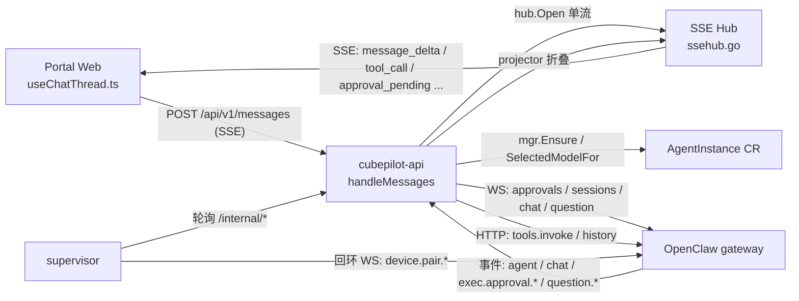
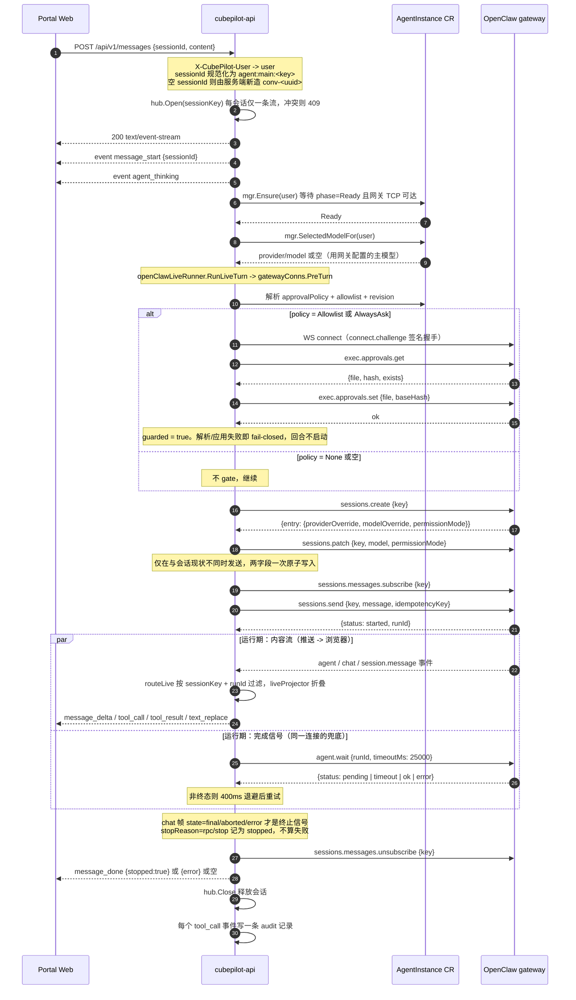
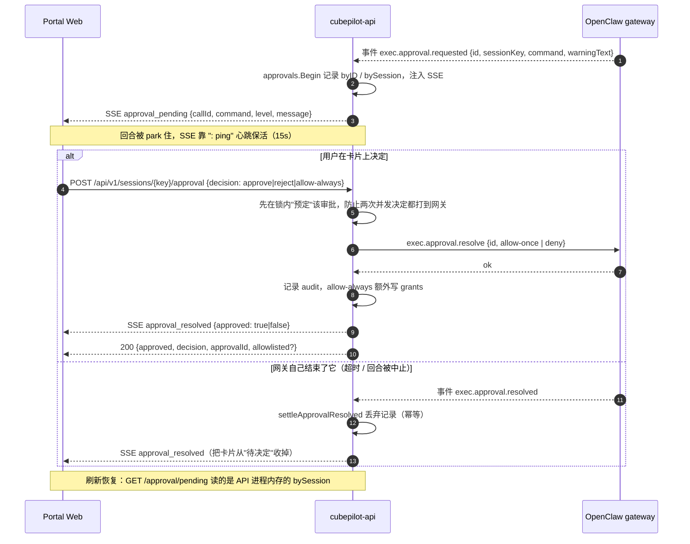
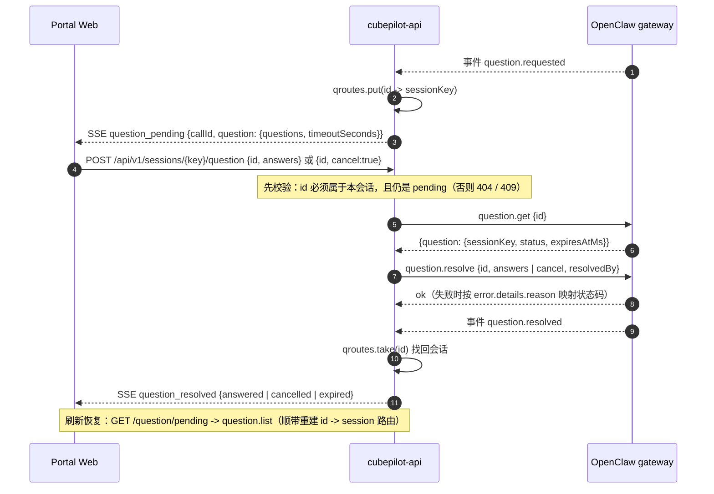
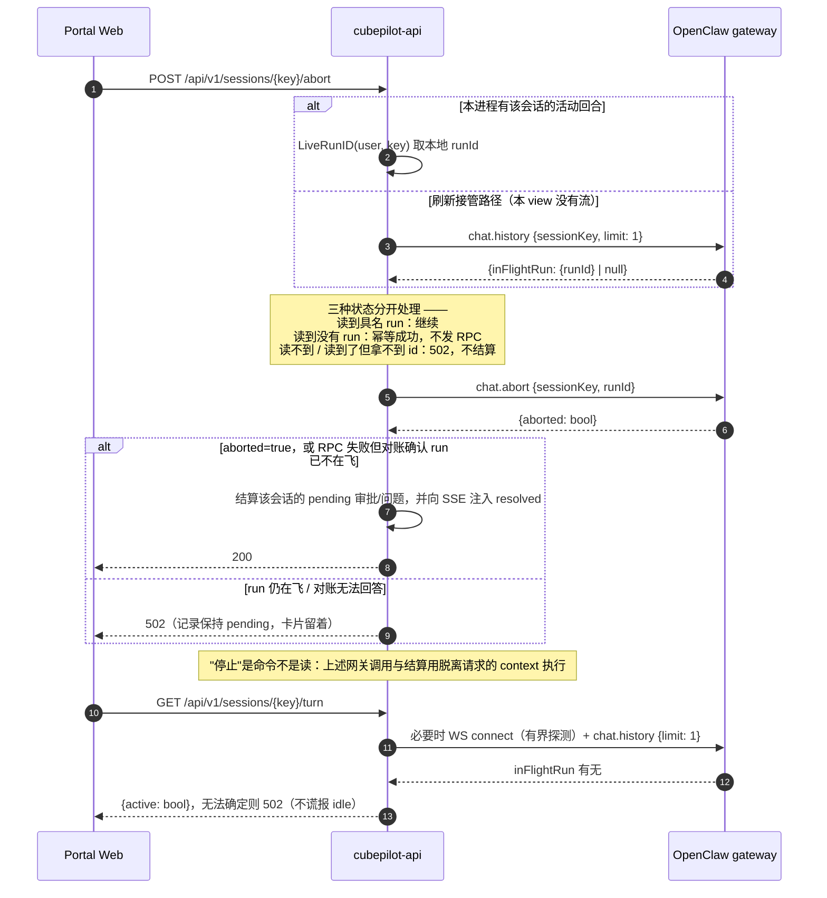
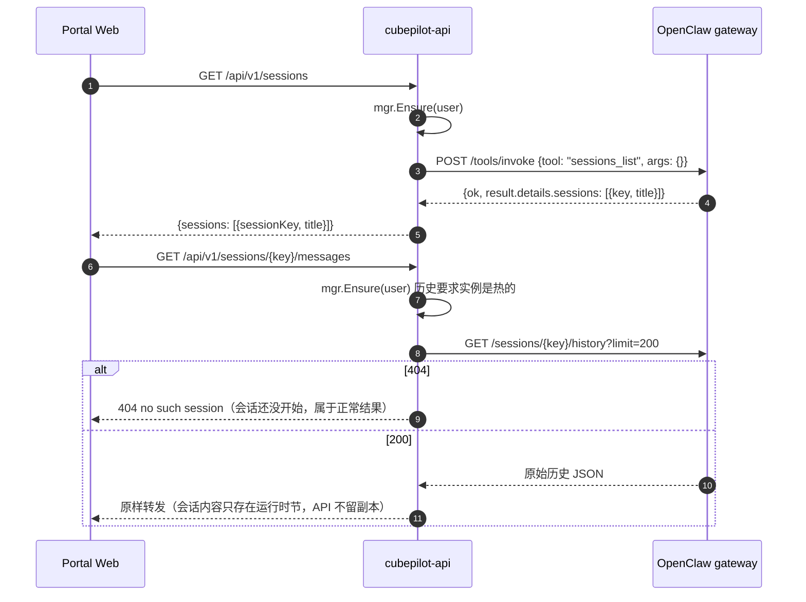
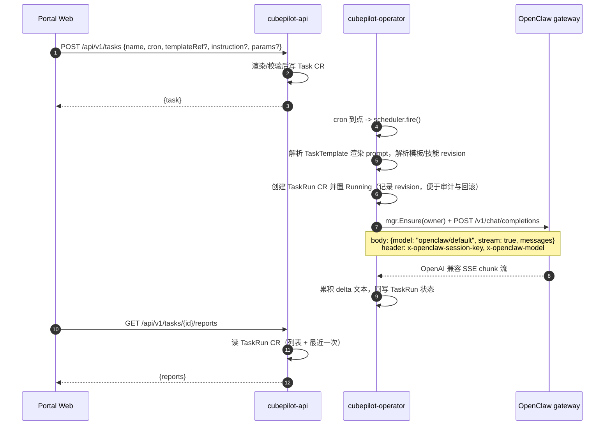
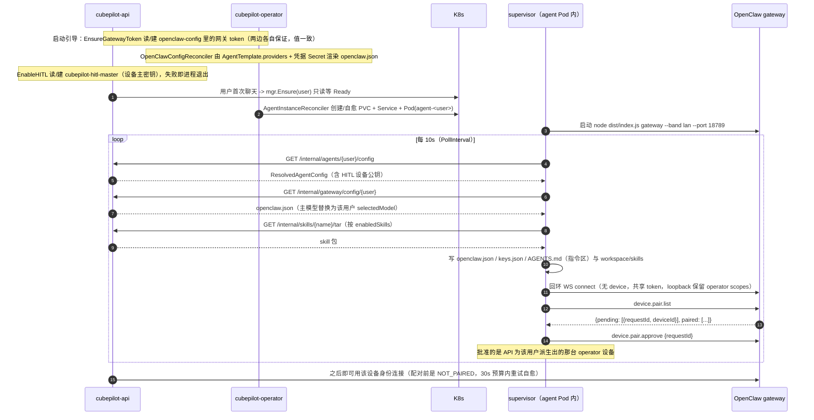

# CubePilot 调用链与时序（Portal -> API -> OpenClaw）

> **读者**：要理解或调试这条链路的人——改聊天回合、排查"审批卡片不出现"、
> 排查"turn 停不下来"、排查定时任务没跑、排查实例一直不 Ready。
>
> **来源**：本文以代码为准。字段级契约见 [api.md](./api.md)，设计意图见
> [cubepilot-design.md](./cubepilot-design.md)，本文只回答**谁在什么时候调用谁**。
>
> **维护**：本文没有测试守着（`api.md` 有 `internal/server/apidoc_test.go`）。改动
> `internal/server/`、`internal/openclaw/`、`internal/supervisor/`、`internal/runner/`
> 的调用关系时请同步更新。

---

## 目录

1. [参与者与通道](#1-参与者与通道)
2. [一次聊天回合的全景](#2-一次聊天回合的全景)
3. [聊天回合时序（POST /api/v1/messages）](#3-聊天回合时序post-apiv1messages)
4. [写审批（HITL exec approval）](#4-写审批hitl-exec-approval)
5. [ask_user 问题](#5-ask_user-问题)
6. [Stop 与 turn 状态](#6-stop-与-turn-状态)
7. [会话列表与历史（一次性 HTTP 读）](#7-会话列表与历史一次性-http-读)
8. [定时任务（operator -> gateway）](#8-定时任务operator---gateway)
9. [实例生命周期与 supervisor](#9-实例生命周期与-supervisor)
10. [API -> OpenClaw 接口清单](#10-api---openclaw-接口清单)
11. [Web -> API 端点映射](#11-web---api-端点映射)
12. [时序不变量与易错点](#12-时序不变量与易错点)
13. [代码索引](#13-代码索引)

---

# 1. 参与者与通道

```text
                                        K8s apiserver
                                             │ CRD: AgentInstance / Task / TaskRun / Skill / Secret
                    ┌────────────────────────┼────────────────────────┐
                    │                        │                        │
  浏览器 Portal ────┤ /api/v1/* HTTP+SSE     │                        │ CRD status
   (web/src)        ▼                        │                        ▼
              cubepilot-api :8080 ──────────┘                 cubepilot-operator
                    │  │  ▲                                     (控制面 + 定时任务)
      WS /gateway   │  │  └── /internal/* ──┐                        │
                    │  └── /tools/invoke,   │                        │ HTTP /v1/chat/completions
                    │      /sessions/...    │                        │ (一次性 turn)
                    ▼                       │                        ▼
       每用户一个 OpenClaw 实例（agent Pod）<─────────────────────────┘
       ├── OpenClaw gateway :18789  (WS + HTTP)
       └── cubepilot-supervisor     (轮询 API，渲染 openclaw.json / keys.json / skills)
```

| 从 | 到 | 协议 | 通道 | 代码 |
|---|---|---|---|---|
| Portal Web | cubepilot-api | REST + JSON | `/api/v1/*`，身份靠 `X-CubePilot-User` 头 | `web/src/api/client.ts`、`web/src/api/index.ts` |
| Portal Web | cubepilot-api | SSE | `POST /api/v1/messages`（POST 流，不能用 `EventSource`） | `web/src/api/sse.ts`、`web/src/views/chat/useChatThread.ts` |
| cubepilot-api | OpenClaw gateway | WebSocket JSON-RPC | `ws://agent-<user>.<ns>.svc:18789/gateway`，身份 = 派生出的 operator 设备 | `internal/openclaw/ws/{client,methods,frames}.go` |
| cubepilot-api | OpenClaw gateway | HTTP | `POST /tools/invoke`、`GET /sessions/{key}/history` | `internal/openclaw/client.go` |
| cubepilot-operator | OpenClaw gateway | HTTP + SSE（OpenAI 兼容） | `POST /v1/chat/completions` | `internal/runner/runner.go` |
| supervisor（agent Pod 内） | cubepilot-api | HTTP | `/internal/agents/{user}/config`、`/internal/gateway/config/{user}`、`/internal/skills/{name}/tar` | `internal/supervisor/supervisor.go` |
| supervisor | 同 Pod 的 gateway | WS（回环） | `ws://127.0.0.1:18789/gateway`，无 device、只用共享 token | `internal/supervisor/pairing.go` |

两条互斥的对话通道，先记住这一点：

- **交互式回合（Portal 聊天）只走 WebSocket**（`internal/openclaw/ws`）。文本、工具、
  审批、问题、完成都来自同一条订阅流，所以顺序天然一致（`internal/openclaw/client.go`
  的包注释写明了这个分工）。
- **一次性/后台回合走 HTTP**（`POST /v1/chat/completions`），只有定时任务在用
  （`internal/runner/runner.go`）。这条路径**不占用**那条共享 WS 连接，因此没有实时审批
  通道——这是有意的取舍。

---

# 2. 一次聊天回合的全景



一句话版本：**浏览器只跟 API 说话，API 只跟网关说话，网关的事件通过同一条 WS 回到 API，
再由 API 写进那条 SSE。**

---

# 3. 聊天回合时序（POST /api/v1/messages）



实现要点：

- 终止以**订阅事件流**为准，`agent.wait` 只是兜底（`internal/server/live.go:213-243`）。
  因为网关对"等待超时"和"真超时"都回 `status:"timeout"`，无法区分，所以不拿它做终态判断。
- `runId` 过滤：`sessions.send` 之前就先把幂等键装成"期望的 runId"，之后只投影这一个
  run 的事件，避免同会话的旧 run 或并行 run 漏进这条 SSE（`liveTurn.acceptRun`）。
- 模型不进 `sessions.send`，而是先 `sessions.patch` 写进会话状态；只有 HTTP 一次性回合
  用 `x-openclaw-model` 头。
- 工具卡片由 `liveProjector` 折叠 `agent`（`stream=tool|item|command_output`）和 `chat`
  帧得到；`ask_user` 工具的卡片被刻意抑制，因为问题卡片才是它的界面（`isQuestionTool`）。
- 单条流限制：同一会话同时只有一个回合，重复的 `POST /messages` 拿 409（`hub.Open`）。

---

# 4. 写审批（HITL exec approval）



实现要点：

- `allow-always` = 先"批准这一次"，再把命令写成用户的 grants 记录（ConfigMap），
  下一回合起在 Allowlist 策略下自动放行；实例 spec 不动。
- 决议失败会把预定的记录**恢复**，用户可以重试；期间落地的 settle 会让恢复变成丢弃，
  否则已经停掉的回合会重新长出一张没人能答的卡片。
- 刷新恢复卡片读的是**进程内存**，所以 API 重启后 pending 卡片无法恢复（网关侧仍 pending，
  但平台不知道它属于哪个会话）。

---

# 5. ask_user 问题



- 会话不是从事件里拿的：`question.resolved` 不带 sessionKey，靠 relay 时记下的路由
  (`qroutes`) 寻址。
- 不支持的问题类型（多问题、缺选项等）不投影成卡片，只记日志。

---

# 6. Stop 与 turn 状态



实现要点：

- 时钟花在"证明 run 真的没了"上：`message_done {stopped:true}` 由 SSE 流给出，前端
  **不**主动 abort 本地 fetch，等服务端的终态事件。
- `/turn` 只问 `chat.history` 的运行态（`sessionRunStatus`，带 `sessionRunStatusLimit` 的
  消息上限，返回里只看 `inFlightRun`），这样帧大小与会话长度无关——早期版本拉整份
  transcript，48 条消息约 126 KB 就撞上客户端读上限，把整条连接（连同它驱动的回合）打死。
- 发送与停止是串行的：前端在同一个会话上发送前先 `abortSession`（若该会话有在飞的回合），
  因为 `POST /messages` 与一条活跃流冲突时会 409，而"发进一个还在跑的 run"会被静默吞掉。

---

# 7. 会话列表与历史（一次性 HTTP 读）



这两个是**仅有的**走开环 HTTP 的聊天相关调用（`internal/openclaw/client.go`，其接口约束
是 `runtime.SessionReader`）。

---

# 8. 定时任务（operator -> gateway）



要点：定时任务**不经过 API 进程**，operator 直接对网关发起一次 HTTP 回合，因此

- 不占用 API 的用户 WS 连接，也不带实时审批通道（后台任务本就不该弹卡片）；
- 模型走 `x-openclaw-model` 头热生效（与交互式回合的 `sessions.patch` 是两条不同的路）；
- 实例不存在时记一条 Failed TaskRun 而不是用陈旧身份执行。

---

# 9. 实例生命周期与 supervisor



要点：

- 设备身份是**确定性**的：`ed25519.Seed = sha512(masterKey + "|" + user)[:32]`，所以 API
  重启后仍是同一台设备，配对结果继续有效（`internal/server/gateway.go:208`）。
- 网关配置是**拉**的，不是推的：provider/模型变更不等 kubelet 的 Secret 卷刷新（issue #6）。
- 技能安装/卸载只改 `AgentInstance.spec.enabledSkills`，真正落盘要等 supervisor 下一轮
  拉取 `/internal/skills/{name}/tar`。

---

# 10. API -> OpenClaw 接口清单

## 10.1 WebSocket 方法（`internal/openclaw/ws/methods.go`）

| 方法 | 用途 | 触发点 |
|---|---|---|
| `connect`（含 `connect.challenge` 签名） | 握手：role=operator、scopes、device proof | 每个用户首用或断线后 |
| `exec.approvals.get` | 读 per-agent 审批策略快照（带 hash） | PreTurn，且 revision 变化时 |
| `exec.approvals.set` | CAS 写入 allowlist（AlwaysAsk 写空表） | 同上，丢失 CAS 重试 3 次 |
| `exec.approval.resolve` | `allow-once` / `deny` | `POST /approval` |
| `sessions.create` | 确保会话存在（已存在则采用） | 每个回合开始 |
| `sessions.patch` | 原子写 model + permissionMode | 回合开始，且与会话现状不同 |
| `sessions.messages.subscribe` | 订阅该会话实时消息流 | 回合开始 |
| `sessions.send` | 发送用户消息，ACK 返回 runId | 回合开始 |
| `agent.wait` | 等待 run 终态（非终态轮询） | 回合进行中（兜底） |
| `sessions.messages.unsubscribe` | 退订 | 回合结束 |
| `chat.history` | 只读 `inFlightRun`（`limit: 1`） | `/turn`、`/abort` 对账 |
| `chat.abort` | 中止指定 runId | `POST /abort` |
| `question.resolve` | 回答问题，或 `cancel: true` 撤销 | `POST /question` |
| `question.get` | 读单个问题记录 | `POST /question` 的前置校验（绑定 id 到会话 + 确认仍 pending） |
| `question.list` | 列出本网关的待决问题 | `GET /question/pending`（刷新恢复）、abort 结算时重读 |
| `device.pair.list` / `device.pair.approve` | 设备配对 | supervisor（回环连接） |

## 10.2 WS 事件（网关 -> API）

| 事件 | 处理 |
|---|---|
| `connect.challenge` | 握手 nonce |
| `exec.approval.requested` | `approvals.Begin` -> SSE `approval_pending` |
| `exec.approval.resolved` | `settleApprovalResolved` -> 丢弃记录 + SSE `approval_resolved` |
| `question.requested` | `relayQuestionRequested` -> SSE `question_pending` |
| `question.resolved` | `relayQuestionResolved` -> SSE `question_resolved` |
| `agent`（`stream=tool/item/command_output`） | 工具卡片：`tool_call` / `tool_result` |
| `chat`（`status/delta/final/aborted/error`） | 文本 `message_delta`；final/aborted/error 是终止帧 |
| `session.message` 及其他信息 | 无 sessionKey 的直接忽略（心跳等） |

## 10.3 HTTP

| 方法路径 | 用途 | 调用方 |
|---|---|---|
| `POST /tools/invoke`（`sessions_list`） | 会话列表 | `GET /api/v1/sessions` |
| `GET /sessions/{key}/history?limit=N` | 会话历史 | `GET /api/v1/sessions/{key}/messages` |
| `POST /v1/chat/completions`（SSE） | 一次性回合 | operator 的 `runner.RunTask`（定时任务） |

## 10.4 已定义但当前没有调用方

`PatchSessionGuarded` / `CreateSessionGuarded` / `EnsureSessionGuarded` 在非测试代码里没有
调用点：guard 现在统一通过 `sessions.patch {permissionMode: "guarded"}` 设置。保留它们等于
给未来的调用者留一条会绕过 `sessions.create` 采用语义的老路，动这块时留意。

---

# 11. Web -> API 端点映射

| 前端调用 | API 端点 | API 下游做什么 |
|---|---|---|
| `streamSSE` | `POST /api/v1/messages` | WS：PreTurn 策略 -> sessions.* -> 事件流（本文 §3） |
| `api.listSessions` | `GET /api/v1/sessions` | Ensure + HTTP `tools/invoke sessions_list` |
| `api.sessionHistory` | `GET /api/v1/sessions/{key}/messages` | Ensure + HTTP history |
| `api.abortSession` | `POST /api/v1/sessions/{key}/abort` | WS `chat.abort` + 对账 + 结算（§6） |
| `api.sessionTurn` | `GET /api/v1/sessions/{key}/turn` | WS `chat.history`（只读 inFlightRun） |
| `api.postApproval` | `POST /api/v1/sessions/{key}/approval` | WS `exec.approval.resolve` |
| `api.pendingApproval` | `GET /api/v1/sessions/{key}/approval/pending` | 进程内存（不碰网关） |
| `api.postQuestion` / `postQuestionCancel` | `POST /api/v1/sessions/{key}/question` | WS `question.resolve` |
| `api.pendingQuestions` | `GET /api/v1/sessions/{key}/question/pending` | WS `question.list` |
| `api.agentConfig` / `saveAgentConfig` | `GET`/`PUT /api/v1/agent/config` | 读写 AgentInstance CR（selectedModel / userInstructions） |
| `api.agentApproval` | `GET /api/v1/agent/approval` | 解析策略 + 有限探测审批通道（可能发起一次 WS connect） |
| `api.saveAgentApproval` | `PUT /api/v1/agent/approval` | 写 AgentInstance CR + grants ConfigMap |
| `api.agentStatus` | `GET /api/v1/agent/status` | 纯 CR 读（phase 等） |
| `api.listTasks` 等 | `/api/v1/tasks*`、`/api/v1/tasktemplates`、`/api/v1/taskruns` | CRD 读写（执行在 operator） |
| `api.listAudit` | `GET /api/v1/audit` | 本地 JSON 存储（tool_call 事件写的） |
| `api.addLLM` / `updateLLM` / `deleteLLM` | `/api/v1/llms[/{name}]` | 写 AgentTemplate + 凭据 Secret，operator 重渲染网关配置 |
| `api.publishSkill` / `installSkill` / `uninstallSkill` | `/api/v1/skills*` | Skill CR / AgentInstance.spec.enabledSkills（落盘靠 supervisor 拉取） |
| `api.listInstances` / `createInstance` | `GET`/`POST /api/v1/instances` | AgentInstance CR，operator 负责实际创建 |

除聊天与 HITL 那几行外，其余端点**完全不碰 OpenClaw**——它们是 CRD 的前端门面。

---

# 12. 时序不变量与易错点

1. **会话 key 必须规范化**（`agent:main:<key>`）。网关推送的审批/问题事件带的是规范形式，
   不一致的 key 会让卡片进不了那条 SSE 流。
2. **一个会话同时只有一个回合**：`hub.Open` 冲突 -> 409。前端因此"先停后发"。
3. **门控 fail-closed**：策略解析失败、审批通道起不来、policy 是未知枚举，都不启动回合；
   `AlwaysAsk`/`Allowlist` 下宁可拒绝也不静默放行。
4. **终态只认事件流**：`agent.wait` 的 `timeout` 分不清"等待到期"和"真超时"，只当兜底。
5. **`chat.history` 只读 `inFlightRun` 时务必带上消息上限**（`sessionRunStatusLimit`，值 1）。
   网关把整份 transcript 装在一帧里返回（自身上限 6 MiB），而 WS 客户端单帧读上限是
   16 MiB（`ws.inboundReadLimit`）——超过即被客户端断开，这条连接上所有在途 RPC 连同它驱动
   的回合一起死，表现出来就是 `/turn` 502、Stop 失败。
6. **"停止"是命令**：`/abort` 的网关调用与结算用脱离请求的 context，客户端断开不应让停止
   变成空操作。
7. **不结算仍在飞的回合**：只有 `aborted=true` 或对账读到"已不在飞"才允许结算，否则保留
   卡片（宁可留陈旧卡片，也不删掉一个还活着、还答得了的卡片）。
8. **审批/问题的待决记录在进程内存**：API 重启后刷新恢复不到卡片（网关侧可能还 pending）。
9. **HTTP 通道没有实时审批**：只有定时任务走它；别把交互式回合挪过去。

---

# 13. 代码索引

| 关注点 | 位置 |
|---|---|
| 路由表 / 会话子资源分发 | `internal/server/server.go` |
| 聊天回合（SSE 入口 + 终态事件） | `internal/server/handlers.go` |
| 每会话单流 / 心跳 / 事件注入 | `internal/server/ssehub.go` |
| WS 驱动、runId 过滤、终止判定 | `internal/server/live.go` |
| `agent`/`chat` 帧 -> SSE 事件的折叠 | `internal/server/livetools.go` |
| 用户 WS 连接池、设备派生、PreTurn | `internal/server/gateway.go`、`internal/server/approvals.go` |
| 审批服务（预定/恢复/结算） | `internal/server/approvals.go`、`internal/server/settle.go` |
| 问题路由与回答 | `internal/server/questions.go` |
| Stop / turn 状态 | `internal/server/abort.go` |
| 实例解析与预热 | `internal/instances/manager.go` |
| 网关 WS 客户端与协议方法 | `internal/openclaw/ws/client.go`、`internal/openclaw/ws/methods.go`、`internal/openclaw/ws/frames.go` |
| 网关 HTTP 客户端（列表/历史/一次性回合） | `internal/openclaw/client.go`、`internal/openclaw/events.go` |
| 定时任务执行 | `internal/scheduler/scheduler.go`、`internal/runner/runner.go` |
| Pod 内 supervisor / 设备配对 | `internal/supervisor/supervisor.go`、`internal/supervisor/pairing.go` |
| 平台控制器（实例、网关配置渲染） | `internal/controller/` |
| 前端流式解析与回合状态机 | `web/src/api/sse.ts`、`web/src/views/chat/useChatThread.ts` |
