# CubeStack 平台智能助手模块详细设计文档

> ⚠️ **已废弃（deprecated）**：本详细设计文档已被 [《CubePilot 模块设计文档 v0.2》](../cubepilot/CubePilot-Module-Design.md) 取代。现作为**重写阶段二/三详细设计时的参考底稿**保留于此，仅供查阅，请勿作为现行设计使用。架构模型（5 层）与阶段划分（HITL/审计列阶段一等）已过时，与当前模块设计文档的 M1-M6 功能域划分及「MCP Gateway 预留」方向不一致。

**文档状态：** Draft（初稿，待评审）
**适用范围：** CubeStack 智算云平台 · 平台智能助手模块（AI Assistant / AI Ops）
**产品名：** CubePilot（仓库 `cubepilot`）
**架构理念：** 平台能力 API 化，AI Agent 只做编排与决策，不直接操作底层资源
**文档版本：** v0.4（v0.3 → v0.4：以 Agent 运行时原生 HITL 替代统一 MCP 网关与平台审批系统；实例持用户凭据直连平台能力）

# 1\. 引言

## 1\.1 目的

随着智算平台规模扩大，GPU 集群、训练任务、推理服务与多租户资源的日常运维复杂度快速上升，传统人工巡检与脚本运维难以为继；平台使用者（算法工程师、应用开发者、运维人员）也需要低门槛的方式来查询资源、操作任务、理解运行状态。

平台智能助手模块（以下简称「助手模块」）是 CubeStack 面向「所有用户」提供的一站式 AI 助手体系，将平台的**资源管理、任务编排、监控告警、运维能力**封装为可被自然语言调用的智能服务：

- **用户侧**：对话式问答与自然语言操作（ChatOps），降低平台使用门槛；
- **运维侧**：集群状态自动感知、故障自动分析、日常运维自动执行与辅助决策（AI Ops），提高平台可用性与运维效率。

本文档描述助手模块的完整设计，包括架构、组件、API、数据模型、状态流转、安全、可观测性、部署与演进。预期读者：模块研发、平台架构、运维、测试、安全工程师。

## 1\.2 范围

**包含**：对话式智能助手、平台知识问答（RAG）、自然语言操作执行（受权限与确认收敛）、智能运维（AI Ops：集群健康巡检、推理服务自动验证、自动化运维 Workflow、故障自动诊断与 RCA、自动修复）、Agent 运行时与工具（Skill）体系、工具级权限与敏感操作确认、操作审计、通知与消息。

**不包含**：平台底层资源管理与调度内核（K8s、Kueue、GPUStack 等既有组件）；LLM 模型的训练与微调（复用平台既有能力）；平台既有业务 API 本身的设计（本文档只定义助手模块新增 API）；客户端 IM 工具（飞书/企业微信）的深度定制。

## 1\.3 参考资料

- 《CubeStack 智算云平台详细设计文档》（v0.4）
- OpenClaw：<https://docs2.openclaw.ai/zh-CN> · <https://github.com/openclaw/openclaw>
- MCP 规范：<https://modelcontextprotocol.io/> · K8s：<https://kubernetes.io/docs/>
- GPUStack、vLLM、Keycloak 官方文档
- 【待补充】LLM 推理模型选型（Qwen / DeepSeek 等）私有化部署评估

## 1\.4 术语表

|术语|说明|
|---|---|
|Agent|具备规划、工具调用、记忆能力的自主智能体，本文档指运行于用户实例中的助手 Agent|
|Skill / Tool|OpenClaw 的扩展机制：将平台 API 封装为可被 Agent 调用的工具；一个 Skill 可含多个 Tool|
|MCP|Model Context Protocol，开放工具接入协议，本模块工具统一以 MCP 方式暴露|
|ChatOps|通过自然语言对话完成平台查询与操作的方式|
|AI Ops|基于 AI 的智能运维，包括巡检、验证、诊断、自动修复等|
|RCA|Root Cause Analysis，故障根因分析|
|Human-in-the-loop|人在回路，写/高风险操作必须由操作人本人确认后执行（由 Agent 运行时原生 HITL 承担）|
|确认规则|平台维护的「工具/命令 → 是否需要操作人确认」规则表，下发为 OpenClaw requireApproval / Hermes pre_tool_call 等运行时钩子|
|OpenShell|OpenClaw 的可选沙箱执行环境，用于隔离不可信代码执行|

# 2\. 功能概述

## 2\.1 模块定位

助手模块位于平台 **AI 产品能力层**，是平台能力的「AI 化入口」：不重造底层能力，而是将既有能力（K8s、AI Controller、GPUStack、监控、资产中心等）通过**受控工具**暴露给 Agent，由 Agent 完成「理解意图 → 规划 → 调用工具 → 汇总结果」闭环。

|角色|典型诉求|助手提供的价值|
|---|---|---|
|算法工程师|低门槛使用训练/推理能力|自然语言提交任务、查询状态、解释失败、使用建议|
|应用开发者|快速接入推理服务|对话式部署服务、验证可用性、获取 API 示例|
|平台运维|高效巡检与排障|自动巡检、异常诊断、RCA 报告、受控自动修复|
|平台/租户管理员|资源治理与合规|配额查询、使用分析、操作审计追溯|

## 2\.2 核心功能模块

|功能模块|说明|面向角色|
|---|---|---|
|对话式问答|平台使用引导、资源/状态查询、报错解释、操作指引|所有用户|
|自然语言操作（ChatOps）|对话执行受权限约束的查询与操作（创建/取消任务、部署推理服务、发起验证等）|开发/租户管理员/平台管理员|
|集群健康巡检|按预定义策略周期性检查平台运行状态，生成巡检报告并通知|运维/平台管理员|
|推理服务自动验证|对推理服务执行标准化可用性验证，输出验证报告|运维/应用开发者|
|自动化运维 Workflow|预置 + 自定义的声明式自动化运维流程|运维/平台管理员|
|故障诊断与 RCA|结合监控、日志、事件自动定位故障根因，输出结构化报告|运维/平台管理员|
|自动修复（Auto-Fix）|对可安全自愈的异常执行受控自动修复|运维/平台管理员|
|平台知识库（RAG）|平台手册、FAQ、最佳实践的检索增强问答|所有用户|
|通知与消息|巡检报告、验证结果、确认请求、RCA 报告推送|所有用户|

## 2\.3 用户角色与权限

助手模块复用平台既有「租户 → 项目 → 用户 → 角色」权限体系，在工具调用层叠加**确认规则**（详见 4\.3\.4）：

|角色|助手可用工具|敏感操作|说明|
|---|---|---|---|
|平台管理员|全部（含高风险）|需确认后执行（操作人本人）|可管理确认规则、Workflow、模型配置|
|租户管理员|租户内全部（含写操作）|需确认（操作人本人）|可管理租户内资源操作|
|开发人员|项目内只读 + 操作类|写操作需确认（操作人本人）|查询与操作本人有权限的项目资源|
|只读用户（运营）|只读工具|不涉及|仅查询与查看报告|

## 2\.4 与平台的集成关系

|平台既有能力|助手模块消费方式|
|---|---|
|Keycloak（认证）|会话鉴权：Token 校验、用户信息注入|
|平台 RBAC（租户/项目/角色）|权限判定依据：K8s 操作由 API Server 强制，业务工具由服务端校验|
|Kubernetes API|集群/节点/Pod/事件查询与操作（实例以用户 kubeconfig 直连）|
|AI Controller API（CRD）|TrainingJob / InferenceService / DevEnvironment 查询与操作|
|GPUStack API|推理服务模型信息、部署信息|
|Prometheus / Perses / Loki|指标与日志查询（GPU 利用率、任务指标、告警、LogQL）|
|平台消息中心 / 邮件 / 飞书|报告推送、确认请求/通知|
|平台推理服务（InferenceService）|助手 LLM 的私有化运行底座，及推理服务验证请求发送|
|平台数据服务（DB）|会话、报告、审计等持久化存储|

# 3\. 架构设计

## 3\.1 设计原则

- **能力直连 + 运行时确认** — Agent 是认知引擎（理解意图、规划、纠错），以**用户自己的凭据**直连平台能力（等效用户 kubectl）；写/高风险操作由 **Agent 运行时原生 HITL** 确认（操作人本人），平台不再设统一授权门
- **最小权限与人在回路** — 权限由「用户凭据 + 平台 RBAC」强制：只读自动执行，写/高风险操作必须**操作人本人确认**（运行时 HITL，拒绝/超时默认不执行）
- **每用户实例、物理隔离** — 每个活跃用户一个独立 Agent 实例与数据目录，隔离边界为进程 + 存储的物理边界，不依赖 Agent 框架的多租户能力
- **K8s 直连，权限等效用户 kubectl** — 实例持有用户 kubeconfig 直连 K8s，受 RBAC 与集群准入策略约束；高危操作（delete/exec/关键 CRD 写）由运行时确认钩子拦截，操作人本人确认
- **声明式 Workflow、全程留痕** — 运维流程以声明式 YAML 定义（可版本化、可审计）；会话、工具调用、确认、执行结果均记审计
- **模型无关与私有化** — Agent 通过统一接口对接 LLM；LLM 优先复用平台推理能力私有化部署，满足完全内网环境
- **渐进演进** — 第一阶段以 OpenClaw 落地，经 Agent Runtime Adapter 平滑迁移到 Hermes / 自研，隔离与记忆机制不因运行时变化而改变

## 3\.2 架构分层

助手模块采用 5 层架构，与平台「用户入口层 → AI 产品能力层 → AI 平台核心控制层 → K8s 基础设施层 → 物理资源层」整体分层对齐：

```text
┌─────────────────────────────────────────────────────────────┐
│  ① 用户入口层                                                │
│  Portal 对话页 / 会话悬浮窗 │ IM（飞书·企业微信，可选）│ API    │
└────────────────────────────┬────────────────────────────────┘
                             ▼
┌─────────────────────────────────────────────────────────────┐
│  ② 助手服务层（Assistant Service，Infra 节点）               │
│  会话管理 · 身份与凭据注入 · 确认事件 · 流式响应(SSE)         │
│  审计日志 · 通知集成 · 知识库检索(RAG) · 模型路由            │
└────────────────────────────┬────────────────────────────────┘
                             ▼
┌─────────────────────────────────────────────────────────────┐
│  ③ Agent 实例池（每用户一个实例，Infra 节点）                │
│  用户级 Agent 实例（OpenClaw / Hermes，独立 HERMES_HOME）    │
│  Instance Manager：按需拉起 · 闲置回收 · 预热池             │
└────────────────────────────┬────────────────────────────────┘
                             ▼
┌─────────────────────────────────────────────────────────────┐
│  ④ 平台能力直连 + 薄业务工具（可选）                       │
│  实例持用户凭据直连：K8s API（用户 kubeconfig）             │
│  薄业务 MCP：GPUStack / 监控 / 知识库 / 通知                │
└────────────────────────────┬────────────────────────────────┘
                             ▼
┌─────────────────────────────────────────────────────────────┐
│  ⑤ 平台能力层（既有组件，只读/受控调用）                      │
│  K8s API · AI Controller · GPUStack · Prometheus · Loki     │
│  Harbor · Keycloak · 数据服务 · 消息中心 · 推理服务(LLM)     │
└─────────────────────────────────────────────────────────────┘
```

**分层职责与故障边界：**

- ① 入口层仅做渲染与协议适配，无业务逻辑
- ② 助手服务层为平台自研，承担全部「平台侧」职责（身份、凭据注入、审计、持久化），是合规边界所在（确认由运行时原生承担，确认规则由平台下发）
- ③ Agent 实例池以「每用户一个实例」提供**物理隔离**：实例不感知平台多租户模型，只服务「自己的那个用户」，平台约束在 ② 层强制
- ④ 不再设统一授权门：实例以用户凭据直连平台能力；写/高风险操作由 Agent 运行时原生 HITL 确认（操作人本人），助手服务保留审计与确认事件接收
- ⑤ 平台能力层故障不应导致 ①② 崩溃：助手服务对下游调用有超时、降级与熔断（见 9\.10）

## 3\.3 数据流向

```text
用户(对话) ──► ① 入口层 ──► ② 助手服务(鉴权/授权/会话) ──► ③ Agent 实例
                                                              │
                            ┌─────────────┬───────────────────┤
                            ▼             ▼                   ▼
                     LLM(推理服务)   ④ 平台能力直连         平台知识库(RAG)
                            │        (用户凭据+运行时确认)     │
                            ▼             ▼                   ▼
                        对话/工具决策   K8s/GPUStack/监控    检索增强上下文
```

- **上行**：用户消息经助手服务鉴权后进入该用户的 Agent 实例，实例结合系统提示词、工具定义、知识库检索结果与 LLM 共同产出「回复文本 + 工具调用序列」
- **下行**：Agent 以用户凭据直连平台能力（K8s / 薄业务工具）；写/高风险调用先经运行时确认钩子（操作人本人确认）再执行，结果回填 Agent，汇总后经助手服务流式返回用户
- **旁路**：定时巡检 / 告警触发等异步任务由调度器直接驱动 Workflow，结果通过通知渠道触达用户

## 3\.4 技术选型

|能力|第一阶段选型|说明|
|---|---|---|
|Agent 运行时|OpenClaw（每用户实例形态）|MIT 协议，原生支持 Skills 与 MCP，多模型适配；以每用户一个实例部署，生命周期由 Instance Manager 管理；预留 Agent Runtime Adapter，可切换 Hermes / 自研|
|工具接入协议|MCP（Model Context Protocol）|业务工具以轻量 MCP Server 暴露（可选）；K8s 能力以用户 kubeconfig 直连（kubectl / k8s MCP 客户端）|
|K8s 长尾能力|用户 kubeconfig + kubectl / k8s MCP 客户端|提供 get/apply/logs/exec 等直连能力；权限由用户 RBAC + 集群准入策略约束，高危操作经运行时确认|
|载荷护栏|Kyverno / Pod Security Admission（集群级基线策略）|禁 privileged / hostPath / hostNetwork 等危险载荷，与请求来源（Agent / 人工 kubectl）无关|
|工作流引擎|平台自研 Workflow CRD（可选引入 OpenClaw ClawFlow）|预置流程以 CRD 承载（可版本化、可审计），复杂可视化编排后期引入 ClawFlow|
|LLM|私有化开源对话模型（具 Function Calling 能力，Qwen / DeepSeek 等）|模型无关，经平台推理服务或独立助手 LLM 服务提供，OpenAI 兼容接口接入|
|Embedding / 向量库|BGE 系列 + 向量数据库（【待补充】Milvus / Qdrant 选型）|平台知识库 RAG 检索|
|沙箱|OpenShell（gVisor，OpenClaw 提供）|隔离不可信代码/脚本执行|
|会话存储|平台数据服务（PostgreSQL）+ Redis|会话、消息、审计持久化；热点上下文缓存|
|实例数据目录|共享存储（Lustre / NFS / PVC）|每用户一个目录，持久化实例 HERMES_HOME 与记忆文件；实例回收后目录保留，重建时重新挂载|

> **选型说明**：选择 OpenClaw 而非自研，是为了复用成熟的 Agent 编排与多通道接入能力，把研发投入集中在平台特有的「凭据与确认规则、审计、运维资产」上；这些资产与运行时解耦（工具层为标准 MCP，流程为声明式 CRD），Agent 以每用户实例形态部署，隔离边界为物理实例，故 OpenClaw / Hermes / 自研均可经 Agent Runtime Adapter 平滑替换（见 4\.2\.5）。

## 3\.5 部署架构

|组件|部署节点|形态|高可用|
|---|---|---|---|
|Assistant Service|Infra 节点|Deployment，多副本|多副本 + 负载均衡|
|Instance Manager|Infra 节点|Deployment（Controller 模式）|多副本 + Leader Election|
|Agent 实例池（每用户一个）|Infra 节点|用户级 Pod，按需创建、闲置回收|按用户 1:1；实例重建后从 DB / 数据目录恢复|
|每用户数据目录|共享存储（Lustre / NFS / PVC）|每用户一个 PV 或共享存储子目录|目录级持久化，随实例挂载/卸载|
|薄业务工具服务（可选）|Infra 节点|Deployment，多副本|多副本；非 K8s 工具（GPUStack/监控），按用户 Token 鉴权|
|用户凭据管理|Infra 节点|随 Instance Manager|按用户 RBAC 生成/轮换 kubeconfig 与 Token，Secret 注入实例|
|助手 LLM 服务|推理池 GPU 节点|InferenceService（独立命名空间）|minReplicas ≥ 1，HPA 扩缩（所有实例共享）|
|知识库服务（Embedding + 向量库）|Infra 节点|Deployment|多副本（共享）|
|调度器（定时巡检/验证）|Infra 节点|Deployment，多副本|Leader Election|

**部署形态说明：**

- **Agent 实例池**是核心形态：每个活跃用户对应一个实例 Pod，**按需创建**（首次发消息或预热池命中）、**闲置回收**（默认空闲 30 分钟自动停止）。实例 Pod 无状态化：会话历史在平台 DB，记忆文件在该用户数据目录（HERMES_HOME），重建可秒级恢复。
- **Instance Manager** 负责实例生命周期（创建/预热/回收/重建）并上报状态指标；单主模式，避免并发重复创建同一用户实例。
- **预热池（可选）**：为高频活跃用户维护少量已就绪实例，冷启动首 Token 延迟由秒级降到亚秒级。

**隔离原则：**

- **每用户物理隔离**：不同用户的 Agent 运行在独立实例 Pod 与独立数据目录中，进程与文件系统层面天然隔离，不依赖框架多租户能力（详见 9\.4）。
- 实例 Pod 持有**用户自己的凭据**（kubeconfig / Token，Secret 注入 0600），以真实用户身份直连平台能力；权限由平台 RBAC 强制，高危操作经运行时确认（见 4\.3\.3 / 4\.3\.5）。
- 助手模块全部部署在 Infra 节点，不占用 GPU 计算节点；助手 LLM 独立部署在推理池专用节点，与用户推理服务物理隔离；对平台能力层全部走既有 API，不持有底层凭据。

# 4\. 详细设计

## 4\.1 助手服务层（Assistant Service）

### 4\.1\.1 职责

助手服务层是助手模块的「平台侧中枢」，是**所有用户请求的必经入口**，在 Agent 能力之前强制平台约束（身份、权限、确认、审计、数据隔离）：

- **会话管理**：会话创建、续接、超时、关闭；会话级数据隔离
- **身份与凭据**：解析用户 Token，注入用户/租户/项目上下文；为实例下发**用户凭据**（kubeconfig / Token）与确认规则（见 4\.3\.4）
- **确认事件接收**：接收 Agent 运行时 HITL 确认结果（谁、何时、批准/拒绝、原因），写审计并同步前端状态
- **流式响应**：将 Agent 的流式输出（文本 + 工具调用状态）转为 SSE 推送前端
- **审计**：记录消息、工具调用、确认动作、执行结果全链路审计日志
- **模型路由 / 知识库 / 通知**：LLM 请求路由（限流与降级）、对话前 RAG 检索注入、报告与确认请求推送

### 4\.1\.2 会话管理

|维度|设计|
|---|---|
|会话载体|`Conversation` 实体（DB），ID 全局唯一（UUID），绑定 `user_id + tenant_id (+ project_id)`|
|实例绑定|会话与当前用户一一绑定；消息到达时由 Instance Manager 确保该用户实例就绪（预热池命中或冷启动拉起）；实例 Pod 无状态，状态从 DB / 数据目录恢复|
|上下文连续性|会话历史持久化在 DB，实例（重新）启动时恢复；用户级长期记忆存于实例数据目录，随重建保持|
|超时策略|会话空闲 24h 标记 inactive，30 天归档；实例空闲默认 30min 回收（独立于会话）|
|上下文窗口|Agent 运行时内置窗口守卫（Context Window Guard），超限自动摘要压缩|
|多轮/并发限制|单会话最大 200 轮；单用户最大并发会话 5 个，超限提示关闭历史会话|

### 4\.1\.3 接口

- 对外 REST API（见第 5 章）：会话 CRUD、消息发送与流式接收、工具调用/确认状态查询
- 对 Agent 运行时：通过进程内/进程间接口下发用户消息、回收 Agent 事件流
- 对下游：调用既有平台 API（K8s / AI Controller / GPUStack / Prometheus / Loki）
- **上游**：Keycloak、平台 BFF/API 网关；**下游**：Agent 实例池（Instance Manager）、薄业务工具服务、数据服务、消息中心、助手 LLM 服务、知识库服务

### 4\.1\.4 工作流程

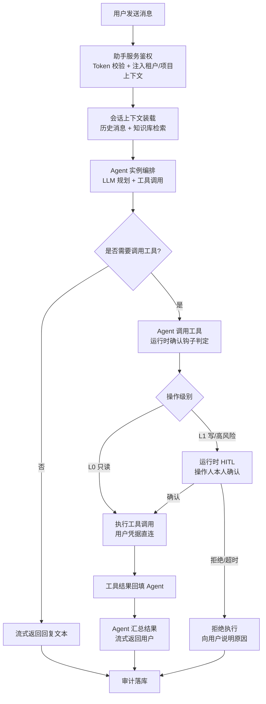

## 4\.2 Agent 实例池（每用户按需实例）

### 4\.2\.1 职责

本层以「**每用户一个 Agent 实例**」的形态运行，一个实例只服务一个用户，是隔离的物理边界。

- **Agent 编排**：执行「接收任务 → LLM 规划 → 调用 Skill → 评估结果 → 汇报」核心循环
- **实例生命周期**：由 Instance Manager 统一管理——按需创建、预热、闲置回收、异常重建；实例 Pod 无状态化，状态（会话 + 记忆）从 DB / 数据目录恢复
- **上下文与记忆**：会话上下文组装与窗口守卫；短期记忆随会话，长期记忆为实例原生记忆（存于该用户独立数据目录）
- **技能调度 / 多通道 / 沙箱**：实例以用户凭据直连 K8s 与薄业务工具，确认由运行时原生 HITL 承担（确认规则由助手服务下发）；Web / IM 消息均落到对应用户实例；脚本执行使用 OpenShell 沙箱

### 4\.2\.2 系统提示词与上下文组装

Agent 系统提示词由助手服务在每次请求时动态组装：

|上下文模块|内容来源|作用|
|---|---|---|
|平台身份|当前用户、租户、项目、角色（实例即用户，身份固定）|限定授权范围与话术|
|平台能力说明|工具（Skill）定义与示例|让 LLM 知道可用能力与调用方式|
|平台知识|知识库 RAG 检索结果|使用引导、报错解释、最佳实践|
|平台实时状态（按需）|一次性工具查询结果|支撑「当前 GPU 是否充足」类实时问题|
|安全约束|禁止事项清单（越权、敏感信息外发等）|护栏，配合 RBAC 与运行时确认兜底|

> 实例与用户一一绑定，实例内注入的「平台身份」是该用户固定上下文；用户切换（如代运维）通过新建/切换实例实现，不共享实例上下文。

### 4\.2\.3 上下文窗口与记忆

**每用户实例的隔离下，记忆管理大幅简化——长期记忆是实例原生的，无需平台侧作用域化存取机制。**

- **短期记忆**：会话内消息按时间序组装，配合 Token 计数与摘要压缩
- **长期记忆**：用户级偏好、常用项目/模型等，由该用户实例**原生记忆**（MEMORY.md / USER.md）承载，存于该用户独立数据目录；实例回收后目录保留，重建后记忆仍在
- **跨会话学习**：同一用户跨会话积累；**跨用户天然隔离**——记忆在各自实例与目录中，物理不可达
- **平台记忆**：巡检历史、RCA 报告、平台变更记录为平台侧只读资产，需要时以「平台上下文」注入（可选），不写入用户实例记忆
- **敏感信息**：实例数据目录加密存储（可选）；会话/记忆不落库 Token、密钥、他人私有资源信息

### 4\.2\.4 与助手服务层的职责边界

|能力|归属|原因|
|---|---|---|
|LLM 规划、工具调用序列|Agent 实例|Agent 核心能力|
|用户级长期记忆|用户实例（原生记忆 + 数据目录）|随实例隔离，跨用户物理不可达|
|权限判定（RBAC）|平台侧（K8s API Server / 业务工具服务端）|以用户真实凭据强制，Agent 无法自报身份或越权|
|工具调用的实际执行|Agent 以用户凭据直连平台能力（K8s / 薄业务工具）|真实用户身份，RBAC 约束，K8s Audit + 业务工具审计|
|高危操作确认（HITL）|Agent 运行时（OpenClaw / Hermes 原生）|操作人本人确认；平台只下发确认规则并接收确认事件|
|会话/报告/审计持久化|助手服务层|平台数据主权|
|知识库检索|助手服务层|可被 Agent 与非 Agent 场景复用|
|实例生命周期管理|Instance Manager|统一生命周期，避免重复创建/泄漏|

### 4\.2\.5 Agent Runtime Adapter

**目的**：将「助手服务层对 Agent 运行时」的依赖收敛为一个窄接口，使 OpenClaw / Hermes / 自研 Agent 平滑替换，隔离机制与记忆管理不依赖具体运行时。

**接口契约**（助手服务层对运行时只依赖这两个方向）：

|方向|契约|说明|
|---|---|---|
|进入|用户消息 + 会话上下文 + 工具清单 → 运行时|助手服务层组装身份、知识、实时状态后下发|
|返回|事件流（`text` / `tool_call` / `tool_result`）|助手服务层解析为 SSE 推送前端，并拦截工具调用执行授权|

**实现要点**：

- 每个运行时实现一个 Adapter（`OpenClawAdapter` / `HermesAdapter` / `SelfAdapter`），将框架 API 翻译成上述契约
- 工具层统一为标准 MCP，各运行时均以 MCP Client 消费，Adapter 无需关心工具差异
- 记忆与隔离边界定义在平台侧（实例化 + 数据目录），不依赖运行时内部实现；运行时记忆工具即使有缺陷，也仅影响该用户自己的实例
- 切换运行时的迁移面：工具定义（MCP）、Workflow（CRD）、会话/审计数据（DB）、实例生命周期（Instance Manager）均不变——仅 Agent 编排语义需适配验证
- 确认机制由运行时原生承担：Adapter 将平台确认规则映射为各运行时的钩子（OpenClaw `before_tool_call`/`requireApproval`、Hermes `pre_tool_call` approve），并把确认事件翻译回助手服务写审计

**选型兼容性（OpenClaw → Hermes 为例）**：两者均以 MCP 消费工具、均支持多会话与独立存储目录（`HERMES_HOME`），满足每用户实例部署要求；通过 Adapter 切换即可，隔离机制不因运行时不同而改变。

## 4\.3 工具与技能层（平台能力直连 + 运行时确认）

### 4\.3\.1 工具接入总览

Agent 以**用户自己的凭据**直连平台能力，等价于「用户自己的 kubectl / 平台 CLI」；需要人工确认的操作由 **Agent 运行时的原生 HITL（确认机制）** 承担，平台不再设置统一授权门：

- **K8s 直连**：实例注入当前用户的 kubeconfig（Secret 挂载，0600），Agent 以该身份调用 K8s API / kubectl / k8s MCP 客户端；权限由 **K8s RBAC + 准入策略** 在 API Server 端强制，操作由 **K8s Audit Log** 记录
- **薄业务工具（可选）**：GPUStack、监控（Prometheus/Loki）、知识库、通知等非 K8s 能力以轻量 MCP server 暴露，按用户 Token 鉴权，服务端复用平台 RBAC 做资源归属校验；只做参数规范化与错误标准化，**不做授权门、不做审批**
- **运行时确认钩子（HITL）**：需要确认的操作由平台下发的钩子规则在运行时拦截——OpenClaw 用 `before_tool_call` + `requireApproval`，Hermes 用 `pre_tool_call` 返回 `{"action": "approve", ...}`；确认人为**操作人本人**（实例所属用户），拒绝/超时默认不执行（fail-closed）

> 简化原则：权限判定交给「凭据 + 平台 RBAC」（真实身份，不可自报），确认交互交给「运行时原生 HITL」（操作人本人），平台只维护「确认规则」与「审计」。

### 4\.3\.2 业务工具清单

自研业务工具封装平台/业务 API，每个工具具备「输入校验、错误标准化、审计埋点」三要素。完整设计集工具分类如下（按阶段启用，见 14）：

|工具名|封装能力|确认级别|说明|
|:--|:--|:--:|:--|
|`cluster.health` / `cluster.nodes`|集群健康、节点列表与状态|L0|只读聚合，含标签/容量/分配|
|`gpu.query`|GPU 池/卡利用率、显存、温度|L0|基于 Prometheus 指标|
|`job.query` / `job.logs`|TrainingJob / InferenceService 列表详情、任务日志|L0|支持按项目/状态过滤；Loki 检索可流式|
|`asset.query` / `storage.query` / `quota.query`|模型/数据集/Checkpoint、存储容量、配额使用|L0|资产中心元数据；Ceph / Lustre|
|`pod.query`|Pod 状态与事件查询（含 CrashLoopBackOff 等异常识别）|L0|—|
|`node.diagnose`|节点异常诊断（只读采集触发）|L0|—|
|`inference.validate`|推理服务自动验证|L0|触发验证任务并返回结果|
|`job.submit` / `job.cancel` / `inference.deploy` / `inference.scale`|创建/取消任务、部署/扩缩推理服务|L1|写操作，运行时确认（操作人本人）|
|`inspection.run` / `workflow.run` / `notification.send`|触发巡检、执行 Workflow、发送通知|L1|按声明判定确认级别|
|`pod.restart`|重建异常 Pod|L1|高风险，运行时强确认|

> 工具清单为完整设计集，按阶段启用（见 14）：L0 只读随第一阶段上线；L1 写/高风险工具随第一阶段运行时确认钩子上线；inspection/workflow 等 AI Ops 工具随第二阶段。新增工具必须通过「工具评审」：明确确认级别、输入校验规则、错误语义与审计字段。

### 4\.3\.3 K8s 直连（用户 kubeconfig）

Agent 持有**用户自己的 kubeconfig**，获得「等效于用户自己 kubectl」的能力；不再做网关聚合与身份代持。

**凭据注入**：实例创建时由 Instance Manager 从平台凭据中心获取该用户 kubeconfig（或绑定该用户 RBAC 的 ServiceAccount kubeconfig），以 Secret 挂载（0600）；凭据定期轮换，用户失效即时吊销（见 ISSUE-015 / ISSUE-016）。

**权限与审计**：API Server 以**用户自身 RBAC** 判定权限；K8s Audit Log 记录真实用户操作；Kyverno / Pod Security Admission 基线（见 9\.6）集群级强制，与请求来源无关。

**确认规则（运行时钩子，按动词映射）**：

|操作|确认级别|说明|
|---|---|---|
|`get / list / watch / logs`|L0|只读直放|
|`apply / patch / scale`（普通资源）|L1|运行时确认|
|`delete`|L1|运行时确认（本人项目资源）|
|`exec / port-forward`|L1|运行时强确认（进入容器 / 端口转发）|
|关键 CRD 写操作（TrainingJob / InferenceService / DevEnvironment）|L1|钩子强制展示参数规范建议 + 运行时确认，避免手写 YAML 错误|

**多重护栏（任一失守仍有兜底）**：

- **RBAC**：用户角色本不具备的权限（跨项目、平台级资源）由 API Server 403，与是否经网关无关
- **准入策略**：Kyverno / PSA 基线禁 privileged / hostPath / hostNetwork 等危险载荷，集群级强制
- **确认规则**：`k8s.delete / exec / apply` 等命中确认规则时，运行时暂停等待操作人确认；规则基于结构化 tool/command 匹配，不由模型自由决定
- **凭据保护**：kubeconfig 0600 + 可选加密；NetworkPolicy 收敛实例出网（见 9\.4），防凭据外带

### 4\.3\.4 权限与确认模型

**权限（由平台强制，与 Agent 无关）**：实例携带用户真实凭据，资源归属校验由 API Server（K8s）与业务工具服务端（非 K8s）基于平台 RBAC 强制执行——Agent 无法访问无权限的租户/项目资源，也无法自报他人身份。

**确认（由运行时承担，操作人本人）**：确认规则表由平台管理员维护，下发为各运行时的钩子配置：

|确认级别|定义|执行方式|
|---|---|---|
|L0 · 只读|不改变平台状态的查询类工具|Agent 直接调用，不拦截|
|L1 · 写/高风险|改变平台状态、删除、重建、exec、跨项目/跨租户影响|运行时 HITL：操作人本人确认后执行；拒绝/超时默认不执行|

**确认判定链（运行时对每次命中规则的工具调用强制执行）**：① 规则匹配（工具名/参数/命令模式）→ ② 暂停运行并弹确认（Claw Desktop / IM / CLI / Portal 内嵌）→ ③ 操作人批准 / 拒绝 / 超时（fail-closed）→ ④ 确认结果回传助手服务写审计。

### 4\.3\.5 运行时确认机制（Human-in-the-loop）

确认交互完全由 Agent 运行时原生承担，平台不建审批任务与审批 API：

- **OpenClaw**：插件 `before_tool_call` 钩子返回 `requireApproval`（title/description/severity/allowedDecisions/timeoutMs）→ 暂停运行，用户在 Claw Desktop / IM 按钮 / `/approve` 命令中批准（allow-once）或拒绝（deny）；超时、无确认通道、未知决策一律拦截（fail-closed）
- **Hermes**：插件 `pre_tool_call` 钩子返回 `{"action": "approve", "message": "...", "rule_key": "..."}` → 进入 Hermes 审批流，CLI/gateway 弹确认；`pre_approval_request` / `post_approval_response` 钩子用于确认事件观测与审计回传
- **确认语义**：确认人恒为**操作人本人**（实例所属用户），不设审批人/审批链；拒绝后 Agent 收到明确「用户拒绝」结果，不得重试同类操作；超时默认不执行
- **Portal 确认**：Portal 入口的用户经助手服务 Adapter 看到 `confirm_pending` 事件，可内嵌确认按钮，由助手服务代理到运行时的审批接口（如 OpenClaw `/approve`），不引入平台审批数据模型
- **确认事件回传**：运行时通过 Adapter 将确认结果（谁、何时、批准/拒绝、原因）回传助手服务，写入审计日志

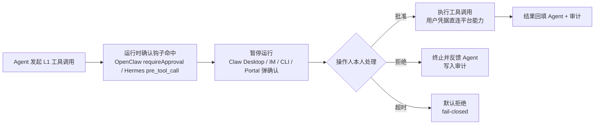

### 4\.3\.6 工具错误标准化

工具统一返回 `{success, data | error}`，错误分类：

|错误类型|说明|Agent 处理建议|
|---|---|---|
|`PERMISSION_DENIED`|无权限（RBAC 拒绝）|说明权限范围，引导授权或联系管理员|
|`USER_DENIED`|操作人拒绝运行时确认|停止该操作，询问用户后续意图|
|`CONFIRM_TIMEOUT`|确认超时未处理|提示用户重新发起并尽快确认|
|`RESOURCE_NOT_FOUND`|资源不存在|提示检查名称/项目是否正确|
|`RATE_LIMITED` / `TIMEOUT`|限流 / 超时|稍后重试或查看平台健康状态|
|`UPSTREAM_ERROR`|下游平台组件异常|提示平台组件状态，避免误导性归因|

## 4\.4 智能运维（AI Ops，第二阶段启用）

### 4\.4\.1 集群健康巡检

**能力**：按预定义巡检策略周期性检查平台运行状态，自动生成巡检报告并通知。

**巡检项（第二阶段预置）**：

|巡检类别|巡检项|数据来源|
|---|---|---|
|Kubernetes 控制面|API Server / etcd / Controller Manager / Scheduler 健康|K8s healthz、组件指标|
|节点|Node Ready、压力（Disk/Mem/PID）|K8s Node 状态|
|GPU|GPU 健康（XID 错误、降级）、利用率、温度、显存|DCGM / 厂商 GPU Exporter|
|Pod|异常 Pod（CrashLoopBackOff / Pending / ImagePullBackOff / OOM）|K8s Pod 状态、事件|
|存储 / 网络|Ceph / Lustre 容量与健康、PVC 使用率；CNI 组件与网卡错误|Ceph Exporter / 组件指标|
|推理服务 / 平台组件|推理服务实例数与就绪数、GPUStack 状态；Harbor / Keycloak / Prometheus / Loki 健康|AI Controller / GPUStack API / 组件指标|

**执行方式**：定时（默认每日 02:00，可配置 Cron）；事件驱动（收到平台告警触发局部巡检）；手动（对话或 Portal 发起）。巡检报告结构化落库（InspectionRun CRD），摘要推送消息中心，异常项按 P0/P1/P2 分级展示；连续多次同项异常自动升级为告警并触发诊断（4\.4\.4）。

### 4\.4\.2 推理服务自动验证

**能力**：对部署完成的推理服务执行标准化可用性验证，作为上线依据。

|验证项|方法|通过标准|
|---|---|---|
|服务启动状态|查询 InferenceService phase|Ready|
|健康检查接口|调用 /health（如有）|HTTP 200|
|推理请求发送|发送 `/v1/chat/completions` 测试请求|成功返回|
|推理结果校验|校验返回结构与内容非空、模型名匹配|符合 Schema|
|响应时间统计|测量首 Token 与总响应时间|P95 < 配置阈值|

**触发**：推理服务上线时自动执行、每日定时抽检、对话手动触发。**输出**：`ServiceValidation` 结果（通过/失败/警告 + 明细），供 Portal 展示，并作为「一键上线」确认依据。

### 4\.4\.3 自动化运维 Workflow

**能力**：将常见运维流程封装为声明式 Workflow，支持预置与自定义扩展，自动执行。

**Workflow 声明（`AssistantWorkflow` CRD）**：`spec.trigger`（manual/cron/event）、`spec.cron`、`spec.event`、`spec.steps`（有序步骤：引用工具 + 参数模板）、`spec.confirmPolicy`（L0/L1 或按步骤指定）、`spec.timeout`（默认 30min）、`spec.retryPolicy`、`spec.notify`、`spec.scope`（all/tenant/project/node-pool）。

**预置 Workflow（第二阶段）**：

|Workflow|说明|确认级别|
|---|---|---|
|`daily-inspection`|每日全量健康巡检（默认 02:00）|L0|
|`inference-validation`|对指定/全部推理服务执行可用性验证|L0|
|`gpu-node-diagnosis`|GPU 节点异常诊断（收集日志、指标、事件并汇总）|L0|
|`cluster-info-gather` / `gpu-usage-report` / `upgrade-precheck`|集群信息收集、GPU 使用率报告、升级前检查|L0|
|`log-collection`|按节点/命名空间/时间窗采集日志并打包|L1|
|`pod-auto-restore`|异常 Pod 自动重建（限 CrashLoopBackOff / ImagePullBackOff 且非用户任务核心）|L1|
|`training-job-cleanup`|过期/已完成训练任务与中间产物清理|L1|

### 4\.4\.4 故障自动诊断与 RCA

**能力**：结合监控数据、日志与事件对平台异常自动分析，输出结构化 RCA 报告。**触发源**：平台告警（Alertmanager → 事件适配器）、巡检报告 P0/P1 异常、用户对话中描述的故障。

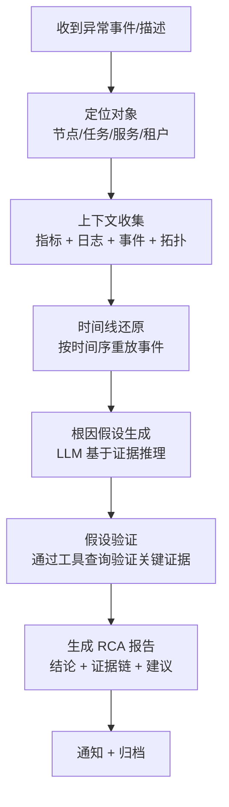

**RCA 报告结构（`RCAAnalysis` CRD）**：`spec.incidentRef`（关联告警/巡检/会话）、`status.phase`（分析中/完成/证据不足）、`status.timeline`（时间线事件）、`status.evidence`（指标快照、日志片段）、`status.possibleCauses`（候选根因及置信度）、`status.rootCause`（最终结论或「需人工介入」）、`status.actions`、`status.confidence`。

**可靠性约束**：RCA 结论必须附带证据链，不得输出无证据支撑的根因结论；置信度 low 时明确提示「需人工核实」。

### 4\.4\.5 自动修复（Auto-Fix）

**能力**：对可安全自愈的异常执行受控自动修复。**自动修复不是无条件的**：

|修复场景|默认行为|确认级别|
|---|---|---|
|推理服务副本异常退出（非用户原因，多次重启仍失败）|通知用户并建议动作|L1（会话确认）|
|节点 NotReady 且为单副本非关键组件|诊断 → 生成建议，不自动操作|L0（仅建议）|
|Pod CrashLoopBackOff（判定为镜像/配置问题，非用户代码问题）|生成修复方案，执行需确认|L1|
|GPU 降级/故障|隔离故障 GPU，通知，不自动重启节点|L1（会话确认）|

**安全护栏**：默认关闭，由管理员在确认规则表中显式开启；仅对白名单 Workflow 生效（`pod-auto-restore` 等）；每次修复动作进审计并推送结果；修复失败不静默——升级为告警并转人工。

## 4\.5 用户智能助手（ChatOps）

### 4\.5\.1 对话问答

自然语言获得平台使用引导与状态解释：**入门引导**（「怎么创建开发环境？」）、**状态查询**（「我的训练任务为什么排队？」）、**报错解释**（粘贴日志/错误码）、**最佳实践**（「训练 70B 模型推荐什么规格？」）。

### 4\.5\.2 自然语言操作

|用户意图|工具调用|确认级别|
|---|---|---|
|「帮我提交一个 GLM-5.2 的微调任务」|asset.query → job.submit|L1|
|「取消任务 t-001」|job.cancel|L1|
|「把 llama3-chat 扩到 4 个副本」|inference.scale|L1|
|「验证一下推荐服务是否正常」|inference.validate|L0|
|「重启那个一直崩的 Pod」|pod.restart|L1|

**操作收敛原则**：只执行用户**明确要求**且**有权限**的操作，不做推测性写操作；写/高风险操作必须经运行时确认（操作人本人），禁止静默执行；操作前展示「计划执行的工具与参数」供操作人确认；工具调用过程与结果透明可解释。

### 4\.5\.3 平台知识库（RAG）

**知识来源**：平台使用手册、FAQ、最佳实践（管理员维护）；运维手册、巡检/验证/故障处理 Sops；模型兼容性矩阵（运行配方）；历史 RCA 报告（去敏后参考）。

**检索流程**：用户消息 → 意图判断 → Embedding 检索 Top-K → 结果注入 Agent 上下文 → LLM 综合回答并标注来源。

**知识治理**：入库前经格式校验与权限标注（公开/租户/内部），避免泄露敏感信息；支持版本更新与过期下线。

## 4\.6 通知与消息

|渠道|用途|实现|
|---|---|---|
|平台消息中心|巡检报告、验证结果、确认请求、RCA 报告（站内）|调用平台消息中心 API|
|邮件|重要报告（P0/P1）与确认请求|SMTP 适配|
|飞书 / 企业微信（可选）|ChatOps 入口与确认处理|IM 机器人适配层|

消息按类型预置模板（巡检摘要、验证结果、确认待办、RCA 结论），支持管理员自定义；内容遵循「先结论后证据、可追溯」原则，重要通知附操作者、时间、资源 ID。

# 5\. API 设计

## 5\.1 REST API 概览

助手模块新增 API 分组 `/api/v1/assistant/*`，复用平台统一鉴权（Keycloak OIDC）、统一响应格式与错误码规范（见主文档 5\.3 / 5\.4）。

|API 分组|接口|方法|说明|
|---|---|---|---|
|会话|/api/v1/assistant/conversations|GET / POST|会话列表 / 创建会话|
||/api/v1/assistant/conversations/\{id\}|GET / DELETE|详情 / 归档|
||/api/v1/assistant/conversations/\{id\}/messages|POST / GET|发送消息（SSE 流式）/ 历史分页|
|工具调用|/api/v1/assistant/tools|GET|当前用户可用工具清单|
||/api/v1/assistant/tool-calls/\{id\}/confirm|POST|Portal 内嵌确认：代理到运行时审批接口（可选，非平台审批系统）|
|巡检|/api/v1/assistant/inspections|GET / POST|任务列表 / 手动触发|
||/api/v1/assistant/inspections/\{id\}|GET|报告详情|
|验证|/api/v1/assistant/validations|GET / POST|验证任务列表 / 发起验证|
||/api/v1/assistant/validations/\{id\}|GET|验证结果详情|
|Workflow|/api/v1/assistant/workflows|GET / POST|清单（预置 + 自定义）/ 注册|
||/api/v1/assistant/workflows/\{id\}/runs|GET / POST|运行记录 / 触发运行|
|RCA|/api/v1/assistant/rca-analyses|GET|RCA 分析列表|
||/api/v1/assistant/rca-analyses/\{id\}|GET|RCA 报告详情|
|实例管理|/api/v1/assistant/admin/instances|GET|实例池状态总览（活跃/预热/回收，运维/管理员）|
||/api/v1/assistant/admin/instances/\{user_id\}|GET|指定用户实例状态（运维/管理员）|
||/api/v1/assistant/admin/instances/\{user_id\}/stop|POST|手动回收实例（运维/管理员）|
||/api/v1/assistant/admin/instances/\{user_id\}/warm|POST|将用户实例加入预热池（运维/管理员）|
|管理|/api/v1/assistant/admin/confirm-rules|GET / PUT|确认规则表管理（平台管理员）|
||/api/v1/assistant/admin/knowledge|GET / POST / PUT|知识库条目管理|
||/api/v1/assistant/admin/llm-config|GET / PUT|助手 LLM 服务配置|
||/api/v1/assistant/audit-logs|GET|审计日志查询（运维/管理员）|

> **实例生命周期对用户透明**：发送消息 / 创建会话时由 Instance Manager 自动确保该用户实例就绪（预热池命中或冷启动），用户无需感知；`POST /messages` 响应头 `X-Assistant-Instance: warming|ready` 用于前端展示「正在唤醒助手…」。

## 5\.2 关键示例

**创建会话**

```json
POST /api/v1/assistant/conversations
{"title": "训练任务排障", "project_id": "proj-001",
 "context": {"resource_type": "training_job", "resource_id": "tj-10086"}}
```

**发送消息（SSE 流式）**

```text
POST /api/v1/assistant/conversations/conv-9f3a/messages
Content-Type: application/json
Accept: text/event-stream
{"content": "帮我查一下 llama3-chat 推理服务现在的状态", "project_id": "proj-001"}

event: message_start   data: {"message_id": "msg-001"}
event: agent_thinking  data: {"text": "正在查询推理服务状态..."}
event: tool_call       data: {"tool": "job.query", "args": {"name": "llama3-chat"}, "level": "L0"}
event: tool_result     data: {"tool": "job.query", "success": true, "summary": "服务已就绪，副本 2/2"}
event: message_delta   data: {"text": "llama3-chat 推理服务当前状态：**Ready**，就绪副本 2/2。"}
event: message_done    data: {"message_id": "msg-001", "tokens_used": 153}
```

> 前端通过 SSE 消费事件流；`tool_call` 事件用于渲染「Agent 正在做什么」的透明过程；写/高风险操作的确认由 Agent 运行时原生 HITL 承担（Claw Desktop / IM / CLI / Portal），助手服务经 Adapter 透出确认状态（`event: confirm_pending` / `event: confirm_resolved`）供前端展示。

## 5\.3 统一响应与错误

复用平台统一响应格式 `{code, message, data, request_id}` 与错误码规范；助手模块新增业务错误码：

|HTTP|业务错误码|说明|
|---|---|---|
|400|45000|对话内容非法 / 参数错误|
|403|45100|工具未授权|
|403|45101|确认被拒 / 已拒绝|
|409|45200|确认已处理（重复确认）|
|422|45300|操作超出用户资源范围（越权目标）|
|429|45400|会话/工具调用限流|
|502|45500|下游平台组件异常（LLM / K8s / 监控）|
|503|45501|助手服务不可用（降级模式）|

# 6\. 数据模型

**存储策略**：会话、消息、确认、审计等高写入量数据存**平台数据服务（DB）+ Redis**；巡检报告、验证结果、RCA 报告、Workflow 等「运维资产」以 **CRD**（`assistant.suanova.io/v1alpha1`）承载，可版本化、可审计、可恢复。

## 6\.1 会话与消息（DB）

**Conversation**：`id`(UUID)、`user_id / tenant_id / project_id`（隔离键）、`title`、`status`（active/inactive/archived/closed）、`context`(json)、`model_config`(json)、时间戳。

**Message**：`id`、`conversation_id`、`role`（user/assistant/tool/system）、`content`、`tool_calls`(json)、`token_usage`(json)、`error`(json)、`created_at`。

## 6\.2 工具调用与确认（DB）

**ToolCallRecord**（审计性质）：`id`、`conversation_id / message_id`、`tool`、`args`、`level`（L0/L1）、`status`（pending/executed/denied/failed/timeout）、`result`(json)、`confirm`(json：操作人、时间、决策、原因)、`duration_ms`、`created_at`。

> 确认机制由 Agent 运行时原生承担，平台不再维护 ApprovalTask；确认结果经 Adapter 回传，写入 `ToolCallRecord.confirm` 与审计日志（见 9.7）。

## 6\.3 巡检定义与报告（CRD）

**AssistantInspection / InspectionRun**：`spec.scope`（all/node-pool/tenant/project）、`spec.items`（启用的巡检项，见 4\.4\.1）、`spec.schedule.cron`、`status.phase`（Pending/Running/Completed/Failed/Cancelled）、`status.items`（各项结果与证据）、`status.summary`（异常数、P0/P1/P2 计数）、`status.reportUrl`、`status.conditions`。

## 6\.4 验证任务与结果（CRD）

**ServiceValidation**：`spec.serviceRef`（目标 InferenceService）、`spec.cases`（默认：健康检查/推理请求/结果校验）、`spec.passThreshold`（P95、成功率）、`status.phase`（Pending/Running/Passed/Failed/Warning）、`status.results`（各用例明细）、`status.startedAt / finishedAt`。

## 6\.5 运维 Workflow（CRD）

**AssistantWorkflow** 定义见 4\.4\.3；**AssistantWorkflowRun**：`spec.workflowRef`、`spec.trigger`（manual/cron/event/approval）、`status.phase`（Pending/Running/AwaitingApproval/Succeeded/Failed/Cancelled）、`status.stepResults`、`status.currentStep`、`status.approvalRef`、`status.error`。

## 6\.6 RCA 报告（CRD）

**RCAAnalysis** 定义见 4\.4\.4：`spec.incidentRef`、`status.phase / timeline / evidence / possibleCauses / rootCause / actions / confidence`。

## 6\.7 审计日志（DB）

**AuditLog**：`id / timestamp`、`actor`（用户/系统/Workflow）、`action`（chat/tool_call/approve/workflow_run/config_change）、`target`（资源类型 + ID）、`detail`、`result`、`ip / user_agent`。

保留策略：热数据 90 天，冷数据归档 1 年（可调）；仅管理员可查询，禁止修改与删除。

## 6\.8 AssistantInstance（用户实例，DB + K8s 对象）

记录每用户 Agent 实例的运行状态，由 Instance Manager 维护。实例 Pod 对应一个 K8s Pod 与一个用户数据目录（PV / 共享存储子目录）。

|字段|说明|
|---|---|
|user_id|实例归属用户（1:1）|
|status|Pending / Warming / Running / Idle / Stopping / Stopped / Failed（见 8\.6）|
|instance_ref|K8s Pod 引用（名称 / 节点）|
|data_dir|该用户数据目录（HERMES_HOME 挂载路径）|
|memory_usage|实例资源占用（CPU / 内存）|
|last_activity_at / idle_timeout|最后活跃时间（驱动闲置回收）/ 回收时长（默认 30min）|
|warm_pool|是否为预热池成员（bool）|
|start_count / last_error|累计启动次数 / 最近异常信息|
|created_at / updated_at|时间戳|

# 7\. 时序图

> 阶段说明：7.1 / 7.2 为第一阶段（对话 + L0/L1 工具 + 运行时确认）；7.3 巡检、7.4 验证、7.5 RCA 为第二阶段能力。

## 7\.1 用户对话与只读工具调用

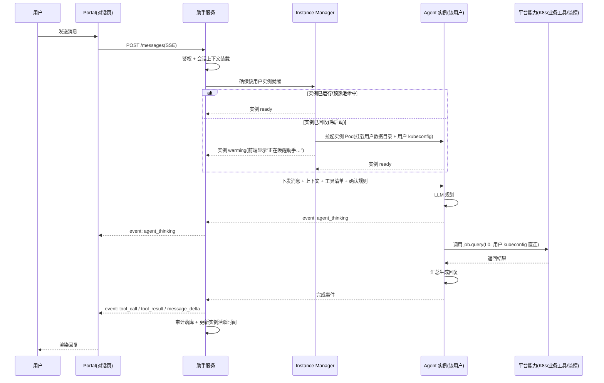

## 7\.2 高风险操作确认流（运行时 HITL）

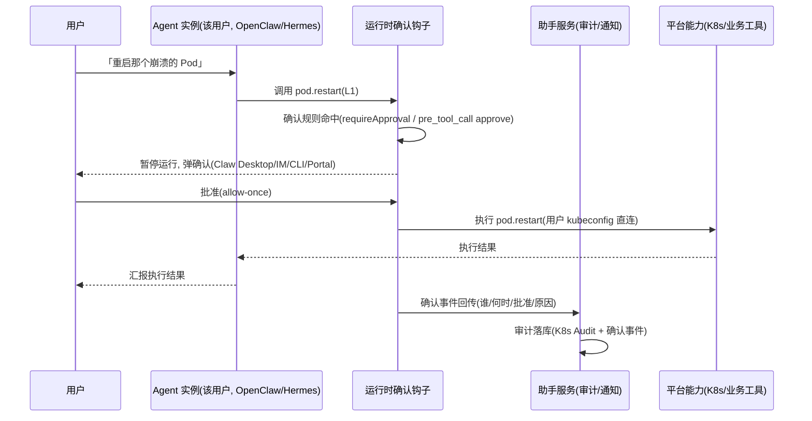

## 7\.3 每日巡检

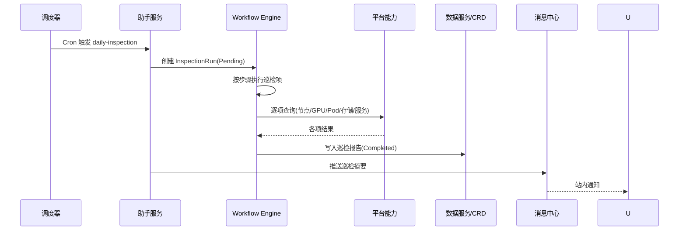

## 7\.4 推理服务自动验证

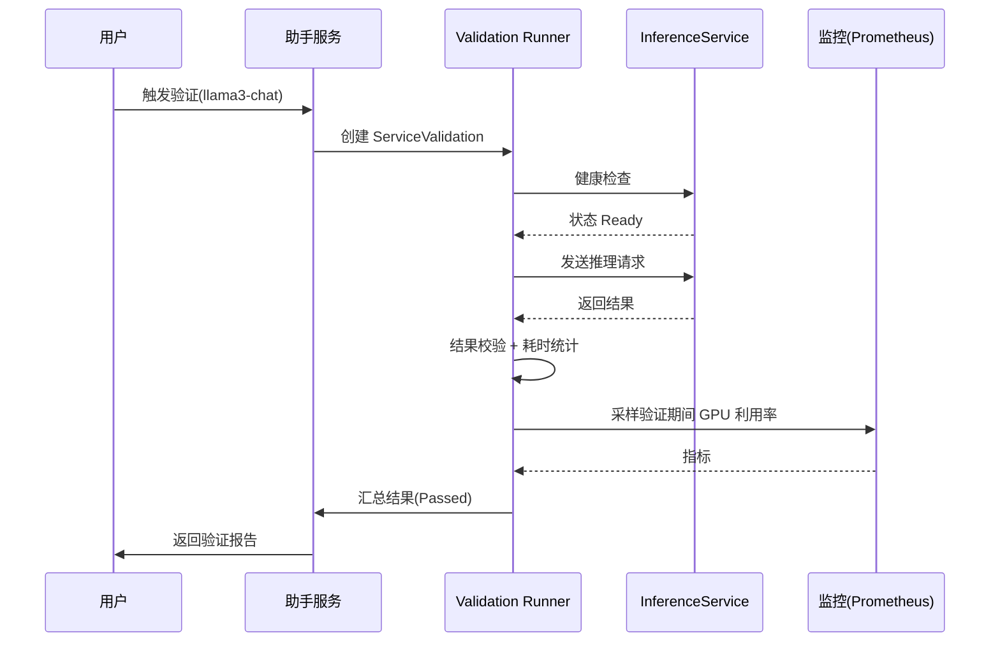

## 7\.5 告警触发自动诊断与 RCA

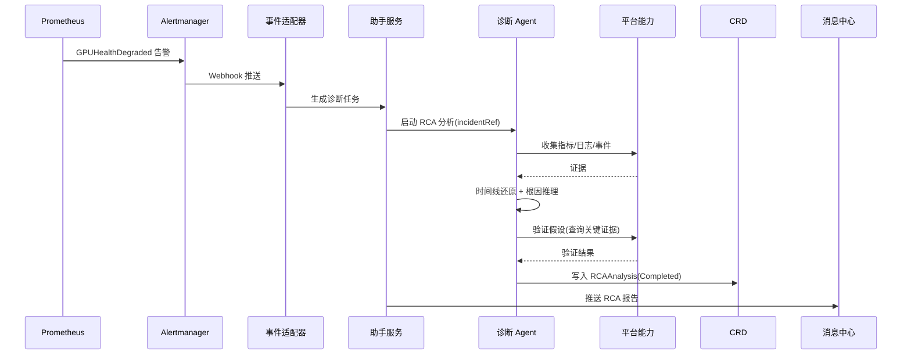

# 8\. 状态机设计

## 8\.1 会话状态机

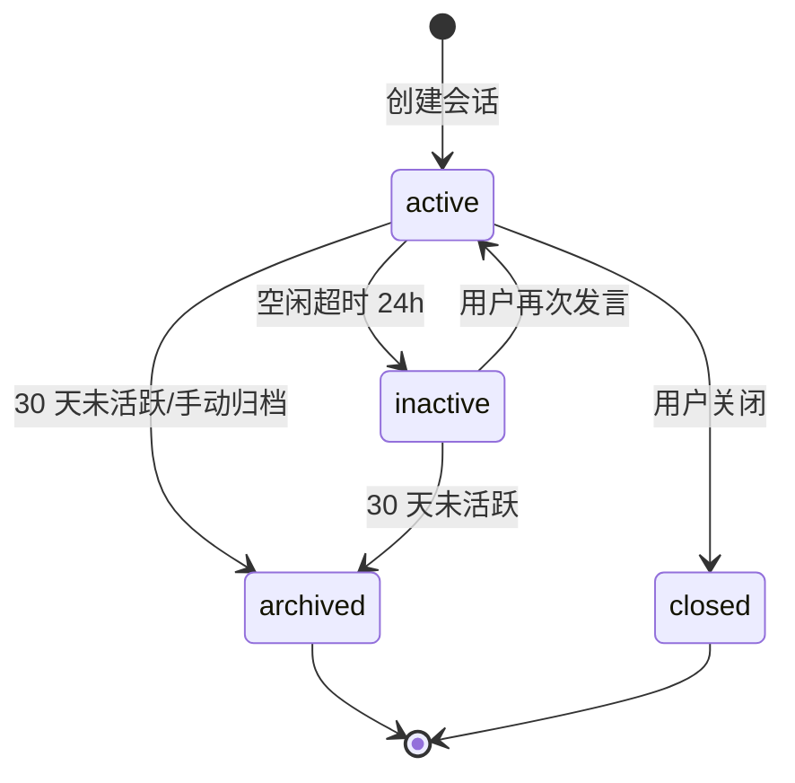

## 8\.2 工具调用/确认状态机

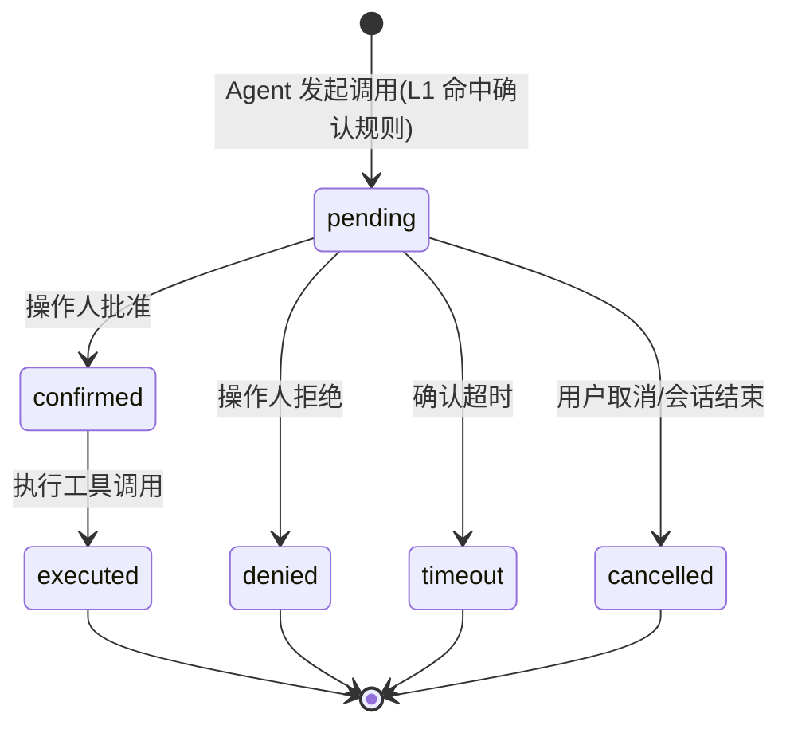

## 8\.3 Workflow Run 状态机

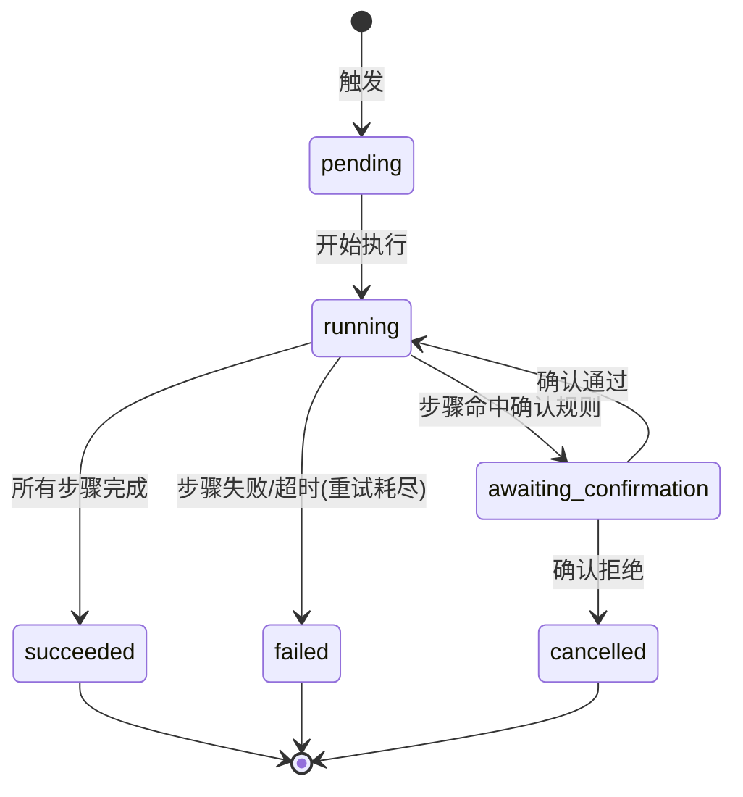

## 8\.4 巡检任务状态机

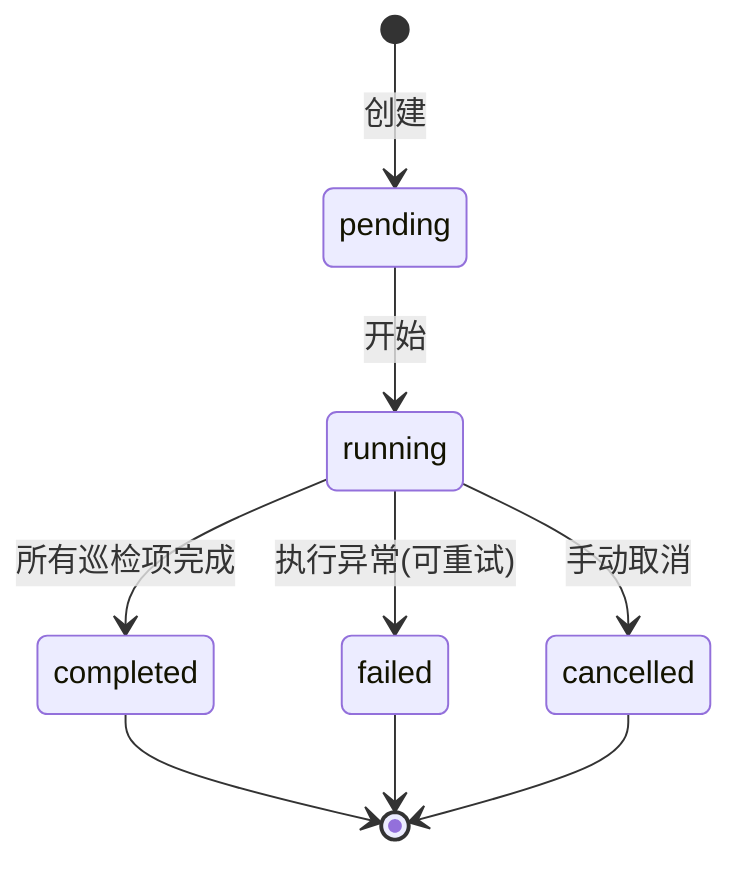

## 8\.5 验证任务状态机

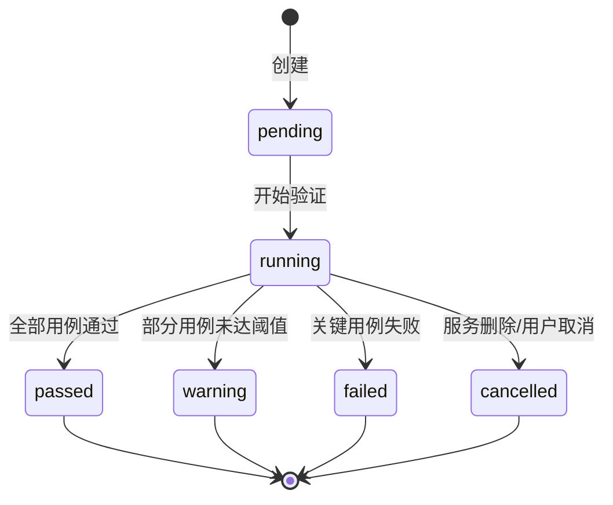

## 8\.6 Agent 实例生命周期状态机

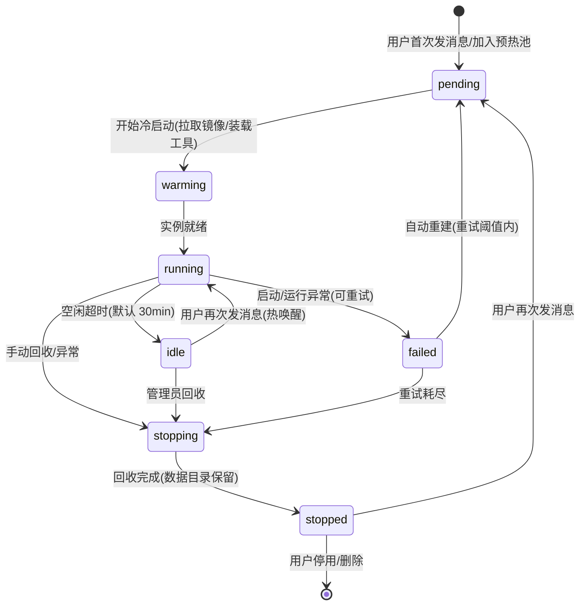

|状态|说明|触发条件|
|---|---|---|
|Pending|等待创建|首次消息、预热池调度|
|Warming|冷启动中|实例 Pod 创建、镜像/工具装载|
|Running|实例就绪，可服务会话|就绪探针通过|
|Idle|Pod 仍存活，空闲待回收|超过闲置阈值无活动|
|Stopping|回收中|闲置回收 / 管理员操作 / 异常|
|Stopped|Pod 已终止（数据目录保留）|回收完成|
|Failed|启动/运行异常|崩溃、资源不足、数据目录异常|

# 9\. 安全设计

## 9\.1 身份与授权

- 统一 Keycloak OIDC 鉴权，助手服务从 Token 解析 `user_id / tenant_id / project_id / role`，**不信任客户端自报身份**
- 工具调用的资源归属校验复用平台 RBAC：目标资源必须属于用户有权访问的命名空间/项目
- 实例持有的平台凭据为**用户自己的最小范围凭据**（kubeconfig / Token，仅该用户 RBAC 对应权限）；凭据以 Secret 注入（0600）、定期轮换、用户失效即时吊销（见 4\.3\.3），禁止使用集群管理员凭据

## 9\.2 权限与确认

- 权限由「用户凭据 + 平台 RBAC」强制：K8s 操作经 API Server 端 RBAC + Kyverno/PSA 准入（见 9\.6）；非 K8s 业务工具服务端做资源归属校验；Agent 无法访问无权限资源、无法自报身份
- 确认由**运行时原生 HITL** 承担：平台下发确认规则（工具名/参数/命令模式 → L1），OpenClaw `before_tool_call`/`requireApproval`、Hermes `pre_tool_call` approve 命中后暂停运行，**操作人本人**批准/拒绝；拒绝/超时默认不执行
- 平台管理员维护确认规则表，变更即时生效并记录审计

## 9\.3 敏感操作确认

- 所有写/高风险操作必须**操作人本人确认**（运行时 HITL），确认界面展示操作说明、参数与影响面
- 确认人恒为操作人本人，不设审批人/审批链；确认动作（谁、何时、批准/拒绝、原因）经运行时钩子回传助手服务写审计
- 超时默认不执行（fail-closed）：OpenClaw 确认超时默认拒绝（2min，上限 10min）；Hermes manual 模式等待用户处理；确认被拒后 Agent 不得重试同类操作

## 9\.4 会话与数据隔离（物理隔离）

**隔离模型：每用户一个 Agent 实例，隔离边界为「进程 + 数据目录」的物理边界。** 不依赖 Agent 框架自身的多租户或记忆能力，从机制上消除跨用户数据可达性。

|隔离维度|实现机制|
|---|---|
|**进程隔离**|每个用户运行独立实例 Pod，互不共享进程与内存；实例仅持该用户自己的凭据（kubeconfig / Token，Secret 注入 0600）|
|**存储隔离**|每个用户拥有独立数据目录（HERMES_HOME / 记忆文件），挂载于该用户实例；不同用户目录由存储层 ACL/配额强制隔离（必选），即使实例被绕过也无法读取他人数据目录|
|**会话隔离**|会话数据按 `user_id + tenant_id + project_id` 强隔离（DB 层），跨租户会话互不可见|
|**框架不可信假设**|即使 Agent 运行时的记忆/工具存在缺陷（如记忆越权写入），也只影响该用户自己的实例与目录，无法越出物理边界|
|**知识库权限**|知识库条目按权限标注（公开/租户/内部），RAG 检索结果按用户权限过滤|
|**资源归属校验**|工具调用仍受资源归属校验约束，Agent 无法查询无权限的租户/项目资源|
|**敏感内容**|历史消息、RCA 报告含敏感内容时，展示与导出均受权限控制|

**实例直连范围收敛（防凭据外带与越权）**：① 凭据最小化——实例仅持该用户 kubeconfig / Token（Secret 注入 0600），权限等同用户自身；② 出网收敛——NetworkPolicy 白名单仅 K8s API / 薄业务工具 / LLM / 平台内网服务，禁公网与未知目标；③ 确认护栏——高危操作必须经运行时确认钩子，模型无法绕过；④ 凭据保护——kubeconfig 可加密存储，实例内禁止外发，读取行为入审计。

> **为什么不用共享实例 + 逻辑隔离**：逻辑隔离靠「会话绑定 + RBAC 约束 + 记忆作用域化」在共享实例内模拟隔离，正确性依赖多层补偿控制——任何一个环节遗漏（如框架记忆工具越权读写、上下文串扰）都可能跨用户泄露；物理隔离把边界放到实例本身，隔离「免费获得、可审计、出错只影响单个用户」，平台只需维护「一用户一实例一目录」的极简机制。

## 9\.5 Prompt 注入防护

- **输入护栏**：用户输入与平台注入的系统指令区分处理；对可疑指令注入模式（「忽略之前指令」「输出系统提示词」）做检测与标注
- **输出护栏**：工具返回的非信任内容（日志、错误信息）作为**数据**而非指令传入 LLM，由助手服务显式标记
- **行为兜底**：即使发生提示注入，权限受 RBAC 约束（无法越权），高危操作必须经运行时确认（无法静默执行）

## 9\.6 沙箱执行与实例加固

**实例 Pod 加固基线**（所有用户实例强制）：

```yaml
spec:
  automountServiceAccountToken: false
  securityContext:
    runAsNonRoot: true
    seccompProfile: {type: RuntimeDefault}
  containers:
    - securityContext:
        allowPrivilegeEscalation: false
        capabilities: {drop: ["ALL"]}
        readOnlyRootFilesystem: true
      volumeMounts: [仅挂该用户数据目录 + 用户 kubeconfig(Secret, 0600)]  # 无 hostPath
# 配套 NetworkPolicy：egress 白名单仅 K8s API / 薄业务工具 / LLM / 平台内网
# 镜像基线：最小化，含 kubectl / k8s MCP 客户端
```

**本地工具收敛**：Hermes/OpenClaw 自带本地工具（Shell、文件）在实例内以用户身份执行（持用户 kubeconfig），作用域受用户 RBAC 约束；可用 disabled_toolsets 收窄；框架内置危险命令表仅覆盖终端命令，K8s 语义操作（如 kubectl delete）由平台下发确认钩子覆盖。

**危险载荷护栏（集群级）**：所有用户命名空间启用 Pod Security Admission（restricted）+ Kyverno 基线策略——禁 privileged / hostPath / hostNetwork / hostPID、限镜像仓库、强制资源 limits。该护栏与请求来源无关（Agent 直连、业务工具、人工 kubectl 同样受约束）。

**脚本沙箱**：需执行脚本/命令的运维场景统一在 OpenShell 沙箱执行；网络白名单、文件系统隔离、CPU/内存限额、执行审计，禁止访问平台凭据与宿主机敏感路径。

## 9\.7 审计

- 全链路审计：会话消息、工具调用（含参数）、确认动作、Workflow 执行、配置变更、知识库变更
- 审计日志仅管理员可读、不可修改、不可删除，保留策略见 6\.7；与平台 K8s Audit Log 互为补充

## 9\.8 LLM 与数据安全

- 助手 LLM 私有化部署，对话数据不出内网；LLM 请求按会话用户隔离，禁止跨会话上下文串扰
- 对 LLM 输出做内容合规检查（敏感信息、越权建议）；模型服务凭据加密存于 K8s Secret / Vault，最小权限引用

## 9\.9 限流与防滥用

|维度|策略|
|---|---|
|会话级|单会话并发 1 条消息（串行），防重复提交|
|用户级|单用户消息速率限制（如 20 msg/min），超限提示|
|实例级|单用户同时活跃实例 1 个；实例空闲默认 30min 回收；每实例会话上限（默认 200 轮）|
|工具级|单工具调用频控（如 job.submit 1/min），防误触发|
|LLM 级|助手 LLM 服务独立配额，防单会话耗尽平台推理资源|
|确认级|同一资源重复确认请求合并/去重|
|直连级|单用户维度聚合频控（含 K8s 直连调用），防单用户压垮 API Server 或 LLM|
|实例池级|并发活跃实例数上限（按 Infra 容量配置），防实例风暴；Instance Manager 单主限流创建|

## 9\.10 错误处理与降级

**原则：助手模块是平台的「锦上添花」能力，任何情况下不得反向拖垮平台。** 助手服务对下游实施超时、重试、熔断与降级：

|下游|超时|重试|降级策略|
|---|---|---|---|
|Agent 实例冷启动|拉起 60s|2 次|返回「助手唤醒失败，请稍后重试」，记录实例异常；不影响其他用户实例|
|助手 LLM 服务|首 Token 15s / 总 60s|1 次|不可用返回「助手暂时不可用」并引导至文档/工单|
|K8s / AI Controller API|10s|2 次（指数退避）|提示平台控制面异常，不继续编排|
|Prometheus / Loki|5s|1 次|返回「监控数据暂不可用」，跳过依赖数据的问题|
|GPUStack API|10s|2 次|提示推理平台异常|
|消息中心|5s|1 次|审计记录待发通知，恢复后补发|

- **熔断**：单一下游连续失败超阈值（默认 5 次/30s）触发熔断，快速失败并告警，恢复探测通过后放行
- **实例级降级**：单用户实例启动失败不影响其他用户；实例池整体过载时新会话排队，恢复后执行
- **会话降级**：LLM 不可用时降级为「关键字兜底 + 知识库直接命中 + 人工入口」，保证基础问答可用
- **幂等**：工具调用与 Workflow 执行具备幂等性，失败重跑不产生重复副作用（写操作以业务 ID 去重）

# 10\. 可观测性

## 10\.1 监控指标

|指标类别|指标|来源|
|---|---|---|
|对话/体验|会话数、消息数、首 Token 延迟、回复总延迟、流式中断率|Assistant Service / LLM 指标|
|智能|工具调用次数、成功率、L0/L1 分布、确认率、确认等待耗时|运行时 / Assistant Service 指标|
|成本|LLM Token 消耗（输入/输出）、模型调用次数|Assistant Service / 助手 LLM 指标|
|运维|巡检执行时长、巡检异常项分布、验证成功率、RCA 置信度分布|Controller / CRD 指标|
|实例池|活跃/预热/回收实例数、冷启动时长（P95）、闲置回收率、实例重建率、每实例资源占用|Instance Manager 指标|
|资源|助手服务 CPU/内存/并发、实例池资源、助手 LLM GPU 利用率|常规资源指标|

## 10\.2 日志与追踪

- 助手服务结构化日志（含 `conversation_id / user_id / tool_call_id` 关联字段）、Agent 运行时日志（OpenClaw / Hermes）分级采集，接入 Loki
- 工具调用与确认事件写入审计日志（见 6\.7），与运行日志分离；热数据 7 天、冷数据 30 天（可调）
- 链路追踪：OpenTelemetry，覆盖「入口 → 助手服务 → Agent → LLM → 平台 API（K8s / 薄业务工具）」；关键 span：LLM 调用、工具调用、确认等待；复用平台追踪后端（Jaeger / Tempo，见主文档 11\.4【待补充】）

## 10\.3 告警

|告警|级别|触发条件|
|---|---|---|
|助手 LLM 服务不可用|P1|健康检查失败 / 连续超时|
|助手服务高延迟|P1|P95 首 Token 延迟 > 5s 持续 5min|
|工具调用失败率升高|P2|失败率 > 10% 持续 10min|
|确认积压|P2|待确认操作 > 20 且存在超时风险|
|Token 消耗异常增长|P2|环比增长 > 200%|
|会话数据/审计写入失败|P1|DB 写入连续失败|

# 11\. 性能与容量

## 11\.1 性能指标

|指标|目标值|测量方式|
|---|---|---|
|对话首 Token 延迟|P95 < 3s|端到端（入口 → LLM）|
|对话完整回复延迟|P95 < 15s|端到端|
|工具调用执行延迟|P95 < 5s|工具级|
|单会话并发 / 用户吞吐|1 条/会话 / 20 msg/min|串行约束 / 限流阈值|
|实例冷启动（预热池命中 / 完全冷启）|P95 < 1s / < 15s|Instance Manager|
|助手 LLM 吞吐 / 巡检全量执行|【待补充】tokens/s / < 15min（中规模）|压测|

## 11\.2 容量规划

|资源|估算方法|建议|
|---|---|---|
|Agent 实例池（CPU/内存）|按**并发活跃用户数**估算：单实例约 0.5~1 vCPU / 1~2 GB；冷启动并发取峰值系数|活跃实例数 = 并发对话用户数 + 预热池大小；按 Infra 容量设实例池上限|
|预热池|按高频活跃用户数配置（如 Top 5% 用户常驻预热）|与空闲回收时长联动，兼顾体验与成本|
|每用户数据目录|单用户记忆/配置约 50~200 MB，预留成长|按用户数 × 单用户配额（默认 1 GB）规划共享存储|
|助手服务（CPU）|单副本支撑 ~50 并发会话|2 副本起步，随用户量横向扩展|
|助手 LLM GPU|日均 Token × 峰值系数 / 单卡吞吐|独立推理节点 ≥ 1 张 80G 级 GPU（视模型规格）|
|会话/审计存储|消息量 × 平均大小 + 审计 90 天保留|DB 扩容，归档策略见 6\.7|
|知识库向量存储 / Redis|文档数 × 分块 × 维度；热点上下文缓存|按规模规划，支持水平扩展|

## 11\.3 性能优化方向

- **首 Token 优化**：LLM 启用 Continuous Batching / Prefill 优化；精简系统提示词 Token
- **知识库缓存**：高频 FAQ 直接缓存，减少检索与 LLM 开销
- **工具调用聚合**：同类只读查询（集群 + GPU + 任务总览）聚合为单次调用，减少往返
- **异步化**：报告生成、RCA 分析、长任务执行异步化，对话不阻塞
- **限流分层**：见 9\.9，防单用户耗尽共享资源

# 12\. 测试设计

## 12\.1 测试分层

|测试层级|测试内容|执行时机|
|---|---|---|
|单元测试|确认规则匹配、错误标准化、会话管理逻辑|每次代码提交|
|集成测试|运行时确认钩子 ↔ 平台 API 直连适配、助手服务 ↔ Agent 运行时、确认与审计链路|每次 PR / 每日构建|
|E2E 测试|完整对话流（问答 → 工具调用 → 确认 → 执行 → 汇报）、巡检、验证、RCA|版本发布前|
|智能评测|意图识别、工具选择、拒绝越权、回复质量评测集|版本发布前 / 定期回归|
|安全 / 性能 / 故障注入|Prompt 注入、越权、确认绕过、隔离、沙箱逃逸；并发与 LLM 吞吐；下游故障、确认超时|版本发布前 / 定期|

## 12\.2 关键测试场景

**功能**：对话问答正确返回；只读/写/高风险工具按确认级别正确执行与拦截；确认（批准、拒绝、超时默认不执行、重复确认去重）；会话创建/续接/归档/并发限制；**实例生命周期**（冷启动、预热池命中、闲置回收、重建后会话/记忆恢复、手动回收）；**物理隔离**（用户 A 实例无法访问用户 B 数据目录/记忆/会话；实例凭据越权操作被 RBAC 拒绝）；巡检/验证/RCA/自动修复全流程；Workflow 注册执行与失败重试。

**智能评测（重点）**：越权场景（请求无权限项目资源 → 拒绝并说明）；指令注入（嵌入「忽略系统指令」→ 行为不被污染）；歧义场景（意图不清主动澄清而非猜测执行）；错误归因（下游故障不被误报为用户问题）。

**可靠性**：助手 LLM 宕机 → 降级问答可用、主链路告警；下游故障 → 熔断快速失败不拖垮平台；Agent 实例 Pod 被杀/重启 → 上下文与记忆恢复、无重复副作用；Instance Manager 重启 → 实例状态对账恢复、无重复创建；实例池容量打满 → 新会话排队、实例风暴受限；冷启动并发（早高峰集中登录）→ 创建不超限、预热池生效。

# 13\. 部署设计

## 13\.1 部署形态

助手模块（CubePilot）以 Helm Chart（`cubepilot`）交付，纳入平台总装 Chart 依赖管理，随平台一键部署：

|组件|Chart 子项|副本|说明|
|---|---|---|---|
|Assistant Service|`assistant-service`|2|无状态，水平扩展|
|Instance Manager|`assistant-instance-manager`|1（Leader）|Agent 实例生命周期管理（Controller 模式）|
|Agent 实例池|`agent-runtime`（OpenClaw / Hermes，每用户一个实例）|按需 0~N|用户级 Pod，实例镜像 + 每用户数据目录 + 用户 kubeconfig 注入；闲置回收|
|薄业务工具服务（可选）|`assistant-business-tools`|2|非 K8s 工具（GPUStack/监控），按用户 Token 鉴权|
|用户凭据管理|`assistant-credential-sync`|1（Leader）|按用户 RBAC 生成/轮换 kubeconfig 与 Token，Secret 注入实例|
|调度器|`assistant-scheduler`|1（Leader）|定时巡检/验证/RCA 触发|
|知识库服务|`assistant-knowledge`|2|Embedding + 向量库（外部依赖可选）|
|助手 LLM 服务|`assistant-llm`（InferenceService）|1~N|独立推理池，HPA 扩缩（共享）|

## 13\.2 依赖组件

- **平台既有**：Keycloak、数据服务、Redis、消息中心、Prometheus / Loki / Alertmanager、K8s、AI Controller、GPUStack
- **新增**：向量数据库（【待补充】选型）、助手 LLM 模型镜像（含工具调用能力）、BGE Embedding 模型、Agent 实例镜像（含 OpenClaw / Hermes 运行时 + kubectl / k8s MCP 客户端）、用户 kubeconfig 生成与轮换机制（按用户 RBAC）
- **集群级护栏**：随平台集群交付 Kyverno / Pod Security Admission 基线策略；用户 kubeconfig 按用户 RBAC 最小权限生成，定期轮换审计
- **存储依赖**：每用户数据目录依赖共享文件系统（Lustre / NFS）或动态 PVC（按用户动态创建）
- **离线交付**：所有镜像、模型文件、Helm Chart 随安装包内化（见主文档 14\.5）

## 13\.3 升级与回滚

- **升级顺序**：CRD → Instance Manager / Controller / 调度器 → Assistant Service / 薄业务工具 → Agent 实例镜像（含 kubectl / k8s 客户端版本）→ 前端
- **Agent 实例滚动升级**：实例为无状态 Pod（状态在 DB / 数据目录），升级实例镜像 = 滚动重建实例，会话与记忆不受影响；可分批灰度（先预热池，后按用户）
- **向后兼容**：Conversation / Audit / AssistantInstance 数据模型向前兼容；工具定义变更兼容旧会话
- **回滚**：`helm rollback` 分钟级回滚；CRD 变更遵循多版本并存 + Conversion Webhook（见主文档 6\.7）
- **LLM 模型升级**：独立于平台升级，经助手 LLM 服务滚动替换，评测集通过后生效

## 13\.4 离线部署

- 助手 LLM / Embedding 模型以离线模型文件随安装包提供，支持从内置模型库选择版本
- 向量数据库、薄业务工具镜像、Agent 实例镜像（OpenClaw / Hermes + kubectl / k8s MCP 客户端）全部离线化
- 每用户数据目录底层存储（Lustre / NFS / PVC）随平台存储体系就绪，首次部署自动创建目录规划与权限模板
- 首次部署自动完成：助手 LLM 服务创建 → 知识库初始化（导入内置文档）→ 预置 Workflow 注册 → 默认确认规则下发 → Instance Manager 预热池初始化

# 14\. 阶段划分与范围

> 原则：第一阶段只做 MVP——非必要能力一律后置；确认闭环治理、AI Ops、自动修复、IM 通道均不在第一阶段实现（运行时原生确认随第一阶段上线）。

## 14\.1 第一阶段（MVP）：对话式助手

**做（仅以下）**：
- 每用户按需实例池：Instance Manager + 用户级实例 + 冷启动/闲置回收（预热池可选）
- 实例注入用户凭据直连 K8s：用户 kubeconfig（Secret 挂载 0600）+ 只读查询自动执行（get/list/watch/logs）
- 运行时确认钩子（HITL）：OpenClaw `before_tool_call`/`requireApproval`、Hermes `pre_tool_call` approve，覆盖写/高风险操作（apply/patch/scale/delete/exec、业务写工具），**操作人本人确认**；Kyverno/PSS 基线随集群交付
- 对话问答 + 自然语言操作（ChatOps）：L0 只读自动执行、L1 写/高风险操作运行时确认
- 平台知识库（RAG）基础问答
- 全链路审计（会话、工具调用、确认动作、执行结果）
- 通知（站内消息中心 + 邮件）；入口：Portal 对话页 / 悬浮窗

**不做**：
- 平台审批系统（审批任务 / 审批 API / 审批链）——确认由运行时原生承担，不再自建
- AI Ops（巡检、推理服务验证、Workflow、RCA、自动修复）→ 第二阶段
- IM 通道（飞书 / 企业微信）→ 第二阶段
- 多运行时确认规则统一治理、确认事件审计回传完善 → 第二阶段

## 14\.2 第二阶段：智能运维与确认闭环完善

- 确认闭环完善：多运行时确认钩子统一治理（规则表下发、确认事件审计回传完备）；IM 通道（飞书 / 企业微信）确认 + ChatOps
- AI Ops：每日巡检、推理服务自动验证、预置 Workflow、故障诊断与 RCA
- 自动修复（Auto-Fix）白名单受控启用（修复动作需运行时确认）
- 实例池优化：预热池动态调优、冷启动镜像预拉取、实例资源弹性；复杂运维流程可视化编排（ClawFlow，可选）

## 14\.3 第三阶段：自研 Agent 演进

- 经 Agent Runtime Adapter 平滑切换运行时（OpenClaw → Hermes → 自研），隔离与记忆机制不变，确认机制随 Adapter 统一
- 事件驱动自动化闭环（告警 → 诊断 → 处置 → 复盘）；自动处置动作按确认规则受控执行
- 多 Agent 协同（巡检 / 诊断 / 执行分工）
- 基于监控数据的主动预测性运维（容量预测、故障预判）

# 15\. 待解决问题

|编号|问题描述|优先级|状态|备注|
|---|---|---|---|---|
|ISSUE-001|助手 LLM 模型选型（Qwen / DeepSeek 等）与规格（显存/吞吐）评估|高|待评估|需支持 Function Calling，完全离线部署|
|ISSUE-002|Embedding 模型与向量数据库选型（Milvus / Qdrant / 其他）|中|待评估|知识库规模与检索性能权衡|
|ISSUE-003|Agent 实例池与 Instance Manager 设计验证（冷启动/预热/回收/实例风暴上限）|高|待设计|含实例数上限、Leader Election、对账逻辑|
|ISSUE-004|OpenShell 沙箱在 K8s 环境的适配与网络白名单配置|中|待验证|gVisor 在目标内核的兼容性；实例内沙箱|
|ISSUE-005|确认规则集细化（哪些工具/命令/参数需确认，开放范围）|中|待设计|与安全团队评审默认开放范围|
|ISSUE-006|自动修复白名单与安全边界细则（哪些场景允许 Auto-Fix）|高|待设计|需与运维团队评审|
|ISSUE-007|IM 通道（飞书/企业微信）接入范围与安全审计要求|低|待确认|第一阶段可不做|
|ISSUE-008|知识库初始内容整理与权限标注流程|中|待补充|需平台文档团队协作|
|ISSUE-009|助手 LLM 服务与用户推理服务在推理池的隔离策略复核|高|待验证|避免相互影响|
|ISSUE-010|对话/审计数据的加密与保留策略细化|中|待补充|合规要求确认|
|ISSUE-011|每用户数据目录底层存储选型（Lustre / NFS / PVC）与容量/权限设计|高|待设计|目录权限隔离、配额、备份策略|
|ISSUE-012|实例凭据保护与出网收敛验证（kubeconfig 0600/加密、NetworkPolicy 白名单、防凭据外带用例）|高|待设计|含凭据轮换与吊销流程|
|ISSUE-013|预热池大小与空闲回收参数调优（体验 vs 成本）|中|待调优|按用户活跃度画像配置|
|ISSUE-014|Agent Runtime Adapter 契约与 OpenClaw / Hermes 迁移验证|中|待验证|进入/返回契约、事件流语义对齐|
|ISSUE-015|用户 kubeconfig 注入与轮换机制（生成/挂载/吊销/轮换）及 k8s 客户端（kubectl / k8s MCP）选型|高|待设计|含凭据中心或按用户 SA 方案|
|ISSUE-016|用户凭据最小权限与轮换审计（按用户 RBAC 生成 kubeconfig，失效即时吊销）|高|待设计|定期审计凭据范围|
|ISSUE-017|确认规则动词映射表初始内容与评审（delete/exec 细化）|高|待设计|与 4\.3\.3 对齐，安全团队评审|
|ISSUE-018|工具描述消毒/覆盖策略实现|中|待设计|防描述投毒；业务工具描述以平台登记为准|
