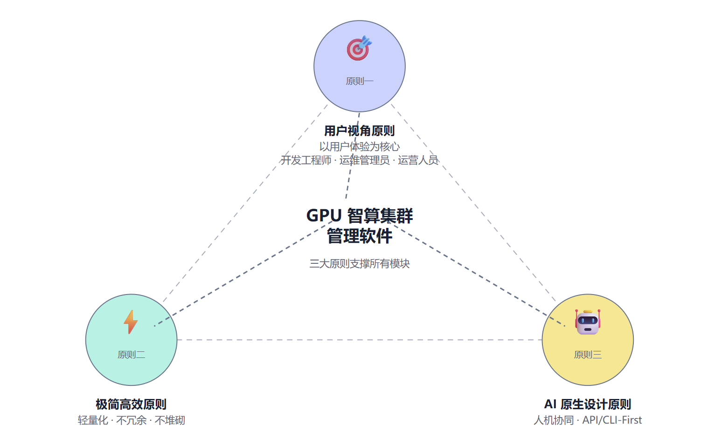
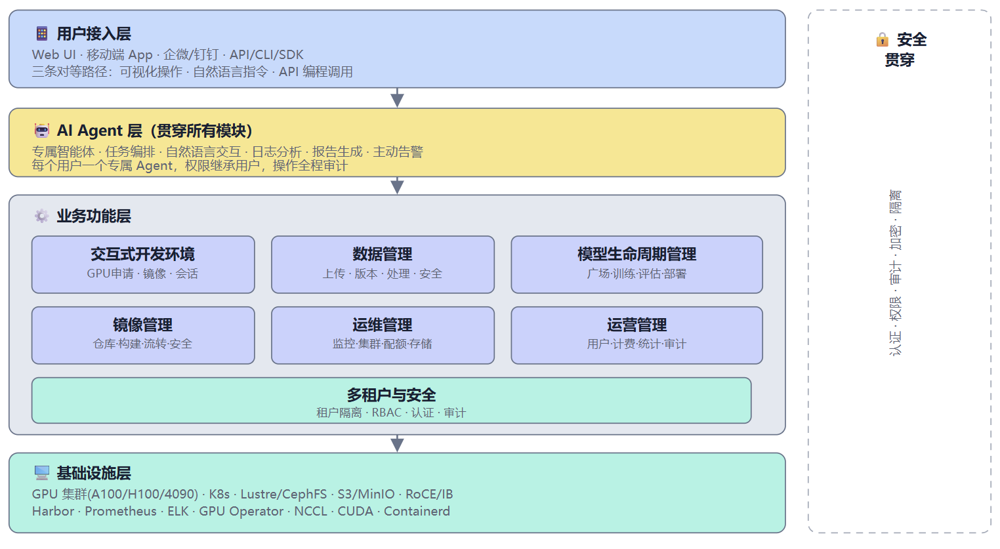
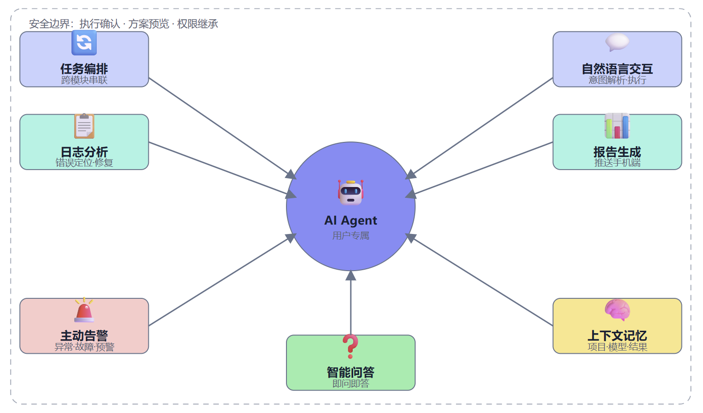
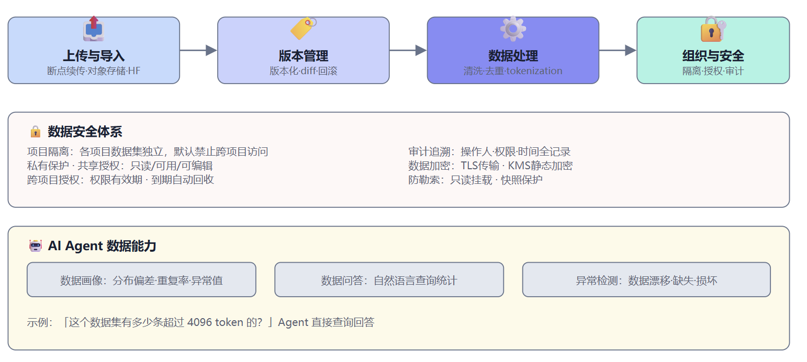
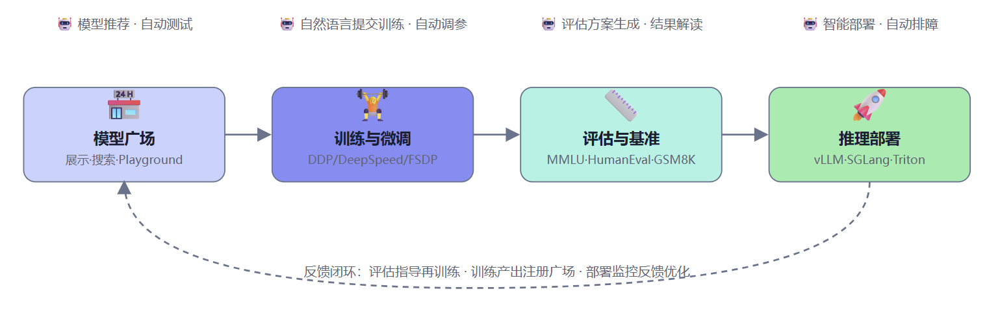
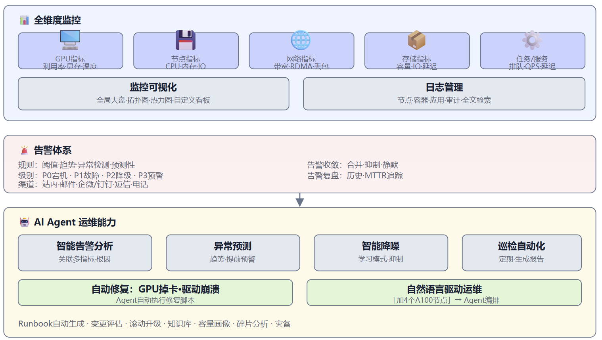
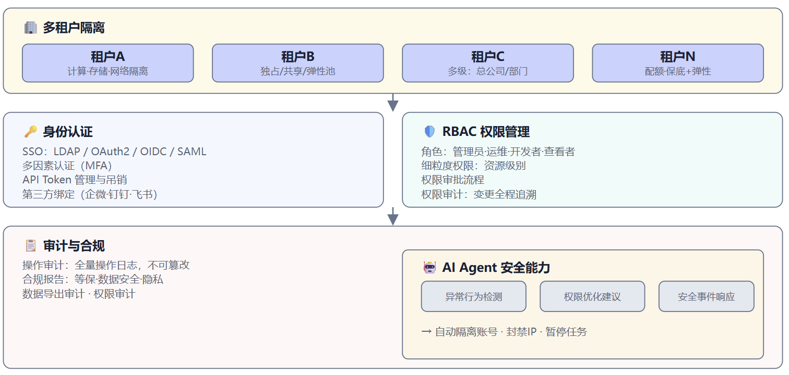

# AI智算云服务平台软件\-需求文档

## 需求场景

企业内部的完全私有化部署的AI智算云服务平台，支持在内外网物理隔离的条件下建设和运营。

平台提供模型微调、Token服务（模型推理）、Agent智能体开发、数字员工服务等功能。

智算集群系统参考典型规模：8卡\~512卡，NVidia/沐曦/壁仞GPU。

下面从真实用户视角出发，描述典型角色在典型工作流中如何使用本产品。每个场景覆盖完整的操作链路，体现产品各模块之间的协同能力。产品提供三条对等的操作路径——可视化 UI、自然语言驱动 AI Agent、API/CLI。

│ 编程调用——用户可根据自身习惯和场景灵活选择，以下场景中会体现不同路径的实际使用。

### AI 研究员：从数据准备到模型上线

角色：算法研究员，有 Python 和深度学习基础，不熟悉集群运维。

场景：研究员张工需要基于 Qwen2\-72B 做 LoRA 微调，用于公司内部的客服问答场景，完成从数据准备、训练、评估到部署的全流程。

操作流程：

- 登录平台后，张工通过 UI 浏览产品功能，了解平台能力。也可以直接唤起 AI Agent 获取个性化引导：「你是首次使用，建议先创建一个开发环境。」

- 张工创建开发环境。方式一（UI）：在「开发环境」页面选择 镜像 PyTorch 2\.4 \+ CUDA 12\.4，配置 4 张 A100，挂载数据卷 /data/customer\-qa\-v3，点击创建。方式二（Agent）：直接说「帮我开一个 PyTorch 2\.4 \+ CUDA 12\.4的环境，4 张 100，挂载我的数据集」，Agent 自动完成全部配置。方式三（CLI）：oc env create \-\-image pytorch:2\.4\-cuda12\.4 \-\-gpu A100:4 \-\-volume /data/customer\-qa\-v3。创建完成后平台返回 SSH 地址和 Jupyter入口。

- 张工将原始数据（10 万条 JSONL）上传到平台，支持断点续传。随后在数据管理页面查看数据 预览和统计分析（条数、分布、label 占比）。也可以让 Agent 帮忙分析：「帮我分析一下这个数据集的质量。」Agent自动生成质量报告：「总条数 100,000；重复率 3\.2%；空字段率 0\.1%；label 分布不均衡，正负比 7:3。」

- 根据分析结果，张工在 UI 上配置预处理流水线（去重 → 过滤空字段 → label 重采样均衡），也可以编写 Python 脚本通过 SDK 调用数据处理 API。流水线执行完毕后平台自动进行数据版本化，记录数据血缘。

- 张工在 VSCode Remote 中调试好训练脚本，确认无误后提交训练任务。方式一（UI） ：在「训练任务」页面选择模型、数据集，配置超参和分布式策略，点击提交。方式二（Agent）：「用 QLoRA 微调 Qwen2\-72B，数据集customer\-qa\-v3，学习率 2e\-4，3 个 epoch。」Agent 自动配置并提交。方式三（SDK）：通过 Python SDK 编写训练提交脚本，适合需要批量提交或集成到 CI/CD 的场景。

- 训练过程中，张工可以在 UI 的训练监控页面实时查看 loss 曲线、GPU 利用率、日志流。第 2 个 epoch 末 loss 出现震荡，平台自动触发告警通知张工。张工也可以让 Agent 持续关注训练状态，Agent 会主动给出建议：「loss震荡，建议将学习率降至 1e\-4 或增加 warmup 步数。」张工确认后通过 UI 或 Agent 调整参数并恢复训练。

- 训练完成后，平台自动生成训练报告（含 loss 曲线、GPU 利用率、耗时、成本），模型自动注册到模型广场，关联完整的 lineage（数据版本 \+ 代码版本 \+ 超参配置）。报告可推送到手机端。

- 张工在模型广场选择训练产出的模型，一键发起评估，选择 MMLU 和自定义业务测试集。也可以通过 CLI 批量发起多组评估：oc eval submit \-\-model qwen2\-72b\-lora \-\-benchmarkmmlu,custom\-qa。评估完成后平台自动生成对比报告：「微调后在客服问答准确率上提升 12%，通用能力下降 2%，整体表现优秀。」

- 张工确认效果后，在模型广场点击「部署推理服务」，选择 vLLM 框架、INT8 量化、资源配置，一键部署。也可以让 Agent 推荐方案：「把这个模型部署成 API，要低延迟。」Agent 自动选择最优配置完成部署，返回 API endpoint。

### 运维工程师：日常巡检、故障处理与集群扩容

角色：GPU 集群运维工程师，负责 200\+ 节点的日常维护和基础设施管理。

场景：运维李工早上到岗，需要快速了解集群夜间运行状况、处理异常，并完成新节点的扩容接入。

操作流程：

日常巡检与故障处理：

- 李工打开平台首页的运维大盘，查看集群拓扑图和资源热力图，快速掌握整体状况。也可以查看 Agent 自动生成的晨间巡检报告：「昨夜集群整体稳定，2 个 P2 告警（节点 A\-12 GPU 温度偏高、节点 B\-07 ECC单比特错误计数上升），无 P0/P1 事件。」

- 李工在告警列表中点击节点 B\-07 的告警详情，查看 ECC 错误的历史趋势图（过去 7 天持续上升 0→12）。也可以让 Agent 帮忙关联分析：「这个 ECC 告警严重吗？」Agent 回复：「按趋势预计 3天内可能触发双比特错误，建议提前隔离该 GPU 并安排检修。」

- 李工处理该节点。方式一（UI）：在节点管理页面选中 B\-07 的 GPU 3，点击「隔离」，系统自动排空该 GPU 上的任务并迁移到备用节点。方式二（Agent）：「把 B\-07 的 GPU 3 隔离，任务迁走。」Agent自动执行。方式三（CLI）：oc node cordon b07 \-\-gpu 3 \-\-migrate\-tasks。

- 下午收到网络告警：节点 C\-01 到 C\-05 的 RDMA 吞吐下降 30%。李工在网络监控页面查看链路质量，定位到 C\-03 交换机端口 24 丢包率异常。Agent 也可以主动给出分析结论：「C\-03 交换机端口 24丢包率异常，建议检查光模块或线缆。」李工派现场人员更换光模块后恢复。

集群扩容：

- 公司新采购 8 台 A100 服务器，李工执行扩容操作。方式一（UI）：在「集群管理 → 节点接入」页面填写新节点 IP 范围，选择初始化模板（GPU 驱动 \+ SDK \+ 容器运行时），点击批量接入。方式二（Agent）：「给集 群加 8 个A100 节点，IP 段 10\.66\.2\.100\-107。」Agent 自动编排完整流程。方式三（Ansible/脚本）：通过平台提供的 Ansible Playbook 或 CLI 脚本批量执行，适合已有自动化流水线的团队。

- 接入过程中，1 台服务器的 GPU 驱动安装失败（PCIe 链路异常）。平台自动隔离该节点并继续其余 7 台的接入，同时触发告警通知李工。李工在节点管理页面查看失败原因，安排硬件检修。

- 7 台节点接入完成后，平台自动运行验收测试：GPU 计算性能（GPU burn）→ 通信性能（NCCL all\-reduce）→ 存储性能（IOPS）。李工在测试报告页面查看结果，与历史基线对比 无异常，确认节点正式纳入调度池。

- 随后李工安排集群组件滚动升级（K8s 1\.28 → 1\.29）。方式一（UI）：在「运维自动化 → 变更管理」页面创建升级任务，选择组件版本，配置批次策略和回滚方案 ，提交执行。方式二（Agent）：「把 K8s 升级到1\.29，滚动升级，每批验证。」Agent 编排流程并自动执行。升级全程零停机，完成后自动生成变更报告并更新 GitOps 配置仓库。

### 运营管理员：成本管控与资源优化

角色：平台运营负责人，管理多个团队的资源使用和成本。

场景：月底将至，运营王总需要审查各团队资源使用情况，处理账单，并优化资源配置。

操作流程：

- 王总打开运营看板，查看本月资源使用概览：GPU 总消耗、各团队占比、整体利用率趋势。也可以让 Agent 生成月度运营摘要：「本月 GPU 总消耗 45,000 GPU\-hour，环比增长 8%。Top 3消费团队：训练组（40%）、推理服务（35%）、开发测试（25% ）。整体利用率 72%，较上月提升 5%。」

- 王总在预算管理页面发现项目 A 已用 85% 预算。平台按预设规则自动触发预警通知。王总评估后决定将项目 A 的低优先级任务切换到竞价队列——方式一（UI）：在项目 A 的配额设置页面开启竞价实例选项。方式二（Agent）：「把项目 A 的低优先级任务切到竞价队列。」Agent 自动执行。方式三（API）：通过 API 修改项目调度策略，适合批量调整多个项目。

- 王总在账单明细页面发现某团队的推理服务费用突增 200%。点击查看详细分析：该团队新上线了一个 70B 模型的推理服务，副本数从 2 扩到 8，且未做量化。王总联系该团队负责人，建议启用 INT4量化或配置自动伸缩。也可以让 Agent 自动生成分析报告并推送：「费用突增原因：70B 模型未量化，8 副本各占 4 张 A100，建议 INT4 量化可减少 50% 占用。」

- 王总查看资源利用率分布，发现某租户的 GPU 利用率连续 7 天低于 15%。在 UI 上标记该租户，生成优化建议单转发给相关负责人。也可以通过 Agent 批量扫描：「帮我找出所有连续 7 天利用率低于 20% 的租户。」Agent返回清单和建议。

- 新用户提交配额申请，王总在审批页面查看申请详情。平台基于历史数据给出参考建议：「该用户为算法实习生，历史类似用户平均月消耗 2 GPU，建议初始配额 4 GPU。」王总据此审批。

- 季度末，王总在「报表管理」页面选择报表模板（季报），自定义统计维度（按团队、按项目、按资源类型），导出 PDF 报表。也可以配置定时报告，每月自动生成并推送到指定邮箱。Agent可以在报表基础上补充分析摘要，标注关键趋势和优化建议。

## 设计原则

### 用户视角原则

所有设计决策均以用户体验为核心，摒弃开发者主观视角的思维惯性，立足真实用户场景与使用习惯开展设计。本软件核心用户群体涵盖开发工程师、运维管理员、运营人员，设计过程需充分适配不同角色的工作诉求、操作习惯与使用场景，保障各类用户均可高效、顺畅地使用产品。

### 极简高效原则

聚焦用户核心刚需，以轻量化、高简洁度的架构实现产品核心功能，拒绝过度设计。系统复杂度会直接拉高开发成本、运维成本与用户使用门槛，因此在功能落地、架构选型、流程设计中，始终坚持能用最简方案解决问题，不冗余、不堆砌，兼顾系统稳定性与落地效率。为此可以摒弃一些非主流核心需求。

### 2\.3 AI 原生设计原则

**人机协同优先，打造人机复合体模式**

产品核心设计理念为适配「人 \+ AI 智能体」协同工作模式，为每一位用户自动配置专属 AI 智能体（Agent）。产品提供三条完全对等、无功能阉割的操作路径：用户可通过可视化 UI 手动操作、通过自然语言指令驱动 AI 智能体自动完成工作、通过 API 编程调用能力，满足不同场景下的灵活使用需求。

**API/CLI\-First 架构，能力全开放**

产品遵循 API/CLI 优先设计规范，系统所有核心功能、操作能力均配套标准化 API/CLI 接口，全面支撑 AI 智能体调用。UI 仅作为 API/CLI 能力的可视化呈现层，并非系统能力的唯一入口，确保底层能力完全开放、可自动化。

---

## 3\. 接口与开放能力

本章定义支撑所有业务模块的接口契约，是 API/CLI\-First 设计原则（1\.3）的直接落地。在描述任何功能模块之前，先确立接口规范。

### 3\.1 CLI / SDK

- 命令行工具：提交任务、管理资源、部署服务、查看状态

- Python SDK：所有 API 封装为 SDK，方便开发者编程集成

- AI Agent 友好：API 设计遵循 RESTful / OpenAPI 规范，响应结构化，附带充分的语义描述，方便 Agent 理解和调用

### 3\.2 API 接口

- 全功能 API：UI 能做的，API 都能做

- Webhook 回调：任务状态变更、训练完成、服务异常等事件支持 webhook 订阅

- 版本管理：API 版本化，向前兼容承诺

---

## 4\. AI 智能体

> 本章描述贯穿所有模块的 AI Agent 核心能力，并非独立功能模块。各功能模块均内置 AI Agent 能力，此处先定义 Agent 的基座架构和通用能力，后续各模块的 AI Agent 小节均基于本章框架。

### 4\.1 智能体基座

- 每个用户一个专属 Agent，随账号自动创建

- 持久化记忆用户偏好、历史操作、项目上下文

- Agent 身份与用户绑定，所有操作以用户身份执行，继承用户权限（不越权）

- Agent 操作全程审计，可追溯

### 4\.2 多入口

- **平台内嵌对话框**：在任意页面唤出 Agent，上下文感知当前页面

- **移动端**：连接手机 App/小程序/企微钉钉，随时接收通知、下达指令、查看报告

### 4\.3 核心能力

- **任务编排**：跨模块串联操作，如「取数据集 A，配环境，提交训练，训练完成后部署推理服务，生成报告发我手机」

- **自然语言交互**：所有操作都可通过自然语言发起，Agent 解析意图、执行、反馈结果

- **日志分析**：Agent 能读取任意任务的运行日志，自动定位错误，给出原因和修复建议

- **报告生成**：根据监控数据、运行日志、评估结果自动生成结构化报告，支持推送到手机端

- **主动告警**：训练异常、服务故障、资源不足、配额预警等主动推送到用户手机端

- **上下文记忆**：记住用户的项目进度、正在调试的模型、上次实验结果，连续对话时不需要重复背景

- **智能问答**：如「我的训练任务为什么这么慢？」「我现在还剩多少 GPU 配额？」

### 4\.4 安全边界

- **执行确认**：高风险操作（部署生产服务、删除资源、共享给外部）需用户确认后执行

- **方案预览**：复杂操作先给出方案，展示预期效果，用户确认后正式执行

- **权限继承**：Agent 只能做用户有权做的事，不额外提权

---

## 5\. 交互式开发环境

### 5\.1 资源申请与配置

- 申请 GPU（指定数量、型号如 A100/H100/4090）、CPU、内存、显存

- GPU 分配模式：独占整卡 / MIG 切片 / time\-slicing 共享

- 挂数据卷，可指定路径和读写权限

- 网络模式选择：是否需要公网出口、RDMA 通信等

### 5\.2 环境配置

- 预置镜像模板矩阵（Python，PyTorch/TensorFlow，MetaX, Biren, CUDA，Jupyter Notebook，Nginx 等）

- conda/pip 自定义安装，支持导出为可复用镜像

- 环境变量、启动命令可配置

### 5\.3 会话管理

- 手动启停 / 定时关机 / 空闲超时自动回收

- 断线重连，session 持久化

- SSH 直连地址端口（VSCode Remote / Cursor 接入）

- 运行中动态扩缩资源

### 5\.4 AI Agent 能力

- **自然语言创建环境**：用户说「给我开个 PyTorch 2\.4 \+ CUDA 12\.4 的环境，2 张 A100，挂载我的数据集」，Agent 自动完成全部配置

- **环境诊断**：Agent 监控环境健康，CUDA 版本冲突、OOM 预警、依赖冲突时主动提示并给出修复建议

- **环境推荐**：基于用户历史使用和当前任务，推荐最优资源配置

- **一键复刻**：Agent 可将当前环境打包成镜像并推送到私有仓库，生成可分享的环境配置文件

---

## 6\. 数据管理

### 6\.1 数据上传与导入

- 大文件/批量上传，断点续传

- 从对象存储拉取

- 从公开数据集仓库导入（HuggingFace / ModelScope）

### 6\.2 数据版本管理

- 数据集版本化、版本 diff、回滚

### 6\.3 数据处理

- 预处理流水线：清洗、去重、tokenization、格式转换

- 数据预览与统计分析（条数、分布、label 占比、长度分布）

### 6\.4 数据组织与安全

最小权限原则，搭建分层隔离、分级授权、可管控可审计的数据权限体系，保障数据使用安全合规。

- **项目隔离**：各项目数据集相互独立，默认禁止跨项目访问、复用

- **私有保护**：用户上传、创建的数据集默认私有

- **共享授权**：支持将数据集共享给项目内指定成员或全体成员，可配置只读、可用、可编辑三种权限

- **跨项目授权**：支持跨项目授权共享数据，可设置权限有效期，到期自动回收；被授权方仅可在权限范围内使用数据，无法修改原始数据

- **审计追溯**：完整记录所有共享、访问、导出操作信息，包含操作人、权限、时间等关键信息，支持全程审计追溯

### 6\.5 AI Agent 能力

- **数据画像**：Agent 自动分析数据集，生成质量报告（分布偏差、重复率、异常值、label 均衡性）

- **数据问答**：用户问「这个数据集有多少条超过 4096 token 的？」「训练集和验证集的 label 分布差异大吗？」Agent 直接查询回答

- **异常检测**：Agent 定期巡检数据集，发现数据漂移、缺失、损坏主动告警

---

## 7\. 模型生命周期管理

模型生命周期涵盖模型获取（模型广场）、训练微调、评估测试、推理部署四个阶段，各阶段环环相扣，前序阶段的产出直接作为后续阶段的输入。

### 7\.1 模型广场

#### 7\.1\.1 模型展示

- 模型卡片：架构、参数量、适用场景、性能指标

- 分类：基础大模型、微调模型、行业模型

- 搜索筛选：按任务类型、参数量、框架、评分

#### 7\.1\.2 模型来源

- 内置开源模型库（HuggingFace / ModelScope 镜像同步）

- 用户训练产出

- 外部导入

#### 7\.1\.3 模型操作

- 在线 Playground：直接对话测试，调参数看效果

- 一键部署推理服务（→ 6\.4）

- 一键发起微调（→ 6\.2）

- 一键发起评估（→ 6\.3）

- 模型下载与导出

#### 7\.1\.4 AI Agent 能力

- **模型推荐**：根据用户任务描述，Agent 推荐合适的基础模型和微调方案

- **自动模型测试**：用户选定模型后，Agent 自动在 Playground 跑一批测试用例，生成体验报告

- **模型血缘问答**：用户问「这个模型用了什么数据训练的？」Agent 从 lineage 中查询回答

- **版本监控**：用户关注的模型有新版本时，Agent 通知并对比差异

### 7\.2 训练与微调

#### 7\.2\.1 任务提交

- 选择模型、数据集、训练脚本/配置文件

- 资源申请：GPU 数量、节点数、训练时长上限

- 分布式策略：单卡 / DDP / DeepSpeed / FSDP / Megatron

- 超参配置：学习率、batch size、warmup、scheduler 等，支持 YAML/JSON 导入

#### 7\.2\.2 训练过程

- 实时监控：loss 曲线、梯度、学习率、GPU 利用率/显存/温度

- 日志实时流式查看

- TensorBoard 集成 / 自带可视化看板

- Checkpoint 自动保存，支持手动保存

- 断点恢复（resume）

- 提前停止（early stopping）

#### 7\.2\.3 训练产出

- 模型自动注册到模型广场（→ 6\.1）

- Lineage 记录：代码版本 \+ 数据版本 \+ 超参 → 产出模型

- 训练报告自动生成

#### 7\.2\.4 微调方式

- 全量微调 / LoRA / QLoRA / Adapter / RLHF / DPO / PPO

- 预置常见微调脚本模板

#### 7\.2\.5 AI Agent 能力

- **自然语言提交训练**：用户说「用 QLoRA 微调 Qwen2\-7B，用我的数据集 v3，学习率 2e\-4，跑 3 个 epoch」，Agent 自动配置并提交

- **训练监控与智能干预**：Agent 实时监控 loss 曲线，发现异常（不收敛、过拟合）主动告警并给出建议

- **自动调参**：Agent 支持 HPO 超参搜索，按贝叶斯优化等策略自动跑多组实验并推荐最优参数

- **训练报告**：训练结束后 Agent 自动生成结构化报告，推送到用户手机端

- **故障处理**：节点故障导致训练中断时，Agent 自动从最近 checkpoint 恢复，并通知用户

### 7\.3 模型评估与基准测试

#### 7\.3\.1 评估任务

- 选择模型 \+ 评估数据集 \+ 指标，一键发起

- 支持标准 benchmark（MMLU、HumanEval、GSM8K、CMMLU 等）和自定义数据集

- 指标：准确率、BLEU、ROUGE、pass@k 等，可自定义指标脚本

#### 7\.3\.2 对比分析

- 多模型横向对比、同模型不同版本纵向对比

- 评估报告自动生成（表格 \+ 图表）

#### 7\.3\.3 性能基准

- 推理压测：吞吐量 \(tokens/s\)、首 token 延迟 \(TTFT\)、P99 延迟

- 不同框架/量化/并发配置的性能对比与排行榜

#### 7\.3\.4 AI Agent 能力

- **评估方案生成**：用户说「评估一下这个微调后的模型」，Agent 自动选择合适的 benchmark 和指标，设计评估计划

- **结果解读**：Agent 自动分析评估结果，生成自然语言报告，指出强弱项和改进方向

- **对比建议**：Agent 主动对比新模型与已有模型，给出「在 X 上提升 Y%，但 Z 指标下降」的结构化结论

- **性能调优建议**：基于压测结果，Agent 给出推理配置优化建议

### 7\.4 模型推理服务部署

#### 7\.4\.1 部署配置

- 单机单卡 / 单机多卡（tensor\-parallel）/ 多机多卡（TP \+ PP）

- 推理框架：vLLM、SGLang、Triton、TensorRT\-LLM、自定义框架

- 量化方案：FP16 / INT8 / INT4

- 模型来源：模型广场（→ 6\.1）/ 训练产出（→ 6\.2）/ 自定义路径

- KV Cache、最大序列长度、batch size 等参数配置

#### 7\.4\.2 部署方式

- **一键部署**：填参数 → 自动拉镜像、加载模型、起服务、注册路由

- **模板部署**：保存部署配置为模板复用

- **AI Agent 部署**：用户描述需求（如「把 Qwen2\-72B 部署成 API，要支持长上下文，低延迟」），Agent 自动选择最优框架、并行策略、量化方案，完成部署并返回 endpoint

#### 7\.4\.3 服务治理

- 自动伸缩：按 QPS / GPU 利用率 / 队列长度扩缩副本

- 健康检查与自动恢复，故障节点自动迁移

- 负载均衡、API 网关（统一入口、鉴权、限流、请求日志）

#### 7\.4\.4 监控

- 实时指标：QPS、延迟 P50/P95/P99、吞吐量、GPU 利用率、显存占用

- 请求日志与错误追踪

- 成本统计：每个服务消耗的 GPU 时长

#### 7\.4\.5 AI Agent 能力

- **智能部署**：根据模型大小、流量预估、延迟要求自动推荐部署方案

- **自动排障**：服务异常时 Agent 主动介入，分析日志 → 定位原因 → 给出修复方案 →（授权后）自动执行

- **性能优化**：Agent 持续监控推理服务，发现低效配置主动建议

---

## 8\. 镜像管理

本章涵盖镜像的完整生命周期管理，包括用户侧的镜像使用和运维侧的仓库管理。

### 8\.1 镜像仓库

- 集成 Harbor 私有仓库，项目/团队命名空间隔离

- Tag 管理：打 tag、版本树管理

### 8\.2 镜像构建

- Dockerfile 在线编辑与构建，构建缓存加速

- 从运行中容器一键打包成镜像（commit \& push）

### 8\.3 镜像流转

- 从互联网拉取并自动 tag 推送到本地仓库

- 推送/拉取、镜像收藏与文档

### 8\.4 镜像安全与生命周期

- 漏洞扫描（Trivy 集成）、签名验证（Cosign）

- 镜像大小分析与优化建议

- 按策略自动清理旧版本

### 8\.5 镜像仓库运维（运维视角）

- Harbor 集群管理：多 Harbor 实例的部署、同步、高可用

- 镜像缓存：边缘节点镜像缓存，减少重复拉取

- 镜像清理：按策略自动清理旧版本、无引用镜像

- 存储管理：镜像仓库的存储容量监控和扩容

- 访问控制：镜像仓库的读写权限管理

- 同步策略：与外部仓库（Docker Hub、HuggingFace）的同步策略

### 8\.6 AI Agent 能力

- **智能构建**：Agent 根据用户需求描述自动生成 Dockerfile，构建并验证镜像可用性

- **安全巡检**：Agent 定期扫描用户所有镜像，发现漏洞主动报告并建议修复方案（升级 base image、修补 CVE）

- **镜像优化**：Agent 分析镜像层级，建议精简方案减小体积，加速分发

- **自动同步**：Agent 监控上游开源镜像更新，有新版本时提示用户是否同步

- **容量预测**：Agent 预测镜像仓库增长趋势，提前预警需要扩容

- **清理建议**：Agent 识别无引用、过期、重复镜像，给出清理建议

---

## 9\. 运维管理

### 9\.1 资源监控与告警

#### 9\.1\.1 全维度监控

- **GPU 指标**：利用率、显存占用、温度、功耗、ECC 错误计数、XID 错误、进程占用

- **节点指标**：CPU 利用率、内存使用、磁盘 IO、网络 IO、负载均衡

- **集群指标**：总资源/已分配/空闲资源池、集群使用率

- **存储指标**：容量使用率、IO 吞吐、延迟、inode 使用率

- **网络指标**：带宽利用率、RDMA 吞吐、丢包率、重传率

- **任务指标**：排队数、运行数、完成率、失败率、平均等待时间

- **服务指标**：推理服务 QPS、延迟分布、错误率

#### 9\.1\.2 告警体系

- **告警规则**：阈值告警、趋势告警、异常检测告警、预测性告警

- **告警级别**：P0（集群宕机）、P1（关键节点故障）、P2（性能降级）、P3（预警）

- **告警渠道**：站内、邮件、企微/钉钉、短信、电话、手机推送

- **告警收敛**：同类告警合并、告警抑制（如集群级故障时抑制节点级告警）、告警静默（维护窗口期）

- **告警复盘**：告警历史记录、MTTR（平均修复时间）追踪

#### 8\.1\.3 监控可视化

- 全局大盘：集群拓扑图、资源热力图、实时刷新

- 节点详情页：单节点所有指标时序图

- 自定义看板：运维人员可自定义监控面板

- 历史数据：指标留存与回溯查询，支持对比分析

#### 9\.1\.4 AI Agent 能力

- **智能告警分析**：告警触发时 Agent 自动关联多个指标，分析根因。如「GPU 温度告警 \+ 风扇转速下降 \+ 同机柜其他节点温度升高，疑似机柜空调故障」，而非简单转发单条告警

- **异常预测**：基于历史趋势，Agent 预测潜在故障（如「节点 A 的 ECC 错误数过去 7 天持续上升，预计 3 天内可能发生 GPU 故障，建议提前隔离」）

- **监控报告自动生成**：日报/周报/月报，包含资源利用率汇总、Top N 消费者、异常事件时间线、容量建议，自动推送到手机端

- **智能降噪**：Agent 学习历史告警模式，自动识别和抑制噪声告警，减少告警疲劳

- **巡检自动化**：Agent 定期巡检集群，生成巡检报告，发现隐患主动报告

### 9\.2 集群管理

#### 9\.2\.1 集群部署

- 集群初始化：一键部署（调度器、监控、存储、网络组件）

- 节点批量接入：PXE/镜像方式批量初始化物理机或虚拟机

- GPU 节点初始化：自动安装 GPU 驱动、SDK、自动升级 VBIOS

- 组件版本管理：集群组件（K8s、Docker/containerd、GPU operator 等）版本矩阵管理

- 环境一致性：确保所有节点运行环境一致，版本偏差自动检测

#### 9\.2\.2 节点管理

- 节点添加：注册新节点，自动检测硬件配置（GPU 型号/数量/内存/磁盘）

- 节点删除：安全下线（排空任务、隔离、移除）

- 节点状态：在线/离线/维护中/故障

- 节点标签：机型、GPU 型号、网络拓扑标签（RDMA 域、机架位置）

- 节点 cordon/uncordon：隔离节点不影响已有任务

- 硬件管理：GPU 驱动更新、固件升级、BIOS 配置

- 自动修复：节点健康检查失败自动触发修复流程

#### 9\.2\.3 集群测试

**Benchmark 测试**

- GPU 计算性能测试（GPU burn、CUDA 样例）

- 通信性能测试（NCCL all\-reduce、all\-gather 带宽测试）

- 存储性能测试（IOPS、带宽、延迟）

**压力测试**

- 满载 GPU 压力测试（稳定性、温度、功耗）

- 大规模并发任务调度压力测试

- 网络高压测试（RDMA 大规模通信）

- 存储高压测试（并发读写、大文件 IO）

**测试报告**

- 自动生成性能基线报告，与历史数据对比

- 验收测试：新节点上线前的自动验收，通过后才能纳入调度池

#### 9\.2\.4 AI Agent 能力

- **节点健康管理**：Agent 持续监控节点健康，自动识别异常节点，建议隔离或自动执行隔离

- **自动修复**：常见故障（GPU 掉卡、驱动崩溃、容器残留）Agent 自动执行修复脚本，无需人工介入

- **性能回归检测**：Agent 对比 Benchmark 结果与历史基线，发现性能下降自动告警并分析原因

- **滚动升级**：Agent 编排集群组件滚动升级流程，确保零停机，自动验证每批次升级结果

- **容量画像**：Agent 持续分析集群资源分布和碎片情况，给出优化建议

### 9\.3 配额与调度策略

#### 9\.3\.1 配额管理

- 多维度配额：按用户/团队/项目分配 GPU、CPU、内存、存储配额

- 配额展示：实时配额使用看板、剩余配额、历史趋势

- 配额策略：保底配额 \+ 弹性配额（低峰期可用更多资源）

#### 9\.3\.2 调度策略

- 调度器：GPU\-aware 调度，支持拓扑感知调度（NUMA、NVLink、RDMA 域）

- 优先级调度：多级优先级队列，高优先级任务可抢占低优先级

- 公平调度：按团队/用户的 fair\-share 调度，防止资源垄断

- 抢占机制：优雅抢占（通知、checkpoint、迁移、重新排队）

- 亲和/反亲和：任务与节点、任务与任务间的亲和反亲和规则

- 资源碎片整理：定期合并碎片化资源，提高利用率

#### 9\.3\.3 任务排队与状态

- 全局任务队列视图：排队位置、预估等待时间、任务状态流转

- 任务优先级：用户/团队优先级，抢占机制

- 任务依赖：支持定义任务间依赖关系（A 完成后触发 B）

#### 9\.3\.4 AI Agent 能力

- **智能调度建议**：Agent 分析调度队列和资源分布，建议最优调度策略调整

- **配额优化**：Agent 分析各团队配额使用率，建议配额调整

- **抢占决策**：需要抢占时，Agent 综合考虑任务优先级、已运行时长、checkpoint 可用性，给出最优抢占方案

- **碎片分析**：Agent 实时监控资源碎片，主动触发碎片整理或建议任务重组

### 9\.4 存储管理

#### 9\.4\.1 文件系统

- 共享文件系统管理（Lustre / CephFS / NFS）：挂载、配额、性能调优

- 训练数据存储：高性能并行文件系统，支持大文件高吞吐

- 工作目录管理：用户/项目的工作空间配额

#### 9\.4\.2 对象存储

- 对象存储集成（S3 / OSS / MinIO）：作为冷数据、归档数据的存储层

- 数据分层：热数据在文件系统，冷数据归档到对象存储

- 生命周期管理：数据自动分层、过期删除

#### 9\.4\.3 数据隔离

- 多租户存储隔离：命名空间/卷级别隔离

- 访问控制：基于身份的存储访问控制

- 数据加密：传输加密（TLS）和静态加密（KMS）

#### 9\.4\.4 数据安全

- 数据备份：关键数据定期备份、增量备份

- 数据恢复：备份恢复

- 数据审计：存储访问日志、数据变更追踪

- 防勒索：关键目录只读挂载、快照保护

#### 9\.4\.5 AI Agent 能力

- **存储诊断**：Agent 监控 IO 性能，发现瓶颈自动分析（如「训练任务 IO 瓶颈在于小文件随机读写，建议合并为 TFRecord 格式或使用内存缓存」）

- **容量预警**：Agent 预测存储增长趋势，提前预警需要扩容

- **冷热分析**：Agent 分析数据访问频率，建议冷热分层策略，降低成本

- **备份验证**：Agent 定期验证备份数据的完整性和可恢复性

- **异常检测**：Agent 检测异常的大量删除、异常的访问模式，防范数据安全风险

### 9\.5 网络管理

#### 9\.5\.1 网络架构管理

- 网络拓扑管理：计算网络（RoCE/InfiniBand）、存储网络、管理网络分离

- RDMA 管理：RoCEv2/IB 配置、PFC（优先级流控）、ECN 配置

- 交换机管理：兼容管理交换机配置（via API/Ansible），网络分段

- IP 地址管理：节点 IP、服务 IP、VIP 管理分配

#### 9\.5\.2 网络状态监控

- 带宽监控：各链路实时带宽利用率

- RDMA 性能：RDMA 读写吞吐、延迟、连接状态

- 网络拓扑可视化：物理拓扑图、逻辑拓扑图

- 丢包/重传/抖动：全链路网络质量监控

- NCCL 通信测试：定期跑 NCCL 测试，检测通信退化

#### 9\.5\.3 网络故障排查

- 端到端连通性检测

- 路由追踪

- 抓包分析

- 网络隔离故障定位

#### 9\.5\.4 AI Agent 能力

- **网络异常分析**：Agent 检测到网络延迟增大或丢包时，自动分析路径上哪一跳有问题，定位到具体交换机端口

- **拓扑优化**：Agent 分析通信模式，建议网络拓扑优化（如「分布式训练中节点 A 与 B 跨交换机通信量大，建议重新分配到同机架」）

- **NCCL 退化检测**：Agent 定期跑 NCCL benchmark，发现通信性能下降时自动告警并分析原因

- **网络规划**：Agent 根据集群规模和任务通信模式，辅助网络扩容规划

### 9\.6 高可用与故障容错

#### 9\.6\.1 高可用

- 控制平面高可用：调度器、API 服务、监控等多副本部署

- 数据库高可用：元数据存储的多副本、定期备份

- 推理服务高可用：多副本、跨节点部署、自动故障转移

- 存储高可用：文件系统多副本/纠删码

#### 9\.6\.2 故障容错

- GPU 故障容错：GPU 故障时任务自动迁移到其他 GPU

- 节点故障容错：节点故障时任务自动迁移到其他节点

- 训练容错：checkpoint 定期保存，故障后自动从 checkpoint 恢复

- 推理容错：推理实例故障时自动重启，流量切到健康实例

#### 9\.6\.3 AI Agent 能力

- **故障根因分析**：故障发生时 Agent 自动收集关联信息（日志、指标、事件），生成根因分析报告，而非让运维人员手动翻日志

- **自动故障恢复**：常见故障 Agent 自动执行恢复流程（如 GPU 掉卡，重置 GPU，重启任务），减少 MTTR

- **容量弹性**：Agent 监控集群负载，在达到阈值时自动触发扩容流程

- **灾备自动化**：Agent 管理备份任务执行，定期验证备份数据完整性，灾备演练自动化

### 9\.7 运维自动化

#### 9\.7\.1 运维 Runbook

- 常见运维场景的自动化脚本（添加节点、扩容存储、升级驱动等）

- 运维文档转化为可执行的自动化流程

- Runbook 版本管理、执行历史记录

#### 9\.7\.2 运维任务编排

- 多步骤运维操作编排为一键流程

- 条件分支：根据执行结果自动选择下一步

- 人工确认节点：关键步骤需人工确认后继续

- 回滚机制：编排流程失败时自动回滚

#### 9\.7\.3 变更管理

- 变更审批：变更申请、审批、执行流程

- 变更窗口：维护窗口期管理，非窗口期变更需紧急审批

- 变更影响评估：变更前自动评估影响范围

- 回滚方案：每个变更必须有回滚方案

#### 9\.7\.4 配置管理

- 集群配置的版本管理（GitOps 模式）

- 配置漂移检测：实际配置与期望配置的差异告警

- 配置回滚：配置变更后可快速回滚

- 配置模板：常用配置的模板管理

#### 9\.7\.5 AI Agent 能力

- **Runbook 自动生成**：Agent 将运维文档和操作历史转化为自动化 Runbook，持续优化

- **自然语言驱动运维**：用户说「给集群加 4 个 A100 节点」，Agent 自动编排完整流程（硬件检测、系统初始化、GPU 驱动安装、集群注册、健康验证）

- **变更影响评估**：变更前 Agent 自动模拟影响评估，分析哪些任务、服务、用户会受影响

- **变更推荐**：Agent 根据集群状态推荐最佳变更窗口，避开业务高峰

- **运维知识库**：Agent 持续积累运维经验和故障案例，形成知识库，遇到类似问题时自动推荐解决方案

### 9\.8 通知管理

#### 9\.8\.1 通知渠道与类型

- **通知渠道**：站内消息、邮件、企微、钉钉、短信、手机推送

- **通知类型**：任务状态变更、训练异常告警、推理服务异常、资源审批结果、Agent 生成的报告、配额预警

- **通知策略**：用户可配置哪些事件通知、通知到哪个渠道、免打扰时段

### 9\.9 日志管理

#### 9\.9\.1 日志收集

- **节点日志**：系统日志、内核日志、GPU 驱动日志

- **容器日志**：应用 stdout/stderr、容器事件

- **应用日志**：训练日志、推理日志、调度器日志

- **审计日志**：用户操作、API 调用、权限变更

#### 9\.9\.2 日志存储与检索

- 结构化存储：日志字段化、标签化

- 全文检索：按关键字、时间范围、来源、级别检索

- 日志保留策略：不同级别日志的保留时长（如审计日志 1 年、应用日志 30 天）

- 日志压缩与归档：过期日志自动压缩归档到对象存储

#### 9\.9\.3 日志告警

- 关键字告警：特定错误关键字触发告警

- 频率告警：同类日志在短时间内大量出现触发告警

- 模式告警：异常日志模式检测告警

#### 9\.9\.4 AI Agent 能力

- **智能日志分析**：Agent 自动分析海量日志，智能聚类异常模式，从日志中发现隐藏的故障关联

- **根因定位**：Agent 从日志中提取关键错误链，自动关联时间线，定位故障根因（如「节点 A 的 GPU 驱动 OOM 日志，与节点 B 的 NCCL 超时日志是因果关系，根因是 A 的 GPU 故障导致通信中断」）

- **日志摘要**：Agent 自动生成日志分析报告，提取关键事件、异常模式、频率统计

- **异常预测**：Agent 从日志趋势中预测潜在问题（如某节点 GPU XID 错误逐渐增多，预测即将发生硬件故障）

- **日志问答**：运维人员问「最近 24 小时有哪些训练任务失败了？原因是什么？」Agent 从日志中查询并总结回答

---

## 10\. 运营管理

### 10\.1 用户与租户管理

#### 10\.1\.1 租户管理

- 租户生命周期：创建、配置、暂停、恢复、注销

- 租户层级：支持多级租户（总公司/部门/项目组）

- 租户配额：租户级别的资源上限和保底配额

- 租户资源池：独占资源池 / 共享资源池 / 弹性资源池

- 租户隔离：计算、存储、网络的隔离策略管理

#### 10\.1\.2 用户管理

- 用户生命周期：注册（自注册/管理员邀请/SSO 同步）、审批、激活、停用、注销

- 用户与租户关系：用户归属租户、多租户成员关系

- 用户角色：平台管理员、租户管理员、团队管理员、开发者、只读用户

- 用户分组：按部门、项目组、团队组织用户

- 用户画像：使用频次、资源消耗、活跃度、贡献度

#### 10\.1\.3 团队协作

- 团队空间：成员管理、角色分配

- 项目隔离：按项目组织资源（数据、模型、服务、任务）

- 团队内资源默认可见，跨团队需共享

- 协作日志：谁在什么时候做了什么

#### 10\.1\.4 认证集成

- 对接企业 SSO（LDAP / OAuth2 / OIDC / SAML）

- 多因素认证（MFA）

- API Token 管理与吊销

- 第三方账号绑定（企微、钉钉、飞书）

#### 10\.1\.5 用户自助服务

- 自助注册和申请资源配额

- 自助修改个人信息、密码、偏好

- 自助申请配额扩容（走审批流程）

- 自助查看个人用量和账单

#### 10\.1\.6 AI Agent 能力

- **用户活跃度分析**：Agent 自动分析用户活跃度，识别沉默用户（如 30 天未登录）、高价值用户、流失风险用户，主动报告

- **智能配额建议**：基于用户历史使用和团队配额池，Agent 建议合理配额分配（如「用户新增，建议初始配额 4 GPU，根据使用率动态调整」）

- **用户引导**：新用户首次登录时 Agent 自动引导，根据用户角色推荐上手路径（如「你是研究员，建议从创建 Jupyter 环境开始」）

- **异常用户检测**：Agent 检测异常用户行为（如突然大量消耗资源、非工作时间频繁操作、异常的数据导出）

### 10\.2 计费管理

#### 10\.2\.1 计费模型

- GPU 计费：按 GPU 时长（GPU\-hour），区分型号（A100、H100、4090 价格不同）

- CPU 计费：按 CPU 核时（CPU\-hour）

- 内存计费：按 GB\-hour

- 存储计费：按 GB\-月，区分文件存储/对象存储

- 网络计费：按流量（跨可用区、公网出口）

- 推理服务计费：按请求量（QPS）或 GPU 时长

- 模型调用计费：按 token 数（如调用平台内置大模型 API）

#### 10\.2\.2 计费方式

- 预付费：包年包月、资源包（如 1000 GPU\-hour 资源包）

- 后付费：按量计费，月度结算

- 混合计费：保底预付 \+ 超量后付

- 竞价计费：低优先级任务享受折扣价（spot pricing）

- 免费额度：新用户免费额度、教学/科研免费额度

#### 10\.2\.3 价格管理

- 价格策略：按租户/项目设置不同价格（内部团队 vs 外部客户）

- 价格版本管理：价格变更历史、未来价格预告

- 优惠策略：折扣、满减、赠送

- 分时定价：高峰/低峰不同价格

#### 10\.2\.4 成本可见性

- 个人/团队资源消耗看板：GPU 时长、存储用量、网络流量

- 配额余量实时显示

- 成本估算：提交任务前预估成本

- 按项目/标签分摊成本

#### 10\.2\.5 账单管理

- 账单生成：按月自动生成账单（租户维度、项目维度）

- 账单明细：每条资源使用记录的计费明细

- 账单审批：账单确认/异议处理流程

- 账单导出：PDF/Excel 导出

- 发票管理：对接财务系统，生成发票

#### 10\.2\.6 AI Agent 能力

- **成本优化建议**：Agent 分析用户/租户的资源使用和计费模式，建议优化方案（如「团队 A 连续 3 个月预付费资源包使用率仅 60%，建议下调包月规格，预计每月节省 15%」）

- **异常计费检测**：Agent 检测异常的费用波动（如某项目费用突增 200%），自动告警并分析原因

- **账单解读**：Agent 自动生成账单摘要（如「本月总费用 X 元，环比增长 Y%，主要增量来自 Z 项目的训练任务」），推送到管理员手机端

- **费用预测**：基于当前使用趋势，Agent 预测月末费用，超预算时提前预警

- **计费策略推荐**：Agent 分析用户使用模式，推荐最优计费方式（如「你的任务集中在夜间低峰期，建议切换到竞价计费，预计节省 40%」）

### 10\.3 资源使用统计分析

#### 10\.3\.1 资源使用看板

- 集群总览：总资源、已分配、空闲、利用率（按 GPU/CPU/内存/存储/网络）

- 趋势分析：日/周/月/季度的资源使用趋势

- 对比分析：同期对比、环比、同比

- Top N 排行：资源消耗 Top 租户/项目/用户

- 利用率分布：GPU 利用率分布直方图（识别低效使用）

#### 10\.3\.2 统计分析维度

- 按租户统计：各租户资源消耗、费用、利用率

- 按项目统计：项目维度的资源消耗和产出

- 按用户统计：用户维度的资源消耗和活跃度

- 按任务类型统计：训练 vs 推理 vs 开发环境的资源占比

- 按时间维度统计：小时/天/周/月/季度/年

- 按资源类型统计：GPU/CPU/存储/网络

#### 10\.3\.3 资源效率分析

- GPU 利用率分析：实际计算利用率 vs 占用率（占用但不计算）

- 空闲资源识别：已分配但未使用的资源

- 低效任务识别：GPU 利用率长期低于阈值的任务

- 资源碎片分析：无法被利用的碎片化资源

- 投入产出分析：资源投入 vs 训练产出/推理服务量

#### 10\.3\.4 报表管理

- 报表模板：预置常用报表模板（日报、周报、月报、季报）

- 自定义报表：自定义统计维度和指标

- 定时报告：自动生成并推送到指定渠道

- 报表导出：PDF/Excel/CSV 导出

- 报表归档：历史报表留存和检索

#### 10\.3\.5 AI Agent 能力

- **智能分析报告**：Agent 自动生成资源使用分析报告，包含趋势、异常、优化建议，推送到管理员手机端

- **低效资源识别**：Agent 主动识别低效使用的资源（如「租户 A 的 8 张 GPU 连续 7 天利用率低于 20%，建议回收或优化」）

- **容量预测**：基于使用趋势，Agent 预测资源需求，给出采购或缩容建议

- **异常检测**：Agent 检测资源使用的异常模式（如某租户突然消耗激增、某时段利用率异常波动）

- **自然语言查询**：管理员问「上个月哪个项目 GPU 消费最多？」「Q2 总利用率是多少？」Agent 直接查询回答

- **投入产出分析**：Agent 关联资源消耗与业务产出（训练模型数、推理调用量、服务在线时长），给出 ROI 分析

### 10\.4 平台运营

#### 10\.4\.1 平台运营

- 平台公告：维护通知、版本更新、功能上新

- 服务目录：平台提供的所有服务和能力目录

- 使用指南：帮助文档、最佳实践、教程

- 用户反馈：工单系统、需求收集、满意度调查

#### 10\.4\.2 审计与合规

- 操作审计：全量操作日志，不可篡改

- 合规报告：等保、数据安全、隐私保护合规报告

- 数据导出审计：敏感数据导出记录

- 权限审计：权限变更和越权操作记录

#### 10\.4\.3 预算管理

- 预算设置：按租户/项目设置月度/年度预算

- 预算告警：消费达到阈值告警（50%、80%、100%）

- 预算控制：超预算后的处理策略（告警/暂停任务/拒绝新任务）

- 预算报表：预算执行情况报告

#### 10\.4\.4 AI Agent 能力

- **运营日报**：Agent 自动生成运营日报——资源利用率、费用、SLA 达标率、异常事件、用户活跃度，推送到管理员

- **预算预警**：Agent 监控预算执行，提前预警（如「项目 A 已用 85% 预算，按当前速度将在 3 天后超预算」）

- **用户满意度分析**：Agent 分析用户反馈和工单数据，识别满意度趋势和痛点

- **运营优化建议**：Agent 综合分析资源利用率、费用、用户活跃度，给出运营优化建议

---

## 11\. 多租户与安全

### 11\.1 多租户隔离

- 租户隔离：计算、存储、网络的多租户隔离

- 租户管理：租户创建、配额分配、资源池划分

- 资源配额：租户级别的资源上限和保底

- 租户计费：按租户统计资源使用和费用

### 11\.2 身份认证

- 统一认证：对接企业 SSO（LDAP/OAuth2/OIDC/SAML）

- API Token 管理：创建、吊销、过期策略

- 多因素认证（MFA）

### 11\.3 权限管理

- **RBAC**：基于角色的权限控制，预设角色（管理员、运维、开发者、查看者）

- **细粒度权限**：资源级别权限（如只能管理特定命名空间的资源）

- **权限审批**：敏感操作审批流程

- **权限审计**：权限变更记录

### 11\.4 AI Agent 能力

- **异常行为检测**：Agent 分析用户操作模式，发现异常行为（如非工作时间大量删除、异常的数据导出、权限提升尝试）

- **权限优化建议**：Agent 分析实际权限使用情况，建议最小化权限调整

- **安全事件响应**：安全事件发生时，Agent 自动执行应急响应（隔离异常账号、封禁异常 IP、暂停异常任务）

